# MySQL实战45讲

> 主要参考：
>
> - MySQL实战45讲	作者：林晓斌（丁奇）
> - 极客时间：https://time.geekbang.org/column/intro/100020801
> - 参考资源：https://funnylog.gitee.io/mysql45/

[TOC]

# 01 讲基础架构：一条SQL查询语句是如何执行的

实战45讲笔记.assets/0d2070e8f84c4801adbfa03bda1f98d9.png)

实战45讲笔记.assets/mysql查询流程.png)

## 第一步：连接器

### 连接sleep

```mysql
show processlist
```

连接完成后，如果你没有后续的动作，这个连接就处于空闲状态，你可以在show processlist命令中看到它。文本中这个图是show processlist的结果，其中的Command列显示为“Sleep”的这一行，就表示现在系统里面有一个空闲连接。

实战45讲笔记.assets/f2da4aa3a672d48ec05df97b9f992fed.png)

客户端如果太长时间没动静，连接器就会自动将它断开。这个时间是由参数**wait_timeout**控制的，默认值是**8小时**。

如果在连接被断开之后，客户端再次发送请求的话，就会收到一个错误提醒： Lost connection to MySQL server during query。这时候如果你要继续，就需要重连，然后再执行请求了。

MySQL 服务支持的最大连接数由 **max_connections** 参数控制，比如我的 MySQL 服务默认是 **151** 个,超过这个值，系统就会拒绝接下来的连接请求，并报错提示“Too many connections”。

### 长连接

数据库里面，**长连接**是指连接成功后，如果客户端持续有请求，则一直使用同一个连接。短连接则是指每次执行完很少的几次查询就断开连接，下次查询再重新建立一个。

建立连接的过程通常是比较复杂的，所以我建议你在使用中要尽量减少建立连接的动作，也就是**尽量使用长连接**。

**但是全部使用长连接**后，你可能会发现，有些时候MySQL占用**内存涨得特别快**，这是因为MySQL在执行过程中临时使用的内存是管理在连接对象里面的。这些资源会在连接断开的时候才释放。所以如果长连接累积下来，可能导致内存占用太大，被系统强行杀掉（OOM），从现象看就是MySQL异常重启了。

怎么**解决**这个问题呢？你可以考虑以下两种方案。

1. `定期断开长连接`。使用一段时间，或者程序里面判断执行过一个占用内存的大查询后，断开连接，之后要查询再重连。
2. 如果你用的是MySQL 5.7或更新版本，可以在每次执行一个比较大的操作后，通过执行 `mysql_reset_connection来重新初始化连接资源`。这个过程不需要重连和重新做权限验证，但是会将连接恢复到刚刚创建完时的状态。


## 第二步：查询缓存

**大多数情况下我会建议你不要使用查询缓存，为什么呢？因为查询缓存往往弊大于利。**

**查询缓存的命中率会非常低**，并且**在一个表上有更新的时候，跟这个表有关的查询缓存会失效**。

除非你的业务就是有一张静态表，很长时间才会更新一次。比如，一个系统配置表，那这张表上的查询才适合使用查询缓存。

可以将参数query_cache_type设置成DEMAND，这样对于默认的SQL语句都不使用查询缓存。而对于你确定要使用查询缓存的语句，可以用SQL_CACHE显式指定，像下面这个语句一样：

```mysql
mysql> select SQL_CACHE * from T where ID=10；
```

需要注意的是，MySQL 8.0版本直接将查询缓存的整块功能删掉了，也就是说**8.0开始彻底没有这个功能**了。


## 第三步：分析器

MySQL需要知道你要做什么，因此需要对SQL语句做解析。

分析器先会做“**词法分析**”。你输入的是由多个字符串和空格组成的一条SQL语句，MySQL需要识别出里面的字符串分别是什么，代表什么。

- MySQL从你输入的"select"这个关键字识别出来，这是一个查询语句。它也要把字符串“T”识别成“表名T”，把字符串“ID”识别成“列ID”。

做完了这些识别以后，就要做“**语法分析**”。根据词法分析的结果，语法分析器会根据语法规则，判断你输入的这个SQL语句是否满足MySQL语法。

- 如果你的语句不对，就会收到“You have an error in your SQL syntax”的错误提醒，比如下面这个语句select少打了开头的字母“s”。

- 一般语法错误会提示第一个出现错误的位置，所以你要关注的是紧接“use near”的内容。


## 第四步：优化器

优化器是在表里面有多个索引的时候，决定使用哪个索引；或者在一个语句有多表关联（join）的时候，决定各个表的连接顺序。比如你执行下面这样的语句，这个语句是执行两个表的join：

```
mysql> select * from t1 join t2 using(ID)  where t1.c=10 and t2.d=20;
```

- 既可以先从表t1里面取出c=10的记录的ID值，再根据ID值关联到表t2，再判断t2里面d的值是否等于20。
- 也可以先从表t2里面取出d=20的记录的ID值，再根据ID值关联到t1，再判断t1里面c的值是否等于10。

这两种执行方法的逻辑结果是一样的，但是执行的效率会有不同，而优化器的作用就是决定选择使用哪一个方案。

优化器阶段完成后，这个语句的执行方案就确定下来了，然后进入执行器阶段。如果你还有一些疑问，比如优化器是怎么选择索引的，有没有可能选择错等等，没关系，我会在后面的文章中单独展开说明优化器的内容。


## 第五步：执行器

MySQL通过分析器知道了你要做什么，通过优化器知道了该怎么做，于是就进入了执行器阶段，开始执行语句。

开始执行的时候，要先判断一下你对这个表T有没有执行查询的**权限**，如果没有，就会返回没有权限的错误，如下所示(在工程实现上，如果命中查询缓存，会在查询缓存放回结果的时候，做权限验证。查询也会在优化器之前调用precheck验证权限)。

如果**有权限**，就打开表继续执行。打开表的时候，执行器就会根据表的引擎定义，去使用这个引擎提供的接口。

**eg：**

比如我们这个例子中的表T中，ID字段没有索引，那么执行器的执行流程是这样的：

1. 调用InnoDB引擎接口取这个表的第一行，判断ID值是不是10，如果不是则跳过，如果是则将这行存在结果集中；
2. 调用引擎接口取“下一行”，重复相同的判断逻辑，直到取到这个表的最后一行。
3. 执行器将上述遍历过程中所有满足条件的行组成的记录集作为结果集返回给客户端。

至此，这个语句就执行完成了。

对于有索引的表，执行的逻辑也差不多。第一次调用的是“取满足条件的第一行”这个接口，之后循环取“满足条件的下一行”这个接口，这些接口都是引擎中已经定义好的。

你会在数据库的慢查询日志中看到一个**rows_examined**的字段，表示这个语句执行过程中扫描了多少行。这个值就是在执行器每次调用引擎获取数据行的时候累加的。

在有些场景下，执行器调用一次，在引擎内部则扫描了多行，因此**引擎扫描行数跟rows_examined并不是完全相同的。**我们后面会专门有一篇文章来讲存储引擎的内部机制，里面会有详细的说明。


# 02 讲日志系统：一条SQL更新语句是如何执行的

## redo log

MySQL里经常说到的WAL技术，WAL的全称是Write-Ahead Logging，它的关键点就是先写日志，再写磁盘，也就是先写粉板，等不忙的时候再写账本。

具体来说，当有一条记录需要更新的时候，InnoDB引擎就会先把记录写到redo log（粉板）里面，并更新内存，这个时候更新就算完成了。同时，InnoDB引擎会在适当的时候，将这个操作记录更新到磁盘里面，而这个更新往往是在系统比较空闲的时候做，这就像打烊以后掌柜做的事。

如果今天赊账的不多，掌柜可以等打烊后再整理。但如果某天赊账的特别多，粉板写满了，又怎么办呢？这个时候掌柜只好放下手中的活儿，把粉板中的一部分赊账记录更新到账本中，然后把这些记录从粉板上擦掉，为记新账腾出空间。

与此类似，InnoDB的redo log是固定大小的，比如可以配置为一组4个文件，每个文件的大小是1GB，那么这块“粉板”总共就可以记录4GB的操作。从头开始写，写到末尾就又回到开头循环写，如下面这个图所示:

实战45讲笔记.assets/image-20230919205345326.png)

write pos是当前记录的位置，一边写一边后移，写到第3号文件末尾后就回到0号文件开头。checkpoint是当前要擦除的位置，也是往后推移并且循环的，擦除记录前要把记录更新到数据文件。

write pos和checkpoint之间的是“粉板”上还空着的部分，可以用来记录新的操作。如果write pos追上checkpoint，表示“粉板”满了，这时候不能再执行新的更新，得停下来先擦掉一些记录，把checkpoint推进一下。


> 有了redo log，InnoDB就可以保证即使数据库发生异常重启，之前提交的记录都不会丢失，这个能力称为**crash-safe**。

## binlog

前面我们讲过，MySQL整体来看，其实就有两块：一块是Server层，它主要做的是MySQL功能层面的事情；还有一块是引擎层，负责存储相关的具体事宜。上面我们聊到的粉板**redo log是InnoDB引擎特有的日志**，而**Server层也有自己的日志，称为binlog**（归档日志）。

我想你肯定会问，为什么会有两份日志呢？

因为最开始MySQL里并没有InnoDB引擎。MySQL自带的引擎是MyISAM，但是MyISAM没有crash-safe的能力，binlog日志只能用于归档。而InnoDB是另一个公司以插件形式引入MySQL的，既然只依靠binlog是没有crash-safe能力的，所以InnoDB使用另外一套日志系统——也就是redo log来实现crash-safe能力。

这两种日志有以下三点不同。

1. `redo log是InnoDB引擎特有的`；`binlog是MySQL的Server层实现的`，所有引擎都可以使用。
2. redo log是**物理日志**，记录的是“在某个数据页上做了什么修改”；binlog是**逻辑日志**，记录的是这个语句的原始逻辑，比如“给ID=2这一行的c字段加1 ”（三种格式）。
3. redo log是循环写的，空间固定会用完；binlog是可以追加写入的。“追加写”是指binlog文件写到一定大小后会切换到下一个，并不会覆盖以前的日志。


## 更新语句执行过程

```mysql
mysql> update T set c=c+1 where ID=2;
```

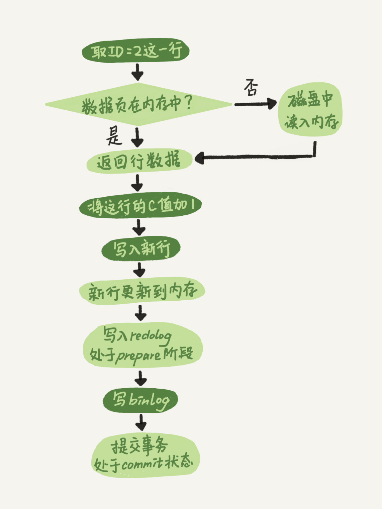

你可能注意到了，最后三步看上去有点“绕”，将redo log的写入拆成了两个步骤：prepare和commit，这就是"两阶段提交"。


## redo log的两阶段提交

由于redo log和binlog是两个独立的逻辑，如果不用两阶段提交，要么就是先写完redo log再写binlog，或者采用反过来的顺序。我们看看这两种方式会有什么问题。

仍然用前面的update语句来做例子。假设当前ID=2的行，字段c的值是0，再假设执行update语句过程中在写完第一个日志后，第二个日志还没有写完期间发生了crash，会出现什么情况呢？

1. **先写redo log后写binlog**。假设在redo log写完，binlog还没有写完的时候，MySQL进程异常重启。由于我们前面说过的，redo log写完之后，系统即使崩溃，仍然能够把数据恢复回来，所以恢复后这一行c的值是1。
   但是由于binlog没写完就crash了，这时候binlog里面就没有记录这个语句。因此，之后备份日志的时候，存起来的binlog里面就没有这条语句。
   然后你会发现，如果需要用这个binlog来恢复临时库的话，由于这个语句的binlog丢失，这个临时库就会少了这一次更新，恢复出来的这一行c的值就是0，与原库的值不同。
2. **先写binlog后写redo log**。如果在binlog写完之后crash，由于redo log还没写，崩溃恢复以后这个事务无效，所以这一行c的值是0。但是binlog里面已经记录了“把c从0改成1”这个日志。所以，在之后用binlog来恢复的时候就多了一个事务出来，恢复出来的这一行c的值就是1，与原库的值不同。

可以看到，**如果不使用“两阶段提交”，那么数据库的状态就有可能和用它的日志恢复出来的库的状态不一致**。

简单说，redo log和binlog都可以用于表示事务的提交状态，而两阶段提交就是让这两个状态保持逻辑上的一致。

即**保证主库和从库的数据一致性**


> redo log用于保证crash-safe能力。**innodb_flush_log_at_trx_commit**这个参数设置成1的时候，表示每次事务的redo log都直接持久化到磁盘。这个参数我建议你设置成1，这样可以保证MySQL异常重启之后数据不丢失。
>
> **sync_binlog**这个参数设置成1的时候，表示每次事务的binlog都持久化到磁盘。这个参数我也建议你设置成1，这样可以保证MySQL异常重启之后binlog不丢失。


# 03 讲事务隔离：为什么你改了我还看不见

提到事务，你肯定会想到ACID（Atomicity、Consistency、Isolation、Durability，即原子性、一致性、隔离性、持久性），今天我们就来说说其中I，也就是“隔离性”。

当数据库上有多个事务同时执行的时候，就可能出现脏读（dirty read）、不可重复读（non-repeatable read）、幻读（phantom read）的问题，为了解决这些问题，就有了“隔离级别”的概念。

在谈隔离级别之前，你首先要知道，你隔离得越严实，效率就会越低。因此很多时候，我们都要在二者之间寻找一个平衡点。SQL标准的事务隔离级别包括：读未提交（read uncommitted）、读提交（read committed）、可重复读（repeatable read）和串行化（serializable ）。下面我逐一为你解释：

- 读未提交是指，一个事务还没提交时，它做的变更就能被别的事务看到。
- 读提交是指，一个事务提交之后，它做的变更才会被其他事务看到。
- 可重复读是指，一个事务执行过程中看到的数据，总是跟这个事务在启动时看到的数据是一致的。当然在可重复读隔离级别下，未提交变更对其他事务也是不可见的。
- 串行化，顾名思义是对于同一行记录，“写”会加“写锁”，“读”会加“读锁”。当出现读写锁冲突的时候，后访问的事务必须等前一个事务执行完成，才能继续执行。

## 长事务的坏处

**总结：**

1、务的特性：原子性、一致性、隔离性、持久性
2、多事务同时执行的时候，可能会出现的问题：脏读、不可重复读、幻读
3、事务隔离级别：读未提交、读提交、可重复读、串行化
4、不同事务隔离级别的区别：
读未提交：一个事务还未提交，它所做的变更就可以被别的事务看到
读提交：一个事务提交之后，它所做的变更才可以被别的事务看到
可重复读：一个事务执行过程中看到的数据是一致的。未提交的更改对其他事务是不可见的
串行化：对应一个记录会加读写锁，出现冲突的时候，后访问的事务必须等前一个事务执行完成才能继续执行

5、配置方法：启动参数transaction-isolation
6、事务隔离的实现：每条记录在更新的时候都会同时记录一条回滚操作。同一条记录在系统中可以存在多个版本，这就是数据库的多版本并发控制（MVCC）。

7、回滚日志什么时候删除？系统会判断当没有事务需要用到这些回滚日志的时候，回滚日志会被删除。
8、什么时候不需要了？当系统里么有比这个回滚日志更早的read-view的时候。

9、为什么**尽量不要使用长事务**。长事务意味着系统里面会存在很老的事务视图，在这个事务提交之前，回滚记录都要保留，这会导致大量占用存储空间。除此之外，长事务还占用锁资源，可能会拖垮库。

10、事务启动方式：一、显式启动事务语句，begin或者start transaction,提交commit，回滚rollback；二、set autocommit=0，该命令会把这个线程的自动提交关掉。这样只要执行一个select语句，事务就启动，并不会自动提交，直到主动执行commit或rollback或断开连接。
11、建议使用方法一，如果考虑多一次交互问题，可以使用commit work and chain语法。在autocommit=1的情况下用begin显式启动事务，如果执行commit则提交事务。如果执行commit work and chain则提交事务并自动启动下一个事务。

可以在information_schema库的innodb_trx这个表中**查询长事务**，比如下面这个语句，用于查找持续时间超过60s的事务。

```mysql
select * from information_schema.innodb_trx where TIME_TO_SEC(timediff(now(),trx_started))>60
```


# 04 讲深入浅出索引(上)

**一句话简单来说，索引的出现其实就是为了提高数据查询的效率，就像书的目录一样。**


## Hash索引

哈希表是一种以键-值（key-value）存储数据的结构，我们只要输入待查找的值即key，就可以找到其对应的值即Value。哈希的思路很简单，把值放在数组里，用一个哈希函数把key换算成一个确定的位置，然后把value放在数组的这个位置。

不可避免地，多个key值经过哈希函数的换算，会出现同一个值的情况。处理这种情况的一种方法是，拉出一个链表。

假设，你现在维护着一个身份证信息和姓名的表，需要根据身份证号查找对应的名字，这时对应的哈希索引的示意图如下所示：

实战45讲笔记.assets/0c62b601afda86fe5d0fe57346ace957.png)

需要注意的是，图中四个ID_card_n的值并不是递增的，这样做的好处是增加新的User时速度会很快，只需要往后追加。但缺点是，因为不是有序的，所以**哈希索引做区间查询(范围查询)的速度是很慢的**。

你可以设想下，如果你现在要找身份证号在[ID_card_X, ID_card_Y]这个区间的所有用户，就必须全部扫描一遍了。

所以，**哈希表这种结构适用于只有等值查询的场景**，比如Memcached及其他一些NoSQL引擎。


## 有序数组

而**有序数组在等值查询和范围查询场景中的性能就都非常优秀**。还是上面这个根据身份证号查名字的例子，如果我们使用有序数组来实现的话，示意图如下所示：

实战45讲笔记.assets/image-20230920194507068.png)

这时候如果你要查ID_card_n2对应的名字，用二分法就可以快速得到，这个**时间复杂度是O(log(N))**。

这个索引结构**支持范围查询**。你要查身份证号在[ID_card_X, ID_card_Y]区间的User，可以先用二分法找到ID_card_X（如果不存在ID_card_X，就找到大于ID_card_X的第一个User），然后向右遍历，直到查到第一个大于ID_card_Y的身份证号，退出循环。

如果仅仅看查询效率，有序数组就是最好的数据结构了。但是，在需要**更新数据**的时候就麻烦了，你往中间插入一个记录就必须得挪动后面所有的记录，**成本太高**。

所以，**有序数组索引只适用于静态存储引擎**，比如你要保存的是2017年某个城市的所有人口信息，这类不会再修改的数据。


## 二叉搜索树

二叉搜索树也是课本里的经典数据结构了。还是上面根据身份证号查名字的例子，如果我们用二叉搜索树来实现的话，示意图如下所示：

实战45讲笔记.assets/04fb9d24065635a6a637c25ba9ddde68.png)

二叉搜索树的特点是：每个节点的左儿子小于父节点，父节点又小于右儿子。这样如果你要查ID_card_n2的话，按照图中的搜索顺序就是按照UserA -> UserC -> UserF -> User2这个路径得到。这个**时间复杂度是O(log(N))**。

当然为了维持O(log(N))的查询复杂度，你就需要保持这棵树是平衡二叉树。为了做这个保证，更新的时间复杂度也是O(log(N))。

你可以想象一下一棵100万节点的平衡二叉树，树高20。一次查询可能需要访问20个数据块。在机械硬盘时代，从磁盘随机读一个数据块需要10 ms左右的寻址时间。也就是说，对于一个100万行的表，如果使用二叉树来存储，单独访问一个行可能需要20个10 ms的时间，**这个查询可真够慢的**。

为了让一个查询尽量少地读磁盘，就必须让查询过程访问尽量少的数据块。那么，我们就不应该使用二叉树，而是要使用“N叉”树。这里，“N叉”树中的“N”取决于数据块的大小。

**N叉树**由于在读写上的性能优点，以及适配磁盘的访问模式，已经被广泛应用在数据库引擎中了。


## B+树

实战45讲笔记.assets/image-20230920195036279.png)

从图中不难看出，根据叶子节点的内容，索引类型分为主键索引和非主键索引。

主键索引的叶子节点存的是整行数据。在InnoDB里，主键索引也被称为聚簇索引（clustered index）。

非主键索引的叶子节点内容是主键的值。在InnoDB里，非主键索引也被称为二级索引（secondary index）。

根据上面的索引结构说明，我们来讨论一个问题：**基于主键索引和普通索引的查询有什么区别？**

- 如果语句是select * from T where ID=500，即主键查询方式，则只需要搜索ID这棵B+树；
- 如果语句是select * from T where k=5，即普通索引查询方式，则需要先搜索k索引树，得到ID的值为500，再到ID索引树搜索一次。这个过程称为回表。

也就是说，基于非主键索引的查询需要多扫描一棵索引树。因此，**我们在应用中应该尽量使用主键查询**。


当不使用有序索引时，插入可能造成**页分裂**，严重影响数据库性能

**显然，主键长度越小，普通索引的叶子节点就越小，普通索引占用的空间也就越小。**


**总结：**

1.索引的作用：提高数据查询效率
2.常见索引模型：哈希表、有序数组、搜索树

3.哈希表：键 - 值(key - value)。
4.哈希思路：把值放在数组里，用一个哈希函数把key换算成一个确定的位置，然后把value放在数组的这个位置
5.哈希冲突的处理办法：链表
6.哈希表适用场景：只有等值查询的场景

7.有序数组：按顺序存储。查询用二分法就可以快速查询，时间复杂度是：O(log(N))
8.有序数组查询效率高，更新效率低
9.有序数组的适用场景：静态存储引擎。

10.二叉搜索树：每个节点的左儿子小于父节点，父节点又小于右儿子
11.二叉搜索树：查询时间复杂度O(log(N))，更新时间复杂度O(log(N))
12.数据库存储大多不适用二叉树，因为树高过高，会适用N叉树

13.InnoDB中的索引模型：B+Tree
14.索引类型：主键索引、非主键索引
主键索引的叶子节点存的是整行的数据(聚簇索引)，非主键索引的叶子节点内容是主键的值(二级索引)
15.主键索引和普通索引的区别：主键索引只要搜索ID这个B+Tree即可拿到数据。普通索引先搜索索引拿到主键值，再到主键索引树搜索一次(回表)

16.一个数据页满了，按照B+Tree算法，新增加一个数据页，叫做页分裂，会导致性能下降。空间利用率降低大概50%。当相邻的两个数据页利用率很低的时候会做数据页合并，合并的过程是分裂过程的逆过程。
17.从性能和存储空间方面考量，自增主键往往是更合理的选择


# 05 讲深入浅出索引(下)

## 回表过程

在下面这个表T中，如果我执行 **select * from T where k between 3 and 5**，需要执行几次树的搜索操作，会扫描多少行？

下面是这个表的初始化语句。

```
mysql> create table T (
ID int primary key,
k int NOT NULL DEFAULT 0, 
s varchar(16) NOT NULL DEFAULT '',
index k(k))
engine=InnoDB;

insert into T values(100,1, 'aa'),(200,2,'bb'),(300,3,'cc'),(500,5,'ee'),(600,6,'ff'),(700,7,'gg');
```

实战45讲笔记.assets/image-20230921102234370.png)

现在，我们一起来看看这条SQL查询语句的执行流程：

1. 在k索引树上找到k=3的记录，取得 ID = 300；
2. 再到ID索引树查到ID=300对应的R3；
3. 在k索引树取下一个值k=5，取得ID=500；
4. 再回到ID索引树查到ID=500对应的R4；
5. 在k索引树取下一个值k=6，不满足条件，循环结束。

在这个过程中，**回到主键索引树搜索的过程，我们称为回表**。可以看到，这个查询过程读了k索引树的3条记录（步骤1、3和5），回表了两次（步骤2和4）。

有没有可能经过索引优化，避免回表过程呢？

## 覆盖索引

如果执行的语句是select **ID** from T where k between 3 and 5，这时只需要查ID的值，而ID的值已经在k索引树上了，因此可以直接提供查询结果，不需要回表。也就是说，在这个查询里面，索引k已经“覆盖了”我们的查询需求，我们称为覆盖索引。

**由于覆盖索引可以减少树的搜索次数，显著提升查询性能，所以使用覆盖索引是一个常用的性能优化手段。**

需要注意的是，在**引擎内部**使用覆盖索引在索引k上其实读了**三个记录**，R3~R5（对应的索引k上的记录项），但是对于MySQL的**Server层**来说，它就是找引擎拿到了**两条记录**，因此MySQL认为扫描行数是2。

## 最左前缀原则

**B+树这种索引结构，可以利用索引的“最左前缀”，来定位记录。**

**第一原则是，如果通过调整顺序，可以少维护一个索引，那么这个顺序往往就是需要优先考虑采用的。**

第二要**考虑的原则就是空间**了。比如name字段是比age字段大的 ，那我就建议你创建一个（name,age)的联合索引和一个(age)的单字段索引。

## 索引下推

上一段我们说到满足最左前缀原则的时候，最左前缀可以用于在索引中定位记录。这时，你可能要问，那些不符合最左前缀的部分，会怎么样呢？

我们还是以市民表的联合索引（name, age）为例。如果现在有一个需求：检索出表中“名字第一个字是张，而且年龄是10岁的所有男孩”。那么，SQL语句是这么写的：

```
mysql> select * from tuser where name like '张%' and age=10 and ismale=1;
```

你已经知道了前缀索引规则，所以这个语句在搜索索引树的时候，只能用 “张”，找到第一个满足条件的记录ID3。当然，这还不错，总比全表扫描要好。

然后呢？

当然是判断其他条件是否满足。

在MySQL 5.6之前，只能从ID3开始一个个回表。到主键索引上找出数据行，再对比字段值。

而MySQL 5.6 引入**的索引下推优化**（index condition pushdown)， 可以**在索引遍历过程中，对索引中包含的字段先做判断，直接过滤掉不满足条件的记录，减少回表次数**。

索引下推是使用联合索引时，若是后面的索引失效，就可以使用索引下推


**总结：**
回表：回到主键索引树搜索的过程，称为回表
覆盖索引：某索引已经覆盖了查询需求，称为覆盖索引，例如：select ID from T where k between 3 and 5
在引擎内部使用覆盖索引在索引K上其实读了三个记录，R3~R5(对应的索引k上的记录项)，但对于MySQL的Server层来说，它就是找引擎拿到了两条记录，因此MySQL认为扫描行数是2

最左前缀原则：B+Tree这种索引结构，可以利用索引的"最左前缀"来定位记录
只要满足最左前缀，就可以利用索引来加速检索。
最左前缀可以是联合索引的最左N个字段，也可以是字符串索引的最左M个字符
第一原则是：如果通过调整顺序，可以少维护一个索引，那么这个顺序往往就是需要优先考虑采用的。

索引下推：在MySQL5.6之前，只能从根据最左前缀查询到ID开始一个个回表。到主键索引上找出数据行，再对比字段值。
MySQL5.6引入的索引下推优化，可以在索引遍历过程中，对索引中包含的字段先做判断，直接过滤掉不满足条件的记录，减少回表次数。


# 06 讲全局锁和表锁：给表加个字段怎么有这么多阻碍

**根据加锁的范围，MySQL里面的锁大致可以分成全局锁、表级锁和行锁三类**。

## 全局锁

顾名思义，全局锁就是对整个数据库实例加锁。MySQL提供了一个加全局读锁的方法，命令是 Flush tables with read lock (FTWRL)。当你需要让整个库处于只读状态的时候，可以使用这个命令，之后其他线程的以下语句会被阻塞：数据更新语句（数据的增删改）、数据定义语句（包括建表、修改表结构等）和更新类事务的提交语句。

**全局锁的典型使用场景是，做全库逻辑备份。**也就是把整库每个表都select出来存成文本。

但是让整库都只读，听上去就很危险：

- 如果你在主库上备份，那么在备份期间都不能执行更新，业务基本上就得停摆；
- 如果你在从库上备份，那么备份期间从库不能执行主库同步过来的binlog，会导致主从延迟。

官方自带的逻辑备份工具是mysqldump。当mysqldump使用参数–single-transaction的时候，导数据之前就会启动一个事务，来确保拿到一致性视图。而由于MVCC的支持，这个过程中数据是可以正常更新的。

你一定在疑惑，有了这个功能，为什么还需要FTWRL呢？**一致性读是好，但前提是引擎要支持这个隔离级别。**比如，对于MyISAM这种不支持事务的引擎，如果备份过程中有更新，总是只能取到最新的数据，那么就破坏了备份的一致性。这时，我们就需要使用FTWRL命令了。

所以，**single-transaction方法只适用于所有的表使用事务引擎的库。**如果有的表使用了不支持事务的引擎，那么备份就只能通过FTWRL方法。这往往是DBA要求业务开发人员使用InnoDB替代MyISAM的原因之一。

你也许会问，**既然要全库只读，为什么不使用set global readonly=true的方式呢**？确实readonly方式也可以让全库进入只读状态，但我还是会建议你用FTWRL方式，主要有两个原因：

- 一是，在有些系统中，readonly的值会被用来做其他逻辑，比如用来判断一个库是主库还是备库。因此，修改global变量的方式影响面更大，我不建议你使用。
- 二是，在异常处理机制上有差异。如果执行FTWRL命令之后由于客户端发生异常断开，那么MySQL会自动释放这个全局锁，整个库回到可以正常更新的状态。而将整个库设置为readonly之后，如果客户端发生异常，则数据库就会一直保持readonly状态，这样会导致整个库长时间处于不可写状态，风险较高。

> 我认为还有一个原因：修改global属性后，已有的session不会更改

业务的更新不只是增删改数据（DML)，还有可能是加字段等修改表结构的操作（DDL）。不论是哪种方法，一个库被全局锁上以后，你要对里面任何一个表做加字段操作，都是会被锁住的。

## 表级锁

MySQL里面表级别的锁有两种：一种是表锁，一种是元数据锁（meta data lock，MDL)。

**表锁的语法是 lock tables … read/write。**

**另一类表级的锁是MDL（metadata lock)。**MDL不需要显式使用，在访问一个表的时候会被自动加上。MDL的作用是，保证读写的正确性。你可以想象一下，如果一个查询正在遍历一个表中的数据，而执行期间另一个线程对这个表结构做变更，删了一列，那么查询线程拿到的结果跟表结构对不上，肯定是不行的。

因此，在MySQL 5.5版本中引入了MDL，当对一个表做增删改查操作的时候，加MDL读锁；当要对表做结构变更操作的时候，加MDL写锁。

- 读锁之间不互斥，因此你可以有多个线程同时对一张表增删改查。
- 读写锁之间、写锁之间是互斥的，用来保证变更表结构操作的安全性。因此，如果有两个线程要同时给一个表加字段，其中一个要等另一个执行完才能开始执行。

实战45讲笔记.assets/image-20230921112908550.png)

我们可以看到session A先启动，这时候会对表t加一个MDL读锁。由于session B需要的也是MDL读锁，因此可以正常执行。

之后session C会被blocked，是因为session A的MDL读锁还没有释放，而session C需要MDL写锁，因此只能被**阻塞**。

如果只有session C自己被阻塞还没什么关系，但是之后所有要在表t上新申请MDL读锁的请求也会被session C阻塞。前面我们说了，所有对表的增删改查操作都需要先申请MDL读锁，就都被锁住，等于这个表现在完全不可读写了。

**解决方法：**

比较理想的机制是，**在alter table语句里面设定等待时间**，如果在这个指定的等待时间里面能够拿到MDL写锁最好，拿不到也不要阻塞后面的业务语句，先放弃。之后开发人员或者DBA再通过重试命令重复这个过程。

MariaDB已经合并了AliSQL的这个功能，所以这两个开源分支目前都支持DDL NOWAIT/WAIT n这个语法。

```
ALTER TABLE tbl_name NOWAIT add column ...
ALTER TABLE tbl_name WAIT N add column ... 
```


**总结：**

根据加锁范围：MySQL里面的锁可以分为：全局锁、表级锁、行级锁

一、全局锁：
对整个数据库实例加锁。
MySQL提供加全局读锁的方法：Flush tables with read lock(FTWRL)
这个命令可以使整个库处于只读状态。使用该命令之后，数据更新语句、数据定义语句和更新类事务的提交语句等操作都会被阻塞。
使用场景：全库逻辑备份。
风险：
1.如果在主库备份，在备份期间不能更新，业务停摆
2.如果在从库备份，备份期间不能执行主库同步的binlog，导致主从延迟

官方自带的逻辑备份工具mysqldump，当mysqldump使用参数--single-transaction的时候，会启动一个事务，确保拿到一致性视图。而由于MVCC的支持，这个过程中数据是可以正常更新的。

一致性读是好，但是前提是引擎要支持这个隔离级别。
如果要全库只读，为什么不使用set global readonly=true的方式？
1.在有些系统中，readonly的值会被用来做其他逻辑，比如判断主备库。所以修改global变量的方式影响太大。
2.在异常处理机制上有差异。如果执行FTWRL命令之后由于客户端发生异常断开，那么MySQL会自动释放这个全局锁，整个库回到可以正常更新的状态。而将整个库设置为readonly之后，如果客户端发生异常，则数据库就会一直保持readonly状态，这样会导致整个库长时间处于不可写状态，风险较高。


二、表级锁
MySQL里面表级锁有两种，一种是表锁，一种是元数据锁(meta data lock,MDL)
表锁的语法是:lock tables ... read/write
可以用unlock tables主动释放锁，也可以在客户端断开的时候自动释放。lock tables语法除了会限制别的线程的读写外，也限定了本线程接下来的操作对象。
对于InnoDB这种支持行锁的引擎，一般不使用lock tables命令来控制并发，毕竟锁住整个表的影响面还是太大。

MDL：不需要显式使用，在访问一个表的时候会被自动加上。
MDL的作用：保证读写的正确性。
在对一个表做增删改查操作的时候，加MDL读锁；当要对表做结构变更操作的时候，加MDL写锁。
读锁之间不互斥。读写锁之间，写锁之间是互斥的，用来保证变更表结构操作的安全性。
MDL 会直到事务提交才会释放，在做表结构变更的时候，一定要小心不要导致锁住线上查询和更新。


# 07 讲行锁功过：怎么减少行锁对性能的影响

MySQL的行锁是在引擎层由各个引擎自己实现的。但并不是所有的引擎都支持行锁，比如MyISAM引擎就不支持行锁。不支持行锁意味着并发控制只能使用表锁，对于这种引擎的表，同一张表上任何时刻只能有一个更新在执行，这就会影响到业务并发度。**InnoDB是支持行锁的，这也是MyISAM被InnoDB替代的重要原因之一**。

## 两阶段锁

**在InnoDB事务中，行锁是在需要的时候才加上的，但并不是不需要了就立刻释放，而是要等到事务结束时才释放。这个就是两阶段锁协议。**


知道了这个设定，对我们使用事务有什么帮助呢？那就是，<font color='red'>如果你的事务中需要锁多个行，要把最可能造成锁冲突、最可能影响并发度的锁尽量往后放</font>。


> eg：
>
> 假设你负责实现一个电影票在线交易业务，顾客A要在影院B购买电影票。我们简化一点，这个业务需要涉及到以下操作：
>
> 1. 从顾客A账户余额中扣除电影票价；
> 2. 给影院B的账户余额增加这张电影票价；
> 3. 记录一条交易日志。
>
> 也就是说，要完成这个交易，我们需要update两条记录，并insert一条记录。当然，为了保证交易的原子性，我们要把这三个操作放在一个事务中。那么，你会怎样安排这三个语句在事务中的顺序呢？
>
> 试想如果同时有另外一个顾客C要在影院B买票，那么这两个事务冲突的部分就是语句2了。因为它们要更新同一个影院账户的余额，需要修改同一行数据。
>
> 根据两阶段锁协议，不论你怎样安排语句顺序，所有的操作需要的行锁都是在事务提交的时候才释放的。所以，如果你把语句2安排在最后，比如按照3、1、2这样的顺序，那么影院账户余额这一行的锁时间就最少。这就最大程度地减少了事务之间的锁等待，**提升了并发度**。

## 死锁和死锁检测

如果这个影院做活动，可以低价预售一年内所有的电影票，而且这个活动只做一天。于是在活动时间开始的时候，你的MySQL就挂了。你登上服务器一看，CPU消耗接近100%，但整个数据库每秒就执行不到100个事务。这是什么原因呢？

这里，我就要说到**死锁**和**死锁检测**了。

当并发系统中不同线程出现循环资源依赖，涉及的线程都在等待别的线程释放资源时，就会导致这几个线程都进入无限等待的状态，称为死锁。这里我用数据库中的行锁举个例子。

实战45讲笔记.assets/image-20230922131553223.png)

这时候，事务A在等待事务B释放id=2的行锁，而事务B在等待事务A释放id=1的行锁。 事务A和事务B在互相等待对方的资源释放，就是进入了死锁状态。当出现死锁以后，有两种策略：

- 一种策略是，直接进入等待，直到超时。这个超时时间可以通过参数innodb_lock_wait_timeout来设置。
- 另一种策略是，发起死锁检测，发现死锁后，主动回滚死锁链条中的某一个事务，让其他事务得以继续执行。将参数innodb_deadlock_detect设置为on，表示开启这个逻辑。

在InnoDB中，**innodb_lock_wait_timeout的默认值是50s**，意味着如果采用第一个策略，当出现死锁以后，第一个被锁住的线程要过50s才会超时退出，然后其他线程才有可能继续执行。对于在线服务来说，这个等待时间往往是**无法接受**的。但是，我们又不可能直接把这个时间设置成一个很小的值，比如1s。这样当出现死锁的时候，确实很快就可以解开，但如果不是死锁，而是简单的锁等待呢？所以，超时时间设置太短的话，会出现**很多误伤**。


所以，正常情况下我们还是要采用第二种策略，即：主动死锁检测，而且**innodb_deadlock_detect**的默认值本身就是on。主动死锁检测在发生死锁的时候，是能够快速发现并进行处理的，但是它也是有**额外负担**的。

你可以想象一下这个过程：每当一个事务被锁的时候，就要看看它所依赖的线程有没有被别人锁住，如此循环，最后判断是否出现了循环等待，也就是死锁。

那如果是我们上面说到的所有事务都要更新同一行的场景呢？

每个新来的被堵住的线程，都要判断会不会由于自己的加入导致了死锁，这是一个时间复杂度是**O(n)**的操作。假设有**1000**个并发线程要同时更新同一行，那么死锁检测操作就是**100万**这个量级的。虽然最终检测的结果是没有死锁，但是这期间要消耗大量的CPU资源。因此，你就会看到**CPU利用率很高，但是每秒却执行不了几个事务**。


## 怎么解决由热点行更新导致的性能问题？

<font color='red'>怎么解决由这种热点行更新导致的性能问题呢？</font>

- **一种头痛医头的方法，就是如果你能确保这个业务一定不会出现死锁，可以临时把死锁检测关掉。**但是这种操作本身带有一定的风险，因为业务设计的时候一般不会把死锁当做一个严重错误，毕竟出现死锁了，就回滚，然后通过业务重试一般就没问题了，这是业务无损的。而关掉死锁检测意味着可能会出现大量的超时，这是**业务有损**的。
- **另一个思路是控制并发度。**根据上面的分析，你会发现如果并发能够控制住，比如同一行同时最多只有10个线程在更新，那么死锁检测的成本很低，就不会出现这个问题。一个直接的想法就是，在客户端做并发控制。但是，你会很快发现这个方法不太可行，因为客户端很多。我见过一个应用，有600个客户端，这样即使每个客户端控制到只有5个并发线程，汇总到数据库服务端以后，峰值并发数也可能要达到3000。

因此，这个**并发控制要做在数据库服务端**。如果你有**中间件**，可以考虑在中间件实现；如果你的团队有能修改MySQL源码的人，也可以做在MySQL里面。基本思路就是，对于相同行的更新，在进入引擎之前排队。这样在InnoDB内部就不会有大量的死锁检测工作了。

可能你会问，**如果团队里暂时没有数据库方面的专家，不能实现这样的方案，能不能从设计上优化这个问题呢？**

你可以考虑通过将一行改成逻辑上的多行来减少锁冲突。还是以影院账户为例，可以考虑放在多条记录上，比如10个记录，**影院的账户总额等于这10个记录的值的总和**。这样每次要给影院账户加金额的时候，随机选其中一条记录来加。这样每次冲突概率变成原来的**1/10**，可以减少锁等待个数，也就减少了死锁检测的CPU消耗。

这个方案看上去是无损的，但其实这类方案需要根据业务逻辑做详细设计。如果账户余额可能会减少，比如退票逻辑，那么这时候就需要考虑当一部分行记录变成0的时候，代码要有特殊处理。


**总结：**

两阶段锁：在 InnoDB 事务中，行锁是在需要的时候才加上的，但并不是不需要了就立刻释放， 而是要等到事务结束时才释放。
建议：如果你的事务中需要锁多个行，要把最可能造成锁冲突、最可能影响并发度的锁尽量往后放。


死锁：当并发系统中不同线程出现循环资源依赖，涉及的线程都在等待别的线程释放资源时，就会导致这几个线程都进入无限等待的状态。

解决方案：
1、通过参数 innodb_lock_wait_timeout 根据实际业务场景来设置超时时间，InnoDB引擎默认值是50s。
2、发起死锁检测，发现死锁后，主动回滚死锁链条中的某一个事务，让其他事务得以继续执行。将参数 innodb_deadlock_detect 设置为 on，表示开启这个逻辑（默认是开启状态）。

如何解决热点行更新导致的性能问题？
1、如果你能确保这个业务一定不会出现死锁，可以临时把死锁检测关闭掉。一般不建议采用
2、控制并发度，对应相同行的更新，在进入引擎之前排队。这样在InnoDB内部就不会有大量的死锁检测工作了。
3、将热更新的行数据拆分成逻辑上的多行来减少锁冲突，但是业务复杂度可能会大大提高。

**innodb行级锁是通过锁索引记录实现的，如果更新的列没建索引是会锁住整个表的。**


# 08 讲事务到底是隔离的还是不隔离的

## read view的生成以及当前读

我给你举一个例子吧。下面是一个只有两行的表的初始化语句。

```
mysql> CREATE TABLE `t` (
  `id` int(11) NOT NULL,
  `k` int(11) DEFAULT NULL,
  PRIMARY KEY (`id`)
) ENGINE=InnoDB;
insert into t(id, k) values(1,1),(2,2);
```

实战45讲笔记.assets/823acf76e53c0bdba7beab45e72e90d6.png)

图1 事务A、B、C的执行流程

> 这里，我们需要注意的是事务的启动时机。
>
> **begin/start transaction** 命令并不是一个事务的起点，在执行到它们之后的**第一个操作InnoDB表的语句（第一个快照读语句），事务才真正启动**。如果你想要**马上启动一个事务**，可以使用**start transaction with consistent snapshot** 这个命令。
>
> 还需要注意的是，在整个专栏里面，我们的例子中如果没有特别说明，都是**默认autocommit=1**。

在这个例子中，事务C没有显式地使用begin/commit，表示这个update语句本身就是一个事务，语句完成的时候会自动提交。事务B在更新了行之后查询; 事务A在一个只读事务中查询，并且时间顺序上是在事务B的查询之后。

这时，如果我告诉你**事务B查到的k的值是3**，而**事务A查到的k的值是1**，你是不是感觉有点晕呢？


### read view原理

InnoDB为每个事务构造了一个数组，用来保存这个事务启动瞬间，当前正在“活跃”的所有事务ID。“活跃”指的就是，启动了但还没提交。

- 数组里面事务ID的最小值记为**低水位**，当前系统里面已经创建过的事务ID的最大值加1记为**高水位**。
- 这个视图数组和高水位，就组成了当前事务的一致性视图（read-view）。
- 而数据版本的可见性规则，就是基于数据的row trx_id和这个一致性视图的对比结果得到的。
- 这个视图数组把所有的row trx_id 分成了几种不同的情况。

实战45讲笔记.assets/image-20230922142150072.png)

**read view规则：**

这样，对于当前事务的启动瞬间来说，一个数据版本的row trx_id，有以下几种可能：

1. 如果落在**绿色部分**，表示这个版本是已提交的事务或者是当前事务自己生成的，这个数据是可见的；
2. 如果落在**红色部分**，表示这个版本是由将来启动的事务生成的，是肯定不可见的；
3. 如果落在**黄色部分**，那就包括两种情况
   a. 若 row trx_id**在**数组中，表示这个版本是由还没提交的事务生成的，不可见；
   b. 若 row trx_id**不在**数组中，表示这个版本是已经提交了的事务生成的，可见。

**InnoDB利用了“所有数据都有多个版本”的这个特性，实现了“秒级创建快照”的能力。**


所以上面那道例题的分析如下：

实战45讲笔记.assets/image-20230922142355909.png)

现在事务A要来读数据了，它的视图数组是[99,100]。当然了，读数据都是从当前版本读起的。所以，事务A查询语句的读数据流程是这样的：

- 找到(1,3)的时候，判断出row trx_id=101，比高水位大，处于红色区域，不可见；
- 接着，找到上一个历史版本，一看row trx_id=102，比高水位大，处于红色区域，不可见；
- 再往前找，终于找到了（1,1)，它的row trx_id=90，比低水位小，处于绿色区域，可见。

这样执行下来，虽然期间这一行数据被修改过，但是事务A不论在什么时候查询，看到这行数据的结果都是一致的，所以我们称之为一致性读。


### 当前读

细心的同学可能有疑问了：**事务B的update语句，如果按照一致性读，好像结果不对哦？**

你看图5中，事务B的视图数组是先生成的，之后事务C才提交，不是应该看不见(1,2)吗，怎么能算出(1,3)来？

> 是的，如果事务B在更新之前查询一次数据，这个查询返回的k的值确实是1。
>
> 但是，当它要去更新数据的时候，就不能再在历史版本上更新了，否则事务C的更新就丢失了。因此，事务B此时的set k=k+1是在（1,2）的基础上进行的操作。
>
> 所以，这里就用到了这样一条规则：**更新数据都是先读后写的，而这个读，只能读当前的值，称为“当前读”（current read）。**
>
> 因此，在更新的时候，当前读拿到的数据是(1,2)，更新后生成了新版本的数据(1,3)，这个新版本的row trx_id是101。
>
> 所以，在执行事务B查询语句的时候，一看自己的版本号是101，最新数据的版本号也是101，是自己的更新，可以直接使用，所以查询得到的k的值是3。
>
> 这里我们提到了一个概念，叫作当前读。其实，**除了update语句外，select语句如果加锁，也是当前读。**

READ VIEW分为快照读和当前读，**<font color='red'>修改删除插入操作和加锁的select操作都属于当前读</font>**


**总结：**

1.innodb支持RC和RR隔离级别实现是用的一致性视图(consistent read view)

2.事务在启动时会拍一个快照,这个快照是基于整个库的.
基于整个库的意思就是说一个事务内,整个库的修改对于该事务都是不可见的(对于快照读的情况)

3.事务是如何实现的MVCC呢?
(1)每个事务都有一个事务ID,叫做transaction id(严格递增)
(2)事务在启动时,找到已提交的最大事务ID记为up_limit_id。
(3)事务在更新一条语句时,比如id=1改为了id=2.会把id=1和该行之前的row trx_id写到undo log里,
并且在数据页上把id的值改为2,并且把修改这条语句的transaction id记在该行行头
(4)再定一个规矩,一个事务要查看一条数据时,必须先用该事务的up_limit_id与该行的transaction id做比对,
如果up_limit_id>=transaction id,那么可以看.如果up_limit_id<transaction id,则只能去undo log里去取。去undo log查找数据的时候,也需要做比对,必须up_limit_id>transaction id,才返回数据

4.什么是当前读,由于当前读都是**先读后写**,只能读当前的值,所以为当前读会更新事务内的up_limit_id为该事务的transaction id

5.为什么rr能实现可重复读而rc不能,分两种情况
(1)快照读的情况下,rr不能更新事务内的up_limit_id,
而rc每次会把up_limit_id更新为快照读之前最新已提交事务的transaction id,则rc不能可重复读
(2)当前读的情况下,rr是利用record lock+gap lock来实现的,而rc没有gap,所以rc不能可重复读


# 09 讲普通索引和唯一索引，应该怎么选择

在不同的业务场景下，应该选择普通索引，还是唯一索引？

假设你在维护一个市民系统，每个人都有一个唯一的身份证号，而且业务代码已经保证了不会写入两个重复的身份证号。如果市民系统需要按照身份证号查姓名，就会执行类似这样的SQL语句：

```mysql
select name from CUser where id_card = 'xxxxxxxyyyyyyzzzzz';
```

所以，你一定会考虑在id_card字段上建索引。

由于身份证号字段比较大，我不建议你把身份证号当做主键，那么现在你有两个选择，要么给id_card字段创建唯一索引，要么创建一个普通索引。如果业务代码已经保证了不会写入重复的身份证号，那么这两个选择逻辑上都是正确的。

现在我要问你的是，从性能的角度考虑，你选择唯一索引还是普通索引呢？选择的依据是什么呢？

## 查询过程的区别

假设，执行查询的语句是 select id from T where k=5。这个查询语句在索引树上查找的过程，先是通过B+树从树根开始，按层搜索到叶子节点，也就是图中右下角的这个数据页，然后可以认为数据页内部通过二分法来定位记录。

- 对于普通索引来说，查找到满足条件的第一个记录(5,500)后，需要查找下一个记录，直到碰到第一个不满足k=5条件的记录。
- 对于唯一索引来说，由于索引定义了唯一性，查找到第一个满足条件的记录后，就会停止继续检索。

那么，这个不同带来的性能差距会有多少呢？答案是，**微乎其微**。

## 更新过程的区别

### change buffer

为了说明普通索引和唯一索引对更新语句性能的影响这个问题，我需要先跟你介绍一下change buffer。

当需要**更新一个数据页**时，如果数据页在内存中就直接更新，而如果这个数据页还没有在内存中的话，在不影响数据一致性的前提下，InooDB会将这些**更新操作缓存在change buffer中，这样就不需要从磁盘中读入这个数据页**了。在下次查询需要访问这个数据页的时候，将数据页读入内存，然后执行change buffer中与这个页有关的操作。通过这种方式就能保证这个数据逻辑的正确性。

需要说明的是，虽然名字叫作change buffer，实际上它是可以持久化的数据。也就是说，change buffer在内存中有拷贝，也会被写入到磁盘上。

将change buffer中的操作应用到原数据页，得到最新结果的过程称为merge。除了**访问这个数据页会触发merge外，系统有后台线程会定期merge。在数据库正常关闭（shutdown）的过程中**，也会执行merge操作。

显然，如果能够将更新操作先记录在change buffer，**减少读磁盘**，语句的执行速度会得到明显的提升。而且，数据读入内存是需要占用buffer pool的，所以这种方式还能够避免占用内存，提高内存利用率。

那么，**什么条件下可以使用change buffer呢？**

- 对于唯一索引来说，所有的更新操作都要先判断这个操作是否违反唯一性约束。比如，要插入(4,400)这个记录，就要先判断现在表中是否已经存在k=4的记录，而这必须要**将数据页读入内存才能判断**。如果都已经读入到内存了，那**直接更新内存**会更快，就没必要使用change buffer了。
- 因此，唯一索引的更新就不能使用change buffer，实际上也只有**普通索引**可以使用。

change buffer用的是buffer pool里的内存，因此不能无限增大。change buffer的大小，可以通过参数**innodb_change_buffer_max_size**来动态设置。这个参数设置为50的时候，表示change buffer的大小最多只能占用buffer pool的50%。


### 更新区别

现在，你已经理解了change buffer的机制，那么我们再一起来看看**如果要在这张表中插入一个新记录(4,400)的话，InnoDB的处理流程是怎样的。**

第一种情况是，**这个记录要更新的目标页在内存中**。这时，InnoDB的处理流程如下：

- 对于唯一索引来说，找到3和5之间的位置，判断到没有冲突，插入这个值，语句执行结束；
- 对于普通索引来说，找到3和5之间的位置，插入这个值，语句执行结束。

这样看来，普通索引和唯一索引对更新语句性能影响的差别，只是一个判断，只会耗费微小的CPU时间。

但，这不是我们关注的重点。

第二种情况是，**这个记录要更新的目标页不在内存中**。这时，InnoDB的处理流程如下：

- 对于唯一索引来说，需要将数据页读入内存，判断到没有冲突，插入这个值，语句执行结束；
- 对于普通索引来说，则是将更新记录在change buffer，语句执行就结束了。

将数据从磁盘读入内存涉及**随机IO的访问，是数据库里面成本最高的操作之一**。change buffer因为减少了随机磁盘访问，所以对更新性能的提升是会很明显的。

之前我就碰到过一件事儿，有个DBA的同学跟我反馈说，他负责的某个业务的库内存命中率突然从99%降低到了75%，整个系统处于阻塞状态，更新语句全部堵住。而探究其原因后，我发现这个业务有大量插入数据的操作，而他在前一天把其中的某个普通索引改成了唯一索引。


## change buffer的使用场景

使用change buffer对更新过程的加速作用，也清楚了change buffer只限于用在普通索引的场景下，而不适用于唯一索引。那么，现在有一个问题就是：普通索引的所有场景，使用change buffer都可以起到加速作用吗？

因为merge的时候是真正进行数据更新的时刻，而change buffer的主要目的就是将记录的变更动作缓存下来，所以在一个数据页做merge之前，**change buffer记录的变更越多（也就是这个页面上要更新的次数越多），收益就越大**。

- 因此，对于**写多读少**的业务来说，页面在写完以后马上被访问到的概率比较小，此时**change buffer的使用效果最好**。这种业务模型常见的就是账单类、日志类的系统。
- 反过来，假设一个业务的更新模式是写入之后马上会做查询，那么即使满足了条件，将更新先记录在change buffer，但之后由于马上要访问这个数据页，会立即触发merge过程。这样随机访问IO的次数不会减少，**反而增加了change buffer的维护代价**。所以，对于这种业务模式来说，change buffer反而起到了副作用。

这两类索引在查询能力上是没差别的，主要考虑的是对更新性能的影响。所以，我**建议你尽量选择普通索引**。

如果所有的更新后面，都马上伴随着对这个记录的查询，那么你应该关闭change buffer。而在其他情况下，change buffer都能提升更新性能。


使用普通索引：

1. 业务代码已经保证不会写入重复数据
2. 归档库：归档数据已经是确保没有唯一键冲突了，要提高归档效率，可以考虑把表里面的唯一索引改成普通索引。


## change buffer 和 redo log

现在，我们要在表上执行这个插入语句：

```
mysql> insert into t(id,k) values(id1,k1),(id2,k2);
```

这里，我们假设当前k索引树的状态，查找到位置后，k1所在的数据页在内存(InnoDB buffer pool)中，k2所在的数据页不在内存中。如图所示是带change buffer的更新状态图。

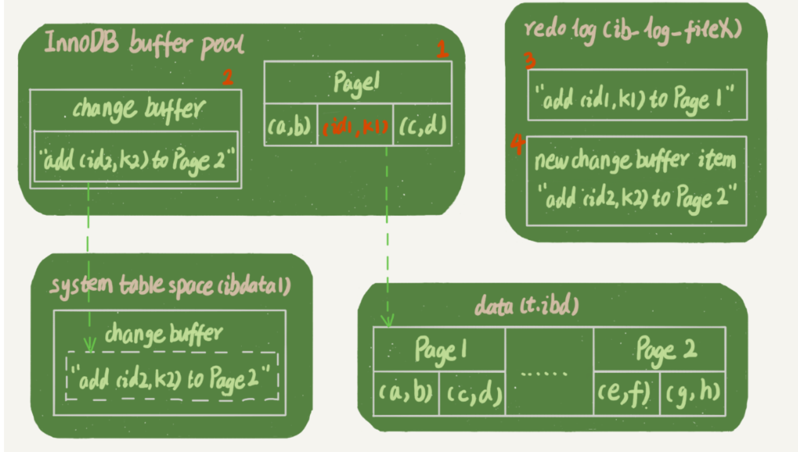

分析这条更新语句，你会发现它涉及了四个部分：内存、redo log（ib_log_fileX）、 数据表空间（t.ibd）、系统表空间（ibdata1）。

这条更新语句做了如下的操作（按照图中的数字顺序）：

1. Page 1在内存中，直接更新内存；
2. Page 2没有在内存中，就在内存的change buffer区域，记录下“我要往Page 2插入一行”这个信息
3. 将上述两个动作记入redo log中（图中3和4）。

比如，我们现在要执行 select * from t where k in (k1, k2)。这里，我画了这两个读请求的流程图。

如果读语句发生在更新语句后不久，内存中的数据都还在，那么此时的这两个读操作就与系统表空间（ibdata1）和 redo log（ib_log_fileX）无关了。所以，我在图中就没画出这两部分。

实战45讲笔记.assets/image-20230924140252534.png)

从图中可以看到：

1. 读Page 1的时候，**直接从内存返回**。有几位同学在前面文章的评论中问到，WAL之后如果读数据，是不是一定要读盘，是不是一定要从redo log里面把数据更新以后才可以返回？其实是不用的。你可以看一下图3的这个状态，虽然磁盘上还是之前的数据，但是这里直接从内存返回结果，结果是正确的。
2. 要读Page 2的时候，需要把Page 2从磁盘**读入内存中，然后应用change buffer里面的操作日志**，生成一个正确的版本并返回结果。

可以看到，直到需要读Page 2的时候，这个数据页才会被读入内存。


所以，如果要简单地对比这两个机制在提升更新性能上的收益的话，

- **redo log 主要节省的是`随机写`磁盘的IO消耗（转成顺序写）**
- **而change buffer主要节省的则是`随机读`磁盘的IO消耗。**


> 注意：这里change buffer是针对**insert**操作的页更新，针对非唯一索引和唯一索引的**update**和**delete**而且条件是where 索引值=这种情况，会采用锁定读，这时候要“**先读后写**”，读的时候数据会读入内存，更新的时候直接改内存，就**不需要change buffer**了


## 总结与问题

选择普通索引还是唯一索引？
对于查询过程来说：
a、普通索引，查到满足条件的第一个记录后，继续查找下一个记录，知道第一个不满足条件的记录
b、唯一索引，由于索引唯一性，查到第一个满足条件的记录后，停止检索
但是，两者的性能差距微乎其微。因为InnoDB根据数据页来读写的。
对于更新过程来说：
概念：change buffer
当需要更新一个数据页，如果数据页在内存中就直接更新，如果不在内存中，在不影响数据一致性的前提下，InnoDB会将这些更新操作缓存在change buffer中。下次查询需要访问这个数据页的时候，将数据页读入内存，然后执行change buffer中的与这个页有关的操作。

change buffer是可以持久化的数据。在内存中有拷贝，也会被写入到磁盘上

purge:将change buffer中的操作应用到原数据页上，得到最新结果的过程，成为merge
访问这个数据页会触发merge，系统有后台线程定期merge，在数据库正常关闭的过程中，也会执行merge

唯一索引的更新不能使用change buffer

change buffer用的是buffer pool里的内存，change buffer的大小，可以通过参数innodb_change_buffer_max_size来动态设置。这个参数设置为50的时候，表示change buffer的大小最多只能占用buffer pool的50%。

将数据从磁盘读入内存涉及随机IO的访问，是数据库里面成本最高的操作之一。
change buffer 因为减少了随机磁盘访问，所以对更新性能的提升很明显。

change buffer使用场景
在一个数据页做purge之前，change buffer记录的变更越多，收益就越大。
对于写多读少的业务来说，页面在写完以后马上被访问到的概率比较小，此时change buffer的使用效果最好。这种业务模型常见的就是账单类、日志类的系统。

反过来，假设一个业务的更新模式是写入之后马上会做查询，那么即使满足了条件，将更新先记录在change buffer,但之后由于马上要访问这个数据页，会立即触发purge过程。
这样随机访问IO的次数不会减少，反而增加了change buffer的维护代价。所以，对于这种业务模式来说，change buffer反而起到了副作用。

索引的选择和实践：
尽可能使用普通索引。
redo log主要节省的是随机写磁盘的IO消耗(转成顺序写)，而change buffer主要节省的则是随机读磁盘的IO消耗。


思考题：
change buffer不会丢失，因为change buffer是可以持久化的数据，在磁盘上占据了系统表空间ibdata，对应的内部系统表名为SYS_IBUF_TABLE，并且changebuffer的变更也会写入到redo log，因此在异常关机的时候，不会丢失。


# 10 讲MySQL为什么有时候会选错索引

## MySQL选错索引举例

前面我们介绍过索引，你已经知道了在MySQL中一张表其实是可以支持多个索引的。但是，你写SQL语句的时候，并没有主动指定使用哪个索引。也就是说，使用哪个索引是由MySQL来确定的。

不知道你有没有碰到过这种情况，一条本来可以执行得很快的语句，却由于MySQL选错了索引，而导致执行速度变得很慢？

我们一起来看一个例子吧。

我们先建一个简单的表，表里有a、b两个字段，并分别建上索引：

```
CREATE TABLE `t` (
  `id` int(11) NOT NULL,
  `a` int(11) DEFAULT NULL,
  `b` int(11) DEFAULT NULL,
  PRIMARY KEY (`id`),
  KEY `a` (`a`),
  KEY `b` (`b`)
) ENGINE=InnoDB；
```

然后，我们往表t中插入10万行记录，取值按整数递增，即：(1,1,1)，(2,2,2)，(3,3,3) 直到(100000,100000,100000)。


接下来，我们分析一条SQL语句：

```
mysql> select * from t where a between 10000 and 20000;
```

你一定会说，这个语句还用分析吗，很简单呀，a上有索引，肯定是要使用索引a的。

你说得没错，图1显示的就是使用explain命令看到的这条语句的执行情况。

实战45讲笔记.assets/2cfce769551c6eac9bfbee0563d48fe3.png)

从图1看上去，这条查询语句的执行也确实符合预期，key这个字段值是’a’，表示优化器选择了索引a。

不过别急，这个案例不会这么简单。在我们已经准备好的包含了10万行数据的表上，我们再做如下操作。

实战45讲笔记.assets/1e5ba1c2934d3b2c0d96b210a27e1a1e.png)

这里，session A的操作你已经很熟悉了，它就是开启了一个事务。随后，session B把数据都删除后，又调用了 idata这个存储过程，插入了10万行数据。

这时候，session B的查询语句select * from t where a between 10000 and 20000就不会再选择索引a了。我们可以通过慢查询日志（slow log）来查看一下具体的执行情况。

为了说明优化器选择的结果是否正确，我增加了一个对照，即：使用force index(a)来让优化器强制使用索引a（这部分内容，我还会在这篇文章的后半部分中提到）。

下面的三条SQL语句，就是这个实验过程。

```
set long_query_time=0;
select * from t where a between 10000 and 20000; /*Q1*/
select * from t force index(a) where a between 10000 and 20000;/*Q2*/
```

- 第一句，是将慢查询日志的阈值设置为0，表示这个线程接下来的语句都会被记录入慢查询日志中；
- 第二句，Q1是session B原来的查询；
- 第三句，Q2是加了force index(a)来和session B原来的查询语句执行情况对比。

如图3所示是这三条SQL语句执行完成后的慢查询日志。

实战45讲笔记.assets/7c58b9c71853b8bba1a8ad5e926de1f6.png)

可以看到，Q1扫描了10万行，显然是走了全表扫描，执行时间是40毫秒。Q2扫描了10001行，执行了21毫秒。也就是说，我们在没有使用force index的时候，MySQL用错了索引，导致了更长的执行时间。

这个例子对应的是我们平常不断地删除历史数据和新增数据的场景。这时，MySQL竟然会选错索引，是不是有点奇怪呢？今天，我们就从这个奇怪的结果说起吧。


## 优化器的逻辑

在第一篇文章中，我们就提到过，选择索引是优化器的工作。

而优化器选择索引的目的，是找到一个最优的执行方案，并用最小的代价去执行语句。在数据库里面，扫描行数是影响执行代价的因素之一。扫描的行数越少，意味着访问磁盘数据的次数越少，消耗的CPU资源越少。

当然，扫描行数并不是唯一的判断标准，优化器还会结合是否使用临时表、是否排序等因素进行综合判断。

我们这个简单的查询语句并没有涉及到临时表和排序，所以MySQL选错索引肯定是在判断扫描行数的时候出问题了。

那么，问题就是：**扫描行数是怎么判断的？**

MySQL在真正开始执行语句之前，并不能精确地知道满足这个条件的记录有多少条，而只能根据统计信息来估算记录数。

这个统计信息就是索引的“区分度”。显然，一个索引上不同的值越多，这个索引的区分度就越好。而一个索引上不同的值的个数，我们称之为“基数”（cardinality）。也就是说，这个基数越大，索引的区分度越好。

我们可以使用show index方法，看到一个索引的基数。如图4所示，就是表t的show index 的结果 。虽然这个表的每一行的三个字段值都是一样的，但是在统计信息中，这三个索引的基数值并不同，而且其实都不准确。

实战45讲笔记.assets/16dbf8124ad529fec0066950446079d4.png)


### 基数统计方法

那么，**MySQL是怎样得到索引的基数的呢？**这里，我给你简单介绍一下MySQL采样统计的方法。

为什么要采样统计呢？因为把整张表取出来一行行统计，虽然可以得到精确的结果，但是代价太高了，所以只能选择“采样统计”。

采样统计的时候，InnoDB默认会选择**N个数据页**，统计这些页面上的不同值，得到一个平均值，然后乘以这个索引的页面数，就得到了这个索引的基数。

而数据表是会持续更新的，索引统计信息也不会固定不变。所以，当变更的数据行数超过**1/M**的时候，会自动触发重新做一次索引统计。

在MySQL中，有两种存储索引统计的方式，可以通过设置参数**innodb_stats_persistent**的值来选择：

- 设置为**on**的时候，表示统计信息会持久化存储。这时，默认的N是20，M是10。
- 设置为**off**的时候，表示统计信息只存储在内存中。这时，默认的N是8，M是16。

由于是采样统计，所以不管N是20还是8，这个基数都是很容易不准的。

你可以从图4中看到，这次的索引统计值（cardinality列）虽然不够精确，但大体上还是差不多的，选错索引一定还有别的原因。

### 预估扫描行数

其实索引统计只是一个输入，对于一个具体的语句来说，优化器还要判断，执行这个语句本身要扫描多少行。

接下来，我们再一起看看优化器预估的，这两个语句的扫描行数是多少。

实战45讲笔记.assets/e2bc5f120858391d4accff05573e1289.png)

图5 意外的explain结果

rows这个字段表示的是预计扫描行数。

其中，Q1的结果还是符合预期的，rows的值是104620；**但是Q2的rows值是37116，偏差就大了**。而图1中我们用explain命令看到的rows是只有10001行，**是这个偏差误导了优化器的判断**。

到这里，可能你的第一个疑问不是为什么不准，而是优化器为什么放着扫描37000行的执行计划不用，却选择了扫描行数是100000的执行计划呢？

这是因为，如果使用索引a，每次从索引a上拿到一个值，都要回到主键索引上查出整行数据，这个代价优化器也要算进去的。

而如果选择扫描10万行，是直接在主键索引上扫描的，没有额外的代价。

优化器会估算这两个选择的代价，从结果看来，优化器认为直接扫描主键索引更快。当然，从执行时间看来，这个选择并不是最优的。

使用普通索引需要把回表的代价算进去，在图1执行explain的时候，也考虑了这个策略的代价 ，但图1的选择是对的。也就是说，这个策略并没有问题。

所以冤有头债有主，MySQL选错索引，这件事儿还得归咎到没能准确地判断出扫描行数。

> **为什么会得到错误的扫描行数？**
>
> 1.为什么没有session A,session B扫描的行数是1W
> 由于mysql是使用标记删除来删除记录的,并不从索引和数据文件中真正的删除。
> 如果delete和insert中间的间隔相对较小,purge线程还没有来得及清理该记录。
> 如果主键相同的情况下,**新插入的insert会沿用之前删除的delete的记录的空间**。
> 由于相同的数据量以及表大小,所以导致了统计信息没有变化
> 2.为什么开启了session A,session B扫描行数变成3W
> 由于session A开启了一致性读,目的为了保证session A的可重复读,insert只能
> 另起炉灶,**不能占用delete的空间**。所以出现的情况就是delete虽然删除了,但是
> 未释放空间,insert又增加了空间。导致统计信息有误
>
>  
>
> delete 语句删掉了所有的数据，然后再通过call idata()插入了10万行数据，看上去是覆盖了原来的10万行。
>
> 但是，session A开启了事务并没有提交，所以之前插入的10万行数据是不能删除的。这样，之前的数据每一行数据都有两个版本，旧版本是delete之前的数据，新版本是标记为deleted的数据。
>
> 这样，索引a上的数据其实就有两份。
>
> 然后你会说，不对啊，主键上的数据也不能删，那没有使用force index的语句，使用explain命令看到的扫描行数为什么还是100000左右？（潜台词，如果这个也翻倍，也许优化器还会认为选字段a作为索引更合适）
>
> 是的，不过这个是主键，主键是直接按照表的行数来估计的。而表的行数，优化器直接用的是show table status的值。


### 修正统计信息

既然是统计信息不对，那就修正。analyze table t 命令，可以用来重新统计索引信息。我们来看一下执行效果。

```mysql
analyze table t;
```

实战45讲笔记.assets/209e9d3514688a3bcabbb75e54e1e49c.png)

图6 执行analyze table t 命令恢复的explain结果

这回对了。

所以在实践中，如果你发现explain的结果预估的rows值跟实际情况差距比较大，可以采用这个方法来处理。

其实，如果只是索引统计不准确，通过analyze命令可以解决很多问题，但是前面我们说了，优化器可不止是看扫描行数。

### 第二个例子

依然是基于这个表t，我们看看另外一个语句：

```
mysql> select * from t where (a between 1 and 1000)  and (b between 50000 and 100000) order by b limit 1;
```

从条件上看，这个查询没有符合条件的记录，因此会返回空集合。

在开始执行这条语句之前，你可以先设想一下，如果你来选择索引，会选择哪一个呢？

为了便于分析，我们先来看一下a、b这两个索引的结构图。

实战45讲笔记.assets/image-20230924143943300.png)

图7 a、b索引的结构图

如果使用索引a进行查询，那么就是扫描索引a的前1000个值，然后取到对应的id，再到主键索引上去查出每一行，然后根据字段b来过滤。显然这样需要扫描1000行。

如果使用索引b进行查询，那么就是扫描索引b的最后50001个值，与上面的执行过程相同，也是需要回到主键索引上取值再判断，所以需要扫描50001行。

所以你一定会想，如果使用索引a的话，执行速度明显会快很多。那么，下面我们就来看看到底是不是这么一回事儿。

图8是执行explain的结果。

```
mysql> explain select * from t where (a between 1 and 1000) and (b between 50000 and 100000) order by b limit 1;
```

实战45讲笔记.assets/483bcb1ef3bb902844e80d9cbdd73ab8.png)

图8 使用explain方法查看执行计划 2

可以看到，返回结果中key字段显示，这次优化器选择了索引b，而rows字段显示需要扫描的行数是50198。

从这个结果中，你可以得到两个结论：

1. 扫描行数的估计值依然不准确；
2. 这个例子里MySQL又选错了索引。


## 索引选择异常和处理

其实大多数时候优化器都能找到正确的索引，但偶尔你还是会碰到我们上面举例的这两种情况：原本可以执行得很快的SQL语句，执行速度却比你预期的慢很多，你应该怎么办呢？

**一种方法是，像我们第一个例子一样，采用force index强行选择一个索引。**MySQL会根据词法解析的结果分析出可能可以使用的索引作为候选项，然后在候选列表中依次判断每个索引需要扫描多少行。如果force index指定的索引在候选索引列表中，就直接选择这个索引，不再评估其他索引的执行代价。

我们来看看第二个例子。刚开始分析时，我们认为选择索引a会更好。现在，我们就来看看执行效果：

实战45讲笔记.assets/9582401a6bed6cb8fd803c9555750b54.png)

可以看到，原本语句需要执行2.23秒，而当你使用force index(a)的时候，只用了0.05秒，比优化器的选择快了40多倍。

也就是说，优化器没有选择正确的索引，force index起到了“矫正”的作用。

不过很多程序员不喜欢使用force index，一来这么写不优美，二来如果索引改了名字，这个语句也得改，显得很麻烦。而且如果以后迁移到别的数据库的话，这个语法还可能会不兼容。

但其实使用force index最主要的问题还是变更的及时性。因为选错索引的情况还是比较少出现的，所以开发的时候通常不会先写上force index。而是等到线上出现问题的时候，你才会再去修改SQL语句、加上force index。但是修改之后还要测试和发布，对于生产系统来说，这个过程不够敏捷。

所以，数据库的问题最好还是在数据库内部来解决。那么，在数据库里面该怎样解决呢？

既然优化器放弃了使用索引a，说明a还不够合适，所以**第二种方法就是，我们可以考虑修改语句，引导MySQL使用我们期望的索引。**比如，在这个例子里，显然把“order by b limit 1” 改成 “order by b,a limit 1” ，语义的逻辑是相同的。

我们来看看改之后的效果：

实战45讲笔记.assets/14cd598e52a2b72dd334a42603e5b894.png)

图10 order by b,a limit 1 执行结果

之前优化器选择使用索引b，是因为它认为使用索引b可以避免排序（b本身是索引，已经是有序的了，如果选择索引b的话，不需要再做排序，只需要遍历），所以即使扫描行数多，也判定为代价更小。

现在order by b,a 这种写法，要求按照b,a排序，就意味着使用这两个索引都需要排序。因此，扫描行数成了影响决策的主要条件，于是此时优化器选了只需要扫描1000行的索引a。

当然，这种修改并不是通用的优化手段，只是刚好在这个语句里面有limit 1，因此如果有满足条件的记录， order by b limit 1和order by b,a limit 1 都会返回b是最小的那一行，逻辑上一致，才可以这么做。

如果你觉得修改语义这件事儿不太好，这里还有一种改法，图11是执行效果。

```
mysql> select * from  (select * from t where (a between 1 and 1000)  and (b between 50000 and 100000) order by b limit 100)alias limit 1;
```

实战45讲笔记.assets/b1a2ad43c78477d7f93dbc692cbaa0d7.png)

图11 改写SQL的explain

在这个例子里，我们用limit 100让优化器意识到，使用b索引代价是很高的。其实是我们根据数据特征诱导了一下优化器，也不具备通用性。

**第三种方法是，在有些场景下，我们可以新建一个更合适的索引，来提供给优化器做选择，或删掉误用的索引。**

不过，在这个例子中，我没有找到通过新增索引来改变优化器行为的方法。这种情况其实比较少，尤其是经过DBA索引优化过的库，再碰到这个bug，找到一个更合适的索引一般比较难。

如果我说还有一个方法是删掉索引b，你可能会觉得好笑。但实际上我碰到过两次这样的例子，最终是DBA跟业务开发沟通后，发现这个优化器错误选择的索引其实根本没有必要存在，于是就删掉了这个索引，优化器也就重新选择到了正确的索引。


# 11 讲怎么给字符串字段加索引

## 字符串前缀索引

现在，几乎所有的系统都支持邮箱登录，如何在邮箱这样的字段上建立合理的索引，是我们今天要讨论的问题。

假设，你现在维护一个支持邮箱登录的系统，用户表是这么定义的：

```
mysql> create table SUser(
ID bigint unsigned primary key,
email varchar(64), 
... 
)engine=innodb; 
```

由于要使用邮箱登录，所以业务代码中一定会出现类似于这样的语句：

```
mysql> select f1, f2 from SUser where email='xxx';
```

从第4和第5篇讲解索引的文章中，我们可以知道，如果email这个字段上没有索引，那么这个语句就只能做全表扫描。

同时，MySQL是支持前缀索引的，也就是说，你可以**定义字符串的一部分作为索引**。默认地，如果你创建索引的语句不指定前缀长度，那么索引就会包含整个字符串。

比如，这两个在email字段上创建索引的语句：

```
mysql> alter table SUser add index index1(email);
或
mysql> alter table SUser add index index2(email(6));
```

第一个语句创建的index1索引里面，包含了每个记录的整个字符串；而第二个语句创建的index2索引里面，对于每个记录都是只取前6个字节。

那么，这两种不同的定义在数据结构和存储上有什么区别呢？如图2和3所示，就是这两个索引的示意图。

实战45讲笔记.assets/image-20230925162512042.png)

从图中你可以看到，由于email(6)这个索引结构中每个邮箱字段都只取前6个字节（即：zhangs），所以**占用的空间会更小**，这就是使用前缀索引的优势。

> 执行时：使用前缀索引会一直回表进行判断，**增加了回表次数**，在此例中，要回主键索引取4次数据，也就是扫描了4行。
>
> 而使用完全索引只用扫描一行
>
> 通过这个对比，你很容易就可以发现，**使用前缀索引后，可能会导致查询语句读数据的次数变多**。

但是，对于这个查询语句来说，如果你定义的index2不是email(6)而是email(7），也就是说取email字段的前7个字节来构建索引的话，即满足前缀’zhangss’的记录只有一个，也能够直接查到ID2，只扫描一行就结束了。

也就是说**使用前缀索引，定义好长度，就可以做到既节省空间，又不用额外增加太多的查询成本。**

## 怎么定义好前缀索引

于是，你就有个问题：当要给字符串创建前缀索引时，有什么方法能够确定我应该使用多长的前缀呢？

实际上，我们在建立索引时关注的是区分度，**区分度越高越好**。因为区分度越高，意味着重复的键值越少。因此，我们可以通过统计索引上有多少个不同的值来判断要使用多长的前缀。

首先，你可以使用下面这个语句，算出这个列上有多少个不同的值：

```
mysql> select count(distinct email) as L from SUser;
```

然后，依次选取不同长度的前缀来看这个值，比如我们要看一下4~7个字节的前缀索引，可以用这个语句：

```
mysql> select 
  count(distinct left(email,4)）as L4,
  count(distinct left(email,5)）as L5,
  count(distinct left(email,6)）as L6,
  count(distinct left(email,7)）as L7,
from SUser;
```

当然，使用前缀索引很可能会损失区分度，所以你需要预先设定一个可以接受的损失比例，比如5%。然后，在返回的L4~L7中，找出不小于 L * 95%的值，假设这里L6、L7都满足，你就可以选择前缀长度为6。


## 前缀索引对覆盖索引的影响

前面我们说了使用前缀索引可能会增加扫描行数，这会影响到性能。其实，前缀索引的影响不止如此，我们再看一下另外一个场景。

你先来看看这个SQL语句：

```
select id,email from SUser where email='zhangssxyz@xxx.com';
```

与前面例子中的SQL语句

```
select id,name,email from SUser where email='zhangssxyz@xxx.com';
```

相比，这个语句只要求返回id和email字段。

所以，如果使用index1（即email整个字符串的索引结构）的话，可以利用覆盖索引，从index1查到结果后直接就返回了，不需要回到ID索引再去查一次。而如果使用index2（即email(6)索引结构）的话，就不得不回到ID索引再去判断email字段的值。

即使你将index2的定义修改为email(18)的前缀索引，这时候虽然index2已经包含了所有的信息，但InnoDB还是要回到id索引再查一下，因为系统并不确定前缀索引的定义是否截断了完整信息。

也就是说，使用前缀索引就用不上覆盖索引对查询性能的优化了，这也是你在选择是否使用前缀索引时需要考虑的一个因素。

> 使用前缀索引，就算包含了要查询的所有字段，也都会回表，**不能使用覆盖索引**


## 定义字符串索引的其他方式

假设你维护的数据库是一个市的公民信息系统，这时候如果对身份证号做长度为6的前缀索引的话，这个索引的区分度就非常低了。

按照我们前面说的方法，可能你需要创建长度为12以上的前缀索引，才能够满足区分度要求。

但是，索引选取的越长，占用的磁盘空间就越大，相同的数据页能放下的索引值就越少，搜索的效率也就会越低。

那么，如果我们能够确定业务需求里面只有按照身份证进行等值查询的需求，还有没有别的处理方法呢？这种方法，既可以占用更小的空间，也能达到相同的查询效率。

答案是，有的。

### 倒序存储

如果你存储身份证号的时候把它倒过来存，每次查询的时候，你可以这么写：

```
mysql> select field_list from t where id_card = reverse('input_id_card_string');
```

由于身份证号的最后6位没有地址码这样的重复逻辑，所以最后这6位很可能就提供了足够的区分度。当然了，实践中你不要忘记使用count(distinct)方法去做个验证。

### hash字段

你可以在表上再创建一个整数字段，来保存身份证的校验码，同时在这个字段上创建索引。

```
mysql> alter table t add id_card_crc int unsigned, add index(id_card_crc);
```

然后每次插入新记录的时候，都同时用crc32()这个函数得到校验码填到这个新字段。由于校验码可能存在冲突，也就是说两个不同的身份证号通过crc32()函数得到的结果可能是相同的，所以你的查询语句where部分要判断id_card的值是否精确相同。

```
mysql> select field_list from t where id_card_crc=crc32('input_id_card_string') and id_card='input_id_card_string'
```

这样，索引的长度变成了**4个字节**，比原来小了很多。


### 倒序和hash的异同

接下来，我们再一起看看**使用倒序存储和使用hash字段这两种方法的异同点。**

**相同点：**

都**不支持范围查询**

- 倒序存储的字段上创建的索引是按照倒序字符串的方式排序的，已经没有办法利用索引方式查出身份证号码在[ID_X, ID_Y]的所有市民了。同样地，hash字段的方式也只能支持等值查询。

它们的**区别**，主要体现在以下三个方面：

1. 从占用的额外空间来看，**倒序**存储方式在主键索引上，**不会消耗额外的存储空间**，而**hash**字段方法**需要增加一个字段**。当然，倒序存储方式使用4个字节的前缀长度应该是不够的，如果再长一点，这个消耗跟额外这个hash字段的int类型也差不多抵消了。
2. 在CPU消耗方面，倒序方式每次写和读的时候，都需要额外调用一次reverse函数，而hash字段的方式需要额外调用一次crc32()函数。如果只从这两个函数的计算复杂度来看的话，**reverse函数额外消耗的CPU资源会更小些**。
3. 从查询效率上看，使用**hash**字段方式的查询性能相对**更稳定一些**。因为crc32算出来的值虽然有冲突的概率，但是概率非常小，可以认为每次查询的平均扫描行数接近1。而倒序存储方式毕竟还是用的前缀索引的方式，也就是说还是会增加扫描行数。


# 12 讲为什么我的MySQL会“抖”一下

平时的工作中，不知道你有没有遇到过这样的场景，一条SQL语句，正常执行的时候特别快，但是有时也不知道怎么回事，它就会变得特别慢，并且这样的场景很难复现，它不只随机，而且持续时间还很短。

看上去，这就像是数据库“抖”了一下。今天，我们就一起来看一看这是什么原因。

## 为什么会突然变慢？

在前面第2篇文章[《日志系统：一条SQL更新语句是如何执行的？》](https://time.geekbang.org/column/article/68633)中，我为你介绍了WAL机制。现在你知道了，InnoDB在处理更新语句的时候，只做了写日志这一个磁盘操作。这个日志叫作redo log（重做日志），也就是《孔乙己》里咸亨酒店掌柜用来记账的粉板，在更新内存写完redo log后，就返回给客户端，本次更新成功。

做下类比的话，掌柜记账的账本是数据文件，记账用的粉板是日志文件（redo log），掌柜的记忆就是内存。

掌柜总要找时间把账本更新一下，这对应的就是把内存里的数据写入磁盘的过程，术语就是flush。在这个flush操作执行之前，孔乙己的赊账总额，其实跟掌柜手中账本里面的记录是不一致的。因为孔乙己今天的赊账金额还只在粉板上，而账本里的记录是老的，还没把今天的赊账算进去。

**当内存数据页跟磁盘数据页内容不一致的时候，我们称这个内存页为“脏页”。内存数据写入到磁盘后，内存和磁盘上的数据页的内容就一致了，称为“干净页”**。

不论是脏页还是干净页，都在内存中。在这个例子里，内存对应的就是掌柜的记忆。

接下来，我们用一个示意图来展示一下“孔乙己赊账”的整个操作过程。假设原来孔乙己欠账10文，这次又要赊9文。

**回到文章开头的问题，你不难想象，平时执行很快的更新操作，其实就是在写内存和日志，而MySQL偶尔“抖”一下的那个瞬间，可能就是在刷脏页（flush）。**


## 什么时候会flush

那么，什么情况会引发数据库的flush过程呢？

- 第一种场景是，**粉板满了，记不下了**。这时候如果再有人来赊账，掌柜就只得放下手里的活儿，将粉板上的记录擦掉一些，留出空位以便继续记账。当然在擦掉之前，他必须先将正确的账目记录到账本中才行。
  这个场景，对应的就是**InnoDB的redo log写满了**。这时候系统会停止所有更新操作，把checkpoint往前推进，redo log留出空间可以继续写。

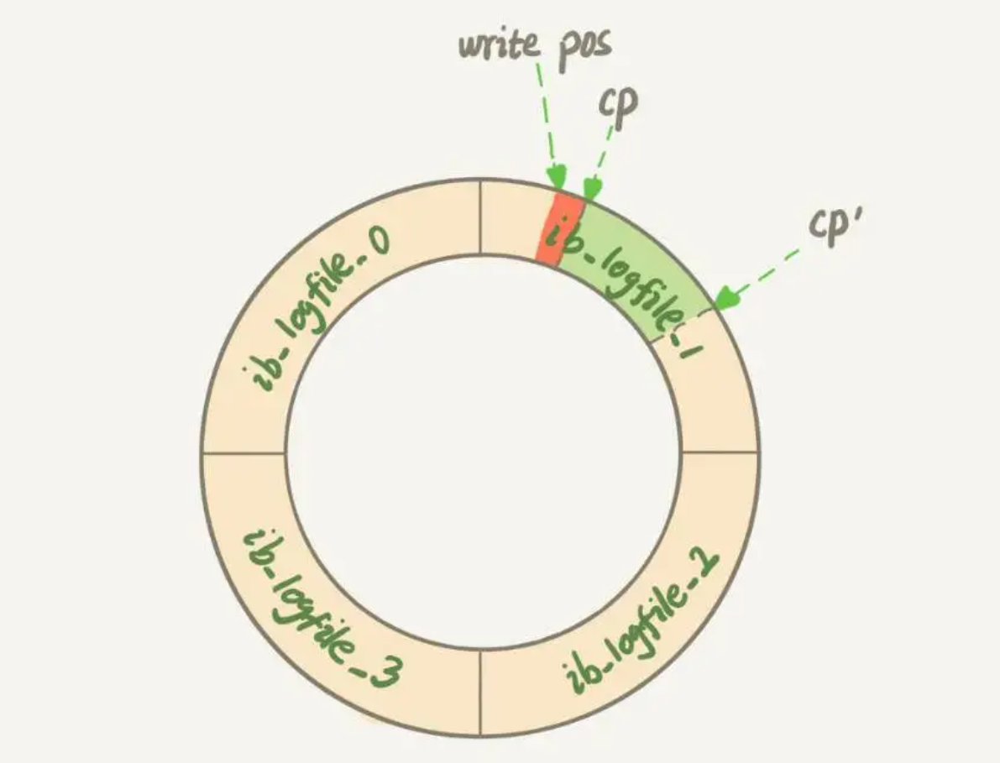

checkpoint可不是随便往前修改一下位置就可以的。比如图2中，把checkpoint位置从CP推进到CP’，就需要将两个点之间的日志（浅绿色部分），对应的所有脏页都flush到磁盘上。之后，图中从write pos到CP’之间就是可以再写入的redo log的区域。


- 第二种场景是，这一天生意太好，要记住的事情太多，掌柜发现自己快记不住了，赶紧找出账本把孔乙己这笔账先加进去。
  这种场景，对应的就是**系统内存不足**。当需要新的内存页，而内存不够用的时候，就要淘汰一些数据页，空出内存给别的数据页使用。**如果淘汰的是“脏页”，就要先将脏页写到磁盘**。
  你一定会说，这时候难道不能直接把内存淘汰掉，下次需要请求的时候，从磁盘读入数据页，然后拿redo log出来应用不就行了？这里其实是从性能考虑的。如果刷脏页一定会写盘，就保证了每个数据页有两种状态：
  - 一种是内存里存在，内存里就肯定是正确的结果，直接返回；
  - 另一种是内存里没有数据，就可以肯定数据文件上是正确的结果，读入内存后返回。这样的效率最高。

- 第三种场景是，生意不忙的时候，或者打烊之后。这时候柜台没事，掌柜闲着也是闲着，不如更新账本。
  这种场景，对应的就是MySQL认为**系统“空闲”的时候**。当然，MySQL“这家酒店”的生意好起来可是会很快就能把粉板记满的，所以“掌柜”要合理地安排时间，即使是“生意好”的时候，也要见缝插针地找时间，只要有机会就刷一点“脏页”。
- 第四种场景是，年底了咸亨酒店要关门几天，需要把账结清一下。这时候掌柜要把所有账都记到账本上，这样过完年重新开张的时候，就能就着账本明确账目情况了。
  这种场景，对应的就是**MySQL正常关闭的情况**。这时候，MySQL会把内存的脏页都flush到磁盘上，这样下次MySQL启动的时候，就可以直接从磁盘上读数据，启动速度会很快。


## flush操作对系统性能的影响

其中，第三种情况是属于MySQL空闲时的操作，这时系统没什么压力，而第四种场景是数据库本来就要关闭了。这两种情况下，你不会太关注“性能”问题。所以这里，我们主要来分析一下前两种场景下的性能问题。


第一种是“**redo log写满了，要flush脏页**”，**这种情况是InnoDB要尽量避免的**。因为出现这种情况的时候，整个系统就**不能再接受更新**了，所有的更新都必须堵住。如果你从监控上看，这时候更新数会跌为0。

第二种是“内存不够用了，要先将脏页写到磁盘”，这种情况其实是常态。**InnoDB用缓冲池（buffer pool）管理内存，缓冲池中的内存页有三种状态：**

- 第一种是，还没有使用的；
- 第二种是，使用了并且是干净页；
- 第三种是，使用了并且是脏页。

InnoDB的策略是尽量使用内存，因此对于一个长时间运行的库来说，未被使用的页面很少。

而当要读入的数据页没有在内存的时候，就必须到缓冲池中申请一个数据页。这时候只能把最久不使用的数据页从内存中淘汰掉：如果要淘汰的是一个干净页，就直接释放出来复用；但如果是脏页呢，就必须将脏页先刷到磁盘，变成干净页后才能复用。

所以，刷脏页虽然是常态，但是出现以下这两种情况，都是会明显**影响性能**的：

1. **一个查询要淘汰的脏页个数太多**，会导致查询的响应时间明显变长；
2. **日志写满**，更新全部堵住，写性能跌为0，这种情况对敏感业务来说，是不能接受的。

所以，InnoDB需要有控制脏页比例的机制，来尽量避免上面的这两种情况。


## InnoDB刷脏页速度的控制策略

### 主机IO能力

接下来，我就来和你说说InnoDB脏页的控制策略，以及和这些策略相关的参数。

首先，你要正确地告诉InnoDB所在主机的IO能力，这样InnoDB才能知道需要全力刷脏页的时候，可以刷多快。

这就要用到**innodb_io_capacity**这个参数了，它会告诉InnoDB你的磁盘能力。这个值我建议你设置成磁盘的IOPS。磁盘的IOPS可以通过fio这个工具来测试，下面的语句是我用来测试磁盘随机读写的命令：

```mysql
fio -filename=$filename -direct=1 -iodepth 1 -thread -rw=randrw -ioengine=psync -bs=16k -size=500M -numjobs=10 -runtime=10 -group_reporting -name=mytest
```

其实，因为没能正确地设置innodb_io_capacity参数，而导致的性能问题也比比皆是。之前，就曾有其他公司的开发负责人找我看一个库的性能问题，说MySQL的写入速度很慢，TPS很低，但是数据库主机的IO压力并不大。经过一番排查，发现罪魁祸首就是这个参数的设置出了问题。

他的主机磁盘用的是SSD，但是innodb_io_capacity的值设置的是300。于是，InnoDB认为这个系统的能力就这么差，所以刷脏页刷得特别慢，甚至比脏页生成的速度还慢，这样就造成了脏页累积，影响了查询和更新性能。

虽然我们现在已经定义了“全力刷脏页”的行为，但平时总不能一直是全力刷吧？毕竟磁盘能力不能只用来刷脏页，还需要服务用户请求。所以接下来，我们就一起看看InnoDB怎么控制引擎按照“全力”的百分比来刷脏页。


> InnoDB的刷盘速度就是要参考这两个因素：一个是**脏页比例**，一个是**redo log写盘速度**。

### 脏页比例

参数**innodb_max_dirty_pages_pct**是**`脏页比例上限`**，默认值是**75%**。InnoDB会根据当前的**`脏页比例`（假设为M）**，算出一个范围在0到100之间的数字，计算这个数字的伪代码类似这样：(**我自己测试mysql8默认值为90%**)

```
F1(M)
{
  if M>=innodb_max_dirty_pages_pct then
      return 100;
  return 100*M/innodb_max_dirty_pages_pct;
}
```


### 刷脏页的速度计算

InnoDB每次写入的日志都有一个序号，当前**写入的序号跟checkpoint对应的序号之间的`差值`，我们假设为N**。InnoDB会根据这个N算出一个范围在0到100之间的数字，这个计算公式可以记为F2(N)。F2(N)算法比较复杂，你只要知道**N越大，算出来的值越大就好了**。

> 即checkpoint和write pos差的越远，说明空间不多了，刷的越快

然后，**根据上述算得的F1(M)和F2(N)两个值，取其中较大的值记为R，之后引擎就可以按照innodb_io_capacity定义的能力乘以R%来控制刷脏页的速度。**

> R = max(F1(M), F2(N))
>
> 刷脏页的速度 = innodb_io_capacity * R

当前**脏页比例越高**，**redo log越久没merge**，即越久没同步磁盘数据，当前**刷脏页速度越快**，**<font color='red'>但都需要定义好主机IO能力innodb_io_capacity这个变量</font>**


现在你知道了，InnoDB会在后台刷脏页，而刷脏页的过程是要将内存页写入磁盘。所以，无论是你的查询语句在需要内存的时候可能要求淘汰一个脏页，还是由于刷脏页的逻辑会占用IO资源并可能影响到了你的更新语句，都可能是造成你从业务端感知到MySQL“抖”了一下的原因。

要尽量避免这种情况，你就要合理地设置innodb_io_capacity的值，并且**平时要多关注脏页比例，不要让它经常接近75%**。

其中，脏页比例是通过Innodb_buffer_pool_pages_dirty/Innodb_buffer_pool_pages_total得到的，具体的命令参考下面的代码：

```
select VARIABLE_VALUE into @a from global_status where VARIABLE_NAME = 'Innodb_buffer_pool_pages_dirty';
select VARIABLE_VALUE into @b from global_status where VARIABLE_NAME = 'Innodb_buffer_pool_pages_total';
select @a/@b;
```


> 一旦一个查询请求需要在执行过程中先flush掉一个脏页时，这个查询就可能要比平时慢了。而MySQL中的一个机制，可能让你的查询会更慢：在准备刷一个脏页的时候，**如果这个数据页旁边的数据页刚好是脏页，就会把这个“邻居”也带着一起刷掉**；而且这个把“邻居”拖下水的逻辑还可以继续蔓延，也就是**对于每个邻居数据页，如果跟它相邻的数据页也还是脏页的话，也会被放到一起刷**。
>
> 在InnoDB中，**innodb_flush_neighbors** 参数就是用来控制这个行为的，值为1的时候会有上述的“连坐”机制，值为0时表示不找邻居，自己刷自己的。
>
> 找“邻居”这个优化在机械硬盘时代是很有意义的，可以减少很多随机IO。机械硬盘的随机IOPS一般只有几百，相同的逻辑操作减少随机IO就意味着系统性能的大幅度提升。
>
> 而如果使用的是SSD这类IOPS比较高的设备的话，我就建议你把innodb_flush_neighbors的值设置成0。因为这时候IOPS往往不是瓶颈，而“只刷自己”，就能更快地执行完必要的刷脏页操作，减少SQL语句响应时间。
>
> **在MySQL 8.0中，innodb_flush_neighbors参数的默认值已经是0了。**


# 13 讲为什么表数据删掉一半，表文件大小不变

经常会有同学来问我，我的数据库占用空间太大，我把一个最大的表删掉了一半的数据，怎么表文件的大小还是没变？

那么今天，我就和你聊聊数据库表的空间回收，看看如何解决这个问题。

这里，我们还是针对MySQL中应用最广泛的InnoDB引擎展开讨论。一个InnoDB表包含两部分，即：表结构定义和数据。在MySQL 8.0版本以前，表结构是存在以.frm为后缀的文件里。而MySQL 8.0版本，则已经允许把表结构定义放在系统数据表中了。因为表结构定义占用的空间很小，所以我们今天主要讨论的是表数据。

接下来，我会先和你说明为什么简单地删除表数据达不到表空间回收的效果，然后再和你介绍正确回收空间的方法。

## 参数innodb_file_per_table

表数据既可以存在共享表空间里，也可以是单独的文件。这个行为是由参数innodb_file_per_table控制的：

1. 这个参数设置为OFF表示的是，表的数据放在系统共享表空间，也就是跟数据字典放在一起；
2. 这个参数设置为ON表示的是，每个InnoDB表数据存储在一个以 .ibd为后缀的文件中。

从MySQL 5.6.6版本开始，它的默认值就是ON了。

我建议你不论使用MySQL的哪个版本，都将这个值设置为ON。因为，一个表单独存储为一个文件更容易管理，而且在你不需要这个表的时候，通过drop table命令，系统就会直接删除这个文件。而如果是放在共享表空间中，即使表删掉了，空间也是不会回收的。

所以，**将innodb_file_per_table设置为ON，是推荐做法，我们接下来的讨论都是基于这个设置展开的。**

我们在删除整个表的时候，可以使用**drop table命令回收表空间**。但是，我们遇到的更多的删除数据的场景是删除某些行，这时就遇到了我们文章开头的问题：表中的数据被删除了，但是表空间却没有被回收。

我们要彻底搞明白这个问题的话，就要从数据删除流程说起了。

> 当innodb_file_per_table为ON时，使用drop table能回收表空间

接下来要看的是使用delete删除数据的情况：

## delete删除数据

因为**记录和数据页都可以被复用**

所以使用delete删除后，表空间未被回收掉，文件大小没减小


> 但是，**数据页的复用跟记录的复用是不同的。**
>
> 记录的复用，只限于符合范围条件的数据。比如上面的这个例子，R4这条记录被删除后，如果插入一个ID是400的行，可以直接复用这个空间。但如果插入的是一个ID是800的行，就不能复用这个位置了。
>
> 而当整个页从B+树里面摘掉以后，可以复用到任何位置。以图1为例，如果将数据页page A上的所有记录删除以后，page A会被标记为可复用。这时候如果要插入一条ID=50的记录需要使用新页的时候，page A是可以被复用的。

进一步地，如果我们**用delete命令把整个表的数据删除**呢？结果就是，所有的数据页都会被标记为可复用。但是磁盘上，**文件不会变小**。

delete命令其实只是把记录的位置，或者数据页标记为了**“可复用”**，但磁盘文件的大小是不会变的。也就是说，通过delete命令是不能回收表空间的。这些可以复用，而没有被使用的空间，看起来就像是**“空洞”**。

实际上，**不止是删除数据会造成空洞，插入数据也会。**

如果数据是按照索引递增顺序插入的，那么索引是紧凑的。但如果数据是随机插入的，就可能造成索引的数据页分裂。页分裂会时页的空间利用率降低，造成空洞

**更新索引上的值**，可以理解为删除一个旧的值，再插入一个新值。不难理解，这**也是会造成空洞**的。

也就是说，经过大量**增删改**的表，都是可能是存在空洞的。所以，如果能够把这些空洞去掉，就能达到收缩表空间的目的。

> insert、delete、update都会造成空洞

而重建表，就可以达到这样的目的。

## 解决方法：重建表

你可以使用alter table A engine=InnoDB命令来重建表

```
alter table A engine=InnoDB
```

但是分为两种情况，执行的具体过程不同

分为**MySQL 5.5版本之前和之后**

在MySQL 5.5版本之前，这个命令的执行流程跟我们前面描述的差不多，区别只是这个临时表B不需要你自己创建，MySQL会自动完成转存数据、交换表名、删除旧表的操作。

实战45讲笔记.assets/image-20230926151135184.png)

> MySQL5.5之前，是采用在**server层**创建**临时表**来完成表的重建的
>
> 显然，花时间最多的步骤是往临时表插入数据的过程，如果在这个过程中，有新的数据要写入到表A的话，就会造成数据丢失。因此，**在整个DDL过程中，表A中不能有更新**。也就是说，**这个DDL不是Online的**。


**MySQL 5.6版本开始引入的Online DDL，对这个操作流程做了优化。**

我给你简单描述一下引入了Online DDL之后，重建表的流程：

1. 建立一个临时文件，扫描表A主键的所有数据页；
2. 用数据页中表A的记录生成B+树，存储到临时文件中；
3. 生成临时文件的过程中，将所有对A的操作记录在一个**日志文件（row log）**中，对应的是图中state2的状态；
4. 临时文件生成后，将日志文件中的操作应用到临时文件，得到一个逻辑数据上与表A相同的数据文件，对应的就是图中state3的状态；
5. 用临时文件替换表A的数据文件。

实战45讲笔记.assets/image-20230926151320804.png)

> MySQL5.6开始，是在**存储引擎**创建**临时文件**完成的，并且由于**日志文件**记录和重放操作这个功能的存在，这个方案在重建表的过程中，允许对表A做增删改操作。这也就是**Online DDL**名字的来源。
>
> alter语句在启动的时候需要获取MDL写锁，但是这个写锁在真正拷贝数据之前就**退化成读锁**了。所以可以进行表的更新
>
> 为什么要退化呢？为了实现Online，MDL读锁不会阻塞增删改操作。

需要补充说明的是，上述的这些重建方法都会扫描原表数据和构建临时文件。对于很大的表来说，这个操作是很**消耗IO和CPU资源**的。因此，如果是线上服务，你要很小心地控制操作时间。如果想要比较安全的操作的话，我推荐你使用GitHub开源的gh-ost来做。

> 注意：在重建表的时候，**InnoDB不会把整张表占满，每个页留了1/16给后续的更新用**。也就是说，其实重建表之后**不是“最”紧凑**的。

## Online 和 inplace

MySQL5.5之前，我们把表A中的数据导出来的存放位置叫作tmp_table。这是一个临时表，是在server层创建的。

MySQL5.5之后，根据表A重建出来的数据是放在“tmp_file”里的，这个临时文件是InnoDB在内部创建出来的。**整个DDL过程都在InnoDB内部完成**。对于server层来说，没有把数据挪动到临时表，是一个**“原地”操作**，这就是**“inplace”**名称的来源。

所以，我现在问你，如果你有一个1TB的表，现在磁盘间是1.2TB，能不能做一个inplace的DDL呢？

答案是不能。因为，tmp_file也是要占用临时空间的。

我们重建表的这个语句alter table t engine=InnoDB，其实隐含的意思是：

```
alter table t engine=innodb,ALGORITHM=inplace;
```

跟inplace对应的就是拷贝表的方式了，用法是：

```
alter table t engine=innodb,ALGORITHM=copy;
```

当你使用ALGORITHM=copy的时候，表示的是强制拷贝表，对应的流程就是MySQL5.5之前的操作过程。

但我这样说你可能会觉得，inplace跟Online是不是就是一个意思？

其实不是的，只是在重建表这个逻辑中刚好是这样而已。

比如，如果我要给InnoDB表的一个字段加全文索引或空间索引，写法是：

```
alter table t add FULLTEXT(field_name);
```

这个过程是inplace的，但会阻塞增删改操作，是非Online的。

如果说这两个逻辑之间的关系是什么的话，可以概括为：

1. DDL过程如果是Online的，就一定是inplace的；
2. 反过来未必，也就是说inplace的DDL，有可能不是Online的。截止到MySQL 8.0，添加全文索引（FULLTEXT index）和空间索引(SPATIAL index)就属于这种情况。

> 意思就是：MySQL5.6开始，alter语句除了添加全文索引和空间索引，都支持Online DDL
>
> **不影响增删改，就是 Online；相对 Server层没有新建临时表，就是 inplace**

- 从MySQL 5.6版本开始，alter table t engine = InnoDB（也就是recreate）默认的就是上面MySQL5.5之后的流程了；
- analyze table t 其实不是重建表，只是对表的索引信息做重新统计，没有修改数据，这个过程中加了MDL读锁；
- optimize table t 等于recreate+analyze。


# 14 讲count(*)这么慢，我该怎么办

你会发现随着系统中记录数越来越多，这条语句执行得也会越来越慢。然后你可能就想了，MySQL怎么这么笨啊，记个总数，每次要查的时候直接读出来，不就好了吗。

那么今天，我们就来聊聊count(*)语句到底是怎样实现的，以及MySQL为什么会这么实现。然后，我会再和你说说，如果应用中有这种频繁变更并需要统计表行数的需求，业务设计上可以怎么做。

## count(*)的实现方式

你首先要明确的是，在不同的MySQL引擎中，count(*)有不同的实现方式。

- MyISAM引擎把一个表的总行数存在了磁盘上，因此执行count(*)的时候会直接返回这个数，效率很高；
- 而InnoDB引擎就麻烦了，它执行count(*)的时候，需要把数据一行一行地从引擎里面读出来，然后累积计数。

这里需要注意的是，我们在这篇文章里讨论的是没有过滤条件的count(*)，如果加了where 条件的话，MyISAM表也是不能返回得这么快的。

在前面的文章中，我们一起分析了为什么要使用InnoDB，因为不论是在事务支持、并发能力还是在数据安全方面，InnoDB都优于MyISAM。我猜你的表也一定是用了InnoDB引擎。这就是当你的记录数越来越多的时候，计算一个表的总行数会越来越慢的原因。

当然，现在这个看上去笨笨的MySQL，在执行**count(*)操作的时候还是做了优化**的。

你知道的，InnoDB是索引组织表，主键索引树的叶子节点是数据，而普通索引树的叶子节点是主键值。所以，普通索引树比主键索引树小很多。对于count(*)这样的操作，遍历哪个索引树得到的结果逻辑上都是一样的。因此，MySQL优化器会找到**最小的那棵树**来遍历。**在保证逻辑正确的前提下，尽量减少扫描的数据量，是数据库系统设计的通用法则之一。**


如果你用过show table status 命令的话，就会发现这个命令的输出结果里面也有一个TABLE_ROWS用于显示这个表当前有多少行，这个命令执行挺快的，那这个TABLE_ROWS能代替count(*)吗？

你可能还记得在第10篇文章[《 MySQL为什么有时候会选错索引？》](https://time.geekbang.org/column/article/71173)中我提到过，索引统计的值是通过采样来估算的。实际上，TABLE_ROWS就是从这个采样估算得来的，因此它也很不准。有多不准呢，官方文档说误差可能达到40%到50%。**所以，show table status命令显示的行数也不能直接使用。**

到这里我们小结一下：

- MyISAM表虽然count(*)很快，但是不支持事务；
- show table status命令虽然返回很快，但是不准确；
- InnoDB表直接count(*)会遍历全表，虽然结果准确，但会导致性能问题。


到底应该怎么办呢？你需要**自己找一个地方**，把操作记录表的行数存起来。

## 用缓存系统保存计数

你可以用一个Redis服务来保存这个表的总行数。这个表每被插入一行Redis计数就加1，每被删除一行Redis计数就减1。这种方式下，读和更新操作都很快，但你再想一下这种方式存在什么问题吗？

没错，缓存系统可能会丢失更新。

当然了，这还是有解的。比如，Redis异常重启以后，到数据库里面单独执行一次count(*)获取真实的行数，再把这个值写回到Redis里就可以了。异常重启毕竟不是经常出现的情况，这一次全表扫描的成本，还是可以接受的。

但实际上，**将计数保存在缓存系统中的方式，还不只是丢失更新的问题。即使Redis正常工作，这个值还是逻辑上不精确的。**

你可以设想一下有这么一个页面，要显示操作记录的总数，同时还要显示最近操作的100条记录。那么，这个页面的逻辑就需要先到Redis里面取出计数，再到数据表里面取数据记录。

我们是这么定义不精确的：

1. 一种是，查到的100行结果里面有最新插入记录，而Redis的计数里还没加1；
2. 另一种是，查到的100行结果里没有最新插入的记录，而Redis的计数里已经加了1。

这两种情况，都是逻辑不一致的。

实战45讲笔记.assets/image-20230926153605478.png)

或者反过来，也是不精确的

在并发系统里面，我们是无法精确控制不同线程的执行时刻的，因为存在图中的这种操作序列，所以，我们说即使Redis正常工作，这个计数值还是逻辑上不精确的。


## 在数据库保存计数

根据上面的分析，用缓存系统保存计数有丢失数据和计数不精确的问题。那么，**如果我们把这个计数直接放到数据库里单独的一张计数表C中，又会怎么样呢？**

首先，这解决了崩溃丢失的问题，InnoDB是支持崩溃恢复不丢数据的。

我们这篇文章要解决的问题，都是由于InnoDB要支持事务，从而导致InnoDB表不能把count(*)直接存起来，然后查询的时候直接返回形成的。

所谓以子之矛攻子之盾，现在我们就利用**“事务”**这个特性，把问题解决掉。

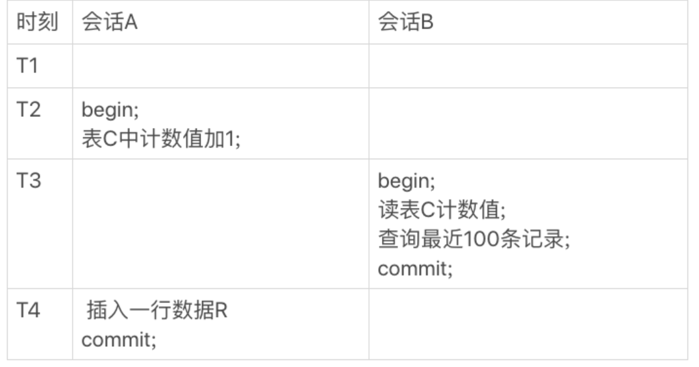

我们来看下现在的执行结果。虽然会话B的读操作仍然是在T3执行的，但是因为这时候更新事务还没有提交，所以计数值加1这个操作对会话B还不可见。

因此，会话B看到的结果里， 查计数值和“最近100条记录”看到的结果，逻辑上就是一致的。

## 不同的count用法

在前面文章的评论区，有同学留言问到：在select count(?) from t这样的查询语句里面，count(* )、count(主键id)、count(字段)和count(1)等不同用法的性能，有哪些差别。今天谈到了count(*)的性能问题，我就借此机会和你详细说明一下这几种用法的性能差别。

需要注意的是，下面的讨论还是**基于InnoDB**引擎的。

这里，首先你要弄清楚count()的语义。count()是一个聚合函数，对于返回的结果集，一行行地判断，如果count函数的参数不是NULL，累计值就加1，否则不加。最后返回累计值。

所以，count(*)、count(主键id)和count(1) 都表示返回满足条件的结果集的总行数；而count(字段），则表示返回满足条件的数据行里面，参数“字段”不为NULL的总个数。

至于分析性能差别的时候，你可以记住这么几个原则：

1. server层要什么就给什么；
2. InnoDB只给必要的值；
3. 现在的优化器只优化了count(*)的语义为“取行数”，其他“显而易见”的优化并没有做。

这是什么意思呢？接下来，我们就一个个地来看看。

**对于count(主键id)来说**，InnoDB引擎会遍历整张表，把每一行的id值都取出来，返回给server层。server层拿到id后，判断是不可能为空的，就按行累加。

**对于count(1)来说**，InnoDB引擎遍历整张表，但不取值。server层对于返回的每一行，放一个数字“1”进去，判断是不可能为空的，按行累加。

单看这两个用法的差别的话，你能对比出来，count(1)执行得要比count(主键id)快。因为从引擎返回id会涉及到解析数据行，以及拷贝字段值的操作。

**对于count(字段)来说**：

1. 如果这个“字段”是定义为not null的话，一行行地从记录里面读出这个字段，判断不能为null，按行累加；
2. 如果这个“字段”定义允许为null，那么执行的时候，判断到有可能是null，还要把值取出来再判断一下，不是null才累加。

也就是前面的第一条原则，server层要什么字段，InnoDB就返回什么字段。

**但是count(\*)是例外**，并不会把全部字段取出来，而是**专门做了优化**，不取值。count(*)肯定不是null，按行累加。会找到**最小的那棵树**遍历

看到这里，你一定会说，优化器就不能自己判断一下吗，主键id肯定非空啊，为什么不能按照count(*)来处理，多么简单的优化啊。

当然，MySQL专门针对这个语句进行优化，也不是不可以。但是这种需要专门优化的情况太多了，而且MySQL已经优化过count(*)了，你直接使用这种用法就可以了。

所以结论是：按照效率排序的话，**count(字段)<count(主键id)<count(1)≈count(* )**，所以我建议你，尽量使用count(*)。


>其实，把计数放在Redis里面，不能够保证计数和MySQL表里的数据精确一致的原因，是**这两个不同的存储构成的系统，不支持分布式事务，无法拿到精确一致的视图。**而把计数值也放在MySQL中，就解决了一致性视图的问题。
>
>InnoDB引擎支持事务，我们利用好事务的原子性和隔离性，就可以简化在业务开发时的逻辑。这也是InnoDB引擎备受青睐的原因之一。


# 15 讲答疑文章（一）：日志和索引相关问题

## 两阶段提交不同异常重启的现象

《02》

**在两阶段提交的不同时刻，MySQL异常重启会出现什么现象。**

如果在图中时刻A的地方，也就是写入redo log 处于prepare阶段之后、写binlog之前，发生了崩溃（crash），由于此时binlog还没写，redo log也还没提交，所以崩溃恢复的时候，这个事务会回滚。这时候，binlog还没写，所以也不会传到备库。到这里，大家都可以理解。

大家出现问题的地方，主要集中在时刻B，也就是binlog写完，redo log还没commit前发生crash，那崩溃恢复的时候MySQL会怎么处理？

我们先来看一下崩溃恢复时的判断规则。

1. 如果redo log里面的事务是完整的，也就是已经有了commit标识，则直接提交；
2. 如果redo log里面的事务只有完整的prepare，则判断对应的事务binlog是否存在并完整：
   a. 如果是，则提交事务；
   b. 否则，回滚事务。

#### 追问1：MySQL怎么知道binlog是完整的?

回答：一个事务的binlog是有完整格式的：

- statement格式的binlog，最后会有**COMMIT**；
- row格式的binlog，最后会有一个**XID event**。

另外，在MySQL 5.6.2版本以后，还引入了binlog-checksum参数，用来验证binlog内容的正确性。对于binlog日志由于磁盘原因，可能会在日志中间出错的情况，MySQL可以通过校验checksum的结果来发现。所以，MySQL还是有办法验证事务binlog的完整性的。

#### 追问2：redo log 和 binlog是怎么关联起来的?

回答：它们有一个共同的数据字段，叫XID。崩溃恢复的时候，会按顺序扫描redo log：

- 如果碰到既有prepare、又有commit的redo log，就直接提交；
- 如果碰到只有parepare、而没有commit的redo log，就**拿着XID去binlog找对应的事务**。

#### 追问3：处于prepare阶段的redo log加上完整binlog，重启就能恢复，MySQL为什么要这么设计?

回答：其实，这个问题还是跟我们在反证法中说到的数据与备份的一致性有关。在时刻B，也就是binlog写完以后MySQL发生崩溃，这时候binlog已经写入了，之后就会被从库（或者用这个binlog恢复出来的库）使用。

所以，在主库上也要提交这个事务。采用这个策略，主库和备库的数据就保证了一致性。

#### 追问4：如果这样的话，为什么还要两阶段提交呢？干脆先redo log写完，再写binlog。崩溃恢复的时候，必须得两个日志都完整才可以。是不是一样的逻辑？

回答：其实，两阶段提交是经典的分布式系统问题，并不是MySQL独有的。

如果必须要举一个场景，来说明这么做的必要性的话，那就是事务的持久性问题。

对于InnoDB引擎来说，如果redo log提交完成了，事务就不能回滚（如果这还允许回滚，就可能覆盖掉别的事务的更新）。而如果redo log直接提交，然后binlog写入的时候失败，InnoDB又回滚不了，数据和binlog日志又不一致了。

两阶段提交就是为了给所有人一个机会，当每个人都说“我ok”的时候，再一起提交。

#### 追问5：不引入两个日志，也就没有两阶段提交的必要了。只用binlog来支持崩溃恢复，又能支持归档，不就可以了？

回答：这位同学的意思是，只保留binlog，然后可以把提交流程改成这样：… -> “数据更新到内存” -> “写 binlog” -> “提交事务”，是不是也可以提供崩溃恢复的能力？

答案是不可以。

如果说**历史原因**的话，那就是InnoDB并不是MySQL的原生存储引擎。MySQL的原生引擎是MyISAM，设计之初就有没有支持崩溃恢复。

InnoDB在作为MySQL的插件加入MySQL引擎家族之前，就已经是一个提供了崩溃恢复和事务支持的引擎了。

InnoDB接入了MySQL后，发现既然binlog没有崩溃恢复的能力，那就用InnoDB原有的redo log好了。

而如果说**实现上的原因**的话，就有很多了。就按照问题中说的，只用binlog来实现崩溃恢复的流程，我画了一张示意图，这里就没有redo log了。

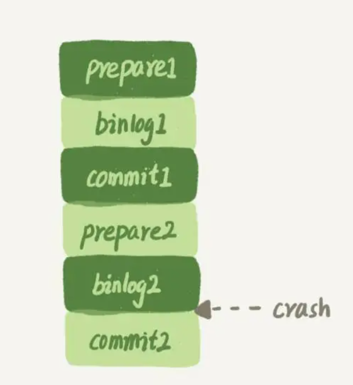

这样的流程下，binlog还是不能支持崩溃恢复的。我说一个不支持的点吧：binlog没有能力恢复“数据页”。

如果在图中标的位置，也就是binlog2写完了，但是整个事务还没有commit的时候，MySQL发生了crash。

重启后，引擎内部事务2会回滚，然后应用binlog2可以补回来；但是对于事务1来说，系统已经认为提交完成了，不会再应用一次binlog1。

但是，InnoDB引擎使用的是WAL技术，执行事务的时候，写完内存和日志，事务就算完成了。如果之后崩溃，要依赖于日志来恢复数据页。

也就是说在图中这个位置发生崩溃的话，事务1也是可能丢失了的，而且是数据页级的丢失。此时，binlog里面并没有记录数据页的更新细节，是补不回来的。

你如果要说，那我优化一下binlog的内容，让它来记录数据页的更改可以吗？但，这其实就是又做了一个redo log出来。

所以，至少现在的binlog能力，还不能支持崩溃恢复。

#### 追问6：那能不能反过来，只用redo log，不要binlog？

回答：如果只从崩溃恢复的角度来讲是可以的。你可以把binlog关掉，这样就没有两阶段提交了，但系统依然是crash-safe的。

但是，如果你了解一下业界各个公司的使用场景的话，就会发现在正式的生产库上，binlog都是开着的。因为binlog有着redo log无法替代的功能。

一个是归档。redo log是循环写，写到末尾是要回到开头继续写的。这样历史日志没法保留，redo log也就起不到归档的作用。

一个就是MySQL系统依赖于binlog。binlog作为MySQL一开始就有的功能，被用在了很多地方。其中，MySQL系统高可用的基础，就是binlog复制。

还有很多公司有异构系统（比如一些数据分析系统），这些系统就靠消费MySQL的binlog来更新自己的数据。关掉binlog的话，这些下游系统就没法输入了。

总之，由于现在包括MySQL高可用在内的很多系统机制都依赖于binlog，所以“鸠占鹊巢”redo log还做不到。你看，发展生态是多么重要。

#### 追问7：redo log一般设置多大？

回答：redo log太小的话，会导致很快就被写满，然后不得不强行刷redo log，这样WAL机制的能力就发挥不出来了。

所以，如果是现在常见的几个TB的磁盘的话，就不要太小气了，直接将redo log设置为4个文件、每个文件1GB吧。

#### 追问8：正常运行中的实例，数据写入后的最终落盘，是从redo log更新过来的还是从buffer pool更新过来的呢？

回答：这个问题其实问得非常好。这里涉及到了，“redo log里面到底是什么”的问题。

实际上，redo log并没有记录数据页的完整数据，所以它并没有能力自己去更新磁盘数据页，也就不存在“数据最终落盘，是由redo log更新过去”的情况。

1. 如果是正常运行的实例的话，数据页被修改以后，跟磁盘的数据页不一致，称为脏页。最终数据落盘，就是把内存中的数据页写盘。这个过程，甚至与redo log毫无关系。
2. 在崩溃恢复场景中，InnoDB如果判断到一个数据页可能在崩溃恢复的时候丢失了更新，就会将它读到内存，然后让redo log更新内存内容。更新完成后，内存页变成脏页，就回到了第一种情况的状态。

#### 追问9：redo log buffer是什么？是先修改内存，还是先写redo log文件？

回答：这两个问题可以一起回答。

在一个事务的更新过程中，日志是要写多次的。比如下面这个事务：

```
begin;
insert into t1 ...
insert into t2 ...
commit;
```

这个事务要往两个表中插入记录，插入数据的过程中，生成的日志都得先保存起来，但又不能在还没commit的时候就直接写到redo log文件里。

所以，redo log buffer就是一块内存，用来先存redo日志的。也就是说，在执行第一个insert的时候，数据的内存被修改了，redo log buffer也写入了日志。

但是，真正把日志写到redo log文件（文件名是 ib_logfile+数字），是在执行commit语句的时候做的。

（这里说的是事务执行过程中不会“主动去刷盘”，以减少不必要的IO消耗。但是可能会出现“被动写入磁盘”，比如内存不够、其他事务提交等情况。这个问题我们会在后面第22篇文章《MySQL有哪些“饮鸩止渴”的提高性能的方法？》中再详细展开）。

单独执行一个更新语句的时候，InnoDB会自己启动一个事务，在语句执行完成的时候提交。过程跟上面是一样的，只不过是“压缩”到了一个语句里面完成。


## 修改一样的数据MySQL会怎样运行

这时候，表t里有唯一的一行数据(1,2)。假设，我现在要执行：

```
mysql> update t set a=2 where id=1;
```

你会看到这样的结果：

实战45讲笔记.assets/367b3f299b94353f32f75ea825391170.png)
结果显示，匹配(rows matched)了一行，修改(Changed)了0行。

仅从现象上看，MySQL内部在处理这个命令的时候，可以有以下三种选择：

1. 更新都是先读后写的，MySQL读出数据，发现a的值本来就是2，不更新，直接返回，执行结束；
2. MySQL调用了InnoDB引擎提供的“修改为(1,2)”这个接口，但是引擎发现值与原来相同，不更新，直接返回；
3. InnoDB认真执行了“把这个值修改成(1,2)"这个操作，该加锁的加锁，该更新的更新。

> MySQL采取的措施是第三条


# 16 讲“orderby”是怎么工作的

在你开发应用的时候，一定会经常碰到需要根据指定的字段排序来显示结果的需求。还是以我们前面举例用过的市民表为例，假设你要查询城市是“杭州”的所有人名字，并且按照姓名排序返回前1000个人的姓名、年龄。

假设这个表的部分定义是这样的：

```
CREATE TABLE `t` (
  `id` int(11) NOT NULL,
  `city` varchar(16) NOT NULL,
  `name` varchar(16) NOT NULL,
  `age` int(11) NOT NULL,
  `addr` varchar(128) DEFAULT NULL,
  PRIMARY KEY (`id`),
  KEY `city` (`city`)
) ENGINE=InnoDB;
```

这时，你的SQL语句可以这么写：

```
select city,name,age from t where city='杭州' order by name limit 1000  ;
```

这个语句看上去逻辑很清晰，但是你了解它的执行流程吗？今天，我就和你聊聊这个语句是怎么执行的，以及有什么参数会影响执行的行为。


## filesort归并排序

如果name字段不能使用索引排序，那么将会使用filesort

前面我们介绍过索引，所以你现在就很清楚了，为避免全表扫描，我们需要在city字段加上索引。

在city字段上创建索引之后，我们用explain命令来看看这个语句的执行情况。

实战45讲笔记.assets/826579b63225def812330ef6c344a303.png)

​						图1 使用explain命令查看语句的执行情况

Extra这个字段中的“Using filesort”表示的就是需要排序，MySQL会给每个线程分配一块内存用于排序，称为sort_buffer。

为了说明这个SQL查询语句的执行过程，我们先来看一下city这个索引的示意图。

实战45讲笔记.assets/image-20230927101107961.png)

​							图2 city字段的索引示意图

从图中可以看到，满足city='杭州’条件的行，是从ID_X到ID_(X+N)的这些记录。

### 全字段排序

当**sort_buffer_size > 要排序的数据**时，

这个语句执行流程如下所示 ：

1. 初始化sort_buffer，确定放入name、city、age这三个字段；
2. 从索引city找到第一个满足city='杭州’条件的主键id，也就是图中的ID_X；
3. 到主键id索引取出整行，取name、city、age三个字段的值，存入sort_buffer中；
4. 从索引city取下一个记录的主键id；
5. 重复步骤3、4直到city的值不满足查询条件为止，对应的主键id也就是图中的ID_Y；
6. 对sort_buffer中的数据按照字段name做快速排序；
7. 按照排序结果取前1000行返回给客户端。

我们暂且把这个排序过程，称为**全字段排序**，执行流程的示意图如下所示，下一篇文章中我们还会用到这个排序。


​									图3 全字段排序

图中“按name排序”这个动作，可能在内存中完成，也可能需要使用外部排序，这取**决于排序所需的内存和参数sort_buffer_size**。

sort_buffer_size，就是MySQL为排序开辟的内存（sort_buffer）的大小。**如果要排序的数据量小于sort_buffer_size，排序就在内存中完成**。但如果排序数据量太大，内存放不下，则不得不利用磁盘临时文件辅助排序。

> 你可以用下面介绍的方法，来确定一个排序语句是否使用了临时文件。
>
> ```
> /* 打开optimizer_trace，只对本线程有效 */
> SET optimizer_trace='enabled=on'; 
> 
> /* @a保存Innodb_rows_read的初始值 */
> select VARIABLE_VALUE into @a from  performance_schema.session_status where variable_name = 'Innodb_rows_read';
> 
> /* 执行语句 */
> select city, name,age from t where city='杭州' order by name limit 1000; 
> 
> /* 查看 OPTIMIZER_TRACE 输出 */
> SELECT * FROM `information_schema`.`OPTIMIZER_TRACE`\G
> 
> /* @b保存Innodb_rows_read的当前值 */
> select VARIABLE_VALUE into @b from performance_schema.session_status where variable_name = 'Innodb_rows_read';
> 
> /* 计算Innodb_rows_read差值 */
> select @b-@a;
> ```
>
> 这个方法是通过查看 OPTIMIZER_TRACE 的结果来确认的，你可以从 number_of_tmp_files中看到是否使用了临时文件。
>
> 实战45讲笔记.assets/89baf99cdeefe90a22370e1d6f5e6495.png)
>
> ​						图4 全排序的OPTIMIZER_TRACE部分结果
>
> - number_of_tmp_files：排序过程中使用的临时文件数
>   - 内存放不下时，就需要使用外部排序，外部排序一般使用归并排序算法。可以这么简单理解，**MySQL将需要排序的数据分成12份，每一份单独排序后存在这些临时文件中。然后把这12个有序文件再合并成一个有序的大文件。**
>   - 如果sort_buffer_size超过了需要排序的数据量的大小，number_of_tmp_files就是0，表示排序可以直接在内存中完成
> - examined_rows=4000，表示参与排序的行数是4000行。
> - sort_mode 里面的packed_additional_fields的意思是，**全字段排序**，并在排序过程对字符串做了“紧凑”处理。即使name字段的定义是varchar(16)，在排序过程中还是要按照实际长度来分配空间的。
> - 最后一个查询语句select @b-@a 的返回结果是4000，表示整个执行过程只扫描了4000行。
>   - 这里需要注意的是，为了避免对结论造成干扰，我把internal_tmp_disk_storage_engine设置成MyISAM。否则，select @b-@a的结果会显示为4001。这是因为查询OPTIMIZER_TRACE这个表时，需要用到临时表，而internal_tmp_disk_storage_engine的默认值是InnoDB。如果使用的是InnoDB引擎的话，把数据从临时表取出来的时候，会让Innodb_rows_read的值加1。


### rowid排序

在上面这个算法过程里面，只对原表的数据读了一遍，剩下的操作都是在sort_buffer和临时文件中执行的。但这个算法有一个问题，就是如果查询要返回的字段很多的话，那么sort_buffer里面要放的字段数太多，这样内存里能够同时放下的行数很少，**要分成很多个临时文件，排序的性能会很差**。

所以**如果单行很大，这个方法效率不够好**。

接下来，我来修改一个参数，让MySQL采用另外一种算法。

```
SET max_length_for_sort_data = 16;
```

max_length_for_sort_data，是MySQL中专门控制用于排序的行数据的长度的一个参数。它的意思是，如果单行的长度超过这个值，MySQL就认为单行太大，要换一个算法。

city、name、age 这三个字段的定义总长度是36，我把max_length_for_sort_data设置为16，我们再来看看计算过程有什么改变。

新的算法放入sort_buffer的字段，只有要排序的列（即name字段）和主键id。

但这时，排序的结果就因为少了city和age字段的值，不能直接返回了，整个执行流程就变成如下所示的样子：

1. 初始化sort_buffer，确定放入两个字段，即name和id；
2. 从索引city找到第一个满足city='杭州’条件的主键id，也就是图中的ID_X；
3. 到主键id索引取出整行，取name、id这两个字段，存入sort_buffer中；
4. 从索引city取下一个记录的主键id；
5. 重复步骤3、4直到不满足city='杭州’条件为止，也就是图中的ID_Y；
6. 对sort_buffer中的数据按照字段name进行排序；
7. 遍历排序结果，取前1000行，并**按照id的值回到原表**中取出city、name和age三个字段返回给客户端。

这个执行流程的示意图如下，我把它称为rowid排序。


​									图5 rowid排序

对比图3的全字段排序流程图你会发现，**rowid排序多访问了一次表t的主键索引**，就是步骤7。

需要说明的是，最后的“结果集”是一个逻辑概念，实际上MySQL服务端从排序后的sort_buffer中依次取出id，然后到原表查到city、name和age这三个字段的结果，不需要在服务端再耗费内存存储结果，是直接返回给客户端的。

根据这个说明过程和图示，你可以想一下，这个时候执行select @b-@a，结果会是多少呢？

现在，我们就来看看结果有什么不同。

首先，图中的examined_rows的值还是4000，表示用于排序的数据是4000行。但是select @b-@a这个语句的值变成5000了。

因为这时候除了排序过程外，在排序完成后，还要根据id去原表取值。由于语句是limit 1000，因此会多读1000行。

实战45讲笔记.assets/27f164804d1a4689718291be5d10f89b.png)

​						图6 rowid排序的OPTIMIZER_TRACE部分输出

从OPTIMIZER_TRACE的结果中，你还能看到另外两个信息也变了。

- sort_mode变成了<sort_key, **rowid**>，表示参与排序的只有name和id这两个字段。
- number_of_tmp_files变成10了，是因为这时候参与排序的行数虽然仍然是4000行，但是每一行都变小了，因此需要排序的总数据量就变小了，需要的临时文件也相应地变少了。


### 全字段排序 VS rowid排序

- 如果MySQL实在是担心排序内存太小，会影响排序效率，才会采用rowid排序算法，这样排序过程中一次可以排序更多行，但是需要再回到原表去取数据。
- 如果MySQL认为内存足够大，会优先选择全字段排序，把需要的字段都放到sort_buffer中，这样排序后就会直接从内存里面返回查询结果了，不用再回到原表去取数据。

这也就体现了MySQL的一个设计思想：**如果内存够，就要多利用内存，尽量减少磁盘访问。**

**对于InnoDB表来说，rowid排序会要求回表多造成磁盘读，因此不会被优先选择。**


> 全字段排序
> 1.通过索引将所需的字段全部读取到sort_buffer中
> 2.按照排序字段进行排序
> 3.将结果集返回给客户端
>
>缺点：
> 1.造成sort_buffer中存放不下很多数据，因为除了排序字段还存放其他字段，对sort_buffer的利用效率不高
> 2.当所需排序数据量很大时，会有很多的临时文件，排序性能也会很差
> 
>优点：MySQL认为内存足够大时会优先选择全字段排序，因为这种方式比rowid 排序避免了一次回表操作
> 
>rowid排序
> 1.通过控制排序的行数据的长度来让sort_buffer中尽可能多的存放数据，max_length_for_sort_data
> 2.只将需要排序的字段和主键读取到sort_buffer中，并按照排序字段进行排序
> 3.按照排序后的顺序，取id进行回表取出想要获取的数据
> 4.将结果集返回给客户端
> 
> 优点：更好的利用内存的sort_buffer进行排序操作，尽量减少对磁盘的访问
>
> 缺点：回表的操作是随机IO，会造成大量的随机读，不一定就比全字段排序减少对磁盘的访问


## 索引排序

其实，并不是所有的order by语句，都需要排序操作的。从上面分析的执行过程，我们可以看到，MySQL之所以需要生成临时表，并且在临时表上做排序操作，**其原因是原来的数据都是无序的。**

你可以设想下，如果能够保证从city这个索引上取出来的行，天然就是按照name递增排序的话，是不是就可以不用再排序了呢？

确实是这样的。

所以，我们可以在这个市民表上创建一个city和name的联合索引，对应的SQL语句是：

```
alter table t add index city_user(city, name);
```

作为与city索引的对比，我们来看看这个索引的示意图。

实战45讲笔记.assets/image-20230927102414680.png)

​								图7 city和name联合索引示意图

在这个索引里面，我们依然可以用树搜索的方式定位到第一个满足city='杭州’的记录，并且额外确保了，接下来按顺序取“下一条记录”的遍历过程中，只要city的值是杭州，name的值就一定是有序的。

这样整个查询过程的流程就变成了：

1. 从索引(city,name)找到第一个满足city='杭州’条件的主键id；
2. 到主键id索引取出整行，取name、city、age三个字段的值，作为结果集的一部分直接返回；
3. 从索引(city,name)取下一个记录主键id；
4. 重复步骤2、3，直到查到第1000条记录，或者是不满足city='杭州’条件时循环结束。

可以看到，这个查询过程不需要临时表，也不需要排序。接下来，我们用explain的结果来印证一下。

实战45讲笔记.assets/fc53de303811ba3c46d344595743358a.png)

​					图9 引入(city,name)联合索引后，查询语句的执行计划

从图中可以看到，Extra字段中没有Using filesort了，也就是不需要排序了。而且由于(city,name)这个联合索引本身有序，所以这个查询也不用把4000行全都读一遍，只要找到满足条件的前1000条记录就可以退出了。也就

是说，在我们这个例子里，只需要扫描1000次。

这里我们可以再稍微复习一下。**覆盖索引是指，索引上的信息足够满足查询请求，不需要再回到主键索引上去取数据。**

按照覆盖索引的概念，我们可以再优化一下这个查询语句的执行流程。

针对这个查询，我们可以创建一个city、name和age的联合索引，对应的SQL语句就是：

```
alter table t add index city_user_age(city, name, age);
```

这时，对于city字段的值相同的行来说，还是按照name字段的值递增排序的，此时的查询语句也就不再需要排序了。这样整个查询语句的执行流程就变成了：

1. 从索引(city,name,age)找到第一个满足city='杭州’条件的记录，取出其中的city、name和age这三个字段的值，作为结果集的一部分直接返回；
2. 从索引(city,name,age)取下一个记录，同样取出这三个字段的值，作为结果集的一部分直接返回；
3. 重复执行步骤2，直到查到第1000条记录，或者是不满足city='杭州’条件时循环结束。

然后，我们再来看看explain的结果。

实战45讲笔记.assets/9e40b7b8f0e3f81126a9171cc22e3423.png)

​				图11 引入(city,name,age)联合索引后，查询语句的执行计划

可以看到，Extra字段里面多了“Using index”，表示的就是使用了覆盖索引，性能上会快很多。

当然，这里并不是说要为了每个查询能用上覆盖索引，就要把语句中涉及的字段都建上联合索引，毕竟索引还是有维护代价的。这是一个需要权衡的决定。


## 问题

假设你的表里面已经有了city_name(city, name)这个联合索引，然后你要查杭州和苏州两个城市中所有的市民的姓名，并且按名字排序，显示前100条记录。如果SQL查询语句是这么写的 ：

```
mysql> select * from t where city in ('杭州',"苏州") order by name limit 100;
```

那么，这个语句执行的时候会有排序过程吗，为什么？

> 虽然有(city,name)联合索引，对于单个city内部，name是递增的。但是由于这条SQL语句不是要单独地查一个city的值，而是同时查了"杭州"和" 苏州 "两个城市，因此所有满足条件的name就不是递增的了。也就是说，**这条SQL语句需要排序。**
>
> 那怎么避免排序呢？
>
> 这里，我们要用到(city,name)联合索引的特性，把这一条语句拆成两条语句，执行流程如下：
>
> 1. 执行select * from t where city=“杭州” order by name limit 100; 这个语句是不需要排序的，客户端用一个长度为100的内存数组A保存结果。
> 2. 执行select * from t where city=“苏州” order by name limit 100; 用相同的方法，假设结果被存进了内存数组B。
> 3. 现在A和B是两个有序数组，然后你可以用归并排序的思想，得到name最小的前100值，就是我们需要的结果了。


# 17 orderby 2 如何正确地显示随机消息


这个英语学习App首页有一个随机显示单词的功能，也就是根据每个用户的级别有一个单词表，然后这个用户每次访问首页的时候，都会随机滚动显示三个单词。他们发现随着单词表变大，选单词这个逻辑变得越来越慢，甚至影响到了首页的打开速度。

现在，如果让你来设计这个SQL语句，你会怎么写呢？

为了便于理解，我对这个例子进行了简化：去掉每个级别的用户都有一个对应的单词表这个逻辑，直接就是从一个单词表中随机选出三个单词。这个表的建表语句和初始数据的命令如下：

```
mysql> CREATE TABLE `words` (
  `id` int(11) NOT NULL AUTO_INCREMENT,
  `word` varchar(64) DEFAULT NULL,
  PRIMARY KEY (`id`)
) ENGINE=InnoDB;
```

为了便于量化说明，我在这个表里面插入了10000行记录。接下来，我们就一起看看要随机选择3个单词，有什么方法实现，存在什么问题以及如何改进。


## 内存临时表

首先，你会想到用**order by rand()**来实现这个逻辑。

```
mysql> select word from words order by rand() limit 3;
```

这个语句的意思很直白，随机排序取前3个。虽然这个SQL语句写法很简单，但执行流程却有点复杂的。

我们先用explain命令来看看这个语句的执行情况。

实战45讲笔记.assets/59a4fb0165b7ce1184e41f2d061ce350.png)

​						图1 使用explain命令查看语句的执行情况

Extra字段显示**Using temporary**，表示的是需要使用临时表；**Using filesort**，表示的是需要执行排序操作。

因此这个Extra的意思就是，需要临时表，并且需要在临时表上排序。

然后，我再问你一个问题，你觉得对于临时内存表的排序来说，它会选择哪一种算法呢？回顾一下上一篇文章的一个结论：**对于InnoDB表来说**，执行全字段排序会减少磁盘访问，因此会被优先选择。

我强调了“InnoDB表”，你肯定想到了，**对于内存表，回表过程只是简单地根据数据行的位置，直接访问内存得到数据，根本不会导致多访问磁盘**。优化器没有了这一层顾虑，那么它会优先考虑的，就是用于排序的行越少越好了，所以，MySQL这时就会选择rowid排序。

理解了这个算法选择的逻辑，我们再来看看语句的执行流程。同时，通过今天的这个例子，我们来尝试分析一下语句的扫描行数。

这条语句的执行流程是这样的：

1. 创建一个临时表。这个临时表使用的是memory引擎，表里有两个字段，第一个字段是double类型，为了后面描述方便，记为字段R，第二个字段是varchar(64)类型，记为字段W。并且，这个表没有建索引。
2. 从words表中，按主键顺序取出所有的word值。对于每一个word值，调用rand()函数生成一个大于0小于1的随机小数，并把这个随机小数和word分别存入临时表的R和W字段中，到此，扫描行数是10000。
3. 现在临时表有10000行数据了，接下来你要在这个没有索引的内存临时表上，按照字段R排序。
4. 初始化 sort_buffer。sort_buffer中有两个字段，一个是double类型，另一个是整型。
5. 从内存临时表中一行一行地取出R值和位置信息（我后面会和你解释这里为什么是“位置信息”），分别存入sort_buffer中的两个字段里。这个过程要对内存临时表做全表扫描，此时扫描行数增加10000，变成了20000。
6. 在sort_buffer中根据R的值进行排序。注意，这个过程没有涉及到表操作，所以不会增加扫描行数。
7. 排序完成后，取出前三个结果的位置信息，依次到内存临时表中取出word值，返回给客户端。这个过程中，访问了表的三行数据，总扫描行数变成了20003。

接下来，我们通过**慢查询日志（slow log）**来验证一下我们分析得到的扫描行数是否正确。

```
# Query_time: 0.900376  Lock_time: 0.000347 Rows_sent: 3 Rows_examined: 20003
SET timestamp=1541402277;
select word from words order by rand() limit 3;
```

其中，Rows_examined：20003就表示这个语句执行过程中扫描了20003行，也就验证了我们分析得出的结论。

这里插一句题外话，在平时学习概念的过程中，你可以经常这样做，先通过原理分析算出扫描行数，然后再通过查看慢查询日志，来验证自己的结论。我自己就是经常这么做，这个过程很有趣，分析对了开心，分析错了但是弄清楚了也很开心。

现在，我来把完整的排序执行流程图画出来。

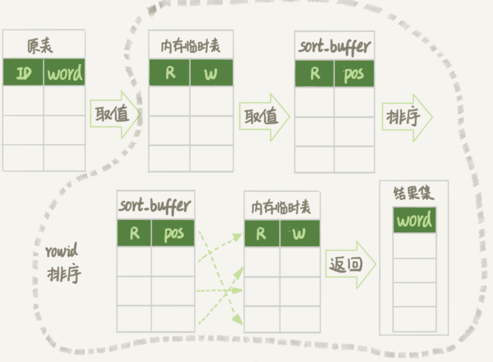

​								图4 随机排序完整流程图1

图中的pos就是位置信息，你可能会觉得奇怪，这里的“位置信息”是个什么概念？在上一篇文章中，我们对InnoDB表排序的时候，明明用的还是ID字段。

这时候，我们就要回到一个基本概念：**MySQL的表是用什么方法来定位“一行数据”的。**

在前面[第4](https://time.geekbang.org/column/article/69236)和[第5](https://time.geekbang.org/column/article/69636)篇介绍索引的文章中，有几位同学问到，如果把一个InnoDB表的主键删掉，是不是就没有主键，就没办法回表了？

其实不是的。如果你创建的表没有主键，或者把一个表的主键删掉了，那么InnoDB会自己生成一个长度为6字节的rowid来作为主键。

这也就是排序模式里面，rowid名字的来历。实际上它表示的是：每个引擎用来唯一标识数据行的信息。

- 对于有主键的InnoDB表来说，这个rowid就是主键ID；
- 对于没有主键的InnoDB表来说，这个rowid就是由系统生成的；
- MEMORY引擎不是索引组织表。在这个例子里面，你可以认为它就是一个数组。因此，这个rowid其实就是数组的下标。

到这里，我来稍微小结一下：**order by rand()使用了内存临时表，内存临时表排序的时候使用了rowid排序方法。**


## 磁盘临时表InnoDB

>磁盘临时表是上一节中归并排序的两种方式，
>
>而内存临时表内存（tmp_table_size）不足时才会别为磁盘临时表，
>
>- 使用内存临时表会优先选择rowid排序，因为在内存中回表消耗不大，不用读磁盘
>
>磁盘临时表是**InnoDB表**，有三种排序方式，一般情况下速度从快到满依次是：
>
>1. 优先队列排序	limit数据量大小 < sort_buffer_size，在内存中构造大顶堆完成
>2. 全字段排序      sort_buffer_size > 数据量大小，不使用磁盘文件
>3. rowid排序      sort_buffer_size < 数据量大小，使用磁盘文件，需要回表读磁盘，最慢

那么，是不是所有的临时表都是内存表呢？

其实不是的。**tmp_table_size**这个配置限制了内存临时表的大小，默认值是**16M**。如果临时表大小超过了tmp_table_size，那么内存临时表就会转成磁盘临时表。

**磁盘临时表使用的引擎默认是InnoDB**，是由参数internal_tmp_disk_storage_engine控制的。

当使用磁盘临时表的时候，对应的就是一个没有显式索引的InnoDB表的排序过程。

为了复现这个过程，我把tmp_table_size设置成1024，把sort_buffer_size设置成 32768, 把 max_length_for_sort_data 设置成16。

```
set tmp_table_size=1024;
set sort_buffer_size=32768;
set max_length_for_sort_data=16;
/* 打开 optimizer_trace，只对本线程有效 */
SET optimizer_trace='enabled=on'; 

/* 执行语句 */
select word from words order by rand() limit 3;

/* 查看 OPTIMIZER_TRACE 输出 */
SELECT * FROM `information_schema`.`OPTIMIZER_TRACE`\G
```

实战45讲笔记.assets/78d2db9a4fdba81feadccf6e878b4aab.png)

​								图5 OPTIMIZER_TRACE部分结果

然后，我们来看一下这次OPTIMIZER_TRACE的结果。

因为将max_length_for_sort_data设置成16，小于word字段的长度定义，所以我们看到sort_mode里面显示的是rowid排序，这个是符合预期的，参与排序的是随机值R字段和rowid字段组成的行。


### 优先队列排序

这时候你可能心算了一下，发现不对。R字段存放的随机值就8个字节，rowid是6个字节（至于为什么是6字节，就留给你课后思考吧），数据总行数是10000，这样算出来就有140000字节，**超过了sort_buffer_size 定义的 32768字节**了。但是，number_of_tmp_files的值居然是0，难道不需要用临时文件吗？

这个SQL语句的排序确实没有用到临时文件，采用是MySQL 5.6版本引入的一个新的排序算法，即：**优先队列排序算法**。接下来，我们就看看为什么没有使用临时文件的算法，也就是归并排序算法，而是采用了优先队列排序算法。

其实，我们现在的SQL语句，**只需要取R值最小的3个rowid**。但是，如果使用归并排序算法的话，虽然最终也能得到前3个值，但是这个算法结束后，已经将10000行数据都排好序了。

也就是说，后面的9997行也是有序的了。但，我们的查询并不需要这些数据是有序的。所以，想一下就明白了，这浪费了非常多的计算量。

而优先队列算法，就可以精确地只得到三个最小值，执行流程如下：

1. 对于这10000个准备排序的(R,rowid)，先取前三行，构造成一个堆；

（对数据结构印象模糊的同学，可以先设想成这是一个由三个元素组成的数组）

1. 取下一个行(R’,rowid’)，跟当前堆里面最大的R比较，如果R’小于R，把这个(R,rowid)从堆中去掉，换成(R’,rowid’)；
2. 重复第2步，直到第10000个(R’,rowid’)完成比较。

这里我简单画了一个优先队列排序过程的示意图。

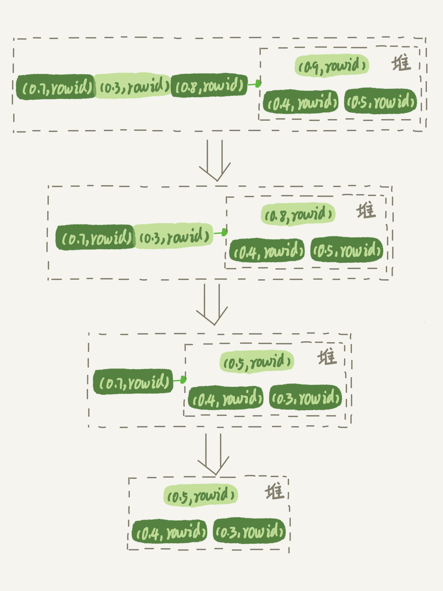

​								图6 优先队列排序算法示例

图6是模拟6个(R,rowid)行，通过优先队列排序找到最小的三个R值的行的过程。整个排序过程中，为了最快地拿到当前堆的最大值，总是保持最大值在堆顶，因此这是一个**最大堆**。

图5的OPTIMIZER_TRACE结果中，**filesort_priority_queue_optimization这个部分的chosen=true**，就表示使用了优先队列排序算法，这个过程不需要临时文件，因此对应的number_of_tmp_files是0。

这个流程结束后，我们构造的堆里面，就是这个10000行里面R值最小的三行。然后，依次把它们的rowid取出来，去临时表里面拿到word字段，这个过程就跟上一篇文章的rowid排序的过程一样了。


我们再看一下上面一篇文章的SQL查询语句：

```
select city,name,age from t where city='杭州' order by name limit 1000  ;
```

你可能会问，这里也用到了limit，为什么没用优先队列排序算法呢？原因是，这条SQL语句是limit 1000，如果使用优先队列算法的话，需要维护的堆的大小就是1000行的(name,rowid)，**超过了我设置的sort_buffer_size大小**，所以只能使用**归并排序算法**。


## 解决文章开头随机排序的方法

**方法1**

我们先把问题简化一下，如果只随机选择1个word值，可以怎么做呢？思路上是这样的：

1. 取得这个表的主键id的最大值M和最小值N;
2. 用随机函数生成一个最大值到最小值之间的数 X = (M-N)*rand() + N;
3. 取不小于X的第一个ID的行。

我们把这个算法，暂时称作随机算法1。这里，我直接给你贴一下执行语句的序列:

```
mysql> select max(id),min(id) into @M,@N from t ;
set @X= floor((@M-@N+1)*rand() + @N);
select * from t where id >= @X limit 1;
```

> 这个方法效率很高，因为取max(id)和min(id)都是不需要扫描索引的，而第三步的select也可以用索引快速定位，可以认为就只扫描了3行。但实际上，这个算法本身并不严格满足题目的随机要求，因为ID中间可能有空洞，因此选择不同行的概率不一样，不是真正的随机。
>
> 比如你有4个id，分别是1、2、4、5，如果按照上面的方法，那么取到 id=4的这一行的概率是取得其他行概率的两倍。
>
> 如果这四行的id分别是1、2、40000、40001呢？这个算法基本就能当bug来看待了。
>
>  
>
> 解决：
>
> 对应单词这种总量不是很多的数据，第一感觉应该装jdk缓存或者**redis缓存**。由于需要随机访问，数组比较好。假如一个单词平均10个字节，10*10000，不到1M就装下了。
> 如果一定要用数据库来做，老师的方案1比较好，空洞的问题，如果单词库不变，可以在上线前**整理数据**，把空洞处理调。比如：原来单词存在A表，新建B表 ，执行 insert into B(word) select word from A. B的id是自增的，就会生成连续的主键。当然如果A表写比较频繁，且数据量较大，业务上禁用这种写法，RR的隔离级别会锁A表


**方法2**

所以，为了得到严格随机的结果，你可以用下面这个流程:

1. 取得整个表的行数，并记为C。
2. 取得 Y = floor(C * rand())。 floor函数在这里的作用，就是取整数部分。
3. 再用limit Y,1 取得一行。

我们把这个算法，称为随机算法2。下面这段代码，就是上面流程的执行语句的序列。

```
mysql> select count(*) into @C from t;
set @Y = floor(@C * rand());
set @sql = concat("select * from t limit ", @Y, ",1");
prepare stmt from @sql;
execute stmt;
DEALLOCATE prepare stmt;
```

> 由于limit 后面的参数不能直接跟变量，所以我在上面的代码中使用了prepare+execute的方法。你也可以把拼接SQL语句的方法写在应用程序中，会更简单些。
>
> 这个随机算法2，解决了算法1里面明显的概率不均匀问题。
>
> MySQL处理limit Y,1 的做法就是按顺序一个一个地读出来，丢掉前Y个，然后把下一个记录作为返回结果，因此这一步需要扫描Y+1行。再加上，第一步扫描的C行，总共需要扫描C+Y+1行，执行代价比随机算法1的代价要高。
>
> 当然，随机算法2跟直接order by rand()比起来，执行代价还是小很多的。
>
> 你可能问了，如果按照这个表有10000行来计算的话，C=10000，要是随机到比较大的Y值，那扫描行数也跟20000差不多了，接近order by rand()的扫描行数，为什么说随机算法2的代价要小很多呢？我就把这个问题留给你去课后思考吧。


**方法3：即方法2取多值**

现在，我们再看看，如果我们按照随机算法2的思路，要随机取3个word值呢？你可以这么做：

1. 取得整个表的行数，记为C；
2. 根据相同的随机方法得到Y1、Y2、Y3；
3. 再执行三个limit Y, 1语句得到三行数据。

我们把这个算法，称作随机算法3。下面这段代码，就是上面流程的执行语句的序列。

```
mysql> select count(*) into @C from t;
set @Y1 = floor(@C * rand());
set @Y2 = floor(@C * rand());
set @Y3 = floor(@C * rand());
select * from t limit @Y1，1； //在应用代码里面取Y1、Y2、Y3值，拼出SQL后执行
select * from t limit @Y2，1；
select * from t limit @Y3，1；
```


## 问题

上面的随机算法3的总扫描行数是 C+(Y1+1)+(Y2+1)+(Y3+1)，实际上它还是可以继续优化，来进一步减少扫描行数的。

这里我给出一种方法，取Y1、Y2和Y3里面最大的一个数，记为M，最小的一个数记为N，然后执行下面这条SQL语句：

```
mysql> select * from t limit N, M-N+1;
```

再加上取整个表总行数的C行，这个方案的扫描行数总共只需要C+M+1行。

当然也可以先取回id值，在应用中确定了三个id值以后，再执行三次where id=X的语句也是可以的


# 18 讲为什么这些SQL语句逻辑相同，性能却差异巨大

# （即索引失效）

## 索引字段使用函数

**对索引字段做函数操作，可能会破坏索引值的有序性，因此优化器就决定放弃走树搜索功能。**

## 隐式类型转换

## 隐式字符编码转换

两张表，一张未utf8，一张为utf8mb4

```
mysql> select d.* from tradelog l, trade_detail d where d.tradeid=l.tradeid and l.id=2; /*语句Q1*/
```

也就是说，实际上这个语句等同于下面这个写法：

```
select * from trade_detail  where CONVERT(traideid USING utf8mb4)=$L2.tradeid.value; 
```

CONVERT()函数，在这里的意思是把输入的字符串转成utf8mb4字符集。

这就再次触发了我们上面说到的原则：对索引字段做函数操作，优化器会放弃走树搜索功能。

到这里，你终于明确了，字符集不同只是条件之一，**连接过程中要求在被驱动表的索引字段上加函数操作**


**两种解决办法：**

- 比较常见的优化方法是，把trade_detail表上的tradeid字段的**字符集也改成utf8mb4**，这样就没有字符集转换的问题了。

```
alter table trade_detail modify tradeid varchar(32) CHARACTER SET utf8mb4 default null;
```

- 如果能够修改字段的字符集的话，是最好不过了。但如果数据量比较大，或者业务上暂时不能做这个DDL的话，那就只能采用修改SQL语句的方法了。

```
mysql> select d.* from tradelog l , trade_detail d where d.tradeid=CONVERT(l.tradeid USING utf8) and l.id=2; 
```

这里，我主动把 l.tradeid转成utf8，就避免了被驱动表上的字符编码转换，从explain结果可以看到，这次索引走对了。


# 19 讲为什么我只查一行的语句，也执行这么慢

## 影响查询速度的几种情况

为了便于描述，我还是构造一个表，基于这个表来说明今天的问题。这个表有两个字段id和c，并且我在里面插入了10万行记录。

```
mysql> CREATE TABLE `t` (
  `id` int(11) NOT NULL,
  `c` int(11) DEFAULT NULL,
  PRIMARY KEY (`id`)
) ENGINE=InnoDB;
```

### 第一类：查询长时间不返回

如图1所示，在表t执行下面的SQL语句：

```
mysql> select * from t where id=1;
```

查询结果长时间不返回。

实战45讲笔记.assets/8707b79d5ed906950749f5266014f22a.png)

​								图1 查询长时间不返回

一般碰到这种情况的话，大概率是表t被锁住了。接下来分析原因的时候，一般都是首先执行一下show processlist命令，看看当前语句处于什么状态。

然后我们再针对每种状态，去分析它们产生的原因、如何复现，以及如何处理。

#### 等MDL锁

如图2所示，就是使用show processlist命令查看Waiting for table metadata lock的示意图。

实战45讲笔记.assets/5008d7e9e22be88a9c80916df4f4b328.png)

​					图2 Waiting for table metadata lock状态示意图

出现**这个状态表示的是，现在有一个线程正在表t上请求或者持有MDL写锁，把select语句堵住了。**

这类问题的处理方式，就是找到谁持有MDL写锁，然后把它kill掉。

但是，由于在show processlist的结果里面，session A的Command列是“Sleep”，导致查找起来很不方便。不过有了performance_schema和sys系统库以后，就方便多了。（MySQL启动时需要设置performance_schema=on，相比于设置为off会有10%左右的性能损失)

通过查询sys.schema_table_lock_waits这张表，我们就可以直接找出造成阻塞的process id，把这个连接用kill 命令断开即可。

```
select blocking_pid from sys.schema_table_lock_waits;
```

实战45讲笔记.assets/74fb24ba3826e3831eeeff1670990c01.png)

​								图4 查获加表锁的线程id

#### 等flush

接下来，我给你举另外一种查询被堵住的情况。

我在表t上，执行下面的SQL语句：

```
mysql> select * from information_schema.processlist where id=1;
```

这里，我先卖个关子。

你可以看一下图5。我查出来这个线程的状态是Waiting for table flush，你可以设想一下这是什么原因。
实战45讲笔记.assets/2d8250398bc7f8f7dce8b6b1923c3724.png)

​				图5 Waiting for table flush状态示意图

这个状态表示的是，现在有一个线程正要对表t做flush操作。MySQL里面对表做flush操作的用法，一般有以下两个：

```
flush tables t with read lock;

flush tables with read lock;
```

这两个flush语句，如果指定表t的话，代表的是只关闭表t；如果没有指定具体的表名，则表示关闭MySQL里所有打开的表。

但是正常这两个语句执行起来都很快，除非它们也被别的线程堵住了。

所以，出现Waiting for table flush状态的可能情况是：有一个flush tables命令被别的语句堵住了，然后它又堵住了我们的select语句。

现在，我们一起来复现一下这种情况，**复现步骤**如图6所示：

实战45讲笔记.assets/2bbc77cfdb118b0d9ef3fdd679d0a69c.png)

​			图6 Waiting for table flush的复现步骤

#### 等行锁

现在，经过了表级锁的考验，我们的select 语句终于来到引擎里了。

```
mysql> select * from t where id=1 lock in share mode; 
```

上面这条语句的用法你也很熟悉了，我们在第8篇[《事务到底是隔离的还是不隔离的？》](https://time.geekbang.org/column/article/70562)文章介绍当前读时提到过。

由于访问id=1这个记录时要加读锁，如果这时候已经有一个事务在这行记录上持有一个写锁，我们的select语句就会被堵住。

复现步骤和现场如下：

实战45讲笔记.assets/3e68326b967701c59770612183277475.png)

​						图 8 行锁复现

实战45讲笔记.assets/3c266e23fc307283aa94923ecbbc738f.png)

图 9 行锁show processlist 现场

显然，session A启动了事务，占有写锁，还不提交，是导致session B被堵住的原因。

这个问题并不难分析，但问题是怎么查出是谁占着这个写锁。如果你用的是MySQL 5.7版本，可以通过sys.innodb_lock_waits 表查到。

查询方法是：

```
mysql> select * from t sys.innodb_lock_waits where locked_table=`'test'.'t'`\G
```

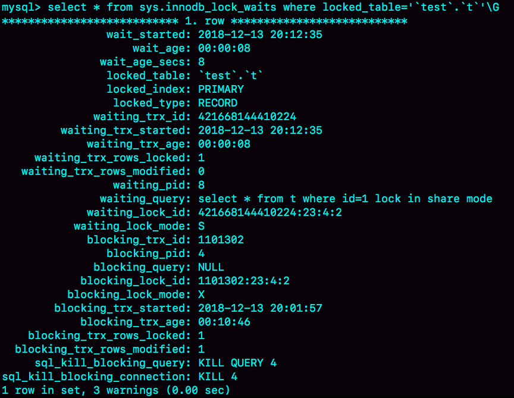

​					图10 通过sys.innodb_lock_waits 查行锁

可以看到，这个信息很全，4号线程是造成堵塞的罪魁祸首。而干掉这个罪魁祸首的方式，就是KILL QUERY 4或KILL 4。

不过，这里不应该显示“KILL QUERY 4”。这个命令表示停止4号线程当前正在执行的语句，而这个方法其实是没有用的。因为占有行锁的是update语句，这个语句已经是之前执行完成了的，现在执行KILL QUERY，无法让这个事务去掉id=1上的行锁。

实际上，KILL 4才有效，也就是说直接断开这个连接。这里隐含的一个逻辑就是，连接被断开的时候，会自动回滚这个连接里面正在执行的线程，也就释放了id=1上的行锁。


### 第二类：查询慢

经过了重重封“锁”，我们再来看看一些查询慢的例子。

#### 全表扫描

先来看一条你一定知道原因的SQL语句：

```
mysql> select * from t where c=50000 limit 1;
```

由于字段c上没有索引，这个语句只能走id主键顺序扫描，因此需要扫描5万行。

作为确认，你可以看一下慢查询日志。注意，这里为了把所有语句记录到slow log里，我在连接后先执行了 set long_query_time=0，将慢查询日志的时间阈值设置为0。

实战45讲笔记.assets/d8b2b5f97c60ae4fc4a03c616847503c.png)

​							图11 全表扫描5万行的slow log

Rows_examined显示扫描了50000行。你可能会说，不是很慢呀，11.5毫秒就返回了，我们线上一般都配置超过1秒才算慢查询。但你要记住：**坏查询不一定是慢查询**。我们这个例子里面只有10万行记录，数据量大起来的话，执行时间就线性涨上去了。

扫描行数多，所以执行慢，这个很好理解。


#### undo链太长

但是接下来，我们再看一个只扫描一行，但是执行很慢的语句。

如图12所示，是这个例子的slow log。可以看到，执行的语句是

```
mysql> select * from t where id=1；
```

虽然扫描行数是1，但执行时间却长达800毫秒。

实战45讲笔记.assets/66f26bb885401e8e460451ff6b0c0746.png)

​								图12 扫描一行却执行得很慢

是不是有点奇怪呢，这些时间都花在哪里了？

如果我把这个slow log的截图再往下拉一点，你可以看到下一个语句，select * from t where id=1 lock in share mode，执行时扫描行数也是1行，执行时间是0.2毫秒。

实战45讲笔记.assets/bde83e269d9fa185b27900c8aa8137d2.png)

​								图 13 加上lock in share mode的slow log

看上去是不是更奇怪了？按理说lock in share mode还要加锁，时间应该更长才对啊。

可能有的同学已经有答案了。如果你还没有答案的话，我再给你一个提示信息，图14是这两个语句的执行输出结果。

实战45讲笔记.assets/1fbb84bb392b6bfa93786fe032690b1c.png)

​							图14 两个语句的输出结果

第一个语句的查询结果里c=1，带lock in share mode的语句返回的是c=1000001。看到这里应该有更多的同学知道原因了。如果你还是没有头绪的话，也别着急。我先跟你说明一下复现步骤，再分析原因。

实战45讲笔记.assets/84667a3449dc846e393142600ee7a2ff.png)

​									图15 复现步骤

你看到了，session A先用start transaction with consistent snapshot命令启动了一个事务，之后session B才开始执行update 语句。

session B执行完100万次update语句后，id=1这一行处于什么状态呢？你可以从图16中找到答案。

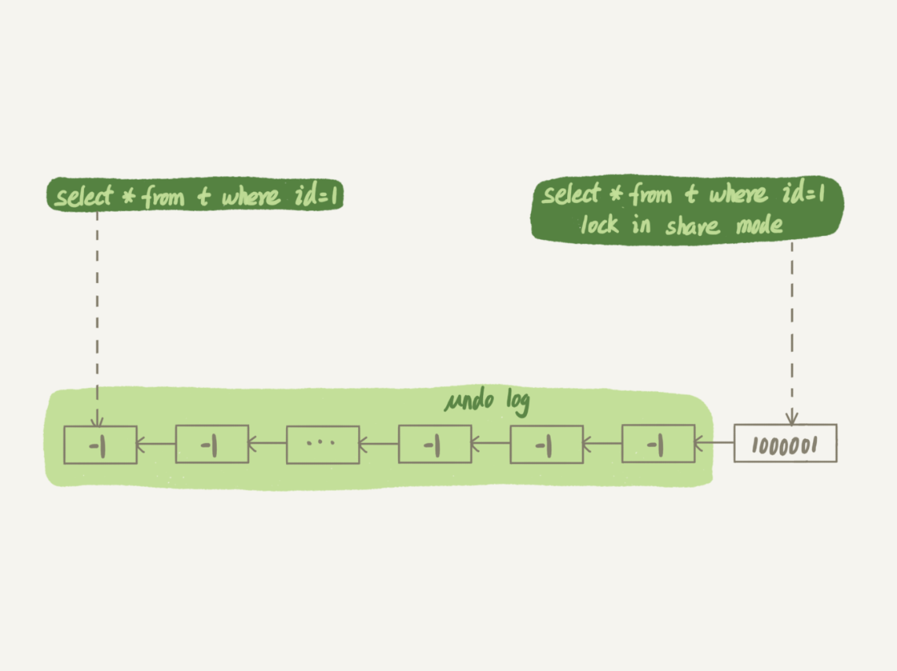

​								图16 id=1的数据状态

session B更新完100万次，生成了100万个回滚日志(undo log)。

带lock in share mode的SQL语句，是当前读，因此会直接读到1000001这个结果，所以速度很快；而select * from t where id=1这个语句，是一致性读，因此需要从1000001开始，依次执行undo log，执行了100万次以后，才将1这个结果返回。

注意，undo log里记录的其实是“把2改成1”，“把3改成2”这样的操作逻辑，画成减1的目的是方便你看图。


# 20 讲幻读是什么，幻读有什么问题

## 非索引字段更新语句的加锁情况

```
CREATE TABLE `t` (
  `id` int(11) NOT NULL,
  `c` int(11) DEFAULT NULL,
  `d` int(11) DEFAULT NULL,
  PRIMARY KEY (`id`),
  KEY `c` (`c`)
) ENGINE=InnoDB;

insert into t values(0,0,0),(5,5,5),
(10,10,10),(15,15,15),(20,20,20),(25,25,25);
```

这个表除了主键id外，还有一个索引c，初始化语句在表中插入了6行数据。

上期我留给你的问题是，下面的语句序列，是怎么加锁的，加的锁又是什么时候释放的呢？

```
begin;
select * from t where d=5 for update;
commit;
```

> 先说结论：
>
> - RC级别下，非索引字段的更新操作会对全表每一条记录加行锁
> - RR级别下，非索引字段的更新操作会对全表每一条记录邻间锁（记录锁+间隙锁）

## 幻读

幻读指的是**一个事务在前后两次查询同一个范围的时候，后一次查询看到了前一次查询没有看到的行。**

这里，我需要对“幻读”做一个说明：

1. 在可重复读隔离级别下，普通的查询是快照读，是不会看到别的事务插入的数据的。因此，**幻读在“当前读”下才会出现**
   - 若是快照读，MVCC机制已经解决了幻读问题
   - 若是当前读，采用加间隙锁的方式解决幻读
2. 上面session B的修改结果，被session A之后的select语句用“当前读”看到，不能称为幻读。幻读仅**专指“新插入的行”**。


## 如何解决幻读？

现在你知道了，产生幻读的原因是，行锁只能锁住行，但是新插入记录这个动作，要更新的是记录之间的“间隙”。因此，为了解决幻读问题，InnoDB只好引入新的锁，也就是**间隙锁(Gap Lock)。**

顾名思义，间隙锁，锁的就是两个值之间的空隙。比如文章开头的表t，初始化插入了6个记录，这就产生了7个间隙。

实战45讲笔记.assets/image-20230930153653250.png)

这样，当你执行 select * from t where d=5 for update的时候，就不止是给数据库中已有的6个记录加上了行锁，还同时加了7个间隙锁。这样就确保了无法再插入新的记录。

也就是说这时候，在一行行扫描的过程中，不仅将给行加上了行锁，还给行两边的空隙，也加上了间隙锁。

**间隙锁之间都不存在冲突关系。**

这句话不太好理解，我给你举个例子：

实战45讲笔记.assets/7c37732d936650f1cda7dbf27daf7498.png)

​						图7 间隙锁之间不互锁

这里session B并不会被堵住。因为表t里并没有c=7这个记录，因此session A加的是间隙锁(5,10)。而session B也是在这个间隙加的间隙锁。它们有共同的目标，即：保护这个间隙，不允许插入值。但，它们之间是不冲突的。

间隙锁和行锁合称next-key lock，每个next-key lock是前开后闭区间。也就是说，我们的表t初始化以后，如果用select * from t for update要把整个表所有记录锁起来，就形成了7个next-key lock，分别是 (-∞,0]、(0,5]、(5,10]、(10,15]、(15,20]、(20, 25]、(25, +suprenum]。

**间隙锁和next-key lock的引入，帮我们解决了幻读的问题，但同时也带来了一些“困扰”。**

间隙锁容易造成**死锁**，且**间隙锁的引入，可能会导致同样的语句锁住更大的范围，这其实是影响了并发度的**

> **间隙锁是在可重复读隔离级别下才会生效**的。所以，你如果把隔离级别设置为**读提交**的话，就没有间隙锁了。但同时，你要解决可能出现的数据和日志不一致问题，需要**把binlog格式设置为row**。这，也是现在不少公司使用的配置组合。


# 21 邻间锁的范围和规则

## 两原则两优化一bug

MySQL后面的版本可能会改变加锁策略，所以这个规则只限于截止到现在的最新版本，即5.x系列<=5.7.24，8.0系列 <=8.0.13。

1. 原则1：加锁的基本单位是next-key lock。希望你还记得，next-key lock是前开后闭区间。
2. 原则2：查找过程中访问到的对象才会加锁。
3. 优化1：索引上的**等值**查询，给**唯一索引**加锁的时候，next-key lock**退化为行锁**。
4. 优化2：索引上的**等值**查询，向右遍历时且最后一个值不满足等值条件的时候，next-key lock**退化为间隙锁**。
5. 一个bug：唯一索引上的范围查询会访问到不满足条件的第一个值为止。（自己测试mysql8.0.25已经不满足此bug）

> 另外：**锁是加在索引树上的**

我还是以上篇文章的表t为例，和你解释一下这些规则。表t的建表语句和初始化语句如下。

```
CREATE TABLE `t` (
  `id` int(11) NOT NULL,
  `c` int(11) DEFAULT NULL,
  `d` int(11) DEFAULT NULL,
  PRIMARY KEY (`id`),
  KEY `c` (`c`)
) ENGINE=InnoDB;

insert into t values(0,0,0),(5,5,5),
(10,10,10),(15,15,15),(20,20,20),(25,25,25);
```


## 案例

### 案例一：等值查询间隙锁

实战45讲笔记.assets/585dfa8d0dd71171a6fa16bed4ba816c.png)

​									图1 等值查询的间隙锁

由于表t中没有id=7的记录，所以用我们上面提到的加锁规则判断一下的话：

1. 根据原则1，加锁单位是next-key lock，session A加锁范围就是(5,10]；
2. 同时根据优化2，这是一个等值查询(id=7)，而id=10不满足查询条件，next-key lock退化成间隙锁，因此最终加锁的范围是**(5,10)**。

所以，session B要往这个间隙里面插入id=8的记录会被锁住，但是session C修改id=10这行是可以的。


### 案例二：非唯一索引等值锁

第二个例子是关于覆盖索引上的锁：

实战45讲笔记.assets/465990fe8f6b418ca3f9992bd1bb5465.png)

​								图2 只加在非唯一索引上的锁

看到这个例子，你是不是有一种“该锁的不锁，不该锁的乱锁”的感觉？我们来分析一下吧。

这里session A要给索引c上c=5的这一行加上读锁。

1. 根据原则1，加锁单位是next-key lock，因此会给(0,5]加上next-key lock。
2. 要注意c是普通索引，因此仅访问c=5这一条记录是不能马上停下来的，需要向右遍历，查到c=10才放弃。根据原则2，访问到的都要加锁，因此要给(5,10]加next-key lock。
3. 但是同时这个符合优化2：等值判断，向右遍历，最后一个值不满足c=5这个等值条件，因此退化成间隙锁(5,10)。
4. 根据原则2 ，**只有访问到的对象才会加锁**，这个查询使用覆盖索引，并不需要访问主键索引，所以主键索引上没有加任何锁，这就是为什么session B的update语句可以执行完成。

所以最终加锁范围为**(0,10)的c索引树**

但session C要插入一个(7,7,7)的记录，就会被session A的间隙锁(5,10)锁住。

需要注意，在这个例子中，lock in share mode**只锁覆盖索引**，

> 要避开覆盖索引：**①使用for update 上锁	②不使用覆盖索引**
>
> - 但是如果是for update就不一样了。 执行 for update时，系统会认为你接下来要更新数据，因此会顺便给主键索引上满足条件的行加上行锁。
> - 这个例子说明，锁是加在索引上的；同时，它给我们的指导是，如果你要用lock in share mode来给行加读锁避免数据被更新的话，就必须得绕过覆盖索引的优化，在查询字段中加入索引中不存在的字段。比如，将session A的查询语句改成select d from t where c=5 lock in share mode。你可以自己验证一下效果。


### 案例三：主键(唯一)索引范围锁

第三个例子是关于范围查询的。

举例之前，你可以先思考一下这个问题：对于我们这个表t，下面这两条查询语句，加锁范围相同吗？

```
mysql> select * from t where id=10 for update;
mysql> select * from t where id>=10 and id<11 for update;
```

你可能会想，id定义为int类型，这两个语句就是等价的吧？其实，它们**并不完全等价**。

在逻辑上，这两条查语句肯定是等价的，但是它们的加锁规则不太一样。现在，我们就让session A执行第二个查询语句，来看看加锁效果。

实战45讲笔记.assets/30b839bf941f109b04f1a36c302aea80.png)

​								图3 主键索引上范围查询的锁

现在我们就用前面提到的加锁规则，来分析一下session A 会加什么锁呢？

1. 开始执行的时候，要找到第一个id=10的行，因此本该是next-key lock(5,10]。 根据优化1， 主键id上的等值条件，退化成行锁，只加了id=10这一行的行锁。
2. 范围查找就往后继续找，找到id=15这一行停下来，因此需要加next-key lock(10,15]，由于是范围查询，所以优化1和2不适用。

所以，session A这时候锁的范围就是主键索引上，**行锁id=10**和next-key lock**(10,15]**。这样，session B和session C的结果你就能理解了。

这里你需要注意一点，首次session A定位查找id=10的行的时候，是当做等值查询来判断的，而向右扫描到id=15的时候，用的是范围查询判断。


### 案例四：非唯一索引范围锁

接下来，我们再看两个范围查询加锁的例子，你可以对照着案例三来看。

需要注意的是，与案例三不同的是，案例四中查询语句的where部分用的是字段c。

实战45讲笔记.assets/7381475e9e951628c9fc907f5a57697a.png)

图4 非唯一索引范围锁

这次session A用字段c来判断，加锁规则跟案例三唯一的不同是：在第一次用c=10定位记录的时候，索引c上加了(5,10]这个next-key lock后，由于索引c是非唯一索引，没有优化规则，也就是说不会蜕变为行锁，因此最终sesion A加的锁是，索引c上的**(5,10] 和(10,15]** 这两个next-key lock。

所以从结果上来看，sesson B要插入（8,8,8)的这个insert语句时就被堵住了。

这里需要扫描到c=15才停止扫描，是合理的，因为InnoDB要扫到c=15，才知道不需要继续往后找了。


### 案例五：唯一索引范围锁bug

前面的四个案例，我们已经用到了加锁规则中的两个原则和两个优化，接下来再看一个关于加锁规则中bug的案例。

实战45讲笔记.assets/b105f8c4633e8d3a84e6422b1b1a316d.png)

​								图5 唯一索引范围锁的bug

session A是一个范围查询，按照原则1的话，应该是索引id上只加(10,15]这个next-key lock，并且因为id是唯一键，所以循环判断到id=15这一行就应该停止了。

但是实现上，InnoDB会往前扫描到第一个不满足条件的行为止，也就是id=20。而且由于这是个范围扫描，因此索引id上的(15,20]这个next-key lock也会被锁上。

所以上锁范围是：**(10,20]**

所以你看到了，session B要更新id=20这一行，是会被锁住的。同样地，session C要插入id=16的一行，也会被锁住。

照理说，这里锁住id=20这一行的行为，其实是没有必要的。因为扫描到id=15，就可以确定不用往后再找了。但实现上还是这么做了，因此我认为这是个bug。

我也曾找社区的专家讨论过，官方bug系统上也有提到，但是并未被verified。所以，认为这是bug这个事儿，也只能算我的一家之言，如果你有其他见解的话，也欢迎你提出来。

> 我在mysql8.0.25中测试已不存在此bug


### 案例六：非唯一索引上存在"等值"的例子

接下来的例子，是为了更好地说明“间隙”这个概念。这里，我给表t插入一条新记录。

```
mysql> insert into t values(30,10,30);
```

新插入的这一行c=10，也就是说现在表里有两个c=10的行。那么，这时候索引c上的间隙是什么状态了呢？你要知道，由于非唯一索引上包含主键的值，所以是不可能存在“相同”的两行的。

实战45讲笔记.assets/image-20231004150328954.png)

​								图6 非唯一索引等值的例子

可以看到，虽然有两个c=10，但是它们的主键值id是不同的（分别是10和30），因此这两个c=10的记录之间，也是有间隙的。

图中我画出了索引c上的主键id。为了跟间隙锁的开区间形式进行区别，我用(c=10,id=30)这样的形式，来表示索引上的一行。

现在，我们来看一下案例六。

这次我们用delete语句来验证。注意，delete语句加锁的逻辑，其实跟select ... for update 是类似的，也就是我在文章开始总结的两个“原则”、两个“优化”和一个“bug”。

实战45讲笔记.assets/b55fb0a1cac3500b60e1cf9779d2da78.png)

​									图7 delete 示例

这时，session A在遍历的时候，先访问第一个c=10的记录。同样地，根据原则1，这里加的是(c=5,id=5)到(c=10,id=10)这个next-key lock。

然后，session A向右查找，直到碰到(c=15,id=15)这一行，循环才结束。根据优化2，这是一个等值查询，向右查找到了不满足条件的行，所以会退化成(c=10,id=10) 到 (c=15,id=15)的间隙锁。

也就是说，这个delete语句在索引c上的加锁范围，就是下图中蓝色区域覆盖的部分。

实战45讲笔记.assets/image-20231004150443919.png)

​								图 8 delete 

加锁效果示例这个蓝色区域左右两边都是虚线，表示开区间**(5,15)**，即 (c=5,id=5) 和 (c=15,id=15) 这两行上都没有锁。


### 案例七：limit 语句加锁

例子6也有一个对照案例，场景如下所示：

实战45讲笔记.assets/afc3a08ae7a254b3251e41b2a6dae02e.png)

​									图9 limit 语句加锁

这个例子里，session A的delete语句加了 limit 2。你知道表t里c=10的记录其实只有两条，因此加不加limit 2，删除的效果都是一样的，但是加锁的效果却不同。可以看到，session B的insert语句执行通过了，跟案例六的结果不同。

这是因为，案例七里的delete语句明确加了limit 2的限制，因此在遍历到(c=10, id=30)这一行之后，满足条件的语句已经有两条，循环就结束了。

因此，索引c上的加锁范围就变成了从（c=5,id=5)到（c=10,id=30)这个前开后闭区间**(5,10-30)**，如下图所示：

实战45讲笔记.assets/image-20231004150555757.png)

​								图10 带limit 2的加锁效果

可以看到，(c=10,id=30）之后的这个间隙并没有在加锁范围里，因此insert语句插入c=12是可以执行成功的。

> 这个例子对我们实践的指导意义就是，**在删除数据的时候尽量加limit**。这样不仅可以控制删除数据的条数，让操作更安全，还可以减小加锁的范围。


### 案例八：一个死锁的例子

前面的例子中，我们在分析的时候，是按照next-key lock的逻辑来分析的，因为这样分析比较方便。最后我们再看一个案例，目的是说明：**next-key lock实际上是间隙锁和行锁加起来的结果。**

> next-key lock会**先加间隙锁，再加行记录锁**

你一定会疑惑，这个概念不是一开始就说了吗？不要着急，我们先来看下面这个例子：

实战45讲笔记.assets/7b911a4c995706e8aa2dd96ff0f36506.png)

​								图11 案例八的操作序列

现在，我们按时间顺序来分析一下为什么是这样的结果。

1. session A 启动事务后执行查询语句加lock in share mode，在索引c上加了next-key lock(5,10] 和间隙锁(10,15)；
2. session B 的update语句也要在索引c上加next-key lock(5,10] ，进入锁等待；
3. 然后session A要再插入(8,8,8)这一行，被session B的间隙锁锁住。由于出现了死锁，InnoDB让session B回滚。

你可能会问，session B的next-key lock不是还没申请成功吗？

其实是这样的，session B的“加next-key lock(5,10] ”操作，实际上分成了两步，**先是加(5,10)的间隙锁（间隙锁不互斥），加锁成功；然后加c=10的行锁**，这时候才被锁住的。

也就是说，我们在分析加锁规则的时候可以用next-key lock来分析。但是要知道，具体执行的时候，是要分成间隙锁和行锁两段来执行的。


## 习题

文章开头初始化的表t，里面有6条记录，图12的语句序列中，为什么session B的insert操作，会被锁住呢？
实战45讲笔记.assets/3a7578e104612a188a2d574eaa3bd81e.png)

​									图12 锁分析思考题

1. 由于是order by c desc，第一个要定位的是索引c上“最右边的”c=20的行，所以会加上间隙锁(20,25)和next-key lock (15,20]。
2. 在索引c上向左遍历，**要扫描到c=10才停下来**，所以next-key lock会加到(5,10]，这正是阻塞session B的insert语句的原因。
3. 在扫描过程中，c=20、c=15、c=10这三行都存在值，由于是select *，所以会在主键id上加三个行锁。

因此，session A 的select语句锁的范围就是：

1. 索引c上 **(5, 25)**；
2. 主键索引上id=10、15、20三个行锁。


**总结：**

1、查询过程中访问到的对象才会加锁，而加锁的基本单位是next-key lock（前开后闭）； 

2、等值查询上MySQL的优化：索引上的等值查询，如果是唯一索引，next-key lock会退化为行锁，如果不是唯一索引，需要访问到第一个不满足条件的值，此时next-key lock会退化为间隙锁； 

3、范围查询：无论是否是唯一索引，范围查询都需要访问到不满足条件的第一个值为止；（bug未修复时）


# 22 讲MySQL有哪些“饮鸩止渴”提高性能的方法

## 短连接风暴

正常的短连接模式就是连接到数据库后，执行很少的SQL语句就断开，下次需要的时候再重连。如果使用的是短连接，在业务高峰期的时候，就可能出现连接数突然暴涨的情况。

我在第1篇文章[《基础架构：一条SQL查询语句是如何执行的？》](https://time.geekbang.org/column/article/68319)中说过，MySQL建立连接的过程，成本是很高的。除了正常的网络连接三次握手外，还需要做登录权限判断和获得这个连接的数据读写权限。

在数据库压力比较小的时候，这些额外的成本并不明显。

碰到这种情况时，一个比较自然的想法，就是调高max_connections的值。但这样做是有风险的。因为设计max_connections这个参数的目的是想保护MySQL，如果我们把它改得太大，让更多的连接都可以进来，那么系统的负载可能会进一步加大，大量的资源耗费在权限验证等逻辑上，结果可能是适得其反，已经连接的线程拿不到CPU资源去执行业务的SQL请求。

那么这种情况下，你还有没有别的建议呢？我这里还有两种方法，但要注意，这些方法都是有损的。


### 第一种方法：先处理掉那些占着连接但是不工作的线程。

但是需要注意，在show processlist的结果里，踢掉显示为sleep的线程，可能是有损的

我们来看下面这个例子。

实战45讲笔记.assets/9091ff280592c8c68665771b1516c62a.png)

图1 sleep线程的两种状态

在上面这个例子里，如果断开session A的连接，因为这时候session A还没有提交，所以MySQL只能按照回滚事务来处理；而断开session B的连接，就没什么大影响。所以，如果按照优先级来说，你应该**优先断开像session B**这样的事务外空闲的连接。

但是，怎么判断哪些是事务外空闲的呢？session C在T时刻之后的30秒执行show processlist，看到的结果是这样的。

实战45讲笔记.assets/ae6a9ceecf8517e47f9ebfc565f0f925.png)

图2 sleep线程的两种状态，show processlist结果

图中id=4和id=5的两个会话都是Sleep 状态。而要看事务具体状态的话，你可以查information_schema库的innodb_trx表。

实战45讲笔记.assets/ca4b455c8eacbf32b98d1fe9ed9876e8.png)

图3 从information_schema.innodb_trx查询事务状态

这个结果里，trx_mysql_thread_id=4，表示id=4的线程还处在事务中。

因此，如果是连接数过多，你可以优先断开事务外空闲太久的连接；如果这样还不够，再考虑断开事务内空闲太久的连接。

从服务端断开连接使用的是**kill connection + id**的命令， 一个客户端处于sleep状态时，它的连接被服务端主动断开后，这个客户端并不会马上知道。直到客户端在发起下一个请求的时候，才会收到这样的报错“ERROR 2013 (HY000): Lost connection to MySQL server during query”。

从数据库端主动断开连接可能是有损的，尤其是有的应用端收到这个错误后，不重新连接，而是直接用这个已经不能用的句柄重试查询。这会导致从应用端看上去，“MySQL一直没恢复”。


### 第二种方法：减少连接过程的消耗（不推荐）

有的业务代码会在短时间内先大量申请数据库连接做备用，如果现在数据库确认是被连接行为打挂了，那么一种可能的做法，是让数据库跳过权限验证阶段。

跳过权限验证的方法是：重启数据库，并使用**–skip-grant-tables**参数启动。这样，整个MySQL会跳过所有的权限验证阶段，包括连接过程和语句执行过程在内。

但是，这种方法特别符合我们标题里说的“饮鸩止渴”，**风险极高，是我特别不建议使用的方案**。尤其你的库外网可访问的话，就更不能这么做了。

**在MySQL 8.0版本里，如果你启用–skip-grant-tables参数，MySQL会默认把 --skip-networking参数打开，**表示这时候数据库只能被本地的客户端连接。可见，MySQL官方对skip-grant-tables这个参数的安全问题也很重视。

除了短连接数暴增可能会带来性能问题外，实际上，我们在线上碰到更多的是查询或者更新语句导致的性能问题。其中，查询问题比较典型的有两类，一类是由新出现的慢查询导致的，一类是由QPS（每秒查询数）突增导致的。而关于更新语句导致的性能问题，我会在下一篇文章和你展开说明。


## 慢查询性能问题

在MySQL中，会引发性能问题的慢查询，大体有以下三种可能：

1. 索引没有设计好；
2. SQL语句没写好；
3. MySQL选错了索引。

接下来，我们就具体分析一下这三种可能，以及对应的解决方案。

### 索引没有设计好

**导致慢查询的第一种可能是，索引没有设计好。**

这种场景一般就是通过紧急创建索引来解决。MySQL 5.6版本以后，创建索引都支持Online DDL了，对于那种高峰期数据库已经被这个语句打挂了的情况，最高效的做法就是直接执行alter table 语句。

比较理想的是能够在备库先执行。假设你现在的服务是一主一备，主库A、备库B，这个方案的大致流程是这样的：

1. 在备库B上执行 set sql_log_bin=off，也就是不写binlog，然后执行alter table 语句加上索引；
2. 执行主备切换；
3. 这时候主库是B，备库是A。在A上执行 set sql_log_bin=off，然后执行alter table 语句加上索引。

这是一个“古老”的DDL方案。平时在做变更的时候，你应该考虑类似gh-ost这样的方案，更加稳妥。但是在需要紧急处理时，上面这个方案的效率是最高的。

### SQL语句没写好

**导致慢查询的第二种可能是，语句没写好。**

比如，我们犯了在第18篇文章[《为什么这些SQL语句逻辑相同，性能却差异巨大？》](https://time.geekbang.org/column/article/74059)中提到的那些错误，导致语句没有使用上索引。

这时，我们可以通过改写SQL语句来处理。MySQL 5.7提供了**query_rewrite**功能，可以把输入的一种语句改写成另外一种模式。

比如，语句被错误地写成了 select * from t where id + 1 = 10000，你可以通过下面的方式，增加一个语句改写规则。

```
mysql> insert into query_rewrite.rewrite_rules(pattern, replacement, pattern_database) values ("select * from t where id + 1 = ?", "select * from t where id = ? - 1", "db1");

call query_rewrite.flush_rewrite_rules();
```

这里，call query_rewrite.flush_rewrite_rules()这个存储过程，是让插入的新规则生效，也就是我们说的“查询重写”。你可以用图4中的方法来确认改写规则是否生效。


​									图4 查询重写效果

### MySQL选错索引

**导致慢查询的第三种可能，就是碰上了我们在第10篇文章**[**《MySQL为什么有时候会选错索引？》**](https://time.geekbang.org/column/article/71173)**中提到的情况，MySQL选错了索引。**

这时候，应急方案就是给这个语句加上**force index**。

同样地，使用查询重写功能，给原来的语句加上force index，也可以解决这个问题。

上面我和你讨论的由慢查询导致性能问题的三种可能情况，实际上出现最多的是前两种，即：索引没设计好和语句没写好。而这两种情况，恰恰是完全可以避免的。比如，通过下面这个过程，我们就可以预先发现问题。

1. 上线前，在测试环境，把慢查询日志（slow log）打开，并且把long_query_time设置成0，确保每个语句都会被记录入慢查询日志；
2. 在测试表里插入模拟线上的数据，做一遍回归测试；
3. 观察慢查询日志里每类语句的输出，特别留意Rows_examined字段是否与预期一致。（我们在前面文章中已经多次用到过Rows_examined方法了，相信你已经动手尝试过了。如果还有不明白的，欢迎给我留言，我们一起讨论）。

不要吝啬这段花在上线前的“额外”时间，因为这会帮你省下很多故障复盘的时间。

如果新增的SQL语句不多，手动跑一下就可以。而如果是新项目的话，或者是修改了原有项目的 表结构设计，全量回归测试都是必要的。这时候，你需要工具帮你检查所有的SQL语句的返回结果。比如，你可以使用开源工具pt-query-digest(https://www.percona.com/doc/percona-toolkit/3.0/pt-query-digest.html)。


## QPS突增问题

有时候由于业务突然出现高峰，或者应用程序bug，导致某个语句的QPS突然暴涨，也可能导致MySQL压力过大，影响服务。

我之前碰到过一类情况，是由一个新功能的bug导致的。当然，最理想的情况是让业务把这个功能下掉，服务自然就会恢复。

而下掉一个功能，如果从数据库端处理的话，对应于不同的背景，有不同的方法可用。我这里再和你展开说明一下。

1. 一种是由全新业务的bug导致的。假设你的DB运维是比较规范的，也就是说白名单是一个个加的。这种情况下，如果你能够确定业务方会下掉这个功能，只是时间上没那么快，那么就可以从数据库端直接**把白名单去掉**。
2. 如果这个新功能使用的是单独的数据库用户，可以用管理员账号**把这个用户删掉**，然后断开现有连接。这样，这个新功能的连接不成功，由它引发的QPS就会变成0。
3. 如果这个新增的功能跟主体功能是部署在一起的，那么我们只能通过处理语句来限制。这时，我们可以使用上面提到的查询重写功能，把压力最大的SQL语句直接**重写成"select 1"返回**。（不推荐）

当然，这个操作的风险很高，需要你特别细致。它可能存在两个副作用：

1. 如果别的功能里面也用到了这个SQL语句模板，会有误伤；
2. 很多业务并不是靠这一个语句就能完成逻辑的，所以如果单独把这一个语句以select 1的结果返回的话，可能会导致后面的业务逻辑一起失败。

所以，方案3是用于止血的，跟前面提到的去掉权限验证一样，应该是你所有选项里优先级最低的一个方案。

同时你会发现，**其实方案1和2都要依赖于规范的运维体系：虚拟化、白名单机制、业务账号分离。由此可见，更多的准备，往往意味着更稳定的系统。**


# 23 redo log和bin log持久化机制


## binlog的写入机制

其实，binlog的写入逻辑比较简单：事务执行过程中，先把日志写到binlog cache，事务提交的时候，再把binlog cache写到binlog文件中。

一个事务的binlog是不能被拆开的，因此不论这个事务多大，也要确保一次性写入。这就涉及到了binlog cache的保存问题。

系统给**binlog cache（默认32K）**分配了一片内存，每个线程一个，参数 binlog_cache_size用于控制单个线程内binlog cache所占内存的大小。如果超过了这个参数规定的大小，就要暂存到磁盘。

事务提交的时候，执行器把binlog cache里的完整事务写入到binlog中，并清空binlog cache。状态如图1所示。

实战45讲笔记.assets/9ed86644d5f39efb0efec595abb92e3e.png)

​							图1 binlog写盘状态

可以看到，**每个线程有自己binlog cache**，但是**共用同一份binlog文件**。

- 图中的write，指的就是指把日志写入到文件系统的page cache，并没有把数据持久化到磁盘，所以速度比较快。
- 图中的fsync，才是将数据持久化到磁盘的操作。一般情况下，我们认为fsync才占磁盘的IOPS。

write 和fsync的时机，是由参数sync_binlog控制的：

1. **sync_binlog=0**的时候，表示每次提交事务都只write，不fsync；
2. **sync_binlog=1**的时候，表示每次提交事务都会执行fsync；
3. **sync_binlog=N(N>1)**的时候，表示每次提交事务都write，但累积N个事务后才fsync。

因此，在出现IO瓶颈的场景里，将sync_binlog设置成一个比较大的值，可以提升性能。在实际的业务场景中，考虑到丢失日志量的可控性，一般不建议将这个参数设成0，比较常见的是将其设置为**100~1000**中的某个数值。

但是，将sync_binlog设置为N，对应的风险是：如果主机发生异常重启，会**丢失最近N个事务的binlog日志**。

## redo log的写入机制

接下来，我们再说说redo log的写入机制。

在专栏的[第15篇答疑文章](https://time.geekbang.org/column/article/73161)中，我给你介绍了redo log buffer。事务在执行过程中，生成的redo log是要先写到redo log buffer的。

> 然后就有同学问了，redo log buffer里面的内容，是不是每次生成后都要直接持久化到磁盘呢？
>
> 答案是，不需要。
>
> 如果事务执行期间MySQL发生异常重启，那这部分日志就丢了。由于事务并没有提交，所以这时日志丢了也不会有损失。
>
> 那么，另外一个问题是，事务还没提交的时候，redo log buffer中的部分日志有没有可能被持久化到磁盘呢？
>
> 答案是，确实会有。

这个问题，要从redo log可能存在的三种状态说起。这三种状态，对应的就是图2 中的三个颜色块。

实战45讲笔记.assets/9d057f61d3962407f413deebc80526d4.png)

​								图2 MySQL redo log存储状态

这三种状态分别是：

1. 存在redo log buffer中，物理上是在MySQL进程内存中，就是图中的红色部分；
2. 写到磁盘(write)，但是没有持久化（fsync)，物理上是在文件系统的page cache里面，也就是图中的黄色部分；
3. 持久化到磁盘，对应的是hard disk，也就是图中的绿色部分。

日志写到redo log buffer是很快的，wirte到page cache也差不多，但是持久化到磁盘的速度就慢多了。

为了控制redo log的写入策略，InnoDB提供了innodb_flush_log_at_trx_commit参数，它有三种可能取值：

1. **设置为0的时候**，表示每次事务提交时都只是把redo log留在redo log buffer中;
2. **设置为1的时候**，表示每次事务提交时都将redo log直接持久化到磁盘；
3. **设置为2的时候**，表示每次事务提交时都只是把redo log写到page cache。

**InnoDB有一个后台线程，每隔1秒，就会把redo log buffer中的日志**，调用write写到文件系统的page cache，然后调用fsync持久化到磁盘。

注意，事务执行中间过程的redo log也是直接写在redo log buffer中的，这些redo log也会被后台线程一起持久化到磁盘。也就是说，一个没有提交的事务的redo log，也是可能已经持久化到磁盘的。

实际上，除了后台线程每秒一次的轮询操作外，还有两种场景会让一个没有提交的事务的redo log写入到磁盘中。

1. **一种是，redo log buffer占用的空间即将达到 innodb_log_buffer_size一半的时候，后台线程会主动写盘。**注意，由于这个事务并没有提交，所以这个写盘动作只是write，而没有调用fsync，也就是只留在了文件系统的page cache。
2. **另一种是，并行的事务提交的时候，顺带将这个事务的redo log buffer持久化到磁盘。**假设一个事务A执行到一半，已经写了一些redo log到buffer中，这时候有另外一个线程的事务B提交，如果innodb_flush_log_at_trx_commit设置的是1，那么按照这个参数的逻辑，事务B要把redo log buffer里的日志全部持久化到磁盘。这时候，就会带上事务A在redo log buffer里的日志一起持久化到磁盘。

这里需要说明的是，我们介绍两阶段提交的时候说过，时序上redo log先prepare， 再写binlog，最后再把redo log commit。

如果把innodb_flush_log_at_trx_commit设置成1，那么redo log在prepare阶段就要持久化一次，因为有一个崩溃恢复逻辑是要依赖于prepare 的redo log，再加上binlog来恢复的。（如果你印象有点儿模糊了，可以再回顾下[第15篇文章](https://time.geekbang.org/column/article/73161)中的相关内容）。

每秒一次后台轮询刷盘，再加上崩溃恢复这个逻辑，InnoDB就认为redo log在commit的时候就不需要fsync了，只会write到文件系统的page cache中就够了。

通常我们说MySQL的“双1”配置，指的就是sync_binlog和innodb_flush_log_at_trx_commit都设置成 1。也就是说，一个事务完整提交前，需要等待两次刷盘，一次是redo log（prepare 阶段），一次是binlog。

### 组提交机制

这时候，你可能有一个疑问，这意味着我从MySQL看到的TPS是每秒两万的话，每秒就会写四万次磁盘。但是，我用工具测试出来，磁盘能力也就两万左右，怎么能实现两万的TPS？

解释这个问题，就要用到组提交（group commit）机制了。

这里，我需要先和你介绍**日志逻辑序列号**（log sequence number，**LSN**）的概念。LSN是单调递增的，用来对应redo log的一个个写入点。每次写入长度为length的redo log， LSN的值就会加上length。

LSN也会写到InnoDB的数据页中，来确保数据页不会被多次执行重复的redo log。关于LSN和redo log、checkpoint的关系，我会在后面的文章中详细展开。

如图3所示，是三个并发事务(trx1, trx2, trx3)在prepare 阶段，都写完redo log buffer，持久化到磁盘的过程，对应的LSN分别是50、120 和160。

实战45讲笔记.assets/933fdc052c6339de2aa3bf3f65b188cc.png)

​							图3 redo log 组提交

从图中可以看到，

1. trx1是第一个到达的，会被选为这组的 **leader**；
2. 等trx1要开始写盘的时候，这个组里面已经有了三个事务，这时候**LSN也变成了160**；
3. trx1去写盘的时候，带的就是LSN=160，因此**等trx1返回时，所有LSN小于等于160的redo log，都已经被持久化到磁盘**；
4. 这时候trx2和trx3就可以直接返回了。

所以，一次组提交里面，组员越多，节约磁盘IOPS的效果越好。但如果只有单线程压测，那就只能老老实实地一个事务对应一次持久化操作了。

在并发更新场景下，第一个事务写完redo log buffer以后，接下来这个fsync越晚调用，组员可能越多，节约IOPS的效果就越好。

### 细化两阶段提交

为了让一次fsync带的组员更多，MySQL有一个很有趣的优化：拖时间。在介绍两阶段提交的时候，我曾经给你画了一个图，现在我把它截过来。

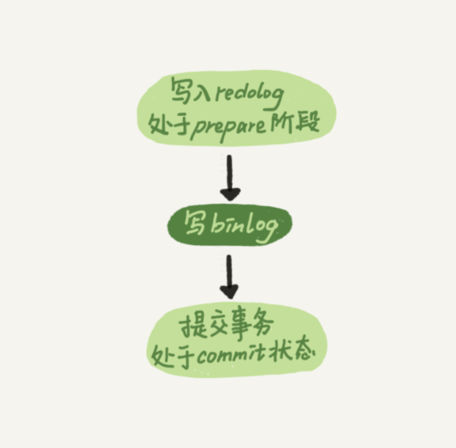

​									图4 两阶段提交

图中，我把“写binlog”当成一个动作。但实际上，写binlog是分成两步的：

1. 先把binlog从binlog cache中写到磁盘上的binlog文件；
2. 调用fsync持久化。

MySQL为了让组提交的效果更好，把redo log做fsync的时间拖到了步骤1之后。也就是说，上面的图变成了这样：


​									图5 两阶段提交细化

这么一来，binlog也可以组提交了。在执行图5中第4步把binlog fsync到磁盘时，如果有多个事务的binlog已经写完了，也是一起持久化的，这样也可以减少IOPS的消耗。


### 提升binlog组提交效果

不过通常情况下第3步执行得会很快，所以**binlog的write和fsync间的间隔时间短**，导致能集合到一起持久化的binlog比较少，因此binlog的组提交的效果通常不如redo log的效果那么好。

如果你想**提升binlog组提交的效果**，可以通过设置 **binlog_group_commit_sync_delay** 和 **binlog_group_commit_sync_no_delay_count**来实现。

1. binlog_group_commit_sync_delay参数，表示延迟多少微秒后才调用fsync;
2. binlog_group_commit_sync_no_delay_count参数，表示累积多少次以后才调用fsync。

这两个条件**是或的关系**，也就是说只要有一个满足条件就会调用fsync。

所以，当binlog_group_commit_sync_delay设置为0的时候，binlog_group_commit_sync_no_delay_count也无效了。

> 这两个参数还可以在26讲 MySQL5.7方案中，用来制造更多的“同时处于prepare阶段的事务”。这样就增加了备库复制的并行度


之前有同学在评论区问到，WAL机制是减少磁盘写，可是每次提交事务都要写redo log和binlog，这磁盘读写次数也没变少呀？

现在你就能理解了，WAL机制主要得益于两个方面：

1. redo log 和 binlog都是**顺序写**，磁盘的顺序写比随机写速度要快；
2. **组提交机制**，可以大幅度**降低磁盘的IOPS消耗**。
3. WAL避免了直接修改页的修改数据量和读取页的数据量严重不成比例

分析到这里，我们再来回答这个问题：**如果你的MySQL现在出现了性能瓶颈，而且瓶颈在IO上，可以通过哪些方法来提升性能呢？**

针对这个问题，可以考虑以下三种方法：

1. 设置 binlog_group_commit_sync_delay 和 binlog_group_commit_sync_no_delay_count参数，减少binlog的写盘次数。这个方法是基于“额外的故意等待”来实现的，因此可能会增加语句的响应时间，但没有丢失数据的风险。
2. 将sync_binlog 设置为大于1的值（比较常见是100~1000）。这样做的风险是，主机掉电时会丢binlog日志。
3. 将innodb_flush_log_at_trx_commit设置为2。这样做的风险是，主机掉电的时候会丢数据。

我不建议你把innodb_flush_log_at_trx_commit 设置成0。因为把这个参数设置成0，表示redo log只保存在内存中，这样的话MySQL本身异常重启也会丢数据，风险太大。而redo log写到文件系统的page cache的速度也是很快的，所以将这个参数设置成2跟设置成0其实性能差不多，但这样做MySQL异常重启时就不会丢数据了，相比之下风险会更小。


# 24 MySQL主备流程

## MySQL主备的基本原理

如图1所示就是基本的主备切换流程。

实战45讲笔记.assets/image-20231007142153070.png)

​								图 1 MySQL主备切换流程

在状态1中，客户端的读写都直接访问节点A，而节点B是A的备库，只是将A的更新都同步过来，到本地执行。这样可以保持节点B和A的数据是相同的。

当需要切换的时候，就切成状态2。这时候客户端读写访问的都是节点B，而节点A是B的备库。

### 备库设置为readonly的好处

在状态1中，虽然节点B没有被直接访问，但是我依然建议你把节点B（也就是备库）设置成只读（readonly）模式。这样做，有以下几个考虑：

> 1. 有时候一些运营类的查询语句会被放到备库上去查，设置为只读可以**防止误操作**；
> 2. **防止切换逻辑有bug**，比如切换过程中出现双写，造成主备不一致；
> 3. 可以用readonly状态，来**判断节点的角色**。

你可能会问，我把备库设置成只读了，还怎么跟主库保持同步更新呢？

这个问题，你不用担心。因为**readonly设置对超级(super)权限用户是无效的**，而用于同步更新的线程，就拥有超级权限。


### 主从复制的详细流程

接下来，我们再看看**节点A到B这条线的内部流程是什么样的**。图2中画出的就是一个update语句在节点A执行，然后同步到节点B的完整流程图。

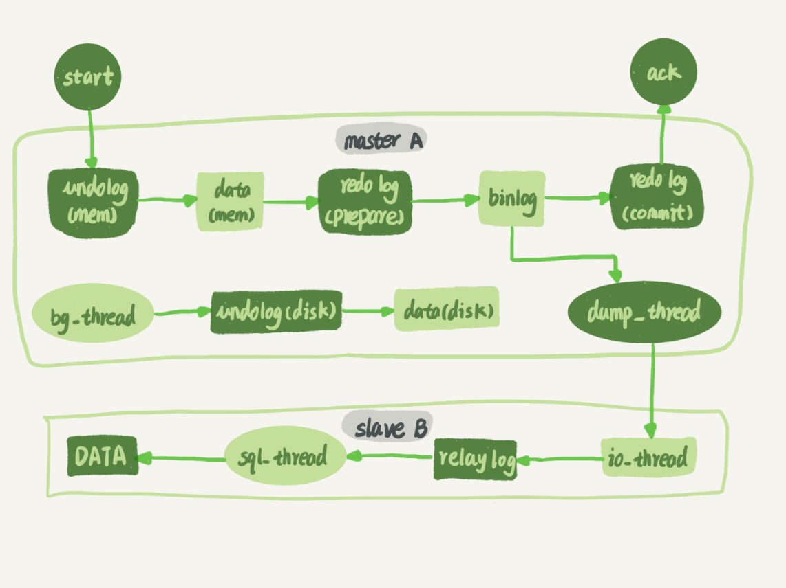

​									图2 主备流程图

图2中，包含了我在上一篇文章中讲到的binlog和redo log的写入机制相关的内容，可以看到：主库接收到客户端的更新请求后，执行内部事务的更新逻辑，同时写binlog。

备库B跟主库A之间维持了一个长连接。主库A内部有一个线程，专门用于服务备库B的这个长连接。一个事务日志同步的完整过程是这样的：

1. 在备库B上通过change master命令，设置主库A的IP、端口、用户名、密码，以及要从哪个位置开始**请求binlog**，这个位置包含文件名和日志偏移量。
2. 在备库B上执行start slave命令，这时候备库会启动两个线程，就是图中的io_thread和sql_thread。其中**io_thread负责与主库建立连接**。
3. 主库A校验完用户名、密码后，开始按照备库B传过来的位置，从本地读取binlog，发给B。
4. 备库B拿到binlog后，写到本地文件，称为**中转日志**（relay log）。
5. sql_thread读取中转日志，解析出日志里的命令，**并执行**。

这里需要说明，后来由于多线程复制方案的引入，**sql_thread演化成为了多个线程**，跟我们今天要介绍的原理没有直接关系，暂且不展开。

分析完了这个长连接的逻辑，我们再来看一个问题：binlog里面到底是什么内容，为什么备库拿过去可以直接执行。


## binlog的三种格式对比

我在[第15篇答疑文章](https://time.geekbang.org/column/article/73161)中，和你提到过binlog有两种格式，一种是statement，一种是row。可能你在其他资料上还会看到有第三种格式，叫作mixed，其实它就是前两种格式的混合。

为了便于描述binlog的这三种格式间的区别，我创建了一个表，并初始化几行数据。如果要在表中删除一行数据的话，我们来看看这个delete语句的binlog是怎么记录的。


注意，下面这个语句包含注释，如果你用MySQL客户端来做这个实验的话，要记得加**-c**参数，否则客户端会自动去掉注释。

```
mysql> delete from t /*comment*/  where a>=4 and t_modified<='2018-11-10' limit 1;
```

当binlog_format=statement时，binlog里面记录的就是SQL语句的原文。你可以用

```
mysql> show binlog events in 'master.000001';
```

命令看binlog中的内容。

实战45讲笔记.assets/b9818f73cd7d38a96ddcb75350b52931.png)

​							图3 statement格式binlog 示例

现在，我们来看一下图3的输出结果。

- 第一行SET @@SESSION.GTID_NEXT='ANONYMOUS’你可以先忽略，后面文章我们会在介绍主备切换的时候再提到；
- 第二行是一个BEGIN，跟第四行的commit对应，表示中间是一个事务；
- 第三行就是真实执行的语句了。可以看到，在真实执行的delete命令之前，还有一个“use ‘test’”命令。这条命令不是我们主动执行的，而是MySQL根据当前要操作的表所在的数据库，自行添加的。这样做可以保证日志传到备库去执行的时候，不论当前的工作线程在哪个库里，都能够正确地更新到test库的表t。
  use 'test’命令之后的delete 语句，就是我们输入的SQL原文了。可以看到，binlog“忠实”地记录了SQL命令，甚至连注释也一并记录了。
- 最后一行是一个COMMIT。你可以看到里面写着**xid=61**。用于**验证binlog的完整性**和**关联redo log和binlog**

为了说明statement 和 row格式的区别，我们来看一下这条delete命令的执行效果图：

实战45讲笔记.assets/96c2be9c0fcbff66883118526b26652b.png)

​							图4 delete执行warnings

可以看到，运行这条delete命令产生了一个warning，原因是当前binlog设置的是statement格式，并且语句中有limit，所以这个命令可能是**unsafe**的。

为什么这么说呢？这是因为delete **带limit，很可能会出现主备数据不一致的情况**。比如上面这个例子：

1. 如果delete语句使用的是索引a，那么会根据索引a找到第一个满足条件的行，也就是说删除的是a=4这一行；
2. 但如果使用的是索引t_modified，那么删除的就是 t_modified='2018-11-09’也就是a=5这一行。

由于statement格式下，记录到binlog里的是语句原文，因此可能会出现这样一种情况：在主库执行这条SQL语句的时候，用的是索引a；而在备库执行这条SQL语句的时候，却使用了索引t_modified。因此，MySQL认为这样写是有风险的。

那么，如果我把binlog的格式改为binlog_format=‘row’， 是不是就没有这个问题了呢？我们先来看看这时候binog中的内容吧。

实战45讲笔记.assets/d67a38db154afff610ae3bb64e266826.png)

​								图5 row格式binlog 示例

可以看到，与statement格式的binlog相比，前后的BEGIN和COMMIT是一样的。但是，row格式的binlog里没有了SQL语句的原文，而是替换成了两个event：Table_map和Delete_rows。

1. Table_map event，用于说明接下来要操作的表是test库的表t;
2. Delete_rows event，用于定义删除的行为。

其实，我们通过图5是看不到详细信息的，还需要借助mysqlbinlog工具，用下面这个命令解析和查看binlog中的内容。因为图5中的信息显示，这个事务的binlog是从8900这个位置开始的，所以可以用start-position参数来指定从这个位置的日志开始解析。

```
mysqlbinlog  -vv data/master.000001 --start-position=8900;
```

实战45讲笔记.assets/c342cf480d23b05d30a294b114cebfc2.png)

​							图6 row格式binlog 示例的详细信息

从这个图中，我们可以看到以下几个信息：

- server id 1，表示这个事务是在server_id=1的这个库上执行的。
- 每个event都有CRC32的值，这是因为我把参数binlog_checksum设置成了CRC32。
- Table_map event跟在图5中看到的相同，显示了接下来要打开的表，map到数字226。现在我们这条SQL语句只操作了一张表，如果要操作多张表呢？每个表都有一个对应的Table_map event、都会map到一个单独的数字，用于区分对不同表的操作。
- 我们在mysqlbinlog的命令中，使用了**-vv参数是为了把内容都解析出来**，所以从结果里面可以看到各个字段的值（比如，@1=4、 @2=4这些值）。
- **binlog_row_image的默认配置是FULL**，因此Delete_event里面，包含了删掉的行的所有字段的值。如果把binlog_row_image设置为**MINIMAL**，则只会记录必要的信息，在这个例子里，就是只会记录id=4这个信息。
- 最后的**Xid event**，用于表示事务被正确地提交了。

你可以看到，当binlog_format使用row格式的时候，binlog里面记录了真实删除行的主键id，这样binlog传到备库去的时候，就肯定会删除id=4的行，不会有主备删除不同行的问题。


### 为什么会有mixed格式的binlog？

基于上面的信息，我们来讨论一个问题：**为什么会有mixed这种binlog格式的存在场景？**推论过程是这样的：

- 因为有些**statement格式的binlog可能会导致主备不一致**，所以要使用row格式。
- 但**row格式的缺点是，很占空间**。比如你用一个delete语句删掉10万行数据，用statement的话就是一个SQL语句被记录到binlog中，占用几十个字节的空间。但如果用row格式的binlog，就要把这10万条记录都写到binlog中。这样做，不仅会占用更大的空间，同时写binlog也要耗费IO资源，影响执行速度。
- 所以，MySQL就取了个折中方案，也就是有了mixed格式的binlog。mixed格式的意思是，MySQL自己会判断这条SQL语句是否可能引起主备不一致，如果有可能，就用row格式，否则就用statement格式。

也就是说，mixed格式可以利用statment格式的优点，同时又避免了数据不一致的风险。

因此，如果你的线上MySQL设置的binlog格式是statement的话，那基本上就可以认为这是一个不合理的设置。你至少应该把binlog的格式设置为mixed。


比如我们这个例子，设置为mixed后，就会记录为row格式；而如果执行的语句去掉limit 1，就会记录为statement格式。

当然我要说的是，现在**越来越多的场景要求把MySQL的binlog格式设置成row**。这么做的理由有很多，我来给你举一个可以直接看出来的好处：**恢复数据**。

接下来，我们就分别从delete、insert和update这三种SQL语句的角度，来看看数据恢复的问题。

通过图6你可以看出来，即使我执行的是delete语句，row格式的binlog也会把被删掉的行的整行信息保存起来。所以，如果你在执行完一条delete语句以后，发现删错数据了，可以直接把binlog中记录的delete语句转成insert，把被错删的数据插入回去就可以恢复了。

如果你是执行错了insert语句呢？那就更直接了。row格式下，insert语句的binlog里会记录所有的字段信息，这些信息可以用来精确定位刚刚被插入的那一行。这时，你直接把insert语句转成delete语句，删除掉这被误插入的一行数据就可以了。

如果执行的是update语句的话，binlog里面会记录修改前整行的数据和修改后的整行数据。所以，如果你误执行了update语句的话，只需要把这个event前后的两行信息对调一下，再去数据库里面执行，就能恢复这个更新操作了。

其实，由delete、insert或者update语句导致的数据操作错误，需要恢复到操作之前状态的情况，也时有发生。MariaDB的[Flashback](https://mariadb.com/kb/en/library/flashback/)工具就是基于上面介绍的原理来回滚数据的。

虽然mixed格式的binlog现在已经用得不多了，但这里我还是要再借用一下mixed格式来说明一个问题，来看一下这条SQL语句：

```
mysql> insert into t values(10,10, now());
```

如果我们把binlog格式设置为mixed，你觉得MySQL会把它记录为row格式还是statement格式呢？

先不要着急说结果，我们一起来看一下这条语句执行的效果。

实战45讲笔记.assets/0150301698979255a6f27711c35e9eef.png)

​								图7 mixed格式和now()

可以看到，MySQL用的居然是statement格式。你一定会奇怪，如果这个binlog过了1分钟才传给备库的话，那主备的数据不就不一致了吗？

接下来，我们再用mysqlbinlog工具来看看：

实战45讲笔记.assets/1ad3a4c4b9a71955edba5195757dd041.png)

​								图8 TIMESTAMP 命令

从图中的结果可以看到，原来binlog在记录event的时候，多记了一条命令：**SET TIMESTAMP=1546103491**。它**用 SET TIMESTAMP命令约定了接下来的now()函数的返回时间**。

因此，不论这个binlog是1分钟之后被备库执行，还是3天后用来恢复这个库的备份，这个insert语句插入的行，值都是固定的。也就是说，通过这条SET TIMESTAMP命令，MySQL就确保了主备数据的一致性。

我之前看过有人在重放binlog数据的时候，是这么做的：用mysqlbinlog解析出日志，然后把里面的statement语句直接拷贝出来执行。

你现在知道了，这个方法是有风险的。因为有些语句的执行结果是依赖于上下文命令的，直接执行的结果很可能是错误的。

### 使用binlog恢复数据的命令

所以，用binlog来恢复数据的标准做法是，用 mysqlbinlog工具解析出来，然后把解析结果整个发给MySQL执行。类似下面的命令：

```
mysqlbinlog master.000001  --start-position=2738 --stop-position=2973 | mysql -h127.0.0.1 -P13000 -u$user -p$pwd;
```

这个命令的意思是，将 master.000001 文件里面从第2738字节到第2973字节中间这段内容解析出来，放到MySQL去执行。

### 循环复制问题

通过上面对MySQL中binlog基本内容的理解，你现在可以知道，binlog的特性确保了在备库执行相同的binlog，可以得到与主库相同的状态。

因此，我们可以认为正常情况下主备的数据是一致的。也就是说，图1中A、B两个节点的内容是一致的。其实，图1中我画的是M-S结构，但实际生产上使用比较多的是双M结构，也就是图9所示的主备切换流程。

实战45讲笔记.assets/image-20231007143221323.png)

​							图 9 MySQL主备切换流程--双M结构

对比图9和图1，你可以发现，双M结构和M-S结构，其实区别只是多了一条线，即：节点A和B之间总是互为主备关系。这样在切换的时候就不用再修改主备关系。

但是，双M结构还有一个问题需要解决。

业务逻辑在节点A上更新了一条语句，然后再把生成的binlog 发给节点B，节点B执行完这条更新语句后也会生成binlog。（我建议你把参数log_slave_updates设置为on，表示备库执行relay log后生成binlog）。

那么，如果节点A同时是节点B的备库，相当于又把节点B新生成的binlog拿过来执行了一次，然后节点A和B间，会不断地循环执行这个更新语句，也就是循环复制了。这个要怎么解决呢？

**解决方法：**

从上面的图6中可以看到，MySQL在binlog中记录了这个命令第一次执行时所在实例的server id。因此，我们可以用下面的逻辑，来**解决**两个节点间的循环复制的问题：

1. 规定两个库的server id必须不同，如果相同，则它们之间不能设定为主备关系；
2. 一个备库接到binlog并在重放的过程中，**生成与原binlog的server id相同的新的binlog**；
3. 每个库在收到从自己的主库发过来的日志后，先判断server id，如果跟自己的**相同**，表示这个日志是自己生成的，就直接**丢弃**这个日志。

按照这个逻辑，如果我们设置了双M结构，日志的执行流就会变成这样：

1. 从节点A更新的事务，binlog里面记的都是A的server id；
2. 传到节点B执行一次以后，节点B生成的binlog 的server id也是A的server id；
3. 再传回给节点A，A判断到这个server id与自己的相同，就不会再处理这个日志。所以，死循环在这里就断掉了。

> 仍然有可能出现循环赋值的场景：
>
> - 一种场景是，在一个主库更新事务后，用命令set global server_id=x**修改了server_id**。等日志再传回来的时候，发现server_id跟自己的server_id不同，就只能执行了。
> - 另一种场景是，有三个节点的时候，如图7所示，**trx1是在节点 B执行的**，因此binlog上的server_id就是B，binlog传给节点 A，然后**A和A’搭建了双M结构，就会出现循环复制**。
>
> 实战45讲笔记.assets/image-20231007143448050.png)
>
> ​									图7 三节点循环复制
>
> 这种三节点复制的场景，做数据库迁移的时候会出现。
>
> **解决：**
>
> 如果出现了循环复制，可以在A或者A’上，执行如下命令：
>
> ```
> stop slave；
> CHANGE MASTER TO IGNORE_SERVER_IDS=(server_id_of_B);
> start slave;
> ```
>
> 这样这个节点收到日志后就不会再执行。过一段时间后，再执行下面的命令把这个值改回来。
>
> ```
> stop slave；
> CHANGE MASTER TO IGNORE_SERVER_IDS=();
> start slave;
> ```


# 25 MySQL主备切换策略

在上一篇文章中，我和你介绍了binlog的基本内容，在一个主备关系中，每个备库接收主库的binlog并执行。

正常情况下，只要主库执行更新生成的所有binlog，都可以传到备库并被正确地执行，备库就能达到跟主库一致的状态，这就是**最终一致性**。

但是，**MySQL要提供高可用能力，只有最终一致性是不够的**。为什么这么说呢？今天我就着重和你分析一下。

这里，我再放一次上一篇文章中讲到的双M结构的主备切换流程图。

实战45讲笔记.assets/image-20231007144319772.png)

​							图 1 MySQL主备切换流程--双M结构

## 主备延迟

主备切换可能是一个**主动运维动作**，比如软件升级、主库所在机器按计划下线等，**也可能是被动操作，比如主库所在机器掉电**。


接下来，我们先一起看看**主动切换**的场景。

在介绍主动切换流程的详细步骤之前，我要先跟你说明一个概念，即**“同步延迟”**。与数据同步有关的时间点主要包括以下三个：

1. 主库A执行完成一个事务，写入binlog，我们把这个时刻记为T1;
2. 之后传给备库B，我们把备库B接收完这个binlog的时刻记为T2;
3. 备库B执行完成这个事务，我们把这个时刻记为T3。

所谓**主备延迟**，就是同一个事务，在备库执行完成的时间和主库执行完成的时间之间的差值，也就是**T3-T1**。

你可以在备库上执行**show slave status**命令，它的返回结果里面会显示**seconds_behind_master**，用于表示当前备库延迟了多少秒。

seconds_behind_master的计算方法是这样的：

1. 每个事务的binlog 里面都有一个时间字段，用于记录主库上写入的时间；
2. 备库取出当前正在执行的事务的时间字段的值，计算它与当前系统时间的差值，得到seconds_behind_master。

可以看到，其实seconds_behind_master这个参数计算的就是T3-T1。所以，我们可以用seconds_behind_master来作为主备延迟的值，这个值的时间精度是秒。

你可能会问，如果主备库机器的系统时间设置不一致，会不会导致主备延迟的值不准？

其实不会的。因为，备库连接到主库的时候，会通过执行**SELECT UNIX_TIMESTAMP()**函数来获得当前主库的系统时间。如果这时候发现主库的系统时间与自己不一致，备库在执行seconds_behind_master计算的时候会自动扣掉这个差值。

需要说明的是，在网络正常的时候，日志从主库传给备库所需的时间是很短的，即T2-T1的值是非常小的。也就是说，网络正常情况下，主备延迟的主要来源是备库接收完binlog和执行完这个事务之间的时间差。

所以说，**主备延迟最直接的表现是，备库消费中转日志（relay log）的速度，比主库生产binlog的速度要慢**。接下来，我就和你一起分析下，这可能是由哪些原因导致的。

### 主备延迟的来源

1. 备库所在机器的性能要比主库所在的机器性能差
2. 备库的压力大
3. 大事务
4. 备库的并行复制能力

**首先，有些部署条件下，备库所在机器的性能要比主库所在的机器性能差。**

一般情况下，有人这么部署时的想法是，反正备库没有请求，所以可以用差一点儿的机器。或者，他们会把20个主库放在4台机器上，而把备库集中在一台机器上。

其实我们都知道，更新请求对IOPS的压力，在主库和备库上是无差别的。所以，做这种部署时，一般都会将备库设置为**“非双1”**的模式。

但实际上，更新过程中也会触发大量的读操作。所以，当备库主机上的多个备库都在争抢资源的时候，就可能会导致主备延迟了。

当然，这种部署现在比较少了。因为主备可能发生切换，备库随时可能变成主库，所以主备库选用相同规格的机器，并且做对称部署，是现在比较常见的情况。


追问1：但是，做了对称部署以后，还可能会有延迟。这是为什么呢？

这就是**第二种常见的可能了，即备库的压力大**。一般的想法是，主库既然提供了写能力，那么备库可以提供一些读能力。或者一些运营后台需要的分析语句，不能影响正常业务，所以只能在备库上跑。

我真就见过不少这样的情况。由于主库直接影响业务，大家使用起来会比较克制，反而忽视了备库的压力控制。结果就是，备库上的查询耗费了大量的CPU资源，影响了同步速度，造成主备延迟。

这种情况，我们一般可以这么处理：

1. **一主多从**。除了备库外，可以多接几个从库，让这些从库来分担读的压力。
2. 通过binlog输出到外部系统，比如Hadoop这类系统，让外部系统提供统计类查询的能力。

其中，一主多从的方式大都会被采用。因为作为数据库系统，还必须保证有定期全量备份的能力。而从库，就很适合用来做备份。

> 备注：这里需要说明一下，从库和备库在概念上其实差不多。在我们这个专栏里，为了方便描述，我把会在HA过程中被选成新主库的，称为备库，其他的称为从库。


追问2：采用了一主多从，保证备库的压力不会超过主库，还有什么情况可能导致主备延迟吗？

**这就是第三种可能了，即大事务。**

大事务这种情况很好理解。因为主库上必须等事务执行完成才会写入binlog，再传给备库。所以，如果一个主库上的语句执行10分钟，那这个事务很可能就会导致从库延迟10分钟。

不知道你所在公司的DBA有没有跟你这么说过：不要**一次性地用delete语句删除太多数据**。其实，这就是一个典型的大事务场景。

比如，一些归档类的数据，平时没有注意删除历史数据，等到空间快满了，业务开发人员要一次性地删掉大量历史数据。同时，又因为要避免在高峰期操作会影响业务（至少有这个意识还是很不错的），所以会在晚上执行这些大量数据的删除操作。

结果，负责的DBA同学半夜就会收到延迟报警。然后，DBA团队就要求你后续再删除数据的时候，要控制每个事务删除的数据量，分成多次删除。

**另一种典型的大事务场景，就是大表DDL。**这个场景，我在前面的文章中介绍过。处理方案就是，计划内的DDL，建议使用gh-ost方案（这里，你可以再回顾下第13篇文章[《为什么表数据删掉一半，表文件大小不变？》](https://time.geekbang.org/column/article/72388)中的相关内容）。


追问3：如果主库上也不做大事务了，还有什么原因会导致主备延迟吗？

造成主备延迟还有一个大方向的原因，就是**备库的并行复制能力**。这个话题，我会留在下一篇文章再和你详细介绍。

其实还是有不少其他情况会导致主备延迟，如果你还碰到过其他场景，欢迎你在评论区给我留言，我来和你一起分析、讨论。

由于主备延迟的存在，所以在主备切换的时候，就相应的有不同的策略。

## 可靠性优先策略

在图1的双M结构下，从状态1到状态2切换的详细过程是这样的：

1. 判断备库B现在的seconds_behind_master，如果**小于某个值（比如5秒）继续下一步**，否则持续重试这一步；
2. 把主库A改成只读状态，即把readonly设置为true；
3. 判断备库B的seconds_behind_master的值，直到这个值变成0为止；
4. 把备库B改成可读写状态，也就是把readonly 设置为false；
5. 把业务请求切到备库B。

这个切换流程，一般是由专门的HA系统来完成的，我们暂时称之为可靠性优先流程。

实战45讲笔记.assets/image-20231007144334670.png)

​							图2 MySQL可靠性优先主备切换流程

备注：图中的SBM，是seconds_behind_master参数的简写。

可以看到，这个切换流程中是有不可用时间的。因为**在步骤2之后，主库A和备库B都处于readonly状态，也就是说这时系统处于不可写状态**，直到步骤5完成后才能恢复。

在这个不可用状态中，**比较耗费时间的是步骤3**，可能需要耗费好几秒的时间。**这也是为什么需要在步骤1先做判断**，确保seconds_behind_master的值足够小。

试想如果一开始主备延迟就长达30分钟，而不先做判断直接切换的话，系统的不可用时间就会长达30分钟，这种情况一般业务都是不可接受的。

当然，系统的不可用时间，是由这个数据可靠性优先的策略决定的。你也可以选择可用性优先的策略，来把这个不可用时间几乎降为0。

## 可用性优先策略

如果我强行把步骤4、5调整到最开始执行，也就是说不等主备数据同步，直接把连接切到备库B，并且让备库B可以读写，那么系统几乎就没有不可用时间了。

我们把这个切换流程，暂时称作可用性优先流程。这个切换流程的代价，就是可能出现数据不一致的情况。

接下来，我就和你分享一个可用性优先流程产生数据不一致的例子。假设有一个表 t：

```
mysql> CREATE TABLE `t` (
  `id` int(11) unsigned NOT NULL AUTO_INCREMENT,
  `c` int(11) unsigned DEFAULT NULL,
  PRIMARY KEY (`id`)
) ENGINE=InnoDB;

insert into t(c) values(1),(2),(3);
```

这个表定义了一个自增主键id，初始化数据后，主库和备库上都是3行数据。接下来，业务人员要继续在表t上执行两条插入语句的命令，依次是：

```
insert into t(c) values(4);
insert into t(c) values(5);
```

假设，现在主库上其他的数据表有大量的更新，导致主备延迟达到5秒。在插入一条c=4的语句后，发起了主备切换。

图3是**可用性优先策略，且binlog_format=mixed**时的切换流程和数据结果。

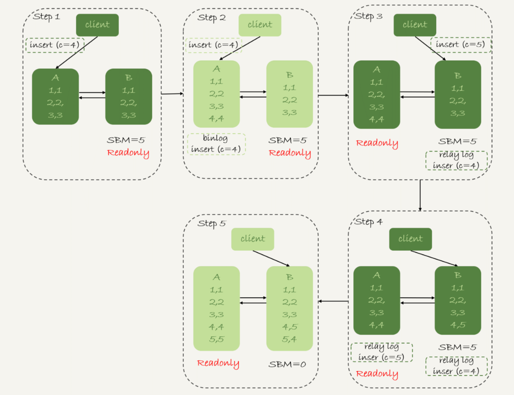

​						图3 可用性优先策略，且binlog_format=mixed

现在，我们一起分析下这个切换流程：

1. 步骤2中，主库A执行完insert语句，插入了一行数据（4,4），之后开始进行主备切换。
2. 步骤3中，由于主备之间有5秒的延迟，所以备库B还没来得及应用“插入c=4”这个中转日志，就开始接收客户端“插入 c=5”的命令。
3. 步骤4中，备库B插入了一行数据（4,5），并且把这个binlog发给主库A。
4. 步骤5中，备库B执行“插入c=4”这个中转日志，插入了一行数据（5,4）。而直接在备库B执行的“插入c=5”这个语句，传到主库A，就插入了一行新数据（5,5）。

最后的结果就是，主库A和备库B上出现了两行不一致的数据。可以看到，这个**数据不一致**，是由可用性优先流程导致的。

那么，如果我还是用**可用性优先策略，但设置binlog_format=row**，情况又会怎样呢？

因为row格式在记录binlog的时候，会记录新插入的行的所有字段值，所以最后只会有一行不一致。而且，两边的主备同步的应用线程会报错duplicate key error并停止。也就是说，这种情况下，备库B的(5,4)和主库A的(5,5)这两行数据，都不会被对方执行。

图4中我画出了详细过程，你可以自己再分析一下。

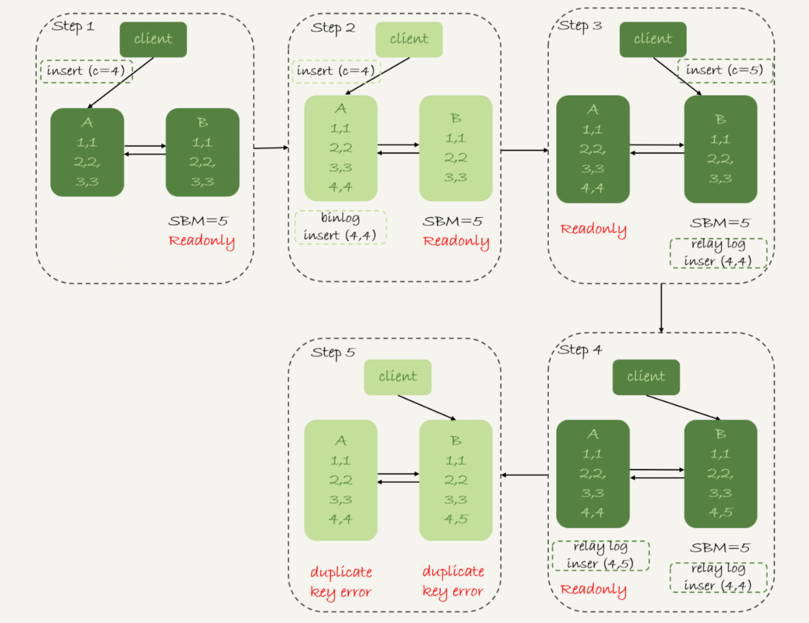

​						图4 可用性优先策略，且binlog_format=row

从上面的分析中，你可以看到一些结论：

1. **使用row格式的binlog时，数据不一致的问题更容易被发现**。而使用mixed或者statement格式的binlog时，数据很可能悄悄地就不一致了。如果你过了很久才发现数据不一致的问题，很可能这时的数据不一致已经不可查，或者连带造成了更多的数据逻辑不一致。
2. 主备切换的可用性优先策略会导致数据不一致。因此，大多数情况下，我都建议你使用可靠性优先策略。毕竟对数据服务来说的话，数据的可靠性一般还是要优于可用性的。


## 哪种情况选择可用性优先策略

但事无绝对，**有没有哪种情况数据的可用性优先级更高呢？**

答案是，有的。

我曾经碰到过这样的一个场景：

- **有一个库的作用是记录操作日志**。这时候，如果数据不一致可以通过binlog来修补，而这个短暂的不一致也不会引发业务问题。
- 同时，**业务系统依赖于这个日志写入逻辑**，如果这个库不可写，会导致线上的业务操作无法执行。

这时候，你可能就需要选择先强行切换，**事后再补数据的策略**。


**改进措施：**

当然，事后复盘的时候，我们想到了一个改进措施就是，**让业务逻辑不要依赖于这类日志的写入**。也就是说，日志写入这个逻辑模块应该可以降级，比如写到本地文件，或者写到另外一个临时库里面。

这样的话，这种场景就又可以使用可靠性优先策略了。

接下来我们再看看，**按照可靠性优先的思路，异常切换会是什么效果？**

假设，主库A和备库B间的主备延迟是30分钟，这时候主库A掉电了，HA系统要切换B作为主库。我们在主动切换的时候，可以等到主备延迟小于5秒的时候再启动切换，但这时候已经别无选择了。

实战45讲笔记.assets/image-20231007144348654.png)

​								图5 可靠性优先策略，主库不可用

采用可靠性优先策略的话，你就必须得等到备库B的seconds_behind_master=0之后，才能切换。但现在的情况比刚刚更严重，并不是系统只读、不可写的问题了，而是系统处于完全不可用的状态。因为，主库A掉电后，我们的连接还没有切到备库B。

你可能会问，那能不能直接切换到备库B，但是保持B只读呢？

这样也不行。

因为，这段时间内，中转日志还没有应用完成，如果直接发起主备切换，客户端查询看不到之前执行完成的事务，会认为有“数据丢失”。

虽然随着中转日志的继续应用，这些数据会恢复回来，但是对于一些业务来说，查询到“暂时丢失数据的状态”也是不能被接受的。

聊到这里你就知道了，**在满足数据可靠性的前提下，MySQL高可用系统的可用性，是依赖于主备延迟的**。**延迟的时间越小**，在主库故障的时候，服务恢复需要的时间就越短，**可用性就越高**。


## 问题

一般现在的数据库运维系统都有备库延迟监控，其实就是在备库上执行 show slave status，采集seconds_behind_master的值。

假设，现在你看到你维护的一个备库，它的延迟监控的图像类似图6，是一个45°斜向上的线段，你觉得可能是什么原因导致呢？你又会怎么去确认这个原因呢？

实战45讲笔记.assets/image-20231007145533901.png)

看这曲线,应该是从库正在应用一个**大事务**,或者一个大表上无主键的情况(有该表的更新)
应该是T3随着时间的增长在增长,而T1这个时间点是没变的,造成的现象就是
随着时间的增长,second_behind_master也是有规律的增长


# 26 MySQL备库的并行复制能力


## 备库的并行复制能力

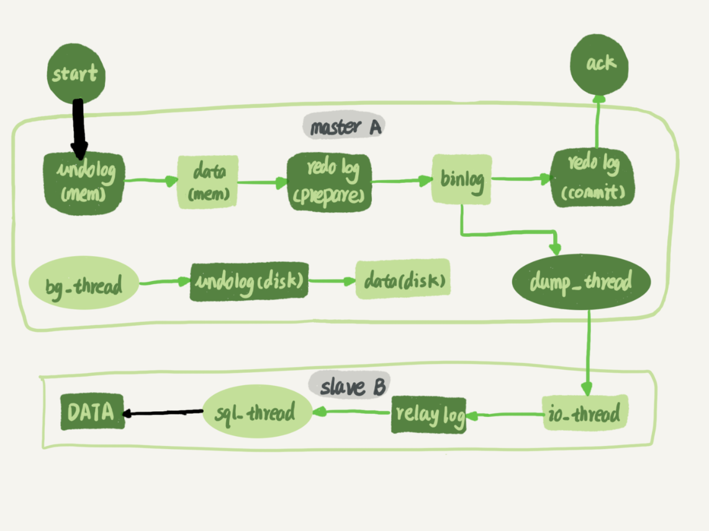

​									图1 主备流程图

谈到主备的**并行复制能力**，我们要关注的是图中**黑色的两个箭头**。一个箭头代表了客户端写入主库，另一箭头代表的是备库上sql_thread执行中转日志（relay log）。如果用箭头的粗细来代表并行度的话，那么真实情况就如图1所示，**第一个箭头要明显粗于第二个箭头**。

在主库上，影响并发度的原因就是各种锁了。由于InnoDB引擎支持行锁，除了所有并发事务都在更新同一行（热点行）这种极端场景外，它对业务并发度的支持还是很友好的。所以，你在性能测试的时候会发现，并发压测线程32就比单线程时，总体吞吐量高。

而日志在备库上的执行，就是图中备库上**sql_thread**更新数据(DATA)的逻辑。**如果是用单线程的话，就会导致备库应用日志不够快，造成主备延迟**。

**在官方的5.6版本之前，MySQL只支持单线程复制**，由此在主库并发高、TPS高时就会出现严重的主备延迟问题。


## 从库实现并行复制的思路

从单线程复制到最新版本的多线程复制，中间的演化经历了好几个版本。接下来，我就跟你说说MySQL多线程复制的演进过程。

其实说到底，所有的多线程复制机制，都是要把图1中只有一个线程的sql_thread，拆成多个线程，也就是都符合下面的这个模型：

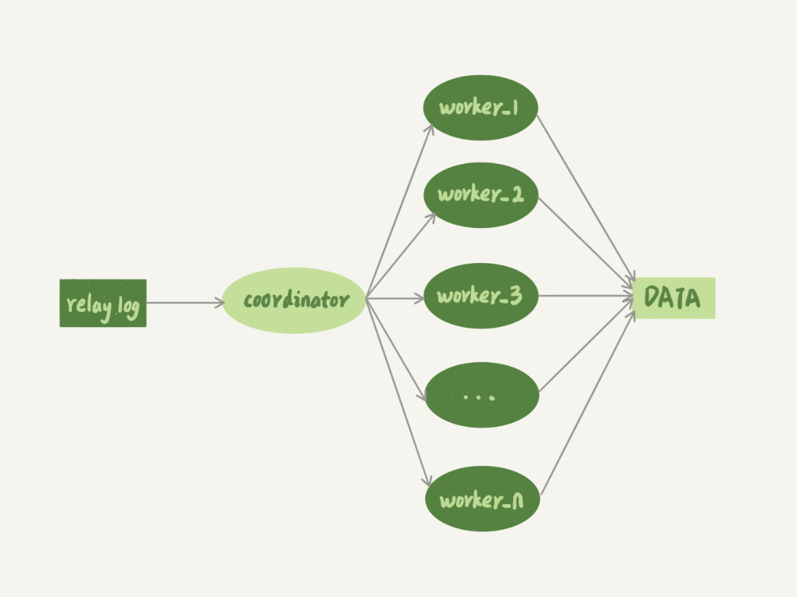

​									图2 多线程模型

图2中，**coordinator就是原来的sql_thread**, 不过现在它不再直接更新数据了，只**负责读取中转日志和分发事务**。**真正更新日志的，变成了worker线程**。而work线程的个数，就是由参数**slave_parallel_workers**决定的。根据我的经验，把这个值设置为**8~16之间最好（32核物理机**（1/4~1/2）的情况），毕竟备库还有可能要提供读查询，不能把CPU都吃光了。（我的8核默认值是4）


接下来，你需要先思考一个问题：事务能不能按照轮询的方式分发给各个worker，也就是第一个事务分给worker_1，第二个事务发给worker_2呢？

其实是不行的。因为，事务被分发给worker以后，不同的worker就独立执行了。但是，**由于CPU的调度策略，很可能第二个事务最终比第一个事务先执行**。而如果这时候刚好这两个事务更新的是同一行，也就意味着，同一行上的两个事务，在主库和备库上的执行顺序相反，会导致主备不一致的问题。

接下来，请你再设想一下另外一个问题：同一个事务的多个更新语句，能不能分给不同的worker来执行呢？

答案是，也不行。举个例子，一个事务更新了表t1和表t2中的各一行，如果这两条更新语句被分到不同worker的话，虽然最终的结果是主备一致的，但如果表t1执行完成的瞬间，备库上有一个查询，就会看到这个事务“更新了一半的结果”，破坏了事务逻辑的原子性。

所以，**coordinator在分发的时候，需要满足以下这两个基本要求**：

1. 不能造成更新覆盖。这就要求**更新同一行的两个事务，必须被分发到同一个worker中**。
2. **同一个事务不能被拆开**，必须放到同一个worker中。

各个版本的多线程复制，都遵循了这两条基本原则。接下来，我们就看看各个版本的并行复制策略。

## MySQL 5.5版本的并行复制策略（作者自写）

**官方MySQL 5.5版本是不支持并行复制的**。但是，在2012年的时候，我自己服务的业务出现了严重的主备延迟，原因就是备库只有单线程复制。然后，我就先后写了两个版本的并行策略。

这里，我给你介绍一下这两个版本的并行策略，即按表分发策略和按行分发策略，以帮助你理解MySQL官方版本并行复制策略的迭代。

### 按表分发策略

按表分发事务的基本思路是，如果两个事务更新不同的表，它们就可以并行。**因为数据是存储在表里的，所以按表分发，可以保证两个worker不会更新同一行**。

当然，如果有跨表的事务，还是要把两张表放在一起考虑的。如图3所示，就是按表分发的规则。

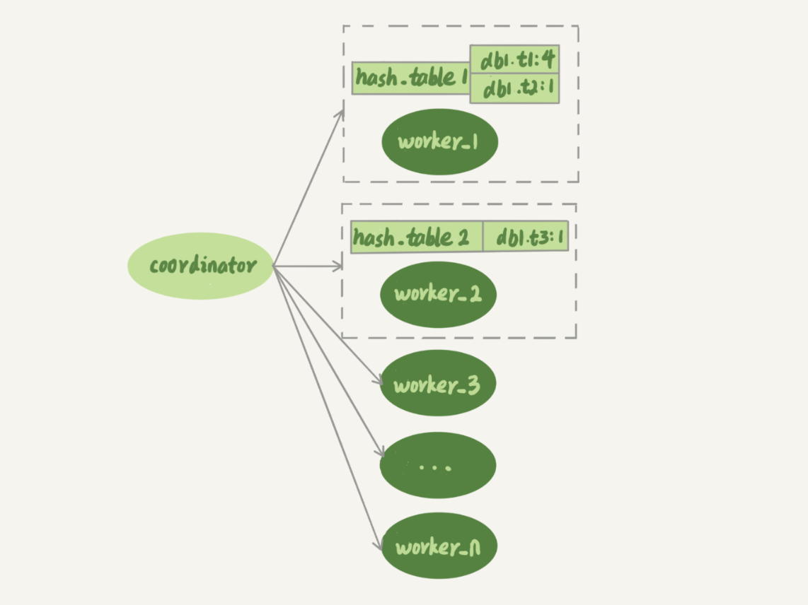

​									图3 按表并行复制程模型

可以看到，每个worker线程对应一个hash表，用于保存当前正在这个worker的“执行队列”里的事务所涉及的表。hash表的key是“**库名.表名**”，value是一个数字，表示队列中有多少个事务修改这个表。

在有事务分配给worker时，事务里面涉及的表会被加到对应的hash表中。worker执行完成后，这个表会被从hash表中去掉。

图3中，hash_table_1表示，现在worker_1的“待执行事务队列”里，有4个事务涉及到db1.t1表，有1个事务涉及到db2.t2表；hash_table_2表示，现在worker_2中有一个事务会更新到表t3的数据。

假设在图中的情况下，coordinator从中转日志中读入一个**新事务T**，这个事务修改的行涉及到**表t1和t3**。

现在我们用事务T的分配流程，来看一下分配规则。

1. 由于事务T中涉及修改表t1，而worker_1队列中有事务在修改表t1，事务T和队列中的某个事务要修改同一个表的数据，这种情况我们说事务T和worker_1是冲突的。
2. 按照这个逻辑，顺序判断事务T和每个worker队列的冲突关系，会发现事务T跟worker_2也冲突。
3. **事务T跟多于一个worker冲突，coordinator线程就进入等待**。
4. 每个worker继续执行，同时修改hash_table。假设hash_table_2里面涉及到修改表t3的事务先执行完成，就会从hash_table_2中把db1.t3这一项去掉。
5. 这样coordinator会发现跟事务T冲突的worker只有worker_1了，因此就把它分配给worker_1。
6. coordinator继续读下一个中转日志，继续分配事务。

也就是说，每个事务在分发的时候，跟所有worker的冲突关系包括以下**三种情况**：

1. 如果**跟所有worker都不冲突**，coordinator线程就会把这个事务分配给最空闲的woker;
2. 如果**跟多于一个worker冲突**，coordinator线程就**进入等待**状态，直到和这个事务存在冲突关系的worker**只剩下1个**；
3. 如果**只跟一个worker冲突**，coordinator线程就会把这个事务分配给这个存在冲突关系的worker。

这个按表分发的方案，在多个表负载均匀的场景里应用效果很好。但是，**如果碰到热点表，比如所有的更新事务都会涉及到某一个表的时候，所有事务都会被分配到同一个worker中，就变成单线程复制了**。

### 按行分发策略

要解决热点表的并行复制问题，就需要一个按行并行复制的方案。按行复制的核心思路是：如果两个事务没有更新相同的行，它们在备库上可以并行执行。显然，**这个模式要求binlog格式必须是row**。

这时候，我们判断一个事务T和worker是否冲突，用的就规则就不是“修改同一个表”，而是“修改同一行”。

按行复制和按表复制的数据结构差不多，也是为每个worker，分配一个hash表。只是要实现按行分发，这时候的key，就必须是“库名+表名+唯一键的值”。

但是，这个“唯一键”只有主键id还是不够的，我们还需要考虑下面这种场景，表t1中除了主键，还有唯一索引a：

```
CREATE TABLE `t1` (
  `id` int(11) NOT NULL,
  `a` int(11) DEFAULT NULL,
  `b` int(11) DEFAULT NULL,
  PRIMARY KEY (`id`),
  UNIQUE KEY `a` (`a`)
) ENGINE=InnoDB;

insert into t1 values(1,1,1),(2,2,2),(3,3,3),(4,4,4),(5,5,5);
```

假设，接下来我们要在主库执行这两个事务：

实战45讲笔记.assets/f19916e27b8ff28e87ed3ad9f5473378-169673606207921.png)

​									图4 唯一键冲突示例

可以看到，这两个事务要更新的行的主键值不同，但是如果它们被分到不同的worker，就有可能session B的语句先执行。这时候id=1的行的a的值还是1，就会报唯一键冲突。

因此，基于行的策略，事务hash表中还需要考虑唯一键，即key应该是“**库名+表名+索引a的名字+a的值**”。

比如，在上面这个例子中，我要在表t1上执行update t1 set a=1 where id=2语句，在binlog里面记录了整行的数据修改前各个字段的值，和修改后各个字段的值。

因此，coordinator在解析这个语句的binlog的时候，这个事务的hash表就有三个项:

1. key=hash_func(db1+t1+“PRIMARY”+2), value=2; 这里value=2是因为修改前后的行id值不变，出现了两次。
2. key=hash_func(db1+t1+“a”+2), value=1，表示会影响到这个表a=2的行。
3. key=hash_func(db1+t1+“a”+1), value=1，表示会影响到这个表a=1的行。

可见，**相比于按表并行分发策略，按行并行策略在决定线程分发的时候，需要消耗更多的计算资源。**


### 这两种方式的缺点和解决方法

你可能也发现了，这**两个方案**其实都有一些**约束条件**：

1. 要能够从binlog里面解析出表名、主键值和唯一索引的值。也就是说，**主库的binlog格式必须是row**；
2. 表必须有**主键**；
3. **不能有外键**。表上如果有外键，级联更新的行不会记录在binlog中，这样冲突检测就不准确。

但，好在这三条约束规则，本来就是DBA之前要求业务开发人员必须遵守的线上使用规范，所以这两个并行复制策略在应用上也没有碰到什么麻烦。

对比按表分发和按行分发这两个方案的话，按行分发策略的并行度更高。不过，如果是要操作很多行的大事务的话，**按行分发**的策略有**两个问题**：

1. **耗费内存**。比如一个语句要删除100万行数据，这时候hash表就要记录100万个项。
2. **耗费CPU**。解析binlog，然后计算hash值，对于大事务，这个成本还是很高的。

所以，我在实现这个策略的时候会**设置一个阈值**，单个事务如果超过设置的行数阈值（比如，如果单个事务更新的行数超过10万行），就暂时**退化为单线程模式**，退化过程的逻辑大概是这样的：

1. coordinator暂时先hold住这个事务；
2. 等待所有worker都执行完成，变成空队列；
3. coordinator直接执行这个事务；
4. 恢复并行模式。

读到这里，你可能会感到奇怪，这两个策略又没有被合到官方，我为什么要介绍这么详细呢？其实，介绍这两个策略的目的是抛砖引玉，方便你理解后面要介绍的社区版本策略。

## MySQL 5.6版本的并行复制策略

官方**MySQL5.6**版本，支持了并行复制，只是支持的粒度是**按库并行**。理解了上面介绍的按表分发策略和按行分发策略，你就理解了，用于决定分发策略的hash表里，**key就是数据库名**。

这个策略的并行效果，取决于压力模型。**如果在主库上有多个DB，并且各个DB的压力均衡，使用这个策略的效果会很好**。

相比于按表和按行分发，这个策略有**两个优势**：

1. **构造hash值的时候很快，只需要库名**；而且一个实例上DB数也不会很多，不会出现需要构造100万个项这种情况。
2. **不要求binlog的格式**。因为statement格式的binlog也可以很容易拿到库名。

但是，**如果你的主库上的表都放在同一个DB里面，这个策略就没有效果了**；或者如果不同DB的热点不同，比如一个是业务逻辑库，一个是系统配置库，那也起不到并行的效果。

理论上你可以创建不同的DB，把相同热度的表均匀分到这些不同的DB中，强行使用这个策略。不过据我所知，由于需要特地移动数据，这个策略用得并不多。

## MariaDB的并行复制策略

在[第23篇文章](https://time.geekbang.org/column/article/76161)中，我给你介绍了redo log**组提交(group commit)优化**， 而MariaDB的并行复制策略利用的就是这个特性：

1. 能够在**同一组里提交的事务，一定不会修改同一行**；
2. 主库上可以并行执行的事务，备库上也一定是可以并行执行的。

在实现上，MariaDB是这么做的：

1. 在一组里面一起提交的事务，有一个**相同的commit_id**，下一组就是commit_id+1；
2. commit_id直接写到binlog里面；
3. 传到备库应用的时候，相同commit_id的事务分发到多个worker执行；
4. 这一组**全部执行完成后**，coordinator**再**去取下一批。

当时，这个策略出来的时候是相当惊艳的。因为，之前业界的思路都是在“分析binlog，并拆分到worker”上。而MariaDB的这个策略，目标是“模拟主库的并行模式”。

但是，这个策略有一个问题，它并没有实现“真正的模拟主库并发度”这个目标。**在主库上，一组事务在commit的时候，下一组事务是同时处于“执行中”状态的。**

如图5所示，假设了三组事务在主库的执行情况，你可以看到在trx1、trx2和trx3提交的时候，trx4、trx5和trx6是在执行的。这样，在第一组事务提交完成的时候，下一组事务很快就会进入commit状态。

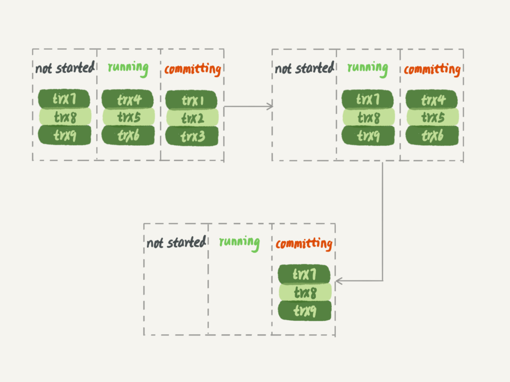

​									图5 主库并行事务

而按照MariaDB的并行复制策略，备库上的执行效果如图6所示。

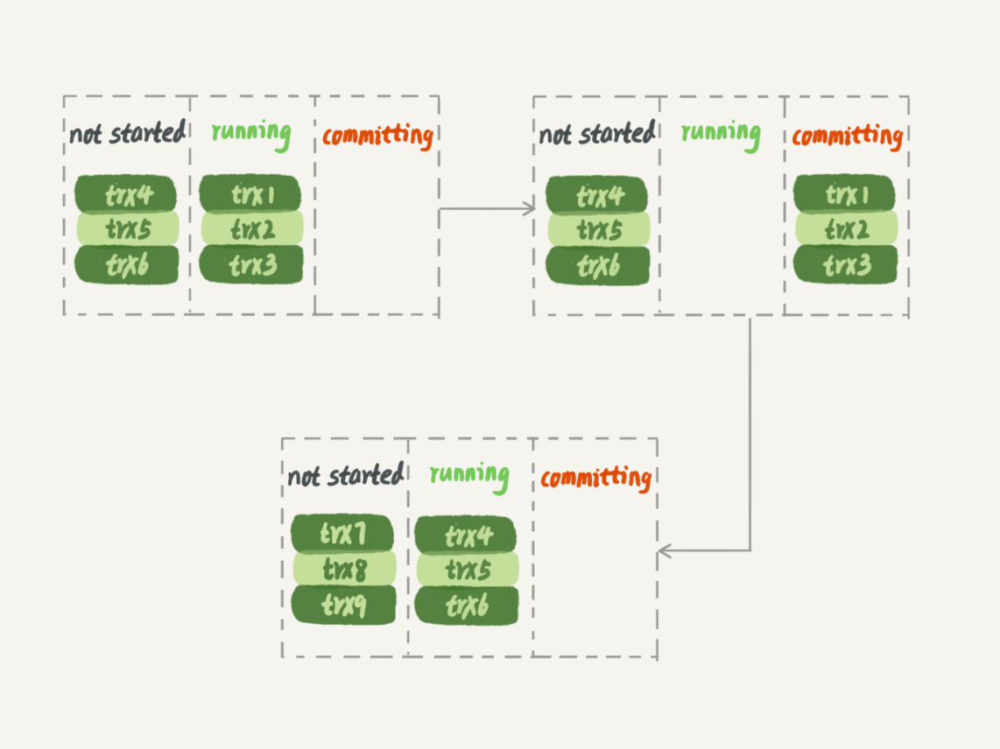

​							图6 MariaDB 并行复制，备库并行效果

可以看到，**在备库上执行的时候，要等第一组事务完全执行完成后，第二组事务才能开始执行**，这样系统的吞吐量就不够。

另外，这个方案**很容易被大事务拖后腿**。假设trx2是一个超大事务，那么在备库应用的时候，trx1和trx3执行完成后，就只能等trx2完全执行完成，下一组才能开始执行。这段时间，**只有一个worker线程在工作**，是对资源的浪费。

不过即使如此，这个策略仍然是一个很漂亮的创新。因为，它对原系统的改造非常少，实现也很优雅。

## MySQL 5.7的并行复制策略

在MariaDB并行复制实现之后，官方的MySQL5.7版本也提供了类似的功能，由参数**slave_parallel_type**来控制并行复制策略：

1. 配置为**DATABASE**，表示使用MySQL 5.6版本的**按库并行**策略；
2. 配置为 **LOGICAL_CLOCK**（默认），表示的就是**类似MariaDB的策略**。不过，MySQL 5.7这个策略，针对并行度**做了优化**。这个优化的思路也很有趣儿。

你可以先考虑这样一个问题：同时处于“执行状态”的所有事务，是不是可以并行？

答案是，不能。

因为，这里面可能有由于锁冲突而处于锁等待状态的事务。如果这些事务在备库上被分配到不同的worker，就会出现备库跟主库不一致的情况。

而上面提到的MariaDB这个策略的核心，是**“所有处于commit”状态的事务可以并行。事务处于commit状态，表示已经通过了锁冲突的检验了**。

这时候，你可以再回顾一下两阶段提交，我把前面[第23篇文章](https://time.geekbang.org/column/article/76161)中介绍过的两阶段提交过程图贴过来。

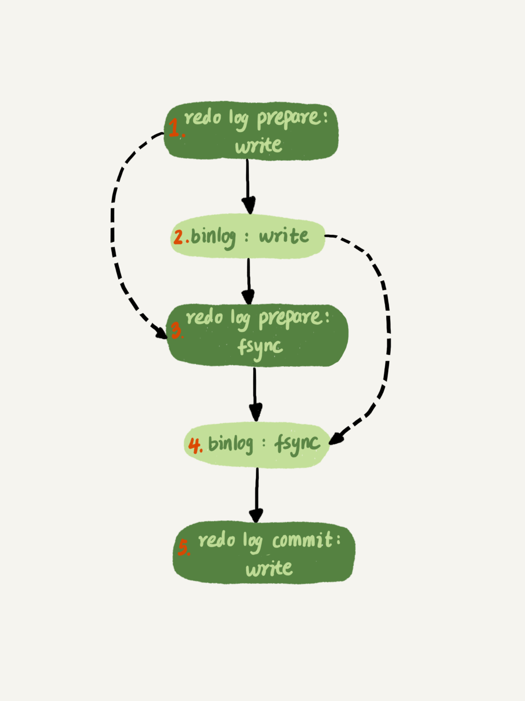

​								图7 两阶段提交细化过程图

其实，不用等到commit阶段，**只要能够到达redo log prepare阶段，就表示事务已经通过锁冲突的检验了**。

因此，MySQL 5.7并行复制策略的思想是：

1. **同时处于prepare状态的事务，在备库执行时是可以并行的；**
2. 处于prepare状态的事务，与处于commit状态的事务之间，在备库执行时也是可以并行的。

我在第23篇文章，讲binlog的组提交的时候，介绍过两个参数：

1. **binlog_group_commit_sync_delay**参数，表示延迟多少微秒后才调用fsync;
2. **binlog_group_commit_sync_no_delay_count**参数，表示累积多少次以后才调用fsync。

这两个参数是用于故意拉长binlog从write到fsync的时间，以此**减少binlog的写盘次数**。在MySQL 5.7的并行复制策略里，它们可以用来**制造更多的“同时处于prepare阶段的事务”**。这样就**增加了备库复制的并行度**。

也就是说，这两个参数，既可以“故意”让主库提交得慢些，又可以让备库执行得快些。在MySQL 5.7处理备库延迟的时候，可以考虑调整这两个参数值，来达到提升备库复制并发度的目的。

## MySQL 5.7.22的并行复制策略

在2018年4月份发布的MySQL 5.7.22版本里，MySQL增加了一个新的并行复制策略，基于WRITESET的并行复制。

相应地，新增了一个参数**binlog_transaction_dependency_tracking**，用来控制是否启用这个新策略。这个参数的可选值有以下三种。

1. **COMMIT_ORDER**(默认)，表示的就是前面介绍的，根据同时进入prepare和commit来判断是否可以并行的策略，即LOGICAL_CLOCK。
2. **WRITESET**，表示的是对于事务涉及更新的**每一行**，计算出这一行的**hash值**，**组成集合writeset**。如果两个事务没有操作相同的行，也就是说它们的writeset**没有交集，就可以并行**。
3. **WRITESET_SESSION**，是在WRITESET的基础上多了一个约束，即在**主库上同一个线程先后执行的两个事务，在备库执行的时候，要保证相同的先后顺序**。

当然为了唯一标识，这个hash值是通过“**库名+表名+索引名+值**”计算出来的。如果一个表上除了有主键索引外，还有其他唯一索引，那么对于每个唯一索引，insert语句对应的writeset就要多增加一个hash值。

你可能看出来了，这跟我们前面介绍的基于**MySQL 5.5版本的按行分发的策略是差不多的**。不过，MySQL官方的这个实现还是有很大的优势：

1. writeset是在主库生成后**直接写入到binlog**里面的，这样在备库执行的时候，**不需要解析binlog内容**（event里的行数据），**节省了很多计算量**；
2. **不需要**把整个事务的binlog都扫一遍才能**决定分发到哪个worker**，**更省内存**；
3. 由于备库的分发策略不依赖于binlog内容，所以binlog是**statement格式也是可以的**。

因此，MySQL 5.7.22的并行复制策略在通用性上还是有保证的。

当然，对于“表上没主键”和“外键约束”的场景，WRITESET策略也是没法并行的，也会暂时退化为单线程模型。


## 问题

假设一个MySQL 5.7.22版本的主库，单线程插入了很多数据，过了3个小时后，我们要给这个主库搭建一个相同版本的备库。

这时候，你为了更快地让备库追上主库，要开并行复制。在binlog_transaction_dependency_tracking参数的COMMIT_ORDER、WRITESET和WRITE_SESSION这三个取值中，你会选择哪一个呢？

> 应该将这个参数设置为WRITESET。
>
> 由于主库是单线程压力模式，所以每个事务的commit_id都不同，那么设置为COMMIT_ORDER模式的话，从库也只能单线程执行。
>
> 同样地，由于WRITESET_SESSION模式要求在备库应用日志的时候，同一个线程的日志必须与主库上执行的先后顺序相同，也会导致主库单线程压力模式下**退化成单线程复制**。
>
> 所以，应该将binlog_transaction_dependency_tracking 设置为WRITESET。


**总结：**

slave_parallel_workers：work线程的个数(推荐设置为CPU核数的1/4 ~ 1/2)

**slave_parallel_type** 的默认值 `LOGICAL_CLOCK`
**binlog_transaction_dependency_tracking** 的默认值 `COMMIT_ORDER`
都指同一个策略，都是优化后的MariaDB策略


binlog_transaction_dependency_tracking 的 WRITESET 和按行分发策略类似


# 27 MySQL主备切换找同步点

## 一主多从

大多数的互联网应用场景都是读多写少，因此你负责的业务，在发展过程中很可能先会遇到读性能的问题。而在数据库层解决读性能问题，就要涉及到接下来两篇文章要讨论的架构：一主多从。

今天这篇文章，我们就先聊聊一主多从的切换正确性。然后，我们在下一篇文章中再聊聊解决一主多从的查询逻辑正确性的方法。

如图1所示，就是一个基本的**一主多从**结构。

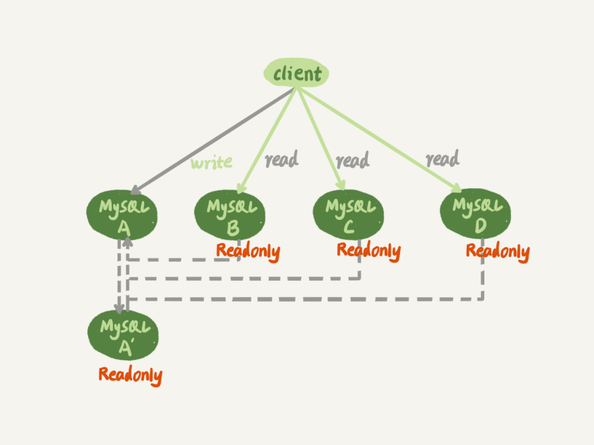

​									图1 一主多从基本结构

图中，虚线箭头表示的是主备关系，也就是A和A’互为主备， 从库B、C、D指向的是主库A。一主多从的设置，一般用于读写分离，主库负责所有的写入和一部分读，其他的读请求则由从库分担。

今天我们要讨论的就是，在一主多从架构下，主库故障后的主备切换问题。

如图2所示，就是主库发生故障，主备切换后的结果。

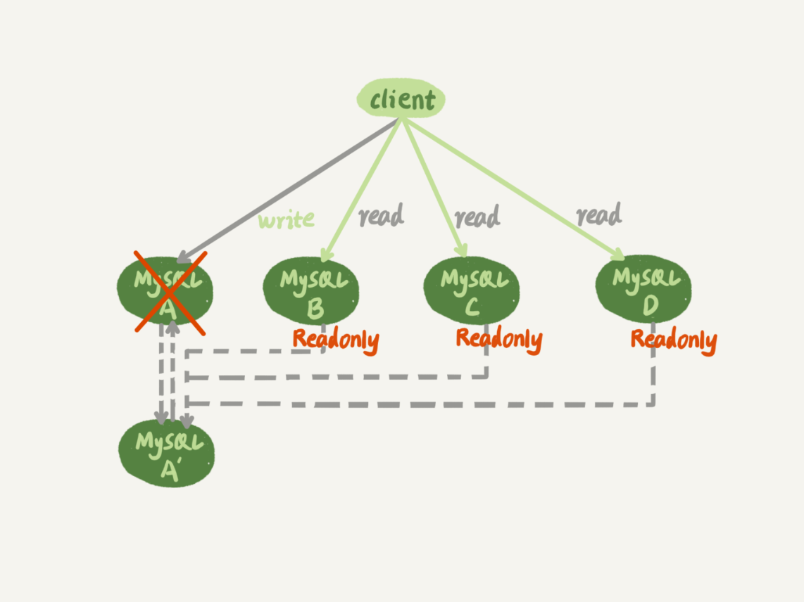

​							图2 一主多从基本结构--主备切换

相比于一主一备的切换流程，一主多从结构在切换完成后，A’会成为新的主库，从库B、C、D也要改接到A’。正是由于多了从库B、C、D重新指向的这个过程，所以主备切换的复杂性也相应增加了。

接下来，我们再一起看看一个切换系统会怎么完成一主多从的主备切换过程。

## 基于位点pos的主备切换

这里，我们需要先来回顾一个知识点。

当我们把节点B设置成节点A’的从库的时候，需要执行一条change master命令：

```
CHANGE MASTER TO 
MASTER_HOST=$host_name 
MASTER_PORT=$port 
MASTER_USER=$user_name 
MASTER_PASSWORD=$password 
MASTER_LOG_FILE=$master_log_name 
MASTER_LOG_POS=$master_log_pos  
```

这条命令有这么6个参数：

- MASTER_HOST、MASTER_PORT、MASTER_USER和MASTER_PASSWORD四个参数，分别代表了主库A’的IP、端口、用户名和密码。
- 最后两个参数MASTER_LOG_FILE和MASTER_LOG_POS表示，要从主库的master_log_name文件的master_log_pos这个位置的日志继续同步。而这个位置就是我们所说的同步位点，也就是主库对应的文件名和日志偏移量。

那么，这里就有一个问题了，节点B要设置成A’的从库，就要执行change master命令，就**不可避免地要设置位点的这两个参数**，但是这两个参数到底应该怎么设置呢？

原来节点B是A的从库，本地记录的也是A的位点。但是相同的日志，A的位点和A’的位点是不同的。因此，从库B要切换的时候，就需要先经过**“找同步位点”**这个逻辑。

这个位点很难精确取到，只能取一个大概位置。为什么这么说呢？

我来和你分析一下看看这个位点一般是怎么获取到的，你就清楚其中不精确的原因了。

考虑到切换过程中不能丢数据，所以我们找位点的时候，总是要找一个“稍微往前”的，然后再通过判断跳过那些在从库B上已经执行过的事务。

一种取同步位点的方法是这样的：

1. 等待新主库A’把中转日志（relay log）全部同步完成；
2. 在A’上执行show master status命令，得到当前A’上最新的File 和 Position；
3. **取原主库A故障的时刻T**；
4. 用mysqlbinlog工具解析A’的File，得到T时刻的位点。

```
mysqlbinlog File --stop-datetime=T --start-datetime=T
```

实战45讲笔记.assets/3471dfe4aebcccfaec0523a08cdd0ddd.png)

​							图3 mysqlbinlog 部分输出结果

图中，**end_log_pos后面的值“123”**，表示的就是A’这个实例，在T时刻写入新的binlog的位置。然后，我们就可以**把123这个值作为$master_log_pos** ，用在节点B的change master命令里。

当然**这个值并不精确**。为什么呢？

你可以设想有这么一种情况，假设在T这个时刻，主库A已经执行完成了一个insert 语句插入了一行数据R，并且已经将binlog传给了A’和B，然后在传完的瞬间主库A的主机就掉电了。

那么，这时候系统的状态是这样的：

1. 在从库B上，由于同步了binlog， R这一行已经存在；
2. 在新主库A’上， R这一行也已经存在，日志是写在123这个位置之后的；
3. 我们在从库B上执行change master命令，指向A’的File文件的123位置，就会把插入R这一行数据的binlog又同步到从库B去执行。

这时候，从库B的同步线程就会报告 Duplicate entry ‘id_of_R’ for key ‘PRIMARY’ 错误，提示出现了主键冲突，然后停止同步。

所以，**通常情况下，我们在切换任务的时候，要先主动跳过这些错误，有两种常用的方法。**

**一种做法是**，主动跳过一个事务。跳过命令的写法是：

```
set global sql_slave_skip_counter=1;
start slave;
```

因为切换过程中，可能会不止重复执行一个事务，所以我们需要在从库B刚开始接到新主库A’时，**持续观察，每次碰到这些错误就停下来，执行一次跳过命令，直到不再出现停下来的情况**，以此来跳过可能涉及的所有事务。

**另外一种方式是，**通过设置slave_skip_errors参数，直接设置跳过指定的错误。

在执行主备切换时，有这么两类错误，是经常会遇到的：

- 1062错误是插入数据时唯一键冲突；
- 1032错误是删除数据时找不到行。

因此，我们可以**把slave_skip_errors 设置为 “1032,1062”**，这样中间碰到这两个错误时就直接跳过。

这里需要注意的是，这种直接跳过指定错误的方法，针对的是主备切换时，由于找不到精确的同步位点，所以只能采用这种方法来创建从库和新主库的主备关系。

这个背景是，我们很清楚在主备切换过程中，直接跳过1032和1062这两类错误是无损的，所以才可以这么设置slave_skip_errors参数。等到主备间的同步关系建立完成，并稳定执行一段时间之后，我们还需要把这个参数设置为空，以免之后真的出现了主从数据不一致，也跳过了。

## GTID全局事务ID

通过sql_slave_skip_counter跳过事务和通过slave_skip_errors忽略错误的方法，虽然都最终可以建立从库B和新主库A’的主备关系，但这两种操作都很复杂，而且容易出错。所以，**MySQL 5.6版本引入了GTID**，彻底解决了这个困难。

那么，GTID到底是什么意思，又是如何解决找同步位点这个问题呢？现在，我就和你简单介绍一下。

**GTID**的全称是Global Transaction Identifier，也就是**全局事务ID**，是一个事务在提交的时候生成的，是这个事务的唯一标识。它由两部分组成，格式是：

```
GTID=server_uuid:gno
```

其中：

- server_uuid是一个实例第一次启动时自动生成的，是一个全局唯一的值；
- gno是一个整数，初始值是1，每次提交事务的时候分配给这个事务，并加1。

这里我需要和你说明一下，在MySQL的官方文档里，GTID格式是这么定义的：

```
GTID=source_id:transaction_id
```

这里的source_id就是server_uuid；而后面的这个transaction_id，我觉得容易造成误导，所以我改成了gno。为什么说使用transaction_id容易造成误解呢？

因为，在MySQL里面我们说**transaction_id就是指事务id**，事务id是在事务执行过程中分配的，**如果这个事务回滚了，事务id也会递增**，而**gno是在事务提交的时候才会分配**。

从效果上看，GTID往往是连续的，因此我们用gno来表示更容易理解。

> GTID模式的启动也很简单，我们只需要在启动一个MySQL实例的时候，加上参数**gtid_mode=on**和**enforce_gtid_consistency=on**就可以了。


### GTID的生成策略

在GTID模式下，每个事务都会跟一个GTID一一对应。这个GTID有两种生成方式，而使用哪种方式取决于session变量gtid_next的值。

1. 如果**gtid_next=automatic**，代表使用**默认值**。这时，MySQL就会把server_uuid:gno分配给这个事务。
   a. 记录binlog的时候，先记录一行 SET @@SESSION.GTID_NEXT=‘server_uuid:gno’;
   b. 把这个GTID加入本实例的GTID集合。
2. 如果gtid_next是一个**指定的GTID的值**，比如通过set gtid_next='current_gtid’指定为current_gtid，那么就有两种可能：
   - a. 如果current_gtid已经**存在**于实例的GTID集合中，接下来执行的这个事务会直接**被系统**忽略；
   - b. 如果current_gtid**没有存在**于实例的GTID集合中，就**将这个current_gtid分配**给接下来要执行的事务，也就是说系统不需要给这个事务生成新的GTID，因此**gno也不用加1**。

注意，**一个current_gtid只能给一个事务使用**。这个事务提交后，如果要执行下一个事务，就要执行set 命令，把gtid_next**设置成另外一个gtid或者automatic**。

这样，每个MySQL实例都维护了一个GTID集合，用来对应“这个实例执行过的所有事务”。


### GTID处理冲突的基本用法

这样看上去不太容易理解，接下来我就用一个简单的例子，来和你说明GTID的基本用法。

我们在实例X中创建一个表t。

```
CREATE TABLE `t` (
  `id` int(11) NOT NULL,
  `c` int(11) DEFAULT NULL,
  PRIMARY KEY (`id`)
) ENGINE=InnoDB;

insert into t values(1,1);
```

实战45讲笔记.assets/28a5cab0079fb12fd5abecd92b3324c2.png)

​								图4 初始化数据的binlog

可以看到，事务的BEGIN之前有一条SET @@SESSION.GTID_NEXT命令。这时，如果实例X有从库，那么将CREATE TABLE和insert语句的binlog同步过去执行的话，执行事务之前就会先执行这两个SET命令，这样被加入从库的GTID集合的，就是图中的这两个GTID。

假设，现在这个实例X是另外一个实例Y的从库，并且此时在实例Y上执行了下面这条插入语句：

```
insert into t values(1,1);
```

并且，这条语句在实例Y上的GTID是 “aaaaaaaa-cccc-dddd-eeee-ffffffffffff:10”。

那么，实例X作为Y的从库，就要同步这个事务过来执行，显然会出现**主键冲突**，导致实例X的同步线程停止。这时，我们应该怎么处理呢？

处理方法就是，你可以执行下面的这个语句序列：

```
set gtid_next='aaaaaaaa-cccc-dddd-eeee-ffffffffffff:10';
begin;
commit;
set gtid_next=automatic;
start slave;
```

其中，前三条语句的作用，是通过**提交一个空事务，把这个GTID加到实例X的GTID集合中**。如图5所示，就是执行完这个空事务之后的show master status的结果。

实战45讲笔记.assets/c8d3299ece7d583a3ecd1557851ed157.png)

​							图5 show master status结果

**可以看到实例X的Executed_Gtid_set里面，已经加入了这个GTID**。

这样，我再执行start slave命令让同步线程执行起来的时候，虽然实例X上还是会继续执行实例Y传过来的事务，但是由于“aaaaaaaa-cccc-dddd-eeee-ffffffffffff:10”**已经存在于实例X的GTID集合中了，所以实例X就会直接跳过这个事务**，也就不会再出现主键冲突的错误。

在上面的这个语句序列中，start slave命令之前还有一句set gtid_next=automatic。这句话的作用是**“恢复GTID的默认分配行为”**，也就是说如果之后有新的事务再执行，就还是按照原来的分配方式，继续分配gno=3。

### 基于GTID的主备切换

现在，我们已经理解GTID的概念，再一起来看看基于GTID的主备复制的用法。

在GTID模式下，备库B要设置为新主库A’的从库的语法如下：

```
CHANGE MASTER TO 
MASTER_HOST=$host_name 
MASTER_PORT=$port 
MASTER_USER=$user_name 
MASTER_PASSWORD=$password 
master_auto_position=1 
```

其中，**master_auto_position=1**就**表示这个主备关系使用的是GTID协议**。可以看到，前面让我们头疼不已的MASTER_LOG_FILE和MASTER_LOG_POS参数，已经不需要指定了。

我们把现在这个时刻，实例A’的GTID集合记为set_a，实例B的GTID集合记为set_b。接下来，我们就看看现在的主备切换逻辑。

我们在实例B上执行start slave命令，取binlog的逻辑是这样的：

1. 实例B指定主库A’，基于主备协议建立连接。
2. **实例B把set_b发给主库A’**。
3. **实例A’算出**set_a与set_b的**差集**，也就是所有存在于set_a，但是不存在于set_b的GITD的集合，判断A’本地是否包含了这个差集需要的所有binlog事务。
   a. 如果**不包含**，表示A’已经把实例B需要的binlog给删掉了，**直接返回错误**；
   b. 如果确认**全部包含**，A’从自己的binlog文件里面，找出第一个不在set_b的事务，**发给B**；
4. 之后就从这个事务开始，往后读文件，按顺序取binlog发给B去执行。

其实，这个逻辑里面包含了一个设计思想：在基于GTID的主备关系里，系统认为只要建立主备关系，就**必须保证主库发给备库的日志是`完整`的**。因此，**如果实例B需要的日志已经不存在，A’就拒绝把日志发给B。**

这跟基于位点的主备协议不同。基于位点的协议，是由备库决定的，备库指定哪个位点，主库就发哪个位点，不做日志的完整性判断。

基于上面的介绍，我们再来看看引入GTID后，一主多从的切换场景下，主备切换是如何实现的。

由于不需要找位点了，所以从库B、C、D只需要分别执行change master命令指向实例A’即可。

其实，严谨地说，主备切换不是不需要找位点了，而是**找位点这个工作，在实例A’内部就已经自动完成了**。但由于这个工作是自动的，所以**对HA系统的开发人员来说，非常友好**。

之后这个系统就由新主库A’写入，主库A’的自己生成的binlog中的GTID集合格式是：server_uuid_of_A’:1-M。

如果之前从库B的GTID集合格式是 server_uuid_of_A:1-N， 那么切换之后GTID集合的格式就变成了server_uuid_of_A:1-N, server_uuid_of_A’:1-M。

当然，主库A’之前也是A的备库，因此主库A’和从库B的GTID集合是一样的。这就达到了我们预期。

### GTID和在线DDL改善主备临时添加索引

接下来，我再举个例子帮你理解GTID。

之前在第22篇文章[《MySQL有哪些“饮鸩止渴”提高性能的方法？》](https://time.geekbang.org/column/article/75746)中，我和你提到业务高峰期的慢查询性能问题时，分析到如果是由于索引缺失引起的性能问题，我们可以通过在线加索引来解决。但是，考虑到要避免新增索引对主库性能造成的影响，我们可以**先在备库加索引，然后再切换**。

当时我说，**在双M结构下，备库执行的DDL语句也会传给主库，为了避免传回后对主库造成影响，要通过set sql_log_bin=off关掉binlog。**

评论区有位同学提出了一个问题：这样操作的话，数据库里面是加了索引，但是**binlog并没有记录下这一个更新，是不是会导致数据和日志不一致**？

这个问题提得非常好。当时，我在留言的回复中就引用了GTID来说明。今天，我再和你展开说明一下。

假设，这两个互为主备关系的库还是实例X和实例Y，且当前主库是X，并且都打开了GTID模式。这时的主备切换流程可以变成下面这样：

- 在实例X上执行stop slave。
- 在实例Y上执行DDL语句。注意，这里并不需要关闭binlog。
- 执行完成后，查出这个DDL语句对应的GTID，并记为 server_uuid_of_Y:gno。
- 到实例X上执行以下语句序列：

```
set GTID_NEXT="server_uuid_of_Y:gno";
begin;
commit;
set gtid_next=automatic;
start slave;
```

这样做的目的在于，既可以让实例Y的更新有binlog记录，同时也可以确保不会在实例X上执行这条更新。

- 接下来，执行完主备切换，然后照着上述流程再执行一遍即可。


> **总结：**
>
> 开启GTID：
>
> - gtid_mode=on
> - enforce_gtid_consistency=on
>
> 修改GTID生成策略：
>
> - gtid_next=automatic（默认自动生成策略）
> - gtid_next=特定值


## 问题

你在GTID模式下设置主从关系的时候，从库执行start slave命令后，主库发现需要的binlog已经被删除掉了，导致主备创建不成功。这种情况下，你觉得可以怎么处理呢？

1. 如果业务允许主从不一致的情况，那么可以在主库上先执行show global variables like ‘gtid_purged’，得到主库已经删除的GTID集合，假设是gtid_purged1；然后先在从库上执行reset master，再执行set global gtid_purged =‘gtid_purged1’；最后执行start slave，就会从主库现存的binlog开始同步。binlog缺失的那一部分，数据在从库上就可能会有丢失，造成主从不一致。
2. 如果需要主从数据一致的话，最好还是通过重新搭建从库来做。
3. 如果有其他的从库保留有全量的binlog的话，可以把新的从库先接到这个保留了全量binlog的从库，追上日志以后，如果有需要，再接回主库。
4. 如果binlog有备份的情况，可以先在从库上应用缺失的binlog，然后再执行start slave。


# 28 MySQL读写分离的延迟问题

## 两种读写分离架构

在上一篇文章中，我和你介绍了一主多从的结构以及切换流程。今天我们就继续聊聊一主多从架构的应用场景：读写分离，以及**怎么处理主备延迟导致的读写分离**问题。

我们在上一篇文章中提到的一主多从的结构，其实就是读写分离的基本结构了。这里，我再把这张图贴过来，方便你理解。

实战45讲笔记.assets/image-20231009165207991.png)

​								图1 读写分离基本结构

读写分离的主要目标就是分摊主库的压力。图1中的结构是客户端（client）主动做负载均衡，这种模式下一般会把数据库的连接信息放在客户端的连接层。也就是说，由客户端来选择后端数据库进行查询。

还有一种架构是，在MySQL和客户端之间有一个中间代理层proxy，客户端只连接proxy， 由proxy根据请求类型和上下文决定请求的分发路由。

实战45讲笔记.assets/image-20231009165218418.png)

​								图2 带proxy的读写分离架构

接下来，我们就看一下客户端直连和带proxy的读写分离架构，各有哪些特点。

1. 客户端直连方案，因为**少了一层proxy转发，所以查询性能稍微好一点儿**，并且整体架构**简单**，排查问题更方便。但是这种方案，由于要了解后端部署细节，所以在出现主备切换、库迁移等操作的时候，客户端都会感知到，并且需要调整数据库连接信息。
   你可能会觉得这样客户端也太麻烦了，信息大量冗余，架构很丑。其实也未必，一般采用这样的架构，一定会伴随一个负责管理后端的组件，比如Zookeeper，尽量让业务端只专注于业务逻辑开发。
2. 带proxy的架构，**对客户端比较友好**。客户端不需要关注后端细节，连接维护、后端信息维护等工作，都是由proxy完成的。但这样的话，对后端维护团队的要求会更高。而且，proxy也需要有高可用架构。因此，带proxy架构的整体就相对比较复杂。

理解了这两种方案的优劣，具体选择哪个方案就取决于数据库团队提供的能力了。但目前看，趋势是往带proxy的架构方向发展的。


## 怎么处理过期读

但是，不论使用哪种架构，你都会碰到我们今天要讨论的问题：由于主从可能存在延迟，客户端执行完一个更新事务后马上发起查询，如果查询选择的是从库的话，就有可能读到刚刚的事务更新之前的状态。

**这种“在从库上会读到系统的一个过期状态”的现象，在这篇文章里，我们暂且称之为“过期读”。**

前面我们说过了几种可能导致主备延迟的原因，以及对应的优化策略，但是主从延迟还是不能100%避免的。

不论哪种结构，客户端都希望查询从库的数据结果，跟查主库的数据结果是一样的。

接下来，我们就来讨论怎么处理过期读问题。

这里，我先把文章中涉及到的处理过期读的方案汇总在这里，以帮助你更好地理解和掌握全文的知识脉络。这些方案包括：

- 强制走主库方案；
- sleep方案；
- 判断主备无延迟方案；
- 配合semi-sync方案；
- 等主库位点方案；
- 等GTID方案。

### 强制走主库方案

强制走主库方案其实就是，将查询请求做分类。通常情况下，我们可以将查询请求分为这么两类：

1. 对于必须要拿到最新结果的请求，强制将其发到主库上。比如，在一个交易平台上，卖家发布商品以后，马上要返回主页面，看商品是否发布成功。那么，这个请求需要拿到最新的结果，就必须走主库。
2. 对于可以读到旧数据的请求，才将其发到从库上。在这个交易平台上，买家来逛商铺页面，就算晚几秒看到最新发布的商品，也是可以接受的。那么，这类请求就可以走从库。

你可能会说，这个方案是不是有点畏难和取巧的意思，但其实这个方案是**用得最多**的。

当然，这个方案最大的问题在于，有时候你会碰到“所有查询都不能是过期读”的需求，比如一些金融类的业务。这样的话，你就要放弃读写分离，所有读写压力都在主库，等同于放弃了扩展性。

因此接下来，我们来讨论的话题是：可以支持读写分离的场景下，有哪些解决过期读的方案，并分析各个方案的优缺点。

### Sleep 方案

主库更新后，读从库之前先sleep一下。具体的方案就是，类似于执行一条select sleep(1)命令。

这个方案的**假设是，大多数情况下主备延迟在1秒之内，做一个sleep可以有很大概率拿到最新的数据**。

这个方案给你的第一感觉，很可能是不靠谱儿，应该不会有人用吧？并且，你还可能会说，直接在发起查询时先执行一条sleep语句，用户体验很不友好啊。

但，这个思路确实可以在一定程度上解决问题。为了看起来更靠谱儿，我们可以换一种方式。

以卖家发布商品为例，商品发布后，用Ajax（Asynchronous JavaScript + XML，异步JavaScript和XML）直接把客户端输入的内容作为“新的商品”显示在页面上，而不是真正地去数据库做查询。

这样，卖家就可以通过这个显示，来确认产品已经发布成功了。等到卖家再刷新页面，去查看商品的时候，其实已经过了一段时间，也就达到了sleep的目的，进而也就解决了过期读的问题。

也就是说，这个sleep方案确实解决了类似场景下的过期读问题。但，从严格意义上来说，这个方案存在的问题就是不精确。这个**不精确**包含了两层意思：

1. 如果这个查询请求本来0.5秒就可以在从库上拿到正确结果，也会等1秒；
2. 如果延迟超过1秒，还是会出现过期读。

看到这里，你是不是有一种“你是不是在逗我”的感觉，这个改进方案虽然可以解决类似Ajax场景下的过期读问题，但还是怎么看都不靠谱儿。别着急，接下来我就和你介绍一些更准确的方案。

### 判断主备无延迟方案

要确保备库无延迟，通常有三种做法。

通过前面的[第25篇](https://time.geekbang.org/column/article/76795)文章，我们知道**show slave status**结果里的**seconds_behind_master**参数的值，可以用来衡量主备延迟时间的长短。

所以**第一种确保主备无延迟的方法是，**每次从库执行查询请求前，先判断seconds_behind_master是否已经等于0。如果还不等于0 ，那就必须等到这个参数变为0才能执行查询请求。

seconds_behind_master的单位是秒，如果你觉得精度不够的话，还可以采用对比位点和GTID的方法来确保主备无延迟，也就是我们接下来要说的第二和第三种方法。

如图3所示，是一个show slave status结果的部分截图。

实战45讲笔记.assets/00110923007513e865d7f43a124887c1.png)

​								图3 show slave status结果

现在，我们就通过这个结果，来看看具体如何通过对比位点和GTID来确保主备无延迟。

**第二种方法，** **对比位点**确保主备无延迟：

- Master_Log_File和Read_Master_Log_Pos，表示的是读到的主库的最新位点；
- Relay_Master_Log_File和Exec_Master_Log_Pos，表示的是备库执行的最新位点。

如果Master_Log_File和Relay_Master_Log_File、Read_Master_Log_Pos和Exec_Master_Log_Pos这两组值完全相同，就表示接收到的日志已经同步完成。

**第三种方法，** **对比GTID集合**确保主备无延迟：

- Auto_Position=1 ，表示这对主备关系使用了GTID协议。
- Retrieved_Gtid_Set，是备库收到的所有日志的GTID集合；
- Executed_Gtid_Set，是备库所有已经执行完成的GTID集合。

如果这两个集合相同，也表示备库接收到的日志都已经同步完成。

可见，**对比位点和对比GTID这两种方法，都要比判断seconds_behind_master是否为0更准确。**

在执行查询请求之前，先判断从库是否同步完成的方法，相比于sleep方案，准确度确实提升了不少，但还是没有达到“精确”的程度。为什么这么说呢？

我们现在一起来回顾下，一个事务的binlog在主备库之间的状态：

1. 主库执行完成，写入binlog，并反馈给客户端；
2. binlog被从主库发送给备库，备库收到；
3. 在备库执行binlog完成。

我们上面判断主备无延迟的逻辑，是**“备库收到的日志都执行完成了”**。但是，从binlog在主备之间状态的分析中，不难看出还有一部分日志，处于客户端已经收到提交确认，而**备库还没收到日志的状态**。

如图4所示就是这样的一个状态。

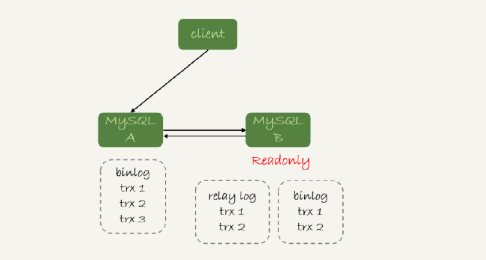

​								图4 备库还没收到trx3

这时，主库上执行完成了三个事务trx1、trx2和trx3，其中：

1. trx1和trx2已经传到从库，并且已经执行完成了；
2. trx3在主库执行完成，并且已经回复给客户端，但是还没有传到从库中。

如果这时候你在从库B上执行查询请求，按照我们上面的逻辑，从库认为已经没有同步延迟，但还是查不到trx3的。严格地说，就是出现了过期读。

那么，这个问题有没有办法解决呢？

### 配合semi-sync半同步复制

要解决这个问题，就要引入**半同步复制**，也就是semi-sync replication。

semi-sync做了这样的设计：

1. 事务提交的时候，主库把binlog发给从库；
2. **从库收到binlog以后，发回给主库一个ack**，表示收到了；
3. 主库收到这个ack以后，才能给客户端返回“事务完成”的确认。

也就是说，如果启用了semi-sync，就表示所有给客户端发送过确认的事务，都确保了备库已经收到了这个日志。

在[第25篇文章](https://time.geekbang.org/column/article/76795)的评论区，有同学问到：如果主库掉电的时候，有些binlog还来不及发给从库，会不会导致系统数据丢失？

答案是，如果使用的是普通的异步复制模式，就可能会丢失，但semi-sync就可以解决这个问题。

这样，semi-sync配合前面关于位点的判断，就能够确定在从库上执行的查询请求，可以避免过期读。

但是，semi-sync+位点判断的方案，**只对一主一备的场景是成立的**。在一主多从场景中，主库只要等到一个从库的ack，就开始给客户端返回确认。这时，在从库上执行查询请求，就有两种情况：

1. 如果查询是落在这个响应了ack的从库上，是能够确保读到最新数据；
2. 但**如果是查询落到其他从库**上，它们可能还没有收到最新的日志，就会**产生过期读**的问题。

其实，判断同步位点的方案还有另外一个潜在的问题，即：如果在业务更新的**高峰期**，主库的位点或者**GTID集合更新很快**，那么上面的两个位点**等值判断就会一直不成立**，很可能出现从库上迟迟无法响应查询请求的情况。

实际上，回到我们最初的业务逻辑里，当发起一个查询请求以后，我们要得到准确的结果，其实并不需要等到“主备完全同步”。

为什么这么说呢？我们来看一下这个时序图。

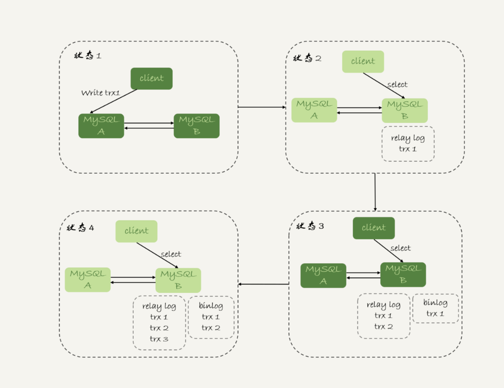

​								图5 主备持续延迟一个事务

图5所示，就是等待位点方案的一个bad case。图中备库B下的虚线框，分别表示relaylog和binlog中的事务。可以看到，图5中从状态1 到状态4，一直处于延迟一个事务的状态。

备库B一直到状态4都和主库A存在延迟，如果用上面必须等到无延迟才能查询的方案，select语句直到状态4都不能被执行。

但是，其实客户端是在发完trx1更新后发起的select语句，我们**只需要确保trx1已经执行完成就可以执行select语句**了。也就是说，如果在状态3执行查询请求，得到的就是预期结果了。

到这里，我们小结一下，semi-sync配合判断主备无延迟的方案，**存在两个问题**：

1. **一主多从**的时候，在某些从库执行查询请求会存在**过期读**的现象；
2. 在**持续延迟**的情况下，可能出现**过度等待**的问题。

接下来，我要和你介绍的等主库位点方案，就可以解决这两个问题。

### 等主库位点方案

要理解等主库位点方案，我需要先和你介绍一条命令：

```
select master_pos_wait(file, pos[, timeout]);
```

这条命令的逻辑如下：

1. 它是**在从库执行**的；
2. 参数file和pos指的是主库上的文件名和位置；
3. timeout可选，设置为正整数N表示这个函数最多等待N秒。

这个命令正常返回的结果是一个**正整数M**，表示**从命令开始执行，到应用完file和pos表示的binlog位置，执行了多少事务**。

当然，除了正常返回一个正整数M外，这条命令还会返回一些**其他结果**，包括：

1. 如果执行期间，备库同步线程发生异常，则返回NULL；
2. 如果等待超过N秒，就返回-1；
3. 如果刚开始执行的时候，就发现已经执行过这个位置了，则返回0。

对于图5中先执行trx1，再执行一个查询请求的逻辑，要保证能够查到正确的数据，我们可以使用这个逻辑：

1. trx1事务更新完成后，马上执行show master status得到当前主库执行到的File和Position；
2. 选定一个从库执行查询语句；
3. 在从库上执行select master_pos_wait(File, Position, 1)；
4. 如果返回值是>=0的正整数，则在这个从库执行查询语句；
5. 否则，到主库执行查询语句。

我把上面这个流程画出来。

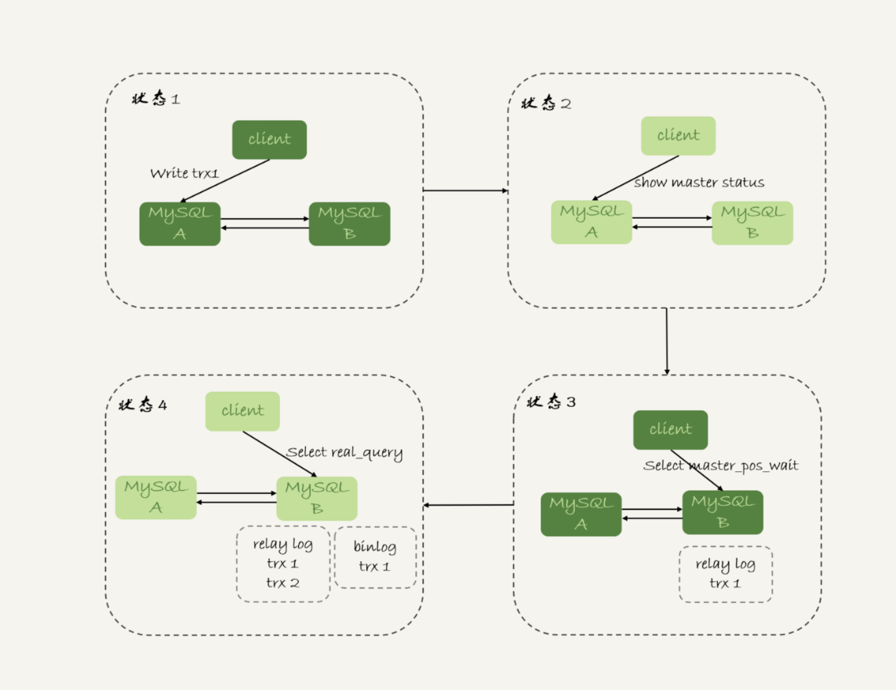

​								图6 master_pos_wait方案

这里我们假设，这条select查询最多在从库上等待1秒。那么，如果1秒内master_pos_wait返回一个大于等于0的整数，就确保了从库上执行的这个查询结果一定包含了trx1的数据。

**步骤5到主库执行查询语句，是这类方案常用的退化机制**。因为从库的延迟时间不可控，不能无限等待，所以如果等待超时，就应该放弃，然后到主库去查。

你可能会说，如果所有的从库都延迟超过1秒了，那查询压力不就都跑到主库上了吗？确实是这样。

但是，按照我们设定不允许过期读的要求，就只有两种选择，一种是超时放弃，一种是转到主库查询。具体怎么选择，就需要业务开发同学做好限流策略了。

### 等待GTID方案

如果你的数据库开启了GTID模式，对应的也有等待GTID的方案。

MySQL中同样提供了一个类似的命令：

```
 select wait_for_executed_gtid_set(gtid_set, 1);
```

这条命令的逻辑是：

1. 等待，直到这个库执行的事务中包含传入的gtid_set，**返回0**；
2. **超时返回1。**

在前面等位点的方案中，我们执行完事务后，还要主动去主库执行show master status。而MySQL 5.7.6版本开始，允许在执行完更新类事务后，把这个事务的GTID返回给客户端，这样等GTID的方案就可以减少一次查询。

这时，等GTID的执行流程就变成了：

1. trx1事务更新完成后，从返回包直接获取这个事务的GTID，记为gtid1；
2. 选定一个从库执行查询语句；
3. 在从库上执行 select wait_for_executed_gtid_set(gtid1, 1)；
4. 如果返回值是0，则在这个从库执行查询语句；
5. 否则，到主库执行查询语句。

跟等主库位点的方案一样，等待超时后是否直接到主库查询，需要业务开发同学来做限流考虑。

我把这个流程图画出来。

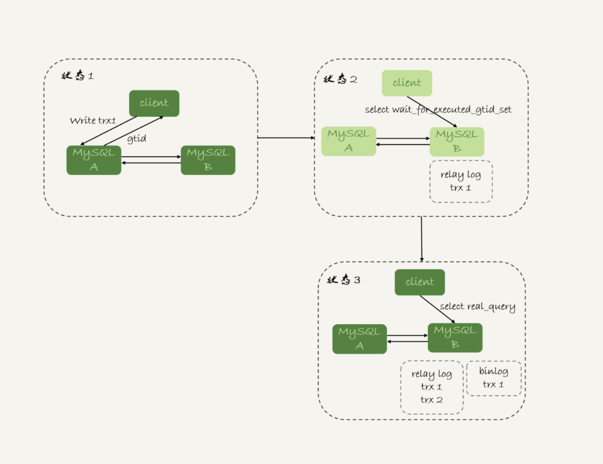

​							图7 wait_for_executed_gtid_set方案

在上面的第一步中，trx1事务更新完成后，从返回包直接获取这个事务的GTID。问题是，怎么能够让MySQL在执行事务后，返回包中带上GTID呢？

你只需要将参数**session_track_gtids**设置为**OWN_GTID**，然后通过API接口mysql_session_track_get_first从返回包解析出GTID的值即可。

在专栏的[第一篇文章](https://time.geekbang.org/column/article/68319)中，我介绍mysql_reset_connection的时候，评论区有同学留言问这类接口应该怎么使用。

这里我再回答一下。其实，MySQL并没有提供这类接口的SQL用法，是提供给程序的API(https://dev.mysql.com/doc/refman/5.7/en/c-api-functions.html)。

比如，为了让客户端在事务提交后，返回的GITD能够在客户端显示出来，我对MySQL客户端代码做了点修改，如下所示：

实战45讲笔记.assets/973bdd8741f830acebe005cbf37a7663.png)

​							图8 显示更新事务的GTID--代码

这样，就可以看到语句执行完成，显示出GITD的值。

实战45讲笔记.assets/253106d31d9d97aaa2846b2015f593fe.png)

​							图9 显示更新事务的GTID--效果

当然了，这只是一个例子。你要使用这个方案的时候，还是应该在你的客户端代码中调用mysql_session_track_get_first这个函数


> **总结：**
>
> 本节在于如何处理“过期读”问题
>
> 1. 需要实时返回数据的强制走主库
> 2. sleep(1)：假装1s就能同步完成（不精确）
> 3. 判断主备是否无延迟
>    - show slave status 查看 seconds_behind_master（只能精确到s）
>    - 对比位点：show slave status 查看 Master_Log_File的Read_Master_Log_Pos 和 Relay_Master_Log_File 的 Exec_Master_Log_Pos 是否相同
>    - 对比GTID集合：Auto_Position=1表示使用GTID，Retrieved_Gtid_Set 和 Executed_Gtid_Set 是否相同
>    - **注意：但是都只能判断的是已经发送给备库的binlog是否同步完成，还有没来得及发送的**
> 4. 上一点配合半同步复制
>    - 有一个从库发送ACK才才返回执行结果
>    - **注意：①一主多从时只有发送ack的从库才能保证没有过期读**
>            **②在持续延迟的情况下，可能出现过度等待的问题**
> 5. 等主库 位点/GTID 方案
>    - 等主库位点：在从库执行select master_pos_wait(file, pos[, timeout]);>=0 才在从库执行查询语句，否则在主库执行
>    - 等GTID方案：在从库执行select wait_for_executed_gtid_set(gtid_set, 1);=0 才在从库执行查询语句，否则在主库执行
>    - **可在代码中编写判断逻辑选择使用主库还是从库执行查询**
>
> **综上所述：按情况采取1 或 3+4 或5的方案**


## 问题

假设你的系统采用了我们文中介绍的最后一个方案，也就是等待GTID的方案，现在你要对主库的一张大表做DDL，可能会出现什么情况呢？为了避免这种情况，你会怎么做呢？

假设，这条语句在主库上要执行10分钟，提交后传到备库就要10分钟（典型的**大事务**）。那么，在主库DDL之后再提交的事务的GTID，去备库查的时候，就会等10分钟才出现。

这样，这个读写分离机制在这10分钟之内都会超时，然后走主库。

这种预期内的操作，应该在业务低峰期的时候，确保主库能够支持所有业务查询，然后**把读请求都切到主库，再在主库上做DDL。等备库延迟追上以后，再把读请求切回备库**。


# 29 判断MySQL服务是否可用

我在第[25](https://time.geekbang.org/column/article/76795)和[27](https://time.geekbang.org/column/article/77427)篇文章中，和你介绍了主备切换流程。通过这些内容的讲解，你应该已经很清楚了：在一主一备的双M架构里，主备切换只需要把客户端流量切到备库；而在一主多从架构里，主备切换除了要把客户端流量切到备库外，还需要把从库接到新主库上。

主备切换有两种场景，一种是主动切换，一种是被动切换。而其中被动切换，往往是因为主库出问题了，由HA系统发起的。

这也就引出了我们今天要讨论的问题：怎么判断一个主库出问题了？

## select 1判断

实际上，select 1成功返回，只能说明这个库的进程还在，并不能说明主库没问题。现在，我们来看一下这个场景。

```
set global innodb_thread_concurrency=3;

CREATE TABLE `t` (
  `id` int(11) NOT NULL,
  `c` int(11) DEFAULT NULL,
  PRIMARY KEY (`id`)
) ENGINE=InnoDB;

insert into t values(1,1)
```

实战45讲笔记.assets/35076dd3d0a0d44d22b76d2a29885255.png)

​								图1 查询blocked

我们设置**innodb_thread_concurrency**参数的目的是，控制InnoDB的并发线程上限。也就是说，一旦并发线程数达到这个值，InnoDB在接收到新请求的时候，就会进入等待状态，直到有线程退出。

这里，我把innodb_thread_concurrency设置成3，表示InnoDB只允许3个线程并行执行。而在我们的例子中，前三个session 中的sleep(100)，使得这三个语句都处于“执行”状态，以此来模拟大查询。

你看到了， session D里面，select 1是能执行成功的，但是查询表t的语句会被堵住。也就是说，如果这时候我们用select 1来检测实例是否正常的话，是检测不出问题的。

在InnoDB中，innodb_thread_concurrency这个参数的**默认值是0，表示不限制并发线程数量**。但是，不限制并发线程数肯定是不行的。因为，一个机器的CPU核数有限，线程全冲进来，上下文切换的成本就会太高。

所以，通常情况下，我们**建议把innodb_thread_concurrency设置为64~128之间的值**。这时，你一定会有疑问，并发线程上限数设置为128够干啥，线上的并发连接数动不动就上千了。

产生这个疑问的原因，是搞混了**并发连接和并发查询。**

并发连接和并发查询，并不是同一个概念。你在show processlist的结果里，看到的几千个连接，指的就是并发连接。而**“当前正在执行”的语句，才是我们所说的并发查询**。

并发连接数达到几千个影响并不大，就是多占一些内存而已。我们应该关注的是并发查询，因为并发查询太高才是CPU杀手。这也是为什么我们需要设置innodb_thread_concurrency参数的原因。

然后，你可能还会想起我们在[第7篇文章](https://time.geekbang.org/column/article/70215)中讲到的热点更新和死锁检测的时候，如果把innodb_thread_concurrency设置为128的话，那么出现同一行热点更新的问题时，是不是很快就把128消耗完了，这样整个系统是不是就挂了呢？

实际上，**在线程进入锁等待以后，并发线程的计数会减一**，也就是说等行锁（也包括间隙锁）的线程是不算在128里面的。

MySQL这样设计是非常有意义的。因为，进入锁等待的线程已经不吃CPU了；更重要的是，必须这么设计，才能避免整个系统锁死。

为什么呢？假设处于锁等待的线程也占并发线程的计数，你可以设想一下这个场景：

1. 线程1执行begin; update t set c=c+1 where id=1, 启动了事务trx1， 然后保持这个状态。这时候，线程处于空闲状态，不算在并发线程里面。
2. 线程2到线程129都执行 update t set c=c+1 where id=1; 由于等行锁，进入等待状态。这样就有128个线程处于等待状态；
3. 如果处于锁等待状态的线程计数不减一，InnoDB就会认为线程数用满了，会阻止其他语句进入引擎执行，这样线程1不能提交事务。而另外的128个线程又处于锁等待状态，整个系统就堵住了。

下图2显示的就是这个状态。

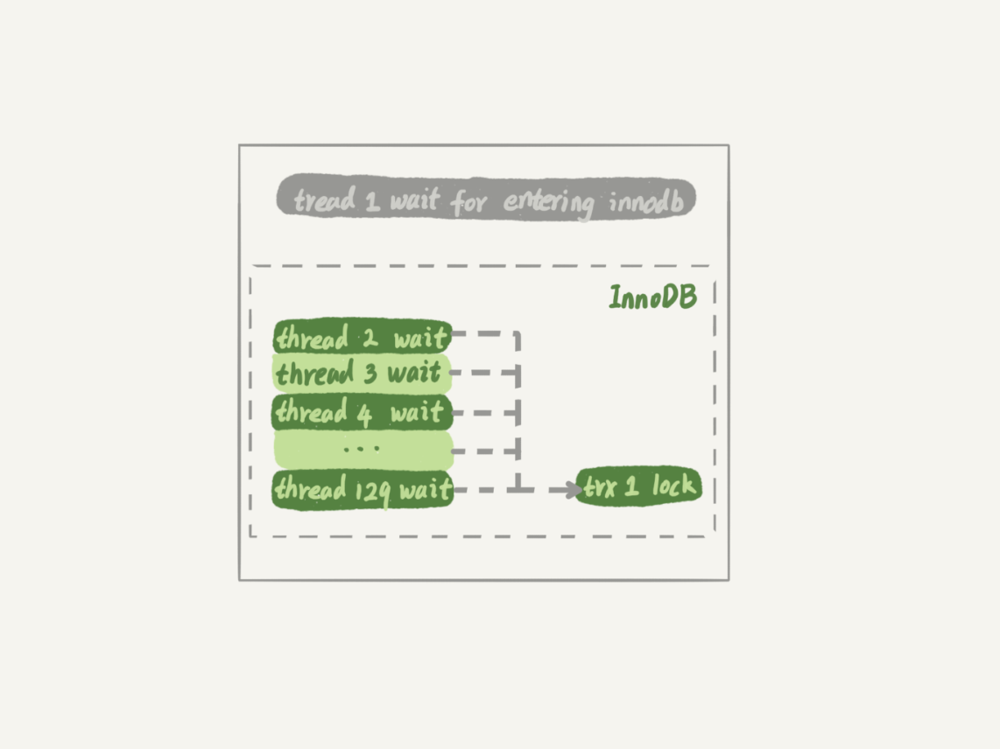

​						图2 系统锁死状态（假设等行锁的语句占用并发计数）

这时候InnoDB不能响应任何请求，整个系统被锁死。而且，由于所有线程都处于等待状态，此时占用的CPU却是0，而这明显不合理。所以，我们说InnoDB在设计时，遇到进程进入锁等待的情况时，将并发线程的计数减1的设计，是合理而且是必要的。

虽然说等锁的线程不算在并发线程计数里，但如果它在真正地执行查询，就比如我们上面例子中前三个事务中的select sleep(100) from t，还是要算进并发线程的计数的。在这个例子中，同时在执行的语句超过了设置的innodb_thread_concurrency的值，这时候系统其实已经不行了，但是通过select 1来检测系统，会认为系统还是正常的。

因此，我们使用select 1的判断逻辑要修改一下。

## 查表判断

为了能够检测InnoDB并发线程数过多导致的系统不可用情况，我们需要找一个访问InnoDB的场景。一般的做法是，在系统库（**mysql库）里创建一个表，比如命名为health_check**，里面只放一行数据，然后定期执行：

```
mysql> select * from mysql.health_check; 
```

使用这个方法，我们可以检测出由于并发线程过多导致的数据库不可用的情况。

但是，我们马上还会碰到下一个问题，即：**空间满了以后，这种方法又会变得不好使**。（查询不写日志）

我们知道，更新事务要写binlog，而一旦binlog所在磁盘的空间占用率达到100%，那么所有的更新语句和事务提交的commit语句就都会被堵住。但是，系统这时候还是可以正常读数据的。

因此，我们还是把这条监控语句再改进一下。接下来，我们就看看把查询语句改成更新语句后的效果。

## 更新判断

既然要更新，就要放个有意义的字段，常见做法是放一个timestamp字段，用来表示最后一次执行检测的时间。这条更新语句类似于：

```
mysql> update mysql.health_check set t_modified=now();
```

节点可用性的检测都应该包含主库和备库。如果用更新来检测主库的话，那么备库也要进行更新检测。

但，备库的检测也是要写binlog的。由于我们一般会把数据库A和B的主备关系设计为双M结构，所以在备库B上执行的检测命令，也要发回给主库A。

但是，如果主库A和备库B都用相同的更新命令，就可能出现行冲突，也就是可能会导致主备同步停止。所以，现在看来mysql.health_check 这个表就**不能只有一行数据**了。

为了让主备之间的更新不产生冲突，我们可以在mysql.health_check表上存入多行数据，并用A、B的**server_id做主键**。

```
mysql> CREATE TABLE `health_check` (
  `id` int(11) NOT NULL,
  `t_modified` timestamp NOT NULL DEFAULT CURRENT_TIMESTAMP,
  PRIMARY KEY (`id`)
) ENGINE=InnoDB;

/* 检测命令 */
insert into mysql.health_check(id, t_modified) values (@@server_id, now()) on duplicate key update t_modified=now();
```

由于MySQL规定了**主库和备库的server_id必须不同**（否则创建主备关系的时候就会报错），这样就可以保证主、备库各自的检测命令不会发生冲突。

更新判断是一个相对比较常用的方案了，不过依然存在一些问题。其中，**“判定慢”**一直是让DBA头疼的问题。

你一定会疑惑，**更新语句，如果失败或者超时，就可以发起主备切换了，为什么还会有判定慢的问题呢？**

其实，这里涉及到的是服务器IO资源分配的问题。

首先，所有的检测逻辑都需要一个超时时间N。**执行一条update语句，超过N秒后还不返回，就认为系统不可用**。

你可以设想一个日志盘的IO利用率已经是100%的场景。这时候，整个系统响应非常慢，已经需要做主备切换了。

但是你要知道，IO利用率100%表示系统的IO是在工作的，每个请求都有机会获得IO资源，执行自己的任务。而我们的**检测使用的update命令，需要的资源很少**，所以**可能**在拿到IO资源的时候就可以提交成功，并且**在超时时间N秒未到达之前就返回给了检测系统**。

检测系统一看，update命令没有超时，于是就得到了“系统正常”的结论。

也就是说，这时候在业务系统上正常的SQL语句已经执行得很慢了，但是DBA上去一看，HA系统还在正常工作，并且认为主库现在处于可用状态。

之所以会出现这个现象，根本原因是我们上面说的所有方法，都是基于外部检测的。外部检测天然有一个问题，就是随机性。

因为，外部检测都需要定时轮询，所以系统可能已经出问题了，但是却需要等到下一个检测发起执行语句的时候，我们才有可能发现问题。而且，如果你的运气不够好的话，可能第一次轮询还不能发现，这就会导致切换慢的问题。

所以，接下来我要再和你介绍一种在MySQL内部发现数据库问题的方法。

## 内部统计IO

针对磁盘利用率这个问题，如果MySQL可以告诉我们，内部每一次IO请求的时间，那我们判断数据库是否出问题的方法就可靠得多了。

其实，MySQL 5.6版本以后提供的**performance_schema**库，就在**file_summary_by_event_name**表里统计了每次IO请求的时间。

file_summary_by_event_name表里有很多行数据，我们先来看看**event_name='wait/io/file/innodb/innodb_log_file'**这一行。

```mysql
select * from performance_schema.file_summary_by_event_name where event_name='wait/io/file/innodb/innodb_log_file'\G;
```

实战45讲笔记.assets/752ccfe43b4eab155be17401838c62dd.png)

​			图3 performance_schema.file_summary_by_event_name的一行

> 图中这一行表示统计的是redo log的写入时间，第一列EVENT_NAME 表示统计的类型。
>
> 接下来的三组数据，显示的是redo log操作的时间统计。
>
> **第一组五列**，是所有**IO类型**的统计。其中，COUNT_STAR是所有IO的总次数，接下来四列是具体的统计项， **单位是皮秒**；前缀SUM、MIN、AVG、MAX，顾名思义指的就是总和、最小值、平均值和最大值。
>
> **第二组六列**，是**读操作**的统计。最后一列SUM_NUMBER_OF_BYTES_READ统计的是，总共从redo log里读了多少个字节。
>
> **第三组六列**，统计的是**写操作**。
>
> **第四组五列**，是对**其他类型数据**的统计。在**redo log里**，你可以认为它们就是**对fsync**的统计。

在performance_schema库的file_summary_by_event_name表里，binlog对应的是event_name = "wait/io/file/sql/binlog"这一行。各个字段的统计逻辑，与redo log的各个字段完全相同。这里，我就不再赘述了。

因为我们每一次操作数据库，performance_schema都需要额外地统计这些信息，所以我们打开这个统计功能是有性能损耗的。

我的测试结果是，**如果打开所有的performance_schema项，性能大概会下降10%左右**。所以，我建议你只打开自己需要的项进行统计。你可以通过下面的方法打开或者关闭某个具体项的统计。

如果要打开redo log的时间监控，你可以执行这个语句：

```
mysql> update setup_instruments set ENABLED='YES', Timed='YES' where name like '%wait/io/file/innodb/innodb_log_file%';
```

假设，现在你已经开启了redo log和binlog这两个统计信息，那要怎么把这个信息用在实例状态诊断上呢？

很简单，你可以通过MAX_TIMER的值来判断数据库是否出问题了。比如，你可以**设定阈值**，单次IO请求时间超过200毫秒属于异常，然后使用类似下面这条语句作为检测逻辑。

```
mysql> select event_name,MAX_TIMER_WAIT  FROM performance_schema.file_summary_by_event_name where event_name in ('wait/io/file/innodb/innodb_log_file','wait/io/file/sql/binlog') and MAX_TIMER_WAIT>200*1000000000;
```

**发现异常后**，取到你需要的信息，再通过下面这条语句：

```
mysql> truncate table performance_schema.file_summary_by_event_name;
```

**把之前的统计信息清空**。这样如果后面的监控中，再次出现这个异常，就可以加入监控累积值了。


## 总结

> **总结：**
>
> 1. select 1 判断：同时在执行的语句超过了设置的innodb_thread_concurrency的值，但是seect 1仍然能成功执行，所以不行
> 2. 查表判断：不能检测磁盘，如果磁盘满了，因为查询不会写日志，所以无法发现磁盘的问题
> 3. 更新判断：
>    - 主备更新同一行，可能出现行差错
>    - 主备以各自的server_id为id，更新对应的行
>      - 但是如果IO利用率很高时，这个检测update需要的资源很少仍然可能拿到IO资源在规定时间内返回
> 4. 内部统计IO：设定阈值查看有无单次IO请求时间超过设定毫秒的异常
>
> **综上所述：推荐采用更新判断 + 内部统计IO的方法判断MySQL服务是否可用**
>
> 使用非常广泛的MHA（Master High Availability）默认使用的是select 1


# 30 讲答疑文章（二）：邻间锁的相关问题

在第[20](https://time.geekbang.org/column/article/75173)和[21](https://time.geekbang.org/column/article/75659)篇文章中，我和你介绍了InnoDB的间隙锁、next-key lock，以及加锁规则。所以，我就从中挑选了几个有代表性的问题，构成了今天这篇答疑文章的主题，即：**用动态的观点看加锁**。

**为了方便你理解，我们再一起复习一下加锁规则。这个规则中，包含了两个“原则”、两个“优化”和一个“bug”：**

- 原则1：加锁的基本单位是next-key lock。希望你还记得，next-key lock是前开后闭区间。
- 原则2：查找过程中访问到的对象才会加锁。
- 优化1：索引上的等值查询，给唯一索引加锁的时候，next-key lock退化为行锁。
- 优化2：索引上的等值查询，向右遍历时且最后一个值不满足等值条件的时候，next-key lock退化为间隙锁。
- 一个bug：唯一索引上的范围查询会访问到不满足条件的第一个值为止。

接下来，我们的讨论还是基于下面这个表t：

```mysql
CREATE TABLE `t` (
  `id` int(11) NOT NULL,
  `c` int(11) DEFAULT NULL,
  `d` int(11) DEFAULT NULL,
  PRIMARY KEY (`id`),
  KEY `c` (`c`)
) ENGINE=InnoDB;

insert into t values(0,0,0),(5,5,5),
(10,10,10),(15,15,15),(20,20,20),(25,25,25);
```

## 非等号也有等值查询

有同学对“等值查询”提出了疑问：等值查询和“遍历”有什么区别？为什么我们文章的例子里面，where条件是不等号，这个过程里也有等值查询？

我们一起来看下这个例子，分析一下这条查询语句的加锁范围：

```
begin;
select * from t where id>9 and id<12 order by id desc for update;
```

利用上面的加锁规则，我们知道这个语句的加锁范围是主键索引上的 (0,5]、(5,10]和**(10, 15)**。也就是说，id=15这一行，并没有被加上行锁。为什么呢？

我们说加锁单位是next-key lock，都是前开后闭区间，但是这里用到了**优化2**，即索引上的等值查询，向右遍历的时候id=15不满足条件，所以next-key lock退化为了间隙锁 (10, 15)。

### 这些“等值查询哪里来的”

但是，我们的查询语句中where条件是大于号和小于号，这里的“等值查询”又是从哪里来的呢？

要知道，加锁动作是发生在语句执行过程中的，所以你在分析加锁行为的时候，要从索引上的数据结构开始。这里，我再把这个过程拆解一下。

如图1所示，是这个表的索引id的示意图。

实战45讲笔记.assets/image-20231011162943054.png)									图1 索引id示意图

1. 首先这个查询语句的语义是order by id desc，要拿到满足条件的所有行，优化器必须先找到“第一个id<12的值”。
2. 这个过程是通过索引树的搜索过程得到的，在引擎内部，其实是要找到id=12的这个值，只是最终没找到，但找到了(10,15)这个间隙。
3. 然后向左遍历，在遍历过程中，就不是等值查询了，会扫描到id=5这一行，所以会加一个next-key lock (0,5]。

也就是说，在执行过程中，**通过树搜索的方式定位记录的时候，用的是“等值查询”的方法**。

### 等值查询的过程

与上面这个例子对应的，是 @发条橙子 同学提出的问题：下面这个语句的加锁范围是什么？

```
begin;
select id from t where c in(5,20,10) lock in share mode;
```

这条查询语句里用的是in，我们先来看这条语句的explain结果。
实战45讲笔记.assets/8a089159c82c1458b26e2756583347b3.png)

​							图2 in语句的explain结果

可以看到，这条in语句使用了索引c并且rows=3，说明这三个值都是通过B+树搜索定位的。

在查找c=5的时候，先锁住了(0,5]。但是因为c不是唯一索引，为了确认还有没有别的记录c=5，就要向右遍历，找到c=10才确认没有了，这个过程满足优化2，所以加了间隙锁**(5,10)**。

同样的，执行c=10这个逻辑的时候，加锁的范围是**(5,10] 和 (10,15)**；执行c=20这个逻辑的时候，加锁的范围是**(15,20] 和 (20,25)。**

通过这个分析，我们可以知道，这条语句在索引c上加的三个记录锁的顺序是：先加c=5的记录锁，再加c=10的记录锁，最后加c=20的记录锁。

你可能会说，这个加锁范围，不就是从(5,25)中去掉c=15的行锁吗？为什么这么麻烦地分段说呢？

因为我要跟你强调这个过程：这些锁是**“在执行过程中一个一个加的”，而不是一次性加上去的。**


### 死锁的例子

理解了这个加锁过程之后，我们就可以来分析下面例子中的死锁问题了。

如果同时有另外一个语句，是这么写的：

```
select id from t where c in(5,20,10) order by c desc for update;
```

此时的加锁范围，又是什么呢？

我们现在都知道间隙锁是不互锁的，但是这两条语句都会在索引c上的c=5、10、20这三行记录上加记录锁。

这里你需要注意一下，由于语句里面是order by c desc， 这三个记录锁的加锁顺序，是先锁c=20，然后c=10，最后是c=5。

也就是说，**这两条语句要加锁相同的资源，但是加锁顺序相反**。当这两条语句并发执行的时候，就可能出现死锁。

关于死锁的信息，MySQL只保留了最后一个死锁的现场，但这个现场还是不完备的。

有同学在评论区留言到，希望我能展开一下怎么看死锁。现在，我就来简单分析一下上面这个例子的死锁现场。


### 怎么看死锁？

图3是在出现死锁后，执行**show engine innodb status**命令得到的部分输出。这个命令会输出很多信息，有一节LATESTDETECTED DEADLOCK，就是记录的最后一次死锁信息。
实战45讲笔记.assets/a7dccb91bc17d12746703eb194775cf6.png)

​									图3 死锁现场

> 我们来看看这图中的几个关键信息。
>
> 1. 这个结果分成三部分：
>    - (1) TRANSACTION，是第一个事务的信息；
>    - (2) TRANSACTION，是第二个事务的信息；
>    - WE ROLL BACK TRANSACTION (1)，是最终的处理结果，表示回滚了第一个事务。
> 2. 第一个事务的信息中：
>    - WAITING FOR THIS LOCK TO BE GRANTED，表示的是这个事务在等待的锁信息；
>    - index c of table `test`.`t`，说明在等的是表t的索引c上面的锁；
>    - lock mode S waiting 表示这个语句要自己加一个读锁，当前的状态是等待中；
>    - Record lock说明这是一个记录锁；
>    - n_fields 2表示这个记录是两列，也就是字段c和主键字段id；
>    - 0: len 4; hex 0000000a; asc ;;是第一个字段，也就是c。值是十六进制a，也就是10；
>    - 1: len 4; hex 0000000a; asc ;;是第二个字段，也就是主键id，值也是10；
>    - 这两行里面的asc表示的是，接下来要打印出值里面的“可打印字符”，但10不是可打印字符，因此就显示空格。
>    - 第一个事务信息就只显示出了等锁的状态，在等待(c=10,id=10)这一行的锁。
>    - 当然你是知道的，既然出现死锁了，就表示这个事务也占有别的锁，但是没有显示出来。别着急，我们从第二个事务的信息中推导出来。
> 3. 第二个事务显示的信息要多一些：
>    - “ HOLDS THE LOCK(S)”用来显示这个事务持有哪些锁；
>    - index c of table `test`.`t` 表示锁是在表t的索引c上；
>    - hex 0000000a和hex 00000014表示这个事务持有c=10和c=20这两个记录锁；
>    - WAITING FOR THIS LOCK TO BE GRANTED，表示在等(c=5,id=5)这个记录锁。
>
> 从上面这些信息中，我们就知道：
>
> 1. “lock in share mode”的这条语句，持**有c=5的记录锁，在等c=10的锁**；
> 2. “for update”这个语句，持有c=20和c=10的记录锁，在等c=5的记录锁。
>
> 因此导致了死锁。这里，我们可以得到两个结论：
>
> 1. 由于锁是一个个加的，**要避免死锁，对同一组资源，要按照尽量相同的顺序访问**；
> 2. 在发生死锁的时刻，for update 这条语句占有的资源更多，回滚成本更大，所以**InnoDB选择了回滚成本更小**的lock in share mode语句，**来回滚**。

### 怎么看锁等待？

#### delete和insert的例子

看完死锁，我们再来看一个锁等待的例子。

在第21篇文章的评论区，@Geek_9ca34e 同学做了一个有趣验证，我把复现步骤列出来：

实战45讲笔记.assets/af3602b81aeb49e33577ba372d220a75.png)

​								图4 delete导致间隙变化

可以看到，由于session A并没有锁住c=10这个记录，所以session B删除id=10这一行是可以的。但是之后，session B再想insert id=10这一行回去就不行了。

现在我们一起看一下此时show engine innodb status的结果，看看能不能给我们一些提示。锁信息是在这个命令输出结果的TRANSACTIONS这一节。你可以在文稿中看到这张图片
实战45讲笔记.assets/c3744fb7b61df2a5b45b8eb1f2a853a6.png)

​									图 5 锁等待信息

我们来看几个关键信息。

1. index PRIMARY of table `test`.`t` ，表示这个语句被锁住是因为表t主键上的某个锁。
2. lock_mode X locks gap before rec insert intention waiting 这里有几个信息：
   - insert intention表示当前线程准备插入一个记录，这是一个插入意向锁。为了便于理解，你可以认为它就是这个插入动作本身。
   - gap before rec 表示这是一个间隙锁，而不是记录锁。
3. 那么这个gap是在哪个记录之前的呢？接下来的0~4这5行的内容就是这个记录的信息。
4. n_fields 5也表示了，这一个记录有5列：
   - 0: len 4; hex 0000000f; asc ;;第一列是主键id字段，十六进制f就是id=15。所以，这时我们就知道了，这个间隙就是id=15之前的，因为id=10已经不存在了，它表示的就是(5,15)。
   - 1: len 6; hex 000000000513; asc ;;第二列是长度为6字节的事务id，表示最后修改这一行的是trx id为1299的事务。
   - 2: len 7; hex b0000001250134; asc % 4;; 第三列长度为7字节的回滚段信息。可以看到，这里的acs后面有显示内容(%和4)，这是因为刚好这个字节是可打印字符。
   - 后面两列是c和d的值，都是15。

因此，我们就知道了，**由于delete操作把id=10这一行删掉了，原来的两个间隙(5,10)、(10,15）变成了一个(5,15)。**

说到这里，你可以联合起来再思考一下这两个现象之间的关联：

1. session A执行完select语句后，什么都没做，但它**加锁的范围突然“变大”了；**
2. 第21篇文章的课后思考题，当我们执行select * from t where c>=15 and c<=20 order by c desc lock in share mode; 向左扫描到c=10的时候，要把(5, 10]锁起来。

也就是说，所谓“间隙”，其实根本就是由“这个间隙右边的那个记录”定义的。

#### update的例子

看过了insert和delete的加锁例子，我们再来看一个update语句的案例。在留言区中@信信 同学做了这个试验：

实战45讲笔记.assets/61c1ceea7b59201649c2514c9db864a7.png)

​									图 6 update 的例子

你可以自己分析一下，session A的加锁范围是索引c上的 (5,10]、(10,15]、(15,20]、(20,25]和(25,suprenum]。

之后session B的第一个update语句，要把c=5改成c=1，你可以理解为两步：

1. 插入(c=1, id=5)这个记录；
2. 删除(c=5, id=5)这个记录。

按照我们上一节说的，索引c上(5,10)间隙是由这个间隙右边的记录，也就是c=10定义的。所以通过这个操作，session A的加锁范围变成了图7所示的样子：

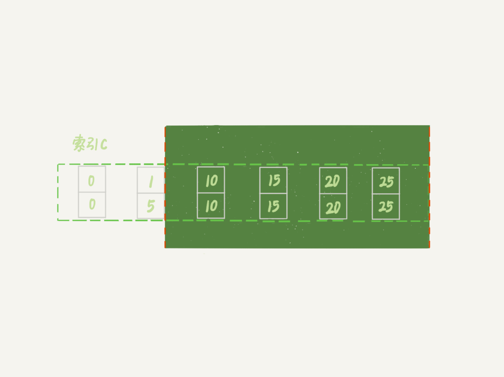

​						图 7 session B修改后， session A的加锁范围

好，接下来session B要执行 update t set c = 5 where c = 1这个语句了，一样地可以拆成两步：

1. 插入(c=5, id=5)这个记录；
2. 删除(c=1, id=5)这个记录。

第一步**试图在已经加了间隙锁的(1,10)中插入数据，所以就被堵住了**。


## 问题

上面我们提到一个很重要的点：所谓“间隙”，其实根本就是由“这个间隙右边的那个记录”定义的。

那么，一个空表有间隙吗？这个间隙是由谁定义的？你怎么验证这个结论呢？

一个空表就只有一个间隙。比如，在空表上执行：

```
begin;
select * from t where id>1 for update;
```

这个查询语句加锁的范围就是next-key lock **(-∞, supremum]。**


# 31 讲误删数据怎么办

在前面几篇文章中，我们介绍了MySQL的高可用架构。当然，传统的高可用架构是不能预防误删数据的，因为主库的一个drop table命令，会通过binlog传给所有从库和级联从库，进而导致整个集群的实例都会执行这个命令。

虽然我们之前遇到的大多数的数据被删，都是运维同学或者DBA背锅的。但实际上，只要有数据操作权限的同学，都有可能踩到误删数据这条线。

今天我们就来聊聊误删数据前后，我们可以做些什么，减少误删数据的风险，和由误删数据带来的损失。

为了找到解决误删数据的更高效的方法，我们需要先对和MySQL相关的误删数据，做下分类：

1. 使用delete语句误删数据行；
2. 使用drop table或者truncate table语句误删数据表；
3. 使用drop database语句误删数据库；
4. 使用rm命令误删整个MySQL实例。

## 误删行

在[第24篇文章](https://time.geekbang.org/column/article/76446)中，我们提到如果是使用delete语句误删了数据行，可以用Flashback工具通过闪回把数据恢复回来。

Flashback恢复数据的原理，是修改binlog的内容，拿回原库重放。而能够使用这个方案的前提是，需要**确保binlog_format=row 和 binlog_row_image=FULL。**

具体恢复数据时，对单个事务做如下处理：

1. 对于insert语句，对应的binlog event类型是Write_rows event，把它改成Delete_rows event即可；
2. 同理，对于delete语句，也是将Delete_rows event改为Write_rows event；
3. 而如果是Update_rows的话，binlog里面记录了数据行修改前和修改后的值，对调这两行的位置即可。

如果误操作不是一个，而是多个，会怎么样呢？比如下面三个事务：

```
(A)delete ...
(B)insert ...
(C)update ...
```

现在要把数据库恢复回这三个事务操作之前的状态，用Flashback工具解析binlog后，写回主库的命令是：

```
(reverse C)update ...
(reverse B)delete ...
(reverse A)insert ...
```

也就是说，如果误删数据涉及到了多个事务的话，需要将事务的顺序调过来再执行。

**需要说明的是，我不建议你直接在主库上执行这些操作。**

恢复数据比较安全的做法，是恢复出一个备份，**或者找一个从库作为临时库，在这个临时库上执行这些操作**，然后再将确认过的临时库的数据，恢复回主库。

为什么要这么做呢？

这是因为，一个在执行线上逻辑的主库，数据状态的变更往往是有关联的。可能由于发现数据问题的时间晚了一点儿，就导致已经在之前误操作的基础上，业务代码逻辑又继续修改了其他数据。所以，如果这时候单独恢复这几行数据，而又未经确认的话，就**可能会出现对数据的二次破坏。**


## 误删库/表

这种情况下，要想恢复数据，就需要使用**全量备份，加增量日志**的方式了。这个方案要求线上有定期的全量备份，并且实时备份binlog。

在这两个条件都具备的情况下，假如有人中午12点误删了一个库，恢复数据的流程如下：

1. 取最近一次全量备份，假设这个库是一天一备，上次备份是当天0点；
2. 用备份恢复出一个临时库；
3. 从日志备份里面，取出凌晨0点之后的日志；
4. 把这些日志，除了误删除数据的语句外，全部应用到临时库。

这个流程的示意图如下所示：

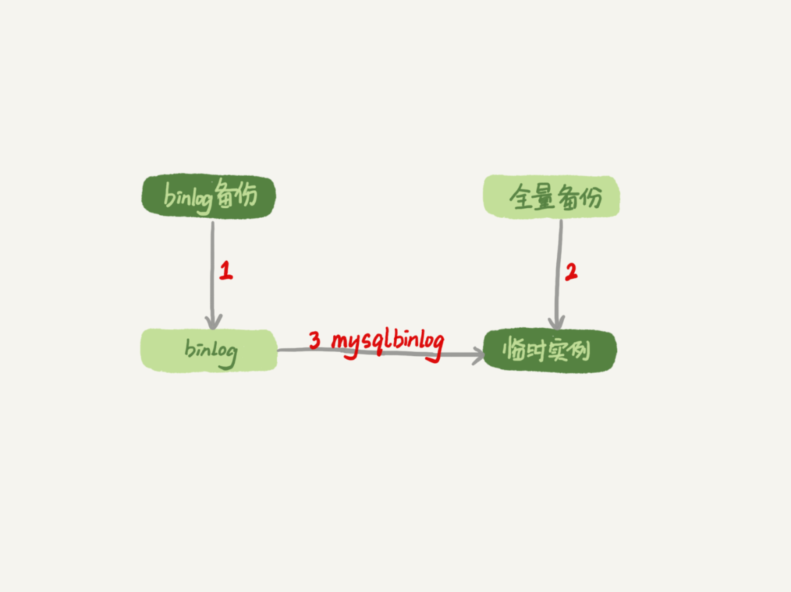

​							图1 数据恢复流程-mysqlbinlog方法

关于这个过程，我需要和你说明如下几点：

1. 为了加速数据恢复，如果这个临时库上有多个数据库，你可以在使用mysqlbinlog命令时，加上一个–database参数，用来指定误删表所在的库。这样，就避免了在恢复数据时还要应用其他库日志的情况。
2. 在应用日志的时候，需要跳过12点误操作的那个语句的binlog：
   - 如果原实例没有使用GTID模式，只能在应用到包含12点的binlog文件的时候，先用–stop-position参数执行到误操作之前的日志，然后再用–start-position从误操作之后的日志继续执行；
   - 如果实例使用了GTID模式，就方便多了。假设误操作命令的GTID是gtid1，那么只需要执行set gtid_next=gtid1;begin;commit; 先把这个GTID加到临时实例的GTID集合，之后按顺序执行binlog的时候，就会自动跳过误操作的语句。

不过，即使这样，使用mysqlbinlog方法恢复数据还是不够快，主要原因有两个：

1. 如果是误删表，最好就是只恢复出这张表，也就是只重放这张表的操作，但是mysqlbinlog工具并不能指定只解析一个表的日志；
2. 用mysqlbinlog解析出日志应用，应用日志的过程就只能是单线程。我们在[第26篇文章](https://time.geekbang.org/column/article/77083)中介绍的那些并行复制的方法，在这里都用不上。

### 加速恢复的方法

**一种加速的方法是，**在用备份恢复出临时实例之后，将这个临时实例**设置成线上备库的从库**，这样：

1. 在start slave之前，先通过执行
   change replication filter replicate_do_table = (tbl_name) 命令，就可以**让临时库只同步误操作的表**；
2. 这样做也可以**用上并行复制技术**，来加速整个数据恢复过程。

这个过程的示意图如下所示。

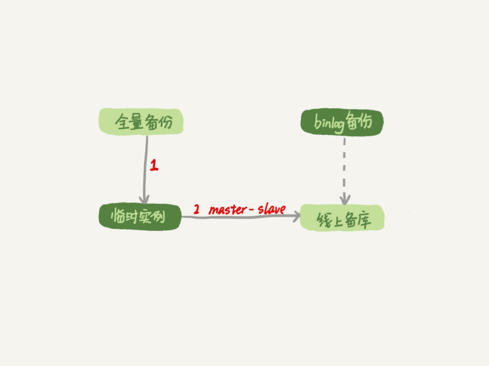

​							图2 数据恢复流程-master-slave方法

可以看到，图中binlog备份系统到线上备库有一条虚线，是指如果由于时间太久，备库上已经删除了临时实例需要的binlog的话，我们可以从binlog备份系统中找到需要的binlog，再放回备库中。

假设，我们发现当前临时实例需要的binlog是从master.000005开始的，但是在备库上执行show binlogs 显示的最小的binlog文件是master.000007，意味着少了两个binlog文件。这时，我们就需要去binlog备份系统中找到这两个文件。

**把之前删掉的binlog放回备库的操作步骤**，是这样的：

1. 从备份系统下载master.000005和master.000006这两个文件，放到备库的日志目录下；
2. 打开日志目录下的master.index文件，在文件开头加入两行，内容分别是 “./master.000005”和“./master.000006”;
3. 重启备库，目的是要让备库重新识别这两个日志文件；
4. 现在这个备库上就有了临时库需要的所有binlog了，建立主备关系，就可以正常同步了。

不论是把mysqlbinlog工具解析出的binlog文件应用到临时库，还是把临时库接到备库上，这两个方案的共同点是：**误删库或者表后，恢复数据的思路主要就是通过备份，再加上应用binlog的方式。**

也就是说，这两个方案都要求备份系统定期备份全量日志，而且需要确保binlog在被从本地删除之前已经做了备份。

但是，一个系统不可能备份无限的日志，你还需要根据成本和磁盘空间资源，设定一个日志保留的天数。如果你的DBA团队告诉你，可以保证把某个实例恢复到半个月内的任意时间点，这就表示备份系统保留的日志时间就至少是半个月。


另外，我建议你不论使用上述哪种方式，**都要把这个数据恢复功能做成自动化工具，并且经常拿出来演练。**为什么这么说呢？

这里的原因，主要包括两个方面：

1. 虽然“发生这种事，大家都不想的”，但是万一出现了误删事件，能够快速恢复数据，将损失降到最小，也应该不用跑路了。
2. 而如果临时再手忙脚乱地手动操作，最后又误操作了，对业务造成了二次伤害，那就说不过去了。


## rm删除数据

其实，对于一个有高可用机制的MySQL集群来说，最不怕的就是rm删除数据了。只要不是恶意地把整个集群删除，而只是删掉了其中某一个节点的数据的话，HA系统就会开始工作，选出一个新的主库，从而保证整个集群的正常工作。

这时，你要做的就是在这个节点上把数据恢复回来，再接入整个集群。

当然了，现在不止是DBA有自动化系统，SA（系统管理员）也有自动化系统，所以也许一个批量下线机器的操作，会让你整个MySQL集群的所有节点都全军覆没。

应对这种情况，我的建议只能是说尽量把你的备份跨机房，或者最好是跨城市保存。


## 提前预防误删

### 方法统计

当然，**我们不止要说误删数据的事后处理办法，更重要是要做到事前预防**。我有以下两个建议：

1. 把**sql_safe_updates**参数设置为**on**。这样一来，如果我们忘记在delete或者update语句中写where条件，或者where条件里面没有包含索引字段的话，这条语句的执行就会报错。
2. 代码上线前，必须经过**SQL审计**。
3. 账号分离，设置**用户权限**
4. 制定操作**规范**
5. 延迟复制备库

你可能会说，设置了sql_safe_updates=on，如果我真的要把一个小表的数据全部删掉，应该怎么办呢？

如果你确定这个删除操作没问题的话，可以在delete语句中加上where条件，比如where id>=0。

但是，delete全表是很慢的，需要生成回滚日志、写redo、写binlog。所以，从性能角度考虑，你应该优先考虑使用truncate table或者drop table命令。

使用delete命令删除的数据，你还可以用Flashback来恢复。而使**用truncate /drop table和drop database命令删除的数据，就没办法通过Flashback来恢复了**。为什么呢？

这是因为，即使我们配置了binlog_format=row，执行这三个命令时，记录的binlog还是statement格式。binlog里面就只有一个truncate/drop 语句，这些信息是恢复不出数据的。


### 延迟复制备库

虽然我们可以通过利用并行复制来加速恢复数据的过程，但是这个方案仍然存在“恢复时间不可控”的问题。

如果一个库的备份特别大，或者误操作的时间距离上一个全量备份的时间较长，比如一周一备的实例，在备份之后的第6天发生误操作，那就需要恢复6天的日志，这个恢复时间可能是要按天来计算的。

那么，我们有什么方法可以缩短恢复数据需要的时间呢？

如果有非常核心的业务，不允许太长的恢复时间，我们可以考虑**搭建延迟复制的备库。**这个功能是MySQL 5.6版本引入的。

一般的主备复制结构存在的问题是，如果主库上有个表被误删了，这个命令很快也会被发给所有从库，进而导致所有从库的数据表也都一起被误删了。

延迟复制的备库是一种特殊的备库，通过 CHANGE MASTER TO MASTER_DELAY = N命令，可以指定这个备库持续保持跟主库有N秒的延迟。

比如你把N设置为3600，这就代表了如果主库上有数据被误删了，并且在1小时内发现了这个误操作命令，这个命令就还没有在这个延迟复制的备库执行。这时候到这个备库上执行stop slave，再通过之前介绍的方法，跳过误操作命令，就可以恢复出需要的数据。

这样的话，你就随时可以得到一个，只需要最多再追1小时，就可以恢复出数据的临时实例，也就缩短了整个数据恢复需要的时间。

### 预防误删库/表的方法

虽然常在河边走，很难不湿鞋，但终究还是可以找到一些方法来避免的。所以这里，我也会给你一些减少误删操作风险的建议。

第一条建议是，账号分离。这样做的目的是，避免写错命令。比如：

- 我们只给业务开发同学DML权限，而不给truncate/drop权限。而如果业务开发人员有DDL需求的话，也可以通过开发管理系统得到支持。
- 即使是DBA团队成员，日常也都规定只使用只读账号，必要的时候才使用有更新权限的账号。

第二条建议是，制定操作规范。这样做的目的，是避免写错要删除的表名。比如：

- 在删除数据表之前，必须先对表做改名操作。然后，观察一段时间，确保对业务无影响以后再删除这张表。
- 改表名的时候，要求给表名加固定的后缀（比如加_to_be_deleted)，然后删除表的动作必须通过管理系统执行。并且，管理系删除表的时候，只能删除固定后缀的表。


# 32 讲为什么还有kill不掉的语句

在MySQL中有两个kill命令：

1. kill query +线程id         表示终止这个线程中正在执行的语句
2. kill connection +线程id        这里connection可缺省，表示断开这个线程的连接，当然如果这个线程有语句正在执行，也是要先停止正在执行的语句的。

不知道你在使用MySQL的时候，有没有遇到过这样的现象：使用了kill命令，却没能断开这个连接。再执行show processlist命令，看到这条语句的Command列显示的是**Killed**。

你一定会奇怪，显示为Killed是什么意思，不是应该直接在show processlist的结果里看不到这个线程了吗？

其实大多数情况下，kill query/connection命令是有效的。比如，执行一个查询的过程中，发现执行时间太久，要放弃继续查询，这时我们就可以用kill query命令，终止这条查询语句。

还有一种情况是，语句处于锁等待的时候，直接使用kill命令也是有效的。我们一起来看下这个例子：

实战45讲笔记.assets/17f88dc70c3fbe06a7738a0ac01db4d0.png)

​								图1 kill query 成功的例子

可以看到，session C 执行kill query以后，session B几乎同时就提示了语句被中断。这，就是我们预期的结果。


## 收到kill以后，线程做什么？

但是，这里你要停下来想一下：session B是直接终止掉线程，什么都不管就直接退出吗？显然，这是不行的。

我在[第6篇文章](https://time.geekbang.org/column/article/69862)中讲过，当对一个表做增删改查操作时，会在表上加MDL读锁。所以，session B虽然处于blocked状态，但还是拿着一个MDL读锁的。如果线程被kill的时候，就直接终止，那之后这个MDL读锁就没机会被释放了。

这样看来，**kill并不是马上停止的意思**，而是告诉执行线程说，这条语句已经不需要继续执行了，可以开始**“执行停止的逻辑了”**。

> 其实，这跟Linux的kill命令类似，kill -N pid并不是让进程直接停止，而是给进程发一个信号，然后进程处理这个信号，进入终止逻辑。只是对于MySQL的kill命令来说，不需要传信号量参数，就只有“停止”这个命令。

**实现上，当用户执行kill query thread_id_B时，MySQL里处理kill命令的线程做了两件事：**

1. 把session B的**运行状态改成THD::KILL_QUERY**(将变量killed赋值为THD::KILL_QUERY)；
2. 给session B的执行线程**发一个信号**。

> 为什么要发信号呢？
>
> 因为像图1的我们例子里面，session B处于锁等待状态，如果只是把session B的线程状态设置THD::KILL_QUERY，**线程B并不知道这个状态变化**，还是会继续等待。发一个信号的目的，就是**通知session B退出等待**，来处理这个THD::KILL_QUERY状态。
>
> 上面的分析中，隐含了这么三层意思：
>
> 1. 一个语句执行过程中有**多处“埋点”**，在这些“埋点”的地方判断线程状态，如果**发现线程状态是THD::KILL_QUERY，才开始进入语句终止逻辑**；
> 2. 如果处于等待状态，必须是一个可以被唤醒的等待，否则根本不会执行到“埋点”处；
> 3. 语句从开始进入终止逻辑，到终止逻辑完全完成，是**有一个过程**的。
>
> 到这里你就知道了，原来不是“说停就停的”。

## kill不掉的例子

接下来，我们**再看一个kill不掉的例子**，也就是我们在前面[第29篇文章](https://time.geekbang.org/column/article/78134)中提到的 innodb_thread_concurrency 不够用的例子。

首先，执行set global innodb_thread_concurrency=2，将InnoDB的并发线程上限数设置为2；然后，执行下面的序列：

实战45讲笔记.assets/32e4341409fabfe271db3dd4c4df696e.png)

​								图2 kill query 无效的例子

可以看到：

1. sesssion C执行的时候被堵住了；
2. 但是session D执行的kill query C命令却没什么效果，
3. 直到session E执行了kill connection命令，才断开了session C的连接，提示“Lost connection to MySQL server during query”，
4. 但是这时候，如果在session E中执行show processlist，你就能看到下面这个图。

实战45讲笔记.assets/915c20e4c11b104d7bcf9d3457304c53.png)

​								图3 kill connection之后的效果

这时候，id=12这个线程的**Commnad列显示的是Killed**。也就是说，客户端虽然断开了连接，但实际上服务端上这条语句还在执行过程中。

> **为什么在执行kill query命令时，这条语句不像第一个例子的update语句一样退出呢？**
>
> 在实现上，等行锁时，使用的是pthread_cond_timedwait函数，这个等待状态可以被唤醒。但是，在这个例子里，12号线程的等待逻辑是这样的：每10毫秒判断一下是否可以进入InnoDB执行，如果不行，就调用nanosleep函数进入sleep状态。
>
> 也就是说，虽然12号线程的状态已经被设置成了KILL_QUERY，但是在这个等待进入InnoDB的循环过程中，并没有去判断线程的状态，因此根本不会进入终止逻辑阶段。
>
> 而当session E执行kill connection 命令时，是这么做的，
>
> 1. 把12号线程状态设置为KILL_CONNECTION；
> 2. 关掉12号线程的网络连接。因为有这个操作，所以你会看到，这时候session C收到了断开连接的提示。
>
> 那为什么执行show processlist的时候，会看到Command列显示为killed呢？其实，这就是因为在执行show processlist的时候，有一个特别的逻辑：
>
> ```
> 如果一个线程的状态是KILL_CONNECTION，就把Command列显示成Killed。
> ```
>
> 所以其实，即使是客户端退出了，这个线程的状态仍然是在等待中。那这个线程什么时候会退出呢？
>
> 答案是，**只有等到满足进入InnoDB的条件后，session C的查询语句继续执行**，然后才有可能判断到线程状态已经变成了KILL_QUERY或者KILL_CONNECTION，再进入终止逻辑阶段。
>
> **因为设置的线程数已经满了，该语句根本不能进入InnoDB执行，所有无法去判断线程的状态然后执行终止逻辑**


## kill不掉情况总结

到这里，我们来小结一下。

**这个例子是kill无效的第一类情况，即：线程没有执行到判断线程状态的逻辑。**跟这种情况相同的，还有由于IO压力过大，读写IO的函数一直无法返回，导致不能及时判断线程的状态。

**另一类情况是，终止逻辑耗时较长。**这时候，从show processlist结果上看也是Command=Killed，需要等到终止逻辑完成，语句才算真正完成。这类情况，比较常见的场景有以下几种：

1. **超大事务执行期间被kill**。这时候，回滚操作需要对事务执行期间生成的所有新数据版本做回收操作，耗时很长。
2. **大查询回滚**。如果查询过程中生成了比较大的临时文件，加上此时文件系统压力大，删除临时文件可能需要等待IO资源，导致耗时较长。
3. **DDL命令执行到最后阶段**，如果被kill，需要删除中间过程的临时文件，也可能受IO资源影响耗时较久。


> 之前有人问过我，如果直接在客户端通过**Ctrl+C**命令，是不是就可以直接终止线程呢？
>
> 答案是，不可以。
>
> 这里有一个误解，其实在客户端的操作只能操作到客户端的线程，客户端和服务端只能通过网络交互，是不可能直接操作服务端线程的。
>
> 而由于MySQL是停等协议，所以这个线程执行的语句还没有返回的时候，再往这个连接里面继续发命令也是没有用的。实际上，**执行Ctrl+C的时候，是MySQL客户端另外启动一个连接，然后发送一个kill query 命令。**
>
> 所以，你可别以为在客户端执行完Ctrl+C就万事大吉了。因为，要kill掉一个线程，还涉及到后端的很多操作。


## 两个关于客户端的误解

### 库里表多，不是连接慢，跟服务端没关系

有些线上的库，会包含很多表（我见过最多的一个库里有6万个表）。这时候，你就会发现，每次用客户端连接都会卡在下面这个界面上。

实战45讲笔记.assets/7e4666bfd580505180c77447d1f44c83.png)

​									图4 连接等待

而如果db1这个库里表很少的话，连接起来就会很快，可以很快进入输入命令的状态。因此，有同学会认为是表的数目影响了连接性能。

从[第一篇文章](https://time.geekbang.org/column/article/68319)你就知道，每个**客户端在和服务端建立连接的时候，需要做的事情就是TCP握手、用户校验、获取权限。但这几个操作，显然跟库里面表的个数无关。**

但实际上，正如图中的文字提示所说的，当使用默认参数连接的时候，**MySQL客户端**会提供一个**本地库名和表名补全**的功能。为了实现这个功能，客户端在连接成功后，需要多做一些操作：

1. 执行show databases；
2. 切到db1库，执行show tables；
3. 把这两个命令的结果用于构建一个本地的哈希表。

在这些操作中，最花时间的就是第三步在本地构建哈希表的操作。所以，当一个库中的表个数非常多的时候，这一步就会花比较长的时间。

也就是说，**我们感知到的连接过程慢，其实并不是连接慢，也不是服务端慢，而是客户端慢。**

图中的提示也说了，如果在连接命令中加上**-A，就可以关掉这个自动补全的功能**，然后客户端就可以快速返回了。

这里自动补全的效果就是，你在输入库名或者表名的时候，输入前缀，可以使用Tab键自动补全表名或者显示提示。

实际使用中，如果你自动补全功能用得并不多，我建议你每次使用的时候都默认加-A。


### -quick参数会降低服务端性能，加速客户端

其实提示里面没有说，除了加-A以外，加–quick(或者简写为-q)参数，也可以跳过这个阶段。但是，这个**–quick是一个更容易引起误会的参数，也是关于客户端常见的一个误解。**

你看到这个参数，是不是觉得这应该是一个让服务端加速的参数？但实际上恰恰相反，设置了**这个参数可能会降低服务端的性能**。为什么这么说呢？

MySQL客户端发送请求后，接收服务端返回结果的方式有两种：

1. 一种是本地缓存，也就是在本地开一片内存，先把结果存起来。如果你用API开发，对应的就是**mysql_store_result** 方法。
2. 另一种是不缓存，读一个处理一个。如果你用API开发，对应的就是**mysql_use_result**方法。

**MySQL客户端默认采用第一种方式，而如果加上–quick参数，就会使用第二种不缓存的方式。**

采用不缓存的方式时，如果本地处理得慢，就会导致服务端发送结果被阻塞，因此会让服务端变慢。关于服务端的具体行为，我会在下一篇文章再和你展开说明。

那你会说，既然这样，为什么要给这个参数取名叫作quick呢？这是因为使用这个参数可以达到以下三点效果：

- 第一点，就是前面提到的，**跳过表名自动补全功能**。
- 第二点，mysql_store_result需要申请本地内存来缓存查询结果，如果查询结果太大，会耗费较多的本地内存，可能会影响客户端本地机器的性能，所以使用mysql_use_result；
- 第三点，是不会把执行命令记录到本地的命令历史文件。

所以你看到了，**–quick参数的意思，是让客户端变得更快**。


## 问题

如果你碰到一个被killed的事务一直处于回滚状态，你认为是应该直接把MySQL进程强行重启，还是应该让它自己执行完成呢？为什么呢？

因为重启之后该做的回滚动作还是不能少的，所以从恢复速度的角度来说，应该**让它自己结束。**

当然，如果这个语句可能会占用别的锁，或者由于占用IO资源过多，从而影响到了别的语句执行的话，就需要先做主备切换，切到新主库提供服务。

切换之后别的线程都断开了连接，自动停止执行。接下来还是等它自己执行完成。这个操作属于我们在文章中说到的，减少系统压力，加速终止逻辑。


**总结：**

kill不掉的两个原因：

1. **线程没有执行到判断线程状态的逻辑**
2. **终止逻辑耗时较长**

库里表多是客户端慢，可用-A或-quick参数跳过客户端的一些操作，例如自动补全

-quick不会开辟本地缓存，也会跳过自动补全，不会记录历史命令记录


# 33 查询数据大于主机内存会不会OOM

我经常会被问到这样一个问题：我的主机内存只有100G，现在要对一个200G的大表做全表扫描，会不会把数据库主机的内存用光了？

这个问题确实值得担心，被系统OOM（out of memory）可不是闹着玩的。但是，反过来想想，逻辑备份的时候，可不就是做整库扫描吗？如果这样就会把内存吃光，逻辑备份不是早就挂了？

所以说，对大表做全表扫描，看来应该是没问题的。但是，这个流程到底是怎么样的呢？


## Server层查询逻辑

假设，我们现在要对一个200G的InnoDB表db1.t，执行一个全表扫描。当然，你要把扫描结果保存在客户端，会使用类似这样的命令：

```
mysql -h$host -P$port -u$user -p$pwd -e "select * from db1.t" > $target_file
```

你已经知道了，InnoDB的数据是保存在主键索引上的，所以全表扫描实际上是直接扫描表t的主键索引。这条查询语句由于没有其他的判断条件，所以查到的每一行都可以直接放到结果集里面，然后返回给客户端。

那么，这个“结果集”存在哪里呢？

实际上，服务端并不需要保存一个完整的结果集。取数据和发数据的流程是这样的：

1. 获取一行，写到**net_buffer**中。这块内存的大小是由参数**net_buffer_length**定义的，**默认是16k**。
2. 重复获取行，直到net_buffer写满，调用网络接口发出去。
3. 如果发送成功，就清空net_buffer，然后继续取下一行，并写入net_buffer。
4. 如果发送函数返回EAGAIN或WSAEWOULDBLOCK，就表示本地网络栈（**socket send buffer**）写满了，进入等待。直到网络栈重新可写，再继续发送。

这个过程对应的流程图如下所示。

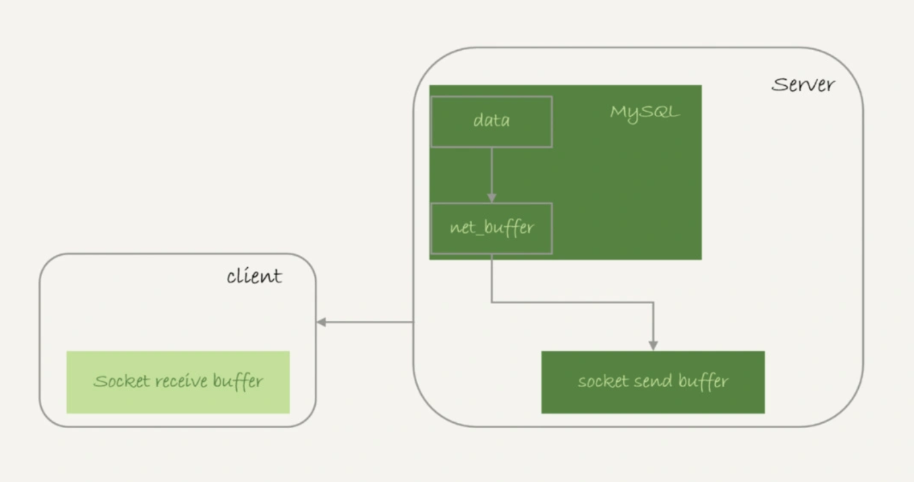

​								图1 查询结果发送流程

从这个流程中，你可以看到：

1. 一个查询在发送过程中，占用的MySQL内部的内存最大就是net_buffer_length这么大，并不会达到200G；
2. socket send buffer 也不可能达到200G（默认定义/proc/sys/net/core/wmem_default），如果socket send buffer被写满，就会暂停读数据的流程。

也就是说，**MySQL是“边读边发的”**，这个概念很重要。这就意味着，如果客户端接收得慢，会导致MySQL服务端由于结果发不出去，这个事务的执行时间变长。

### Sending to client

比如下面这个状态，就是我故意让客户端不去读socket receive buffer中的内容，然后在服务端show processlist看到的结果。

实战45讲笔记.assets/183a704d4495bebbc13c524695b5b6c3.png)

​								图2 服务端发送阻塞

如果你看到State的值一直处于**“Sending to client”**，**就表示服务器端的网络栈写满了。**

我在上一篇文章中曾提到，如果客户端使用–quick参数，会使用mysql_use_result方法。这个方法是读一行处理一行。你可以想象一下，假设有一个业务的逻辑比较复杂，每读一行数据以后要处理的逻辑如果很慢，就会导致客户端要过很久才会去取下一行数据，可能就会出现如图2所示的这种情况。

因此，**对于正常的线上业务来说，如果一个查询的返回结果不会很多的话，我都建议你使用mysql_store_result这个接口，直接把查询结果保存到本地内存。**

当然前提是查询返回结果不多。在[第30篇文章](https://time.geekbang.org/column/article/78427)评论区，有同学说到自己因为执行了一个大查询导致客户端占用内存近20G，这种情况下就需要改用mysql_use_result接口了。

> 另一方面，如果你在自己负责维护的MySQL里看到很多个线程都处于“Sending to client”这个状态，就意味着你要让业务开发同学**优化查询结果**，并**评估**这么多的返回结果**是否合理**。
>
> 而如果要快速减少处于这个状态的线程的话，将**net_buffer_length参数设置为一个更大的值**是一个可选方案。

### Sending data

与“Sending to client”长相很类似的一个状态是**“Sending data”**，这是一个经常被误会的问题。有同学问我说，在自己维护的实例上看到很多查询语句的状态是“Sending data”，但查看网络也没什么问题啊，为什么Sending data要这么久？

实际上，一个查询语句的状态变化是这样的（注意：这里，我略去了其他无关的状态）：

- MySQL查询语句进入执行阶段后，首先把状态设置成“Sending data”；
- 然后，发送执行结果的列相关的信息（meta data) 给客户端；
- 再继续执行语句的流程；
- 执行完成后，把状态设置成空字符串。

也就是说，“Sending data”并不一定是指“正在发送数据”，而可能是处于执行器过程中的任意阶段。比如，你可以构造一个锁等待的场景，就能看到Sending data状态。

实战45讲笔记.assets/7640b0d82965bf8b305514f30425424b.png)

​									图3 读全表被锁

实战45讲笔记.assets/84533515cf36be65582309fbb85e13c0.png)

​								图 4 Sending data状态

可以看到，session B明显是在等锁，状态显示为Sending data。


也就是说，**仅当一个线程处于“等待客户端接收结果”的状态，才会显示"Sending to client"；而如果显示成“Sending data”，它的意思只是“正在执行”**。

现在你知道了，查询的结果是分段发给客户端的，因此扫描全表，查询返回大量的数据，**并不会把内存打爆**。

在server层的处理逻辑我们都清楚了，在InnoDB引擎里面又是怎么处理的呢？ 扫描全表会不会对引擎系统造成影响呢？


## InnoDB层处理逻辑

### 内存命中率

在[第2](https://time.geekbang.org/column/article/68633)和[第15篇](https://time.geekbang.org/column/article/73161)文章中，我介绍WAL机制的时候，和你分析了InnoDB内存的一个作用，是保存更新的结果，再配合redo log，就避免了随机写盘。

内存的数据页是在Buffer Pool (BP)中管理的，在WAL里Buffer Pool 起到了加速更新的作用。而实际上，Buffer Pool 还有一个更重要的作用，就是加速查询。

在第2篇文章的评论区有同学问道，由于有WAL机制，当事务提交的时候，磁盘上的数据页是旧的，那如果这时候马上有一个查询要来读这个数据页，是不是要马上把redo log应用到数据页呢？

答案是不需要。因为这时候内存数据页的结果是最新的，直接读内存页就可以了。你看，这时候**查询根本不需要读磁盘，直接从内存拿结果，速度是很快的。所以说，Buffer Pool还有加速查询的作用**。

而Buffer Pool对查询的加速效果，依赖于一个重要的指标，即：**内存命中率**。

你可以在show engine innodb status结果中，查看一个系统当前的BP命中率。一般情况下，一个稳定服务的线上系统，要保证响应时间符合要求的话，内存命中率要在**99%以上**。

执行show engine innodb status ，可以看到“Buffer pool hit rate”字样，显示的就是当前的命中率。比如图5这个命中率，就是99.0%。

实战45讲笔记.assets/c70a95ee99826812c292c46de508982e.png)

​						图5 show engine innodb status显示内存命中率

如果所有查询需要的数据页都能够直接从内存得到，那是最好的，对应的命中率就是100%。但，这在实际生产上是很难做到的。

InnoDB Buffer Pool的大小是由参数 **innodb_buffer_pool_size**确定的，**一般建议设置成可用物理内存的60%~80%。**

### 淘汰旧页 最近最少使用算法LRU

在大约十年前，单机的数据量是上百个G，而物理内存是几个G；现在虽然很多服务器都能有128G甚至更高的内存，但是单机的数据量却达到了T级别。

所以，innodb_buffer_pool_size小于磁盘的数据量是很常见的。**如果一个 Buffer Pool满了，而又要从磁盘读入一个数据页，那肯定是要淘汰一个旧数据页的。**

InnoDB内存管理用的是最近最少使用 (Least Recently Used, LRU)算法，这个算法的核心就是淘汰最久未使用的数据。

下图是一个LRU算法的基本模型。


​								图6 基本LRU算法

InnoDB管理Buffer Pool的LRU算法，是用**链表**来实现的。

1. 在图6的状态1里，链表头部是P1，表示P1是最近刚刚被访问过的数据页；假设内存里只能放下这么多数据页；
2. 这时候有一个读请求访问P3，因此变成状态2，P3被移到最前面；
3. 状态3表示，这次访问的数据页是不存在于链表中的，所以需要在Buffer Pool中新申请一个数据页Px，加到链表头部。但是由于内存已经满了，不能申请新的内存。于是，会清空链表末尾Pm这个数据页的内存，存入Px的内容，然后放到链表头部。
4. 从效果上看，就是最久没有被访问的数据页Pm，被淘汰了。

这个算法乍一看上去没什么问题，但是如果考虑到要做一个全表扫描，会不会有问题呢？

假设按照这个算法，我们要扫描一个200G的表，而这个表是一个历史数据表，平时没有业务访问它。

那么，**按照这个算法扫描的话，就会把当前的Buffer Pool里的数据全部淘汰掉**，存入扫描过程中访问到的数据页的内容。也就是说**Buffer Pool里面主要放的是这个历史数据表的数据。**

对于一个正在做业务服务的库，**这可不妙**。你会看到，**Buffer Pool的内存命中率急剧下降**，磁盘压力增加，SQL语句响应变慢。


所以，InnoDB不能直接使用这个LRU算法。实际上，**InnoDB对LRU算法做了`改进`。**

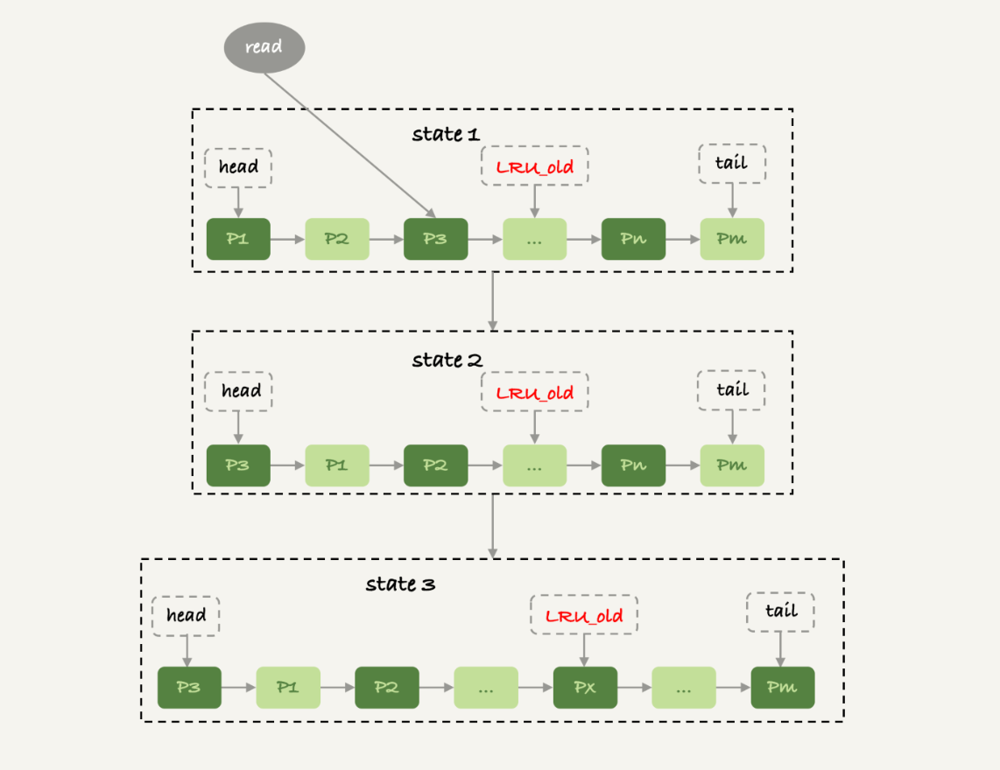

​								图 7 改进的LRU算法

在InnoDB实现上，按照**5:3**的比例把整个LRU链表分成了**young区域和old区域**。图中LRU_old指向的就是old区域的第一个位置，是整个链表的5/8处。也就是说，**靠近链表头部的5/8是young区域，靠近链表尾部的3/8是old区域。**

改进后的LRU算法执行流程变成了下面这样。

1. 图7中状态1，要访问数据页P3，由于P3在young区域，因此和优化前的LRU算法一样，将其移到链表头部，变成状态2。
2. 之后要访问一个新的不存在于当前链表的数据页，这时候依然是淘汰掉数据页Pm，但是**新插入的数据页Px，是放在LRU_old处。**
3. 处于old区域的数据页，每次被访问的时候都要做下面这个判断：
   - 若这个数据页在LRU链表中存在的**时间超过了1秒**，就把它**移动到链表头部；**
   - 如果这个数据页在LRU链表中存在的**时间短于1秒，位置保持不变**。1秒这个时间，是由参数**innodb_old_blocks_time**控制的。其默认值是1000，单位毫秒。于是**很快就会被淘汰**

这个策略，就是为了处理类似全表扫描的操作量身定制的。还是以刚刚的扫描200G的历史数据表为例，我们看看改进后的LRU算法的操作逻辑：

1. 扫描过程中，需要**新插入的数据页，都被放到old区域;**
2. 一个数据页里面有多条记录，这个数据页会被多次访问到，但由于是顺序扫描，这个数据页第一次被访问和最后一次被访问的时间间隔不会超过1秒，因此还是会被保留在old区域；
3. 再继续扫描后续的数据，之前的这个数据页之后也不会再被访问到，于是始终没有机会移到链表头部（也就是young区域），很快就会被淘汰出去。

可以看到，这个策略最大的收益，就是在扫描这个大表的过程中，虽然也用到了Buffer Pool，但是对young区域完全没有影响，从而保证了Buffer Pool响应正常业务的查询命中率。


## 问题

你可以设想出由于客户端的性能问题，对数据库影响更严重的例子吗？或者你是否经历过这样的场景？你又是怎么优化的？

这个问题的核心是，**造成了“长事务”**。

至于长事务的影响，就要结合我们前面文章中提到的锁、MVCC的知识点了。

- 如果前面的语句有更新，意味着它们在占用着行锁，会导致别的语句更新被锁住；
- 当然读的事务也有问题，就是会导致undo log不能被回收，导致回滚段空间膨胀。


如果要快速减少处于这个状态的线程的话，将 net_buffer_length 参数设置为一个更大的值是一个可选方案。
对于这个方案不是很懂，“Sending to client” 表示服务器端的网路栈写满了，那不是应该加大 socket send buffer 吗？跟加大 net_buffer_length 有什么关系？net_buffer_length 加再大，但 socket send buffer 很小的话，网络栈不还是处于写满状态？

是这样的，net_buffer_length 的最大值是 1G，这个值比 socket send buffer大（一般是几M）

比如假设一个业务，他的平均查询结果都是10M （当然这个业务有有问题，最终是要通过业务解决）

但是如果我把net_buffer_length 改成10M，就不会有“Sending to client” 的情况。虽然网络栈还是慢慢发的，但是那些没发完的都缓存在net_buffer中，对于执行器来说，都是“已经写出去了”。


# 34 讲到底可不可以使用join连接查询

在实际生产中，关于join语句使用的问题，一般会集中在以下两类：

1. 我们DBA不让使用join，使用join有什么问题呢？
2. 如果有两个大小不同的表做join，应该用哪个表做驱动表呢？

今天这篇文章，我就先跟你说说join语句到底是怎么执行的，然后再来回答这两个问题。

为了便于量化分析，我还是创建两个表t1和t2来和你说明。

```
CREATE TABLE `t2` (
  `id` int(11) NOT NULL,
  `a` int(11) DEFAULT NULL,
  `b` int(11) DEFAULT NULL,
  PRIMARY KEY (`id`),
  KEY `a` (`a`)
) ENGINE=InnoDB;
```

这两个表都有一个主键索引id和一个索引a，字段b上无索引。存储过程idata()往表t2里插入了1000行数据，在表t1里插入的是100行数据。t2数据为(1,1,1)...(1000,1000,1000)


## Index Nested-Loop Join（NLJ）

我们来看一下这个语句：

```
select * from t1 straight_join t2 on (t1.a=t2.a);
```

如果直接使用join语句，MySQL优化器可能会选择表t1或t2作为驱动表，这样会影响我们分析SQL语句的执行过程。所以，为了便于分析执行过程中的性能问题，我改用straight_join让MySQL使用固定的连接方式执行查询，这样优化器只会按照我们指定的方式去join。在这个语句里，t1 是驱动表，t2是被驱动表。

现在，我们来看一下这条语句的explain结果。

实战45讲笔记.assets/4b9cb0e0b83618e01c9bfde44a0ea990.png)

​							图1 使用索引字段join的 explain结果

可以看到，在这条语句里，被驱动表t2的字段a上有索引，join过程用上了这个索引，因此这个语句的执行流程是这样的：

1. 从表t1中读入一行数据 R；
2. 从数据行R中，取出a字段到表t2里去查找；
3. 取出表t2中满足条件的行，跟R组成一行，作为结果集的一部分；
4. 重复执行步骤1到3，直到表t1的末尾循环结束。

这个过程是先遍历表t1，然后根据从表t1中取出的每行数据中的a值，去表t2中查找满足条件的记录。在形式上，这个过程就跟我们写程序时的嵌套查询类似，并且可以用上被驱动表的索引，所以我们称之为**“Index Nested-Loop Join”，简称NLJ**。

它对应的流程图如下所示：


​						图2 Index Nested-Loop Join算法的执行流程

在这个流程里：

1. 对驱动表t1做了全表扫描，这个过程需要扫描100行；
2. 而对于每一行R，根据a字段去表t2查找，走的是树搜索过程。由于我们构造的数据都是一一对应的，因此每次的搜索过程都只扫描一行，也是总共扫描100行；
3. 所以，整个执行流程，**总扫描行数是200**。


## 用不用join，谁做驱动表

现在我们知道了这个过程，再试着回答一下文章开头的两个问题。

先看第一个问题：**能不能使用join?**

假设不使用join，那我们就只能用单表查询。我们看看上面这条语句的需求，用单表查询怎么实现。

1. 执行`select * from t1`，查出表t1的所有数据，这里有100行；
2. 循环遍历这100行数据：
   - 从每一行R取出字段a的值$R.a；
   - 执行`select * from t2 where a=$R.a`；
   - 把返回的结果和R构成结果集的一行。

可以看到，在这个查询过程，也是扫描了200行，但是总共执行了101条语句，比直接join多了100次交互。除此之外，客户端还要自己拼接SQL语句和结果。

显然，这么做**还不如直接join好**。

我们再来看看第二个问题：**怎么选择驱动表？**

在这个join语句执行过程中，驱动表是走全表扫描，而被驱动表是走树搜索。

假设被驱动表的行数是M。每次在被驱动表查一行数据，要先搜索索引a，再搜索主键索引。每次搜索一棵树近似复杂度是以2为底的M的对数，记为log2M，所以在被驱动表上查一行的时间复杂度是 2*log2M。

假设驱动表的行数是N，执行过程就要扫描驱动表N行，然后对于每一行，到被驱动表上匹配一次。

因此整个执行过程，近似复杂度是 N + N*2*log2M。

显然，N对扫描行数的影响更大，**因此应该让小表来做驱动表**。

> 如果你没觉得这个影响有那么“显然”， 可以这么理解：N扩大1000倍的话，扫描行数就会扩大1000倍；而M扩大1000倍，扫描行数扩大不到10倍。

到这里小结一下，通过上面的分析我们得到了两个结论：

1. **使用join语句，性能比强行拆成多个单表执行SQL语句的性能要好；**
2. **如果使用join语句的话，需要让小表做驱动表。**

但是，你需要注意，这个结论的前提是“可以使用被驱动表的索引”。

接下来，我们再看看被驱动表用不上索引的情况。


## Simple Nested-Loop Join（SNL）

现在，我们把SQL语句改成这样：

```
select * from t1 straight_join t2 on (t1.a=t2.b);
```

由于表t2的字段b上没有索引，因此再用图2的执行流程时，每次到t2去匹配的时候，就要做一次全表扫描。

你可以先设想一下这个问题，继续使用图2的算法，是不是可以得到正确的结果呢？如果只看结果的话，这个算法是正确的，而且这个算法也有一个名字，叫做“Simple Nested-Loop Join”。

但是，这样算来，这个SQL请求就要扫描表t2多达100次，**总共扫描100*1000=10万行**。

这还只是两个小表，如果t1和t2都是10万行的表（当然了，这也还是属于小表的范围），就要扫描100亿行，这个算法看上去太“笨重”了。

当然，MySQL也没有使用这个Simple Nested-Loop Join算法，而是使用了另一个叫作“Block Nested-Loop Join”的算法，简称BNL。

## Block Nested-Loop Join（BNL）

这时候，被驱动表上没有可用的索引，算法的流程是这样的：

1. 把表t1的数据读入线程内存**join_buffer**中，由于我们这个语句中写的是select *，因此是把整个表t1放入了内存；
2. 扫描表t2，把表t2中的每一行取出来，跟join_buffer中的数据做对比，满足join条件的，作为结果集的一部分返回。

这个过程的流程图如下：


​						图3 Block Nested-Loop Join 算法的执行流程

对应地，这条SQL语句的explain结果如下所示：

实战45讲笔记.assets/676921fa0883e9463dd34fb2bc5e87e1.png)

​							图4 不使用索引字段join的 explain结果

可以看到，在这个过程中，对表t1和t2都做了一次全表扫描，因此**总的扫描行数是1100**。由于join_buffer是以无序数组的方式组织的，因此对表t2中的每一行，都要做100次判断，总共需要在内存中做的**判断次数**是：100*1000=**10万次**。

前面我们说过，如果使用Simple Nested-Loop Join算法进行查询，扫描行数也是10万行。因此，从时间复杂度上来说，这两个算法是一样的。但是，Block Nested-Loop Join算法的**这10万次判断是内存操作，速度上会快很多**，性能也更好。

接下来，我们来看一下，在这种情况下，应该选择哪个表做驱动表。

假设小表的行数是N，大表的行数是M，那么在这个算法里：

1. 两个表都做一次全表扫描，所以总的扫描行数是M+N；
2. 内存中的判断次数是M*N。

可以看到，调换这两个算式中的M和N没差别，因此这时候选择大表还是小表做驱动表，执行耗时是一样的。


然后，你可能马上就会问了，这个例子里表t1才100行，要是表t1是一个大表，**join_buffer放不下怎么办呢？**

join_buffer的大小是由参数join_buffer_size设定的，默认值是256k。**如果放不下表t1的所有数据话，策略很简单，就是分段放。**我把join_buffer_size改成1200，再执行：

```
select * from t1 straight_join t2 on (t1.a=t2.b);
```

执行过程就变成了：

1. 扫描表t1，顺序读取数据行放入join_buffer中，放完第88行join_buffer满了，继续第2步；
2. 扫描表t2，把t2中的每一行取出来，跟join_buffer中的数据做对比，满足join条件的，作为结果集的一部分返回；
3. 清空join_buffer；
4. 继续扫描表t1，顺序读取最后的12行数据放入join_buffer中，继续执行第2步。

执行流程图也就变成这样：


​							图5 Block Nested-Loop Join -- 两段

图中的步骤4和5，表示清空join_buffer再复用。

这个流程才体现出了这个算法名字中“Block”的由来，表示“分块去join”。

可以看到，这时候由于表t1被分成了两次放入join_buffer中，导致表t2会被扫描两次。虽然分成两次放入join_buffer，但是**判断等值条件的次数**还是不变的，**依然是(88+12)*1000=10万次**。

我们再来看下，在这种情况下驱动表的选择问题。

假设，驱动表的数据行数是N，需要分K段才能完成算法流程，被驱动表的数据行数是M。

注意，这里的K不是常数，N越大K就会越大，因此把K表示为λ*N，显然λ的取值范围是(0,1)。

所以，在这个算法的执行过程中：

1. 扫描行数是 N+λ*N*M；
2. 内存判断 N*M次。

显然，内存判断次数是不受选择哪个表作为驱动表影响的。而考虑到扫描行数，在M和N大小确定的情况下，N小一些，整个算式的结果会更小。

所以结论是，**应该让小表当驱动表。**

当然，你会发现，在**N+λ*N*M**这个式子里，**λ**才是影响扫描行数的关键因素，这个值**越小越好**。

刚刚我们说了N越大，分段数K越大。那么，N固定的时候，什么参数会影响K的大小呢？（也就是λ的大小）答案是join_buffer_size。join_buffer_size越大，一次可以放入的行越多，分成的段数也就越少，对被驱动表的全表扫描次数就越少。

这就是为什么，你可能会看到一些建议告诉你，如果你的join语句很慢，就把join_buffer_size改大。

## 再次回答两个问题

理解了MySQL执行join的两种算法，现在我们再来试着**回答文章开头的两个问题**。

第一个问题：能不能使用join语句？

1. 如果可以使用Index Nested-Loop Join算法，也就是说可以用上被驱动表上的索引，其实是没问题的；
2. 如果使用Block Nested-Loop Join算法，扫描行数就会过多。尤其是在大表上的join操作，这样可能要扫描被驱动表很多次，会占用大量的系统资源。所以这种join尽量不要用。

所以你在判断要不要使用join语句时，就是看explain结果里面，Extra字段里面有没有出现“Block Nested Loop”字样。


第二个问题是：如果要使用join，应该选择大表做驱动表还是选择小表做驱动表？

1. 如果是Index Nested-Loop Join算法，应该选择小表做驱动表；
2. 如果是Block Nested-Loop Join算法：
   - 在join_buffer_size足够大的时候，是一样的；
   - 在join_buffer_size不够大的时候（这种情况更常见），应该选择小表做驱动表。

所以，这个问题的结论就是，总是应该使用**小表做驱动表**。

## 有索引谁做驱动表

只有一个表有索引时：

若是外连接，则会选择有索引的作为**被驱动表**

若是内连接，则会选择有索引的作为**驱动表**

## 什么叫做小表

当然了，这里我需要说明下，**什么叫作“小表”**。

我们前面的例子是没有加条件的。如果我在语句的where条件加上 t2.id<=50这个限定条件，再来看下这两条语句：

```
select * from t1 straight_join t2 on (t1.b=t2.b) where t2.id<=50;
select * from t2 straight_join t1 on (t1.b=t2.b) where t2.id<=50;
```

注意，为了让两条语句的被驱动表都用不上索引，所以join字段都使用了没有索引的字段b。

但如果是用第二个语句的话，join_buffer只需要放入t2的前50行，显然是更好的。所以这里，“t2的前50行”是那个相对小的表，也就是“小表”。

我们再来看另外一组例子：

```
select t1.b,t2.* from  t1  straight_join t2 on (t1.b=t2.b) where t2.id<=100;
select t1.b,t2.* from  t2  straight_join t1 on (t1.b=t2.b) where t2.id<=100;
```

这个例子里，表t1 和 t2都是只有100行参加join。但是，这两条语句每次查询放入join_buffer中的数据是不一样的：

- 表t1只查字段b，因此如果把t1放到join_buffer中，则join_buffer中只需要放入b的值；
- 表t2需要查所有的字段，因此如果把表t2放到join_buffer中的话，就需要放入三个字段id、a和b。

这里，我们应该选择表t1作为驱动表。也就是说在这个例子里，“只需要一列参与join的表t1”是那个相对小的表。

所以，更准确地说，**在决定哪个表做驱动表的时候，应该是两个表按照各自的条件过滤，过滤完成之后，计算参与join的各个字段的总数据量，数据量小的那个表，就是“小表”，应该作为驱动表。**


## 问题

我的问题是，如果被驱动表是一个大表，并且是一个冷数据表，除了查询过程中可能会导致IO压力大以外，你觉得对这个MySQL服务还有什么更严重的影响吗？（这个问题需要结合上一篇文章的知识点）

> 看下一节的 《BNL算法可能会对内存命中率造成影响》


# 35 讲join语句怎么优化

在上一篇文章中，我和你介绍了join语句的两种算法，分别是Index Nested-Loop Join(**NLJ**)和Block Nested-Loop Join(**BNL**)。

我们发现在使用NLJ算法的时候，其实效果还是不错的，比通过应用层拆分成多个语句然后再拼接查询结果更方便，而且性能也不会差。

但是，BNL算法在大表join的时候性能就差多了，比较次数等于两个表参与join的行数的乘积，很消耗CPU资源。

当然了，这两个算法都还有继续优化的空间，我们今天就来聊聊这个话题。

为了便于分析，我还是创建两个表t1、t2来和你展开今天的问题。

```
create table t1(id int primary key, a int, b int, index(a));
create table t2 like t1;
```

我在表t1里，插入了1000行数据，每一行的a=1001-id的值。也就是说，表t1中字段a是逆序的。同时，我在表t2中插入了100万行数据。


## Multi-Range Read优化回表（MRR）

在介绍join语句的优化方案之前，我需要先和你介绍一个知识点，即：Multi-Range Read优化(MRR)。**这个优化的主要目的是尽量使用顺序读盘。**

在[第4篇文章](https://time.geekbang.org/column/article/69236)中，我和你介绍InnoDB的索引结构时，提到了**“回表”**的概念。我们先来回顾一下这个概念。回表是指，InnoDB在普通索引a上查到主键id的值后，再根据一个个主键id的值到主键索引上去查整行数据的过程。

然后，有同学在留言区问到，回表过程是一行行地查数据，还是批量地查数据？

我们先来看看这个问题。假设，我执行这个语句：

```
select * from t1 where a>=1 and a<=100;
```

主键索引是一棵B+树，在这棵树上，每次只能根据一个主键id查到一行数据。因此，回表肯定是一行行搜索主键索引的，基本流程如图1所示。


​									图1 基本回表流程

如果随着a的值递增顺序查询的话，**id的值就变成随机的，那么就会出现随机访问，性能相对较差**。虽然“按行查”这个机制不能改，但是调整查询的顺序，还是能够加速的。

**因为大多数的数据都是按照主键递增顺序插入得到的，所以我们可以认为，如果按照主键的递增顺序查询的话，对磁盘的读比较接近顺序读，能够提升读性能。**

这，就是MRR优化的设计思路。此时，语句的执行流程变成了这样：

1. 根据索引a，定位到满足条件的记录，将id值放入read_rnd_buffer中;
2. 将read_rnd_buffer中的id进行递增排序；
3. 排序后的id数组，依次到主键id索引中查记录，并作为结果返回。

这里，read_rnd_buffer的大小是由**read_rnd_buffer_size**参数控制的。如果步骤1中，read_rnd_buffer放满了，就会先执行完步骤2和3，然后清空read_rnd_buffer。之后继续找索引a的下个记录，并继续循环。

另外需要说明的是，如果你想要稳定地使用MRR优化的话，需要设置`set optimizer_switch="mrr_cost_based=off"`。（官方文档的说法，是现在的优化器策略，判断消耗的时候，会更倾向于不使用MRR，把mrr_cost_based设置为off，就是固定使用MRR了。）

下面两幅图就是使用了MRR优化后的执行流程和explain结果。


​									图2 MRR执行流程

实战45讲笔记.assets/a513d07ebaf1ae044d44391c89bc6432.png)

​							图3 MRR执行流程的explain结果

从图3的explain结果中，我们可以看到Extra字段多了**Using MRR**，表示的是用上了MRR优化。而且，由于我们在read_rnd_buffer中按照id做了排序，所以最后得到的结果集也是按照主键id递增顺序的，也就是与图1结果集中行的顺序相反。

到这里，我们小结一下。

**MRR能够提升性能的核心**在于，这条查询语句在索引a上做的是一个范围查询（也就是说，这是一个多值查询），可以得到足够多的主键id。这样通过排序以后，再去主键索引查数据，才能体现出“顺序性”的优势。


## Batched Key Access优化NLJ和BNL（BKA）

### BKA优化NLJ

理解了MRR性能提升的原理，我们就能理解MySQL在5.6版本后开始引入的Batched Key Acess(BKA)算法了。这个BKA算法，其实就是对NLJ算法的优化。

我们再来看看上一篇文章中用到的NLJ算法的流程图：


​							图4 Index Nested-Loop Join流程图

NLJ算法执行的逻辑是：从驱动表t1，一行行地取出a的值，再到被驱动表t2去做join。也就是说，对于表t2来说，每次都是匹配一个值。这时，MRR的优势就用不上了。

那怎么才能**一次性地多传些值**给表t2呢？方法就是，从表t1里一次性地多拿些行出来，一起传给表t2。

既然如此，我们就把表t1的数据取出来一部分，先放到一个临时内存。这个临时内存不是别人，就是**join_buffer**。

通过上一篇文章，我们知道join_buffer **在BNL算法里的作用，是暂存驱动表的数据**。但是**在NLJ算法**里并没有用。那么，我们刚好就可以**复用join_buffer到BKA算法**中。

如图5所示，是上面的NLJ算法优化后的BKA算法的流程。


​								图5 Batched Key Acess流程

图中，我在join_buffer中放入的数据是P1~P100，表示的是只会取查询需要的字段。当然，如果join buffer放不下P1~P100的所有数据，就会把这100行数据分成多段执行上图的流程。

那么，这个BKA算法到底要怎么启用呢？

如果要使用BKA优化算法的话，你需要在执行SQL语句之前，先设置

```
set optimizer_switch='mrr=on,mrr_cost_based=off,batched_key_access=on';
```

其中，前两个参数的作用是要启用MRR。这么做的原因是，**BKA算法的优化要依赖于MRR**。


### BKA优化BNL

#### BNL算法可能会对内存命中率造成影响

说完了NLJ算法的优化，我们再来看BNL算法的优化。

我在上一篇文章末尾，给你留下的思考题是**，使用Block Nested-Loop Join(BNL)算法时，可能会对被驱动表做多次扫描。如果这个被驱动表是一个大的冷数据表，除了会导致IO压力大以外，还会对系统有什么影响呢？**

在[第33篇文章](https://time.geekbang.org/column/article/79407)中，我们说到InnoDB的LRU算法的时候提到，由于InnoDB对Bufffer Pool的LRU算法做了优化，即：第一次从磁盘读入内存的数据页，会先放在old区域。如果1秒之后这个数据页不再被访问了，就不会被移动到LRU链表头部，这样对Buffer Pool的命中率影响就不大。

但是，**如果一个使用BNL算法的join语句，多次扫描一个冷表，而且这个语句执行时间超过1秒**，就会在再次扫描冷表的时候，把冷表的数据页移到LRU链表头部。

这种情况对应的，是冷表的数据量小于整个Buffer Pool的3/8，能够完全放入old区域的情况。

如果这个**冷表很大**，就会出现另外一种情况：**业务正常访问的数据页，没有机会进入young区域**。

由于优化机制的存在，一个正常访问的数据页，要进入young区域，需要隔1秒后再次被访问到。但是，由于我们的join语句在循环读磁盘和淘汰内存页，进入old区域的数据页，很可能在1秒之内就被淘汰了。这样，就会导致这个MySQL实例的Buffer Pool在这段时间内，young区域的数据页没有被合理地淘汰。

也就是说，这两种情况都**会影响Buffer Pool的正常运作**。

**大表join操作虽然对IO有影响，但是在语句执行结束后，对IO的影响也就结束了。但是，对Buffer Pool的影响就是持续性的，需要依靠后续的查询请求慢慢恢复内存命中率。**

为了减少这种影响，你可以考虑增大join_buffer_size的值，减少对被驱动表的扫描次数。

也就是说，BNL算法对系统的影响主要包括三个方面：

1. 可能会多次扫描被驱动表，占用磁盘IO资源；
2. 判断join条件需要执行M*N次对比（M、N分别是两张表的行数），如果是大表就会占用非常多的CPU资源；
3. 可能会导致Buffer Pool的热数据被淘汰，影响内存命中率。

我们执行语句之前，需要通过理论分析和查看explain结果的方式，确认是否要使用BNL算法。如果确认优化器会使用BNL算法，就需要做优化。优化的常见做法是，给被驱动表的join字段加上索引，把BNL算法转成BKA算法。

接下来，我们就具体看看，这个优化怎么做？

#### BNL转BKA

- 适合建索引时：

一些情况下，我们**可以直接在被驱动表上建索引**，这时就可以直接转成BKA算法了。


- 不适合2建索引时：建立临时表，在临时表上建索引

但是，有时候你确实会碰到一些不适合在被驱动表上建索引的情况。比如下面这个语句：

```
select * from t1 join t2 on (t1.b=t2.b) where t2.b>=1 and t2.b<=2000;
```

我们在文章开始的时候，在表t2中插入了100万行数据，但是经过where条件过滤后，需要参与join的只有2000行数据。如果这条语句同时是一个低频的SQL语句，那么再为这个语句在表t2的字段b上创建一个索引就很浪费了。

但是，如果使用BNL算法来join的话，这个语句的执行流程是这样的：

1. 把表t1的所有字段取出来，存入join_buffer中。这个表只有1000行，join_buffer_size默认值是256k，可以完全存入。
2. 扫描表t2，取出每一行数据跟join_buffer中的数据进行对比，
   - 如果不满足t1.b=t2.b，则跳过；
   - 如果满足t1.b=t2.b, 再判断其他条件，也就是是否满足t2.b处于[1,2000]的条件，如果是，就作为结果集的一部分返回，否则跳过。

我在上一篇文章中说过，对于表t2的每一行，判断join是否满足的时候，都需要遍历join_buffer中的所有行。因此判断等值条件的次数是1000*100万=10亿次，这个判断的工作量很大。

实战45讲笔记.assets/92fbdbfc35da3040396401250cb33f60.png)

​								图6 explain结果

实战45讲笔记.assets/d862bc3e88305688df2c354a4b26809c.png)

​								图7 语句执行时间

可以看到，explain结果里Extra字段显示使用了BNL算法。在我的测试环境里，这条语句需要执行1分11秒。

在表t2的字段b上创建索引会浪费资源，但是不创建索引的话这个语句的等值条件要判断10亿次，想想也是浪费。那么，有没有两全其美的办法呢？

这时候，我们可以考虑**使用临时表**。使用临时表的大致思路是：

1. 把表t2中**满足条件的数据放在临时表tmp_t中**；
2. 为了让join使用BKA算法，给临时表tmp_t的字段b加上索引；
3. 让表t1和tmp_t做join操作。

此时，对应的SQL语句的写法如下：

```
create temporary table temp_t(id int primary key, a int, b int, index(b))engine=innodb;
insert into temp_t select * from t2 where b>=1 and b<=2000;
select * from t1 join temp_t on (t1.b=temp_t.b);
```

图8就是这个语句序列的执行效果。

实战45讲笔记.assets/a80cdffe8173fa0fd8969ed976ac6ac7.png)

​								图8 使用临时表的执行效果

可以看到，整个过程3个语句执行时间的总和还不到1秒，相比于前面的1分11秒，性能得到了大幅提升。接下来，我们一起看一下这个过程的消耗：

1. 执行insert语句构造temp_t表并插入数据的过程中，对表t2做了全表扫描，这里扫描行数是100万。
2. 之后的join语句，扫描表t1，这里的扫描行数是1000；join比较过程中，做了1000次带索引的查询。相比于优化前的join语句需要做10亿次条件判断来说，这个优化效果还是很明显的。

总体来看，不论是在原表上加索引，还是用有索引的临时表，我们的思路都是让join语句能够用上被驱动表上的索引，来触发BKA算法，提升查询性能。

## 扩展：hash join

看到这里你可能发现了，其实上面计算10亿次那个操作，看上去有点儿傻。如果join_buffer里面维护的不是一个无序数组，而是一个哈希表的话，那么就不是10亿次判断，而是100万次hash查找。这样的话，整条语句的执行速度就快多了吧？

确实如此。

这，也正是MySQL的优化器和执行器一直被诟病的一个原因：不支持哈希join。并且，MySQL官方的roadmap，也是迟迟没有把这个优化排上议程。

实际上，这个优化思路，我们可以自己实现在业务端。实现流程大致如下：

1. `select * from t1;`取得表t1的全部1000行数据，在业务端存入一个hash结构，比如C++里的set、PHP的dict这样的数据结构。
2. `select * from t2 where b>=1 and b<=2000;` 获取表t2中满足条件的2000行数据。
3. 把这2000行数据，一行一行地取到业务端，到hash结构的数据表中寻找匹配的数据。满足匹配的条件的这行数据，就作为结果集的一行。

理论上，这个过程会比临时表方案的执行速度还要快一些。如果你感兴趣的话，可以自己验证一下。


现在，**MySQL8.0.20已经支持Hash Join，正在逐步淘汰BNL**


## 问题

我们在讲join语句的这两篇文章中，都只涉及到了两个表的join。那么，现在有一个三个表join的需求，假设这三个表的表结构如下：

```
CREATE TABLE `t1` (
 `id` int(11) NOT NULL,
 `a` int(11) DEFAULT NULL,
 `b` int(11) DEFAULT NULL,
 `c` int(11) DEFAULT NULL,
  PRIMARY KEY (`id`)
) ENGINE=InnoDB;

create table t2 like t1;
create table t3 like t2;
insert into ... //初始化三张表的数据
```

语句的需求实现如下的join逻辑：

```
select * from t1 join t2 on(t1.a=t2.a) join t3 on (t2.b=t3.b) where t1.c>=X and t2.c>=Y and t3.c>=Z;
```

现在为了得到最快的执行速度，如果让你来设计表t1、t2、t3上的索引，来支持这个join语句，你会加哪些索引呢？

同时，如果我希望你用straight_join来重写这个语句，配合你创建的索引，你就需要安排连接顺序，你主要考虑的因素是什么呢？

第一原则是要**尽量使用BKA算法**。需要注意的是，使用BKA算法的时候，并不是“先计算两个表join的结果，再跟第三个表join”，而是直接嵌套查询的。

具体实现是：在t1.c>=X、t2.c>=Y、t3.c>=Z这三个条件里，选择一个经过过滤以后，数据最少的那个表，作为第一个驱动表。此时，可能会出现如下两种情况。

第一种情况，如果选出来是表t1或者t3，那剩下的部分就固定了。

1. 如果驱动表是t1，则连接顺序是t1->t2->t3，要在被驱动表字段创建上索引，也就是t2.a 和 t3.b上创建索引；
2. 如果驱动表是t3，则连接顺序是t3->t2->t1，需要在t2.b 和 t1.a上创建索引。

同时，我们还需要在第一个驱动表的字段c上创建索引。

第二种情况是，如果选出来的第一个驱动表是表t2的话，则需要评估另外两个条件的过滤效果。

总之，整体的思路就是，尽量让每一次参与join的驱动表的数据集，越小越好，因为这样我们的驱动表就会越小。


**总结：**

今天，我和你分享了Index Nested-Loop Join（NLJ）和Block Nested-Loop Join（BNL）的优化方法。

在这些优化方法中：

1. BKA优化是MySQL已经内置支持的，建议你默认使用；
2. BNL算法效率低，建议你都尽量转成BKA算法。**优化的方向就是给被驱动表的关联字段加上索引**；
3. 基于临时表的改进方案，对于能够提前过滤出小数据的join语句来说，效果还是很好的；
4. MySQL目前的版本还不支持hash join，但你可以配合应用端自己模拟出来，理论上效果要好于临时表的方案。


# 36 临时表

## 临时表和内存表

在上一篇文章中，我们在优化join查询的时候使用到了临时表。当时，我们是这么用的：

```
create temporary table temp_t like t1;
alter table temp_t add index(b);
insert into temp_t select * from t2 where b>=1 and b<=2000;
select * from t1 join temp_t on (t1.b=temp_t.b);
```

你可能会有疑问，为什么要用临时表呢？直接用普通表是不是也可以呢？

今天我们就从这个问题说起：临时表有哪些特征，为什么它适合这个场景？

这里，我需要先帮你厘清一个容易误解的问题：有的人可能会认为，临时表就是内存表。但是，这两个概念可是完全不同的。

- **内存表**，指的是使用**Memory引擎的表**，建表语法是create table … engine=memory。这种表的数据都保存在内存里，系统重启的时候会被清空，但是表结构还在。除了这两个特性看上去比较“奇怪”外，从其他的特征上看，它就是一个正常的表。
- 而**临时表**，可以使用各种引擎类型 。如果是使用InnoDB引擎或者MyISAM引擎的临时表，写数据的时候是写到磁盘上的。当然，临时表也可以使用Memory引擎。

弄清楚了内存表和临时表的区别以后，我们再来看看临时表有哪些特征。


## 临时表的特点

为了便于理解，我们来看下下面这个操作序列：

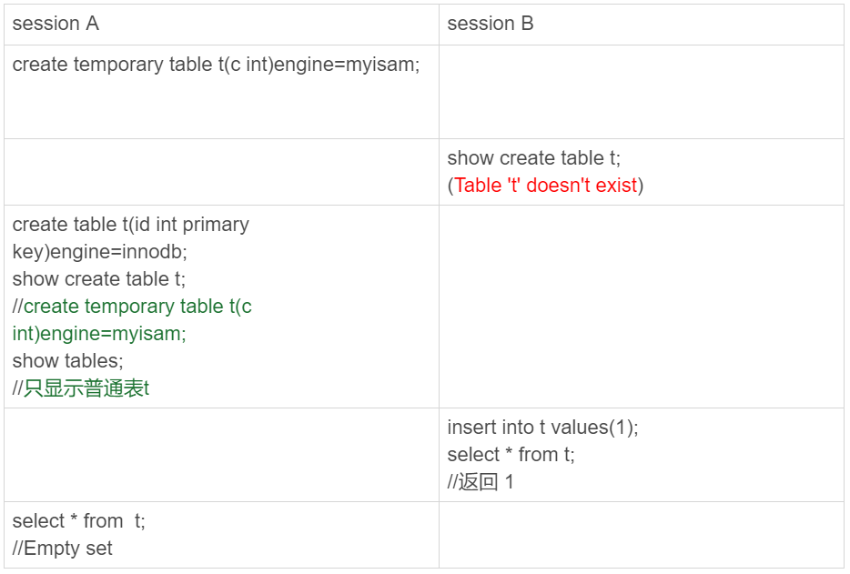

​									图1 临时表特性示例

可以看到，临时表在使用上有以下几个特点：

1. 建表语法是**create temporary table** …。
2. 一个临时表**只能被创建它的session访问**，对其他线程不可见。所以，图中session A创建的临时表t，对于session B就是不可见的。
3. 临时表**可以与普通表同名**。
4. session A内有同名的临时表和普通表的时候，show create语句，以及增删改查语句**优先访问的是临时表**。
5. **show tables命令不显示临时表**。

由于临时表只能被创建它的session访问，所以在这个session结束的时候，会自动删除临时表。也正是由于这个特性，**临时表就特别适合我们文章开头的join优化这种场景**。为什么呢？

原因主要包括以下两个方面**优点**：

1. 不同session的临时表是可以重名的，如果有多个session同时执行join优化，不需要担心表名重复导致建表失败的问题。
2. 不需要担心数据删除问题。如果使用普通表，在流程执行过程中客户端发生了异常断开，或者数据库发生异常重启，还需要专门来清理中间过程中生成的数据表。而临时表由于会自动回收，所以不需要这个额外的操作。

## 临时表的应用

由于不用担心线程之间的重名冲突，临时表经常会被用在复杂查询的优化过程中。其中，分库分表系统的跨库查询就是一个典型的使用场景。

一般分库分表的场景，就是要把一个逻辑上的大表分散到不同的数据库实例上。比如。将一个大表ht，按照字段f，拆分成1024个分表，然后分布到32个数据库实例上。如下图所示：


​									图2 分库分表简图

一般情况下，这种分库分表系统都有一个中间层proxy。不过，也有一些方案会让客户端直接连接数据库，也就是没有proxy这一层。

在这个架构中，分区key的选择是以“减少跨库和跨表查询”为依据的。如果大部分的语句都会包含f的等值条件，那么就要用f做分区键。这样，在proxy这一层解析完SQL语句以后，就能确定将这条语句路由到哪个分表做查询。

比如下面这条语句：

```
select v from ht where f=N;
```

这时，我们就可以通过分表规则（比如，N%1024)来确认需要的数据被放在了哪个分表上。这种语句只需要访问一个分表，是分库分表方案最欢迎的语句形式了。

但是，如果这个表上还有另外一个索引k，并且查询语句是这样的：

```
select v from ht where k >= M order by t_modified desc limit 100;
```

这时候，由于查询条件里面没有用到分区字段f，只能到所有的分区中去查找满足条件的所有行，然后统一做order by 的操作。这种情况下，有两种比较常用的思路。

**第一种思路是，**在proxy层的进程代码中实现排序。

这种方式的优势是处理速度快，拿到分库的数据以后，直接在内存中参与计算。不过，这个方案的缺点也比较明显：

1. 需要的开发工作量比较大。我们举例的这条语句还算是比较简单的，如果涉及到复杂的操作，比如group by，甚至join这样的操作，对中间层的开发能力要求比较高；
2. 对proxy端的压力比较大，尤其是很容易出现内存不够用和CPU瓶颈的问题。

**另一种思路就是，**把各个分库拿到的数据，汇总到一个MySQL实例的一个表中，然后在这个汇总实例上做逻辑操作。

比如上面这条语句，执行流程可以类似这样：

- 在汇总库**上创建一个临时表temp_ht**，表里包含三个字段v、k、t_modified；
- 在各个分库上执行

```
select v,k,t_modified from ht_x where k >= M order by t_modified desc limit 100;
```

- 把分库执行的结果插入到temp_ht表中；
- 执行

```
select v from temp_ht order by t_modified desc limit 100; 
```

得到结果。

这个过程对应的流程图如下所示：


​								图3 跨库查询流程示意图

**在实践中，我们往往会发现每个分库的计算量都不饱和，所以会直接把临时表temp_ht放到32个分库中的某一个上。**这时的查询逻辑与图3类似，你可以自己再思考一下具体的流程。

## 为什么临时表可以重名？

### 临时表文件命名区别

你可能会问，不同线程可以创建同名的临时表，这是怎么做到的呢？

接下来，我们就看一下这个问题。

我们在执行

```
create temporary table temp_t(id int primary key)engine=innodb;
```

这个语句的时候，MySQL要给这个InnoDB表创建一个**frm**文件保存表结构定义，还要有地方保存表数据。

**这个frm文件放在临时文件目录下，文件名的后缀是.frm，`前缀是“#sql{进程id}_{线程id}_序列号”`**。你可以使用select @@tmpdir命令，来显示实例的临时文件目录。

而关于表中数据的存放方式，在不同的MySQL版本中有着不同的处理方式：

- 在**5.6以及之前**的版本里，MySQL会在临时文件目录下创建一个相同前缀、以**.ibd**为后缀的文件，用来**存放数据**文件；
- 而从 **5.7版本开始**，MySQL引入了一个**临时文件表空间**，专门用来存放临时文件的数据。因此，我们就不需要再创建ibd文件了。

从文件名的前缀规则，我们可以看到，其实创建一个叫作t1的InnoDB临时表，MySQL在存储上认为我们创建的表名跟普通表t1是不同的，因此同一个库下面已经有普通表t1的情况下，还是可以再创建一个临时表t1的。

为了便于后面讨论，我先来举一个例子。

实战45讲笔记.assets/22078eab5c7688c9fbfd6185555bd91b.png)

​									图4 临时表的表名

这个进程的进程号是1234，session A的线程id是4，session B的线程id是5。所以你看到了，session A和session B创建的临时表，在磁盘上的文件不会重名。

### 内存table_def_key区别

MySQL维护数据表，除了物理上要有文件外，内存里面也有一套机制区别不同的表，每个表都对应一个**table_def_key**。

- 一个**普通表**的table_def_key的值是由**“库名+表名”**得到的，所以如果你要在同一个库下创建两个同名的普通表，创建第二个表的过程中就会发现table_def_key已经存在了。
- 而对于**临时表**，table_def_key在**“库名+表名”**基础上，又加入了**“server_id+thread_id”**。

也就是说，session A和sessionB创建的两个临时表t1，它们的table_def_key不同，磁盘文件名也不同，因此可以并存。

在实现上，每个线程都维护了自己的临时表链表。这样每次session内操作表的时候，先遍历链表，检查是否有这个名字的临时表，如果有就优先操作临时表，如果没有再操作普通表；在session结束的时候，对链表里的每个临时表，执行 “DROP TEMPORARY TABLE +表名”操作。

这时候你会发现，binlog中也记录了DROP TEMPORARY TABLE这条命令。你一定会觉得奇怪，临时表只在线程内自己可以访问，为什么需要写到binlog里面？

这，就需要说到主备复制了。

## 临时表的主备复制问题

### 什么情况binlog需要记录临时表sql语句

既然写binlog，就意味着备库需要。

你可以设想一下，在主库上执行下面这个语句序列：

```
create table t_normal(id int primary key, c int)engine=innodb;/*Q1*/
create temporary table temp_t like t_normal;/*Q2*/
insert into temp_t values(1,1);/*Q3*/
insert into t_normal select * from temp_t;/*Q4*/
```

如果关于临时表的操作都不记录，那么在备库就只有create table t_normal表和insert into t_normal select * from temp_t这两个语句的binlog日志，备库在执行到insert into t_normal的时候，就会报错“表temp_t不存在”。

你可能会说，如果把binlog设置为row格式就好了吧？因为binlog是row格式时，在记录insert into t_normal的binlog时，记录的是这个操作的数据，即：write_row event里面记录的逻辑是“插入一行数据（1,1)”。

确实是这样。**如果当前的binlog_format=row，那么跟临时表有关的语句，就不会记录到binlog里**。也就是说，**只在binlog_format=statment/mixed 的时候，binlog中才会记录临时表的操作**。

### statment/mixed格式需要额外执行DROP TEMPORARY TABLE传给备库执行

这种情况下，创建临时表的语句会传到备库执行，因此备库的同步线程就会创建这个临时表。主库在线程退出的时候，会自动删除临时表，但是备库同步线程是持续在运行的。所以，这时候我们就需要在主库上**再写一个DROP TEMPORARY TABLE传给备库执行**。

**之前有人问过我一个有趣的问题：**MySQL在记录binlog的时候，不论是create table还是alter table语句，都是原样记录，甚至于连空格都不变。但是如果执行drop table t_normal，系统记录binlog就会写成：

```
DROP TABLE `t_normal` /* generated by server */
```

也就是改成了标准的格式。为什么要这么做呢 ？

现在你知道原因了，那就是：drop table命令是可以一次删除多个表的。比如，在上面的例子中，设置binlog_format=row，如果主库上执行 "drop table t_normal, temp_t"这个命令，那么binlog中就只能记录：

```
DROP TABLE `t_normal` /* generated by server */
```

因为备库上并没有表temp_t，将这个命令重写后再传到备库执行，才不会导致备库同步线程停止。

所以，drop table命令记录binlog的时候，就必须对语句做改写。“/* generated by server */”说明了这是一个被服务端改写过的命令。

### 备库执行临时表sql也能区分同名表

说到主备复制，**还有另外一个问题需要解决**：主库上不同的线程创建同名的临时表是没关系的，但是传到备库执行是怎么处理的呢？

现在，我给你举个例子，下面的序列中实例S是M的备库。

实战45讲笔记.assets/74e789024f10bcde515f21c0368847ba.png)

​								图5 主备关系中的临时表操作

主库M上的两个session创建了同名的临时表t1，这两个create temporary table t1 语句都会被传到备库S上。

但是，备库的应用日志线程是共用的，也就是说要在应用线程里面先后执行这个create 语句两次。（即使开了多线程复制，也可能被分配到从库的同一个worker中执行）。那么，这会不会导致同步线程报错 ？

显然是不会的，否则临时表就是一个bug了。也就是说，备库线程在执行的时候，要把这两个t1表当做两个不同的临时表来处理。这，又是怎么实现的呢？

MySQL在记录binlog的时候，**会把主库执行这个语句的线程id写到binlog中**。这样，在备库的应用线程就能够知道执行每个语句的主库线程id，并利用这个线程id来构造临时表的table_def_key：

1. session A的临时表t1，在备库的table_def_key就是：库名+t1+“M的serverid”+“session A的thread_id”;
2. session B的临时表t1，在备库的table_def_key就是 ：库名+t1+“M的serverid”+“session B的thread_id”。

由于table_def_key不同，所以这两个表在备库的应用线程里面是不会冲突的。


## 小结

今天这篇文章，我和你介绍了临时表的用法和特性。

在实际应用中，**临时表一般用于处理比较复杂的计算逻辑**。由于临时表是每个线程自己可见的，所以不需要考虑多个线程执行同一个处理逻辑时，临时表的重名问题。在线程退出的时候，临时表也能自动删除，省去了收尾和异常处理的工作。

如何区分同名临时表：

1. 临时表文件格式	#sql{进程id}\_{线程id}_序列号.frm
   内存table_def_key=库名+表名+server_id+thread_id
2. 普通表和临时表以临时表优先
3. 备库备份时也能构建table_def_key以区分同名临时表

在binlog_format=**'row’**的时候，临时表的操作**不记录到binlog**中，也省去了不少麻烦，这也可以成为你选择binlog_format时的一个考虑因素。

需要注意的是，我们上面说到的这种临时表，是用户自己创建的 ，也可以称为用户临时表。与它相对应的，就是内部临时表，在[第17篇文章](https://time.geekbang.org/column/article/73795)中我已经和你介绍过。


## 问题

下面的语句序列是创建一个临时表，并将其改名：

实战45讲笔记.assets/333ad95b2ce16de1931fe347128caff9.png)

​								图6 关于临时表改名的思考题

可以看到，我们可以使用alter table语法修改临时表的表名，而不能使用rename语法。你知道这是什么原因吗？

在实现上，执行rename table语句的时候，要求按照“库名/表名.frm”的规则去磁盘找文件，但是临时表在磁盘上的frm文件是放在tmpdir目录下的，并且文件名的规则是“#sql{进程id}_{线程id}_序列号.frm”，因此会报“找不到文件名”的错误。


# 37 内存临时表

在[第16](https://time.geekbang.org/column/article/73479)和[第34](https://time.geekbang.org/column/article/79700)篇文章中，我分别和你介绍了sort buffer、内存临时表和join buffer。这三个数据结构都是用来存放语句执行过程中的中间数据，以辅助SQL语句的执行的。其中，我们在排序的时候用到了sort buffer，在使用join语句的时候用到了join buffer。

然后，你可能会有这样的疑问，MySQL什么时候会使用内部临时表呢？

今天这篇文章，我就先给你举两个需要用到内部临时表的例子，来看看内部临时表是怎么工作的。然后，我们再来分析，什么情况下会使用内部临时表。

## 什么时候会使用内存临时表

### union 执行流程

为了便于量化分析，我用下面的表t1来举例。

```
create table t1(id int primary key, a int, b int, index(a));
delimiter ;;
create procedure idata()
begin
  declare i int;

  set i=1;
  while(i<=1000)do
    insert into t1 values(i, i, i);
    set i=i+1;
  end while;
end;;
delimiter ;
call idata();
```

然后，我们执行下面这条语句：

```
(select 1000 as f) union (select id from t1 order by id desc limit 2);
```

这条语句用到了union，它的语义是，取这两个子查询结果的并集。并集的意思就是这两个集合加起来，重复的行只保留一行。

下图是这个语句的explain结果。

实战45讲笔记.assets/402cbdef84eef8f1b42201c6ec4bad4e.png)

​								图1 union语句explain 结果

可以看到：

- 第二行的key=PRIMARY，说明第二个子句用到了索引id。
- 第三行的Extra字段，表示在对子查询的结果集做union的时候，使用了临时表(Using temporary)。

这个语句的执行流程是这样的：

1. 创建一个内存临时表，这个临时表只有一个整型字段f，并且f是主键字段。
2. 执行第一个子查询，得到1000这个值，并存入临时表中。
3. 执行第二个子查询：
   - 拿到第一行id=1000，试图插入临时表中。但由于1000这个值已经存在于临时表了，违反了唯一性约束，所以插入失败，然后继续执行；
   - 取到第二行id=999，插入临时表成功。
4. 从临时表中按行取出数据，返回结果，并删除临时表，结果中包含两行数据分别是1000和999。

这个过程的流程图如下所示：


​								图 2 union 执行流程

可以看到，这里的内存临时表起到了暂存数据的作用，而且计算过程还用上了临时表主键id的唯一性约束，实现了union的语义。

顺便提一下，如果把上面这个语句中的union改成union all的话，就没有了“去重”的语义。这样执行的时候，就依次执行子查询，得到的结果直接作为结果集的一部分，发给客户端。因此也就不需要临时表了。

实战45讲笔记.assets/c1e90d1d7417b484d566b95720fe3f6d.png)

​							图3 union all的explain结果

可以看到，第二行的Extra字段显示的是Using index，表示只使用了覆盖索引，没有用临时表了。

### group by 执行流程

另外一个常见的使用临时表的例子是group by，我们来看一下这个语句：

```
select id%10 as m, count(*) as c from t1 group by m;
```

这个语句的逻辑是把表t1里的数据，按照 id%10 进行分组统计，并按照m的结果排序后输出。它的explain结果如下：

实战45讲笔记.assets/3d1cb94589b6b3c4bb57b0bdfa385d98.png)

​							图4 group by 的explain结果

在Extra字段里面，我们可以看到三个信息：

- Using index，表示这个语句使用了覆盖索引，选择了索引a，不需要回表；
- Using temporary，表示使用了临时表；
- Using filesort，表示需要排序。

这个语句的执行流程是这样的：

1. 创建内存临时表，表里有两个字段m和c，主键是m；
2. 扫描表t1的索引a，依次取出叶子节点上的id值，计算id%10的结果，记为x；
   - 如果临时表中没有主键为x的行，就插入一个记录(x,1);
   - 如果表中有主键为x的行，就将x这一行的c值加1；
3. 遍历完成后，再根据字段m做排序，得到结果集返回给客户端。

这个流程的执行图如下：


​								图5 group by执行流程

图中最后一步，对内存临时表的排序，在[第17篇文章](https://time.geekbang.org/column/article/73795)中已经有过介绍，我把图贴过来，方便你回顾。


​								图6 内存临时表排序流程

其中，临时表的排序过程就是图6中虚线框内的过程。

接下来，我们再看一下这条语句的执行结果：

实战45讲笔记.assets/ae6a28d890efc35ee4d07f694068f455.png)

​								图 7 group by执行结果

如果你的需求并**不需要对结果进行排序**，那你可以在SQL语句末尾增加**order by null**，也就是改成：

```
select id%10 as m, count(*) as c from t1 group by m order by null;
```

这样就跳过了最后排序的阶段，直接从临时表中取数据返回。返回的结果如图8所示。

实战45讲笔记.assets/036634e53276eaf8535c3442805dfaeb.png)

​						图8 group + order by null 的结果（内存临时表）

由于表t1中的id值是从1开始的，因此返回的结果集中第一行是id=1；扫描到id=10的时候才插入m=0这一行，因此结果集里最后一行才是m=0。

这个例子里由于临时表只有10行，内存可以放得下，因此全程只使用了内存临时表。但是，内存临时表的大小是有限制的，参数**tmp_table_size**就是控制这个内存大小的，**默认是16M**。

如果我执行下面这个语句序列：

```
set tmp_table_size=1024;
select id%100 as m, count(*) as c from t1 group by m order by null limit 10;
```

把内存临时表的大小限制为最大1024字节，并把语句改成id % 100，这样返回结果里有100行数据。但是，这时的内存临时表大小不够存下这100行数据，也就是说，执行过程中会发现内存临时表大小到达了上限（1024字节）。

那么，这时候就会把内存临时表转成磁盘临时表，磁盘临时表默认使用的引擎是InnoDB。 这时，返回的结果如图9所示。

实战45讲笔记.assets/a76381d0f3c947292cc28198901f9e6e.png)

​						图9 group + order by null 的结果（磁盘临时表）

如果这个表t1的数据量很大，很可能这个查询需要的磁盘临时表就会占用大量的磁盘空间。

## group by的优化

### group by 优化方法 --索引

可以看到，不论是使用内存临时表还是磁盘临时表，group by逻辑都需要构造一个带唯一索引的表，执行代价都是比较高的。如果表的数据量比较大，上面这个group by语句执行起来就会很慢，我们有什么优化的方法呢？

要解决group by语句的优化问题，你可以先想一下这个问题：执行group by语句为什么需要临时表？

group by的语义逻辑，是统计不同的值出现的个数。但是，由于每一行的id%100的结果是无序的，所以我们就需要有一个临时表，来记录并统计结果。

那么，如果扫描过程中可以**保证出现的数据是有序的**，是不是就简单了呢？

假设，现在有一个类似图10的这么一个数据结构，我们来看看group by可以怎么做。


​							图10 group by算法优化-有序输入

可以看到，如果可以确保输入的数据是有序的，那么计算group by的时候，就只需要从左到右，顺序扫描，依次累加。也就是下面这个过程：

- 当碰到第一个1的时候，已经知道累积了X个0，结果集里的第一行就是(0,X);
- 当碰到第一个2的时候，已经知道累积了Y个1，结果集里的第二行就是(1,Y);

按照这个逻辑执行的话，扫描到整个输入的数据结束，就可以拿到group by的结果，不需要临时表，也不需要再额外排序。

你一定想到了，InnoDB的索引，就可以满足这个输入有序的条件。

在MySQL 5.7版本支持了**generated column**机制，用来实现列数据的关联更新。你可以用下面的方法创建一个列z，然后在z列上创建一个索引（如果是MySQL 5.6及之前的版本，你也可以创建普通列和索引，来解决这个问题）。

```
alter table t1 add column z int generated always as(id % 100), add index(z);
```

这样，索引z上的数据就是类似图10这样有序的了。上面的group by语句就可以改成：

```
select z, count(*) as c from t1 group by z;
```

优化后的group by语句的explain结果，如下图所示：

实战45讲笔记.assets/c9f88fa42d92cf7dde78fca26c4798b9.png)

​							图11 group by 优化的explain结果

从Extra字段可以看到，这个语句的执行不再需要临时表，也不需要排序了。

### group by优化方法 --直接排序

所以，如果可以通过加索引来完成group by逻辑就再好不过了。但是，如果碰上不适合创建索引的场景，我们还是要老老实实做排序的。那么，这时候的group by要怎么优化呢？

如果我们明明知道，一个group by语句中需要放到临时表上的数据量特别大，却还是要按照“先放到内存临时表，插入一部分数据后，发现内存临时表不够用了再转成磁盘临时表”，看上去就有点儿傻。

那么，我们就会想了，MySQL有没有让我们直接走磁盘临时表的方法呢？

答案是，有的。

在group by语句中加入**SQL_BIG_RESULT**这个提示（hint），就可以**告诉优化器：这个语句涉及的数据量很大，请直接用磁盘临时表**。

MySQL的优化器一看，磁盘临时表是B+树存储，存储效率不如数组来得高。所以，既然你告诉我数据量很大，那从磁盘空间考虑，还是直接用数组来存吧。

因此，下面这个语句

```
select SQL_BIG_RESULT id%100 as m, count(*) as c from t1 group by m;
```

的执行流程就是这样的：

1. 初始化sort_buffer，确定放入一个整型字段，记为m；
2. 扫描表t1的索引a，依次取出里面的id值, 将 id%100的值存入sort_buffer中；
3. 扫描完成后，对sort_buffer的字段m做排序（如果sort_buffer内存不够用，就会利用磁盘临时文件辅助排序）；
4. 排序完成后，就得到了一个有序数组。

根据有序数组，得到数组里面的不同值，以及每个值的出现次数。这一步的逻辑，你已经从前面的图10中了解过了。

下面两张图分别是执行流程图和执行explain命令得到的结果。


​							图12 使用 SQL_BIG_RESULT的执行流程图

实战45讲笔记.assets/83b6cd6b3e37dfbf9699cf0ccc0f1bec.png)

​							图13 使用 SQL_BIG_RESULT的explain 结果

从Extra字段可以看到，这个语句的执行没有再使用临时表，而是直接用了排序算法。

## 小结

基于上面的union、union all和group by语句的执行过程的分析，我们来回答文章开头的问题：**MySQL什么时候会使用内存临时表？**

1. 如果语句执行过程可以一边读数据，一边直接得到结果，是不需要额外内存的，否则就需要额外的内存，来**保存中间结果**；
2. **join_buffer是无序数组，sort_buffer是有序数组，临时表是二维表结构；**
3. 如果执行逻辑需要用到**二维表特性，就会优先考虑使用临时表**。比如我们的例子中，union需要用到唯一索引约束， group by还需要用到另外一个字段来存累积计数。
4. 当需要使用临时表时，比如filesort时，如果**数据量小于tmp_table_size，使用内存临时表**，否则会进行文件排序（filesort使用cache还是磁盘临时表看sort_buffer的大小够否），若确定数据量很大，SQL语句可以使用SQL_BIG_RESULT来避免出现内存临时表不够用而重新使用磁盘临时表的情况

通过今天这篇文章，我重点和你讲了group by的几种实现算法，从中可以总结一些使用的指导原则：

1. 如果对group by语句的结果没有排序要求，要在语句后面加 **order by null**；
2. **尽量让group by过程用上表的索引**，确认方法是explain结果里没有Using temporary 和 Using filesort；
3. 如果group by需要统计的数据量不大，尽量只使用内存临时表；也可以通过适当**调大tmp_table_size参数，来避免用到磁盘临时表；**
4. 如果数据量实在太大，使用**SQL_BIG_RESULT**这个提示，来告诉优化器**直接使用磁盘临时表排序算法**得到group by的结果。

## 问题

文章中图8和图9都是order by null，为什么图8的返回结果里面，0是在结果集的最后一行，而图9的结果里面，0是在结果集的第一行？

- 图8是tmp_table_size够的情况，使用的是内存临时表，存储引擎默认为Memory，默认索引是Hash索引，存储的数据是无序的
- 图9是tmp_table_size不够的情况，使用的是磁盘临时表，存储引擎默认为InnoDB，默认索引是B+树索引，存储的数据是有序的


# 38 内存表（Memory引擎）

我在上一篇文章末尾留给你的问题是：两个group by 语句都用了order by null，为什么使用内存临时表得到的语句结果里，0这个值在最后一行；而使用磁盘临时表得到的结果里，0这个值在第一行？

今天我们就来看看，出现这个问题的原因吧。

## InnoDB和Memory表数据组织结构的对比

为了便于分析，我来把这个问题简化一下，假设有以下的两张表t1 和 t2，其中表t1使用Memory 引擎， 表t2使用InnoDB引擎。

```
create table t1(id int primary key, c int) engine=Memory;
create table t2(id int primary key, c int) engine=innodb;
insert into t1 values(1,1),(2,2),(3,3),(4,4),(5,5),(6,6),(7,7),(8,8),(9,9),(0,0);
insert into t2 values(1,1),(2,2),(3,3),(4,4),(5,5),(6,6),(7,7),(8,8),(9,9),(0,0);
```

然后，我分别执行select * from t1和select * from t2。

实战45讲笔记.assets/3fb1100b6e3390357d4efff0ba4765e6.png)

​							图1 两个查询结果-0的位置

可以看到，内存表t1的返回结果里面0在最后一行，而InnoDB表t2的返回结果里0在第一行。

出现这个区别的原因，要从这两个引擎的主键索引的组织方式说起。

表t2用的是InnoDB引擎，它的主键索引id的组织方式，你已经很熟悉了：InnoDB表的数据就放在主键索引树上，主键索引是B+树。所以表t2的数据组织方式如下图所示：


​									图2 表t2的数据组织

主键索引上的值是有序存储的。在执行select *的时候，就会按照叶子节点从左到右扫描，所以得到的结果里，0就出现在第一行。

与InnoDB引擎不同，Memory引擎的数据和索引是分开的。我们来看一下表t1中的数据内容。


​									图3 表t1 的数据组织

可以看到，内存表的数据部分以数组的方式单独存放，而主键id索引里，存的是每个数据的位置。主键id是hash索引，可以看到索引上的key并不是有序的。

在内存表t1中，当我执行select *的时候，走的是全表扫描，也就是顺序扫描这个数组。因此，0就是最后一个被读到，并放入结果集的数据。

可见，InnoDB和Memory引擎的数据组织方式是不同的：

- InnoDB引擎把数据放在主键索引上，其他索引上保存的是主键id。这种方式，我们称之为**索引组织表**（Index Organizied Table）。
- 而Memory引擎采用的是把数据单独存放，索引上保存数据位置的数据组织形式，我们称之为**堆组织表**（Heap Organizied Table）。

从中我们可以看出，**这两个引擎的一些典型不同**：

1. **InnoDB**表的数据总是**有序**存放的，而**内存表**的数据就是按照**写入顺序**存放的；
2. 当数据文件有空洞的时候，**InnoDB表**在插入新数据的时候，为了保证数据有序性，只能在**固定的位置写入新值**，而**内存表**找到**空位就可以**插入新值；
3. 数据位置发生变化的时候，**InnoDB表只需要修改主键索引，而内存表需要修改所有索引；**
4. InnoDB表用主键索引查询时需要走一次索引查找，用普通索引查询的时候，需要走两次索引查找。而**内存表**没有这个区别，**所有索引的“地位”都是相同的**。
5. **InnoDB支持变长数据类型**，不同记录的长度可能不同；内存表不支持Blob 和 Text字段，并且即使定义了varchar(N)，实际也当作char(N)，也就是固定长度字符串来存储，因此**内存表的每行数据长度相同**。

由于内存表的这些特性，每个数据行被删除以后，空出的这个位置都可以被接下来要插入的数据复用。比如，如果要在表t1中执行：

```
delete from t1 where id=5;
insert into t1 values(10,10);
select * from t1;
```

就会看到返回结果里，id=10这一行出现在id=4之后，也就是原来id=5这行数据的位置。

需要指出的是，表t1的这个主键索引是哈希索引，因此如果执行范围查询，比如

```
select * from t1 where id<5;
```

是用不上主键索引的，需要走全表扫描。你可以借此再回顾下[第4篇文章](https://time.geekbang.org/column/article/69236)的内容。那如果要让内存表支持范围扫描，应该怎么办呢 ？

## hash索引和B-Tree索引的对比

实际上，内存表也是支B-Tree索引的。在id列上创建一个B-Tree索引，SQL语句可以这么写：

```
alter table t1 add index a_btree_index using btree (id);
```

这时，表t1的数据组织形式就变成了这样：


​							图4 表t1的数据组织--增加B-Tree索引

新增的这个B-Tree索引你看着就眼熟了，这跟InnoDB的b+树索引组织形式类似。

作为对比，你可以看一下这下面这两个语句的输出：

实战45讲笔记.assets/a85808fcccab24911d257d720550328a.png)

​							图5 使用B-Tree和hash索引查询返回结果对比

可以看到，执行select * from t1 where id<5的时候，优化器会选择B-Tree索引，所以返回结果是0到4。 使用force index强行使用主键id这个索引，id=0这一行就在结果集的最末尾了。

其实，一般在我们的印象中，内存表的优势是速度快，其中的一个原因就是Memory引擎支持hash索引。当然，更重要的原因是，内存表的所有数据都保存在内存，而内存的读写速度总是比磁盘快。

## 内存表的缺点

但是，接下来我要跟你说明，为什么我不建议你在生产环境上使用内存表。这里的原因主要包括两个方面：

1. 锁粒度问题；
2. 数据持久化问题。

### 内存表只支持表锁

我们先来说说内存表的锁粒度问题。

内存表不支持行锁，只支持表锁。因此，一张表只要有更新，就会堵住其他所有在这个表上的读写操作。

需要注意的是，这里的表锁跟之前我们介绍过的MDL锁不同，但都是表级的锁。接下来，我通过下面这个场景，跟你模拟一下内存表的表级锁。

实战45讲笔记.assets/f216e2d707559ed2ca98fbe21e509f29.png)

​								图6 内存表的表锁--复现步骤

在这个执行序列里，session A的update语句要执行50秒，在这个语句执行期间session B的查询会进入锁等待状态。session C的show processlist 结果输出如下：

实战45讲笔记.assets/14d88076dad6db573f0b66f2c17df916.png)

​								图7 内存表的表锁--结果

跟行锁比起来，表锁对并发访问的支持不够好。所以，内存表的锁粒度问题，决定了它在处理并发事务的时候，性能也不会太好。

### 不支持数据持久性

接下来，我们再看看数据持久性的问题。

数据放在内存中，是内存表的优势，但也是一个劣势。因为，数据库重启的时候，所有的内存表都会被清空。

你可能会说，如果数据库异常重启，内存表被清空也就清空了，不会有什么问题啊。但是，在高可用架构下，内存表的这个特点简直可以当做bug来看待了。为什么这么说呢？

**我们先看看M-S架构下，使用内存表存在的问题。**


​									图8 M-S基本架构

我们来看一下下面这个时序：

1. 业务正常访问主库；
2. 备库硬件升级，备库重启，内存表t1内容被清空；
3. 备库重启后，客户端发送一条update语句，修改表t1的数据行，这时备库应用线程就会报错“找不到要更新的行”。

这样就会导致主备同步停止。当然，如果这时候发生主备切换的话，客户端会看到，表t1的数据“丢失”了。

在图8中这种有proxy的架构里，大家默认主备切换的逻辑是由数据库系统自己维护的。这样对客户端来说，就是“网络断开，重连之后，发现内存表数据丢失了”。

你可能说这还好啊，毕竟主备发生切换，连接会断开，业务端能够感知到异常。

但是，接下来内存表的这个特性就会让使用现象显得更“诡异”了。**由于MySQL知道重启之后，内存表的数据会丢失。所以，担心主库重启之后，出现主备不一致，MySQL在实现上做了这样一件事儿：在数据库重启之后，往binlog里面写入一行DELETE FROM t1。**

**如果你使用是如图9所示的双M结构的话：**


​									图9 双M结构

在备库重启的时候，备库binlog里的delete语句就会传到主库，然后把主库内存表的内容删除。这样你在使用的时候就会发现，主库的内存表数据突然被清空了。

基于上面的分析，你可以看到，内存表并不适合在生产环境上作为普通数据表使用。

有同学会说，但是内存表执行速度快呀。这个问题，其实你可以这么分析：

1. 如果你的表更新量大，那么并发度是一个很重要的参考指标，InnoDB支持行锁，并发度比内存表好；
2. 能放到内存表的数据量都不大。如果你考虑的是读的性能，一个读QPS很高并且数据量不大的表，即使是使用InnoDB，数据也是都会缓存在InnoDB Buffer Pool里的。因此，使用InnoDB表的读性能也不会差。

所以，**我建议你把普通内存表都用InnoDB表来代替。**但是，有一个场景却是例外的。

## 内存表的适用场景

这个场景就是，我们在第35和36篇说到的**用户临时表**。在**数据量可控，不会耗费过多内存的情况下，你可以考虑使用内存表。**

内存临时表刚好可以无视内存表的两个不足，主要是下面的三个原因：

1. 临时表不会被其他线程访问，没有并发性的问题；
2. 临时表重启后也是需要删除的，清空数据这个问题不存在；
3. 备库的临时表也不会影响主库的用户线程。

现在，我们回过头再看一下第35篇join语句优化的例子，当时我建议的是创建一个InnoDB临时表，使用的语句序列是：

```
create temporary table temp_t(id int primary key, a int, b int, index(b))engine=innodb;
insert into temp_t select * from t2 where b>=1 and b<=2000;
select * from t1 join temp_t on (t1.b=temp_t.b);
```

了解了内存表的特性，你就知道了， 其实这里使用内存临时表的效果更好，原因有三个：

1. 相比于InnoDB表，使用内存表不需要写磁盘，往表temp_t的写数据的速度更快；
2. 索引b使用hash索引，查找的速度比B-Tree索引快；
3. 临时表数据只有2000行，占用的内存有限。

因此，你可以对[第35篇文章](https://time.geekbang.org/column/article/80147)的语句序列做一个改写，将临时表t1改成内存临时表，并且在字段b上创建一个hash索引。

```
create temporary table temp_t(id int primary key, a int, b int, index (b))engine=memory;
insert into temp_t select * from t2 where b>=1 and b<=2000;
select * from t1 join temp_t on (t1.b=temp_t.b);
```

实战45讲笔记.assets/a468ba6d14ea225623074b6255b99f92.png)

​								图10 使用内存临时表的执行效果

可以看到，不论是导入数据的时间，还是执行join的时间，使用内存临时表的速度都比使用InnoDB临时表要更快一些。

## 小结和问题

今天这篇文章，我从“要不要使用内存表”这个问题展开，和你介绍了Memory引擎的几个特性。

可以看到，由于重启会丢数据，如果一个备库重启，会导致主备同步线程停止；如果主库跟这个备库是**双M架构，还可能导致主库的内存表数据被删掉。**

因此，在生产上，我不建议你使用普通内存表。

如果你是DBA，可以在建表的审核系统中增加这类规则，要求业务改用InnoDB表。我们在文中也分析了，其实InnoDB表性能还不错，而且数据安全也有保障。而内存表由于不支持行锁，更新语句会阻塞查询，性能也未必就如想象中那么好。

基于内存表的特性，我们还分析了它的**一个适用场景，就是内存临时表**。内存表支持hash索引，这个特性利用起来，对复杂查询的加速效果还是很不错的。


最后，我给你留一个问题吧。

假设你刚刚接手的一个数据库上，真的发现了一个内存表。备库重启之后肯定是会导致备库的内存表数据被清空，进而导致主备同步停止。这时，最好的做法是将它修改成InnoDB引擎表。

假设当时的业务场景主库暂时不允许你修改引擎，你可以加上什么自动化逻辑，来避免主备同步停止呢？

我们假设的是主库暂时不能修改引擎，那么就把**备库**的内存表引擎先**都改成InnoDB**。对于每个内存表，执行

```
set sql_log_bin=off;
alter table tbl_name engine=innodb;
```

这样就能避免备库重启的时候，数据丢失的问题。

由于主库重启后，会往binlog里面写“delete from tbl_name”，这个命令传到备库，备库的同名的表数据也会被清空。

因此，就不会出现主备同步停止的问题。

如果由于主库异常重启，触发了HA，这时候我们之前修改过引擎的备库变成了主库。而原来的主库变成了新备库，在新备库上把所有的内存表（这时候表里没数据）都改成InnoDB表。

所以，如果我们不能直接修改主库上的表引擎，可以配置一个自动巡检的工具，在备库上发现内存表就把引擎改了。

同时，跟业务开发同学约定好建表规则，避免创建新的内存表。


# 39 MySQL自增主键

在[第4篇文章](https://time.geekbang.org/column/article/69236)中，我们提到过自增主键，由于自增主键可以让主键索引尽量地保持递增顺序插入，避免了页分裂，因此索引更紧凑。

之前我见过有的业务设计依赖于自增主键的连续性，也就是说，这个设计假设自增主键是连续的。但实际上，这样的假设是错的，因为自增主键不能保证连续递增。

今天这篇文章，我们就来说说这个问题，看看什么情况下自增主键会出现 “空洞”？

为了便于说明，我们创建一个表t，其中id是自增主键字段、c是唯一索引。

```
CREATE TABLE `t` (
  `id` int(11) NOT NULL AUTO_INCREMENT,
  `c` int(11) DEFAULT NULL,
  `d` int(11) DEFAULT NULL,
  PRIMARY KEY (`id`),
  UNIQUE KEY `c` (`c`)
) ENGINE=InnoDB;
```

## 自增值保存在哪儿？

在这个空表t里面执行insert into t values(null, 1, 1);插入一行数据，再执行show create table命令，就可以看到如下图所示的结果：

实战45讲笔记.assets/cb2637cada0201b18650f56875e94fff.png)

​							图1 自动生成的AUTO_INCREMENT值

可以看到，表定义里面出现了一个AUTO_INCREMENT=2，表示下一次插入数据时，如果需要自动生成自增值，会生成id=2。

其实，这个输出结果容易引起这样的误解：自增值是保存在表结构定义里的。实际上，**表的结构定义存放在后缀名为.frm的文件中，但是并不会保存自增值。**

不同的引擎对于自增值的保存策略不同。

- **MyISAM**引擎的自增值**保存在数据文件**中。
- **InnoDB**引擎的自增值，其实是**保存在了内存**里，并且到了MySQL 8.0版本后，才有了“自增值持久化”的能力，也就是才实现了“如果发生重启，表的自增值可以恢复为MySQL重启前的值”，具体情况是：
  - 在**MySQL 5.7及之前**的版本，自增值**保存在内存里，并没有持久化**。每次**重启后**，第一次打开表的时候，都会**去找自增值的最大值max(id)，然后将max(id)+1作为这个表当前的自增值**。
    举例来说，如果一个表当前数据行里最大的id是10，AUTO_INCREMENT=11。这时候，我们删除id=10的行，AUTO_INCREMENT还是11。但如果马上重启实例，重启后这个表的AUTO_INCREMENT就会变成10。
    也就是说，MySQL重启可能会修改一个表的AUTO_INCREMENT的值。
  - 在**MySQL 8.0**版本，将自增值的**变更记录在了redo log**中，重启的时候依靠redo log恢复重启之前的值。

理解了MySQL对自增值的保存策略以后，我们再看看自增值修改机制。

## 自增值修改机制

在MySQL里面，如果字段id被定义为AUTO_INCREMENT，在插入一行数据的时候，自增值的行为如下：

1. 如果插入数据时id字段指定为0、null 或未指定值，那么就把这个表当前的 AUTO_INCREMENT值填到自增字段；
2. 如果插入数据时id字段指定了具体的值，就直接使用语句里指定的值。

根据要插入的值和当前自增值的大小关系，自增值的变更结果也会有所不同。假设，某次要插入的值是X，当前的自增值是Y。

1. 如果X<Y，那么这个表的自增值不变；
2. 如果X≥Y，就需要把当前自增值修改为新的自增值。

**新的自增值生成算法是**：从**auto_increment_offset**开始，以**auto_increment_increment**为步长，持续叠加，直到找到第一个大于X的值，作为新的自增值。

其中，auto_increment_offset 和 auto_increment_increment是两个系统参数，分别用来表示自增的初始值和步长，默认值都是1。

> 备注：在一些场景下，使用的就不全是默认值。比如，**双M的主备结构里要求双写**的时候，我们就**可能会设置成auto_increment_increment=2**，让一个库的自增id都是**奇数**，另一个库的自增id都是**偶数**，避免两个库生成的主键发生冲突。

当auto_increment_offset和auto_increment_increment都是1的时候，新的自增值生成逻辑很简单，就是：

1. 如果准备插入的值>=当前自增值，新的自增值就是“准备插入的值+1”；
2. 否则，自增值不变。

这就引入了我们文章开头提到的问题，在这两个参数都设置为1的时候，自增主键id却不能保证是连续的，这是什么原因呢？

## 为什么自增主键id不能保证是连续的？

1. 唯一键冲突后，自增值不会回滚
2. 事务回滚后，自增值不会回滚
3. 批量插入自增锁的优化机制会连续申请id

### 自增值的修改时机（原因1和2）

要回答这个问题，我们就要看一下自增值的修改时机。

假设，表t里面已经有了(1,1,1)这条记录，这时我再执行一条插入数据命令：

```
insert into t values(null, 1, 1); 
```

这个语句的执行流程就是：

1. 执行器调用InnoDB引擎接口写入一行，传入的这一行的值是(0,1,1);
2. InnoDB发现用户没有指定自增id的值，获取表t当前的自增值2；
3. 将传入的行的值改成(2,1,1);
4. 将表的自增值改成3；
5. 继续执行插入数据操作，由于已经存在c=1的记录，所以报Duplicate key error，语句返回。

对应的执行流程图如下：


​							图2 insert(null, 1,1)唯一键冲突

可以看到，这个表的自增值改成3，是在真正执行插入数据的操作之前。这个语句真正执行的时候，因为碰到唯一键c冲突，所以id=2这一行并没有插入成功，但也没有将自增值再改回去。

所以，在这之后，再插入新的数据行时，拿到的自增id就是3。也就是说，出现了自增主键不连续的情况。

如图3所示就是完整的演示结果。

实战45讲笔记.assets/77b87820b649692a555f19b562d5d926.png)

​						图3 一个自增主键id不连续的复现步骤

可以看到，这个操作序列复现了一个自增主键id不连续的现场(没有id=2的行）。可见，**唯一键冲突是导致自增主键id不连续的第一种原因。**

同样地，事务**回滚也会产生类似的现象，这就是第二种原因。**

下面这个语句序列就可以构造不连续的自增id，你可以自己验证一下。

```
insert into t values(null,1,1);
begin;
insert into t values(null,2,2);
rollback;
insert into t values(null,2,2);
//插入的行是(3,2,2)
```

你可能会问，为什么在出现唯一键冲突或者回滚的时候，MySQL没有把表t的自增值改回去呢？如果把表t的当前自增值从3改回2，再插入新数据的时候，不就可以生成id=2的一行数据了吗？

其实，MySQL这么设计是为了提升性能。接下来，我就跟你分析一下这个设计思路，看看**自增值为什么不能回退。**

假设有两个并行执行的事务，在申请自增值的时候，为了避免两个事务申请到相同的自增id，肯定要加锁，然后顺序申请。

1. 假设事务A申请到了id=2， 事务B申请到id=3，那么这时候表t的自增值是4，之后继续执行。
2. 事务B正确提交了，但事务A出现了唯一键冲突。
3. 如果允许事务A把自增id回退，也就是把表t的当前自增值改回2，那么就会出现这样的情况：表里面已经有id=3的行，而当前的自增id值是2。
4. 接下来，继续执行的其他事务就会申请到id=2，然后再申请到id=3。这时，就会出现插入语句报错“主键冲突”。

而为了解决这个主键冲突，有两种方法：

1. 每次申请id之前，先判断表里面是否已经存在这个id。如果存在，就跳过这个id。但是，这个方法的成本很高。因为，本来申请id是一个很快的操作，现在还要再去主键索引树上判断id是否存在。
2. 把自增id的锁范围扩大，必须等到一个事务执行完成并提交，下一个事务才能再申请自增id。这个方法的问题，就是锁的粒度太大，系统并发能力大大下降。

可见，这两个方法都会导致性能问题。造成这些麻烦的罪魁祸首，就是我们假设的这个“允许自增id回退”的前提导致的。

因此，InnoDB放弃了这个设计，语句执行失败也不回退自增id。也正是因为这样，所以才只保证了自增id是递增的，但不保证是连续的。

### 自增锁策略

可以看到，自增id锁并不是一个事务锁，而是每次申请完就马上释放，以便允许别的事务再申请。其实，在MySQL 5.1版本之前，并不是这样的。

接下来，我会先给你介绍下自增锁设计的历史，这样有助于你分析接下来的一个问题。

在MySQL 5.0版本的时候，自增锁的范围是语句级别。也就是说，如果一个语句申请了一个表自增锁，这个锁会等语句执行结束以后才释放。显然，这样设计会影响并发度。

MySQL 5.1.22版本引入了一个新策略，新增参数**innodb_autoinc_lock_mode**

1. 这个参数的值被设置为0时，表示采用之前MySQL 5.0版本的策略，即语句执行结束后才释放锁；
2. 这个参数的值被设置为1时：（MySQL8.0前默认）
   - 普通insert语句，自增锁在申请之后就马上释放；
   - 类似insert … select这样的批量插入数据的语句，自增锁还是要等语句结束后才被释放；
3. 这个参数的值被设置为2时，（MySQL8.0后默认）所有的申请自增主键的动作都是申请后就释放锁。（为了主备数据一致性需要设置binlog格式为row）

你一定有两个疑问：**为什么默认设置下，insert … select 要使用语句级的锁？为什么这个参数的默认值不是2？**

答案是，这么设计还是**为了数据的一致性**。

我们一起来看一下这个场景：

实战45讲笔记.assets/e0a69e151277de54a8262657e4ec89df.png)

​								图4 批量插入数据的自增锁

在这个例子里，我往表t1中插入了4行数据，然后创建了一个相同结构的表t2，然后两个session同时执行向表t2中插入数据的操作。

你可以设想一下，如果session B是申请了自增值以后马上就释放自增锁，那么就可能出现这样的情况：

- session B先插入了两个记录，(1,1,1)、(2,2,2)；
- 然后，session A来申请自增id得到id=3，插入了（3,5,5)；
- 之后，session B继续执行，插入两条记录(4,3,3)、 (5,4,4)。

你可能会说，这也没关系吧，毕竟session B的语义本身就没有要求表t2的所有行的数据都跟session A相同。

是的，从数据逻辑上看是对的。但是，如果我们现在的binlog_format=statement，你可以设想下，binlog会怎么记录呢？

由于两个session是同时执行插入数据命令的，所以binlog里面对表t2的更新日志只有两种情况：要么先记session A的，要么先记session B的。

但不论是哪一种，这个binlog拿去从库执行，或者用来恢复临时实例，备库和临时实例里面，session B这个语句执行出来，生成的结果里面，id都是连续的。这时，这个库就发生了**数据不一致**。

你可以分析一下，出现这个问题的原因是什么？

其实，这是因为原库session B的insert语句，生成的id不连续。这个不连续的id，用statement格式的binlog来串行执行，是执行不出来的。

而要解决这个问题，有两种思路：

1. 一种思路是，让原库的批量插入数据语句，固定生成连续的id值。所以，自增锁直到语句执行结束才释放，就是为了达到这个目的。（innodb_autoinc_lock_mode=1）
2. 另一种思路是，在binlog里面把插入数据的操作都如实记录进来，到备库执行的时候，不再依赖于自增主键去生成。这种情况，其实就是**innodb_autoinc_lock_mode设置为2，同时binlog_format设置为row**。

#### 自增锁的优化（原因3）

因此，**在生产上，尤其是有insert … select这种批量插入数据的场景时，从并发插入数据性能的角度考虑，我建议你这样设置：innodb_autoinc_lock_mode=2 ，并且 binlog_format=row**.这样做，既能提升并发性，又不会出现数据一致性问题。

需要注意的是，我这里说的**批量插入数据，包含的语句类型是insert … select、replace … select和load data语句。**

但是，在普通的insert语句里面包含多个value值的情况下，即使innodb_autoinc_lock_mode设置为1，也不会等语句执行完成才释放锁。因为这类语句在申请自增id的时候，是可以精确计算出需要多少个id的，然后一次性申请，申请完成后锁就可以释放了。

也就是说，批量插入数据的语句，之所以需要这么设置，是因为“不知道要预先申请多少个id”。

既然预先不知道要申请多少个自增id，那么一种直接的想法就是需要一个时申请一个。但如果一个select … insert语句要插入10万行数据，按照这个逻辑的话就要申请10万次。显然，这种申请自增id的策略，在大批量插入数据的情况下，不但速度慢，还会影响并发插入的性能。

因此，对于批量插入数据的语句，**MySQL有一个批量申请自增id的策略**：

1. 语句执行过程中，第一次申请自增id，会分配1个；
2. 1个用完以后，这个语句第二次申请自增id，会分配2个；
3. 2个用完以后，还是这个语句，第三次申请自增id，会分配4个；
4. 依此类推，**同一个语句去申请自增id，每次申请到的自增id个数都是上一次的两倍。**

举个例子，我们一起看看下面的这个语句序列：

```
insert into t values(null, 1,1);
insert into t values(null, 2,2);
insert into t values(null, 3,3);
insert into t values(null, 4,4);
create table t2 like t;
insert into t2(c,d) select c,d from t;
insert into t2 values(null, 5,5);
```

insert…select，实际上往表t2中插入了4行数据。但是，这四行数据是分三次申请的自增id，第一次申请到了id=1，第二次被分配了id=2和id=3， 第三次被分配到id=4到id=7。

由于这条语句实际只用上了4个id，所以id=5到id=7就被浪费掉了。之后，再执行insert into t2 values(null, 5,5)，实际上插入的数据就是（8,5,5)。

**这是主键id出现自增id不连续的第三种原因。**

## 小结和问题

今天，我们从“自增主键为什么会出现不连续的值”这个问题开始，首先讨论了自增值的存储。

在MyISAM引擎里面，自增值是被写在数据文件上的。而在InnoDB中，自增值是被记录在内存的。MySQL直到8.0版本，才给InnoDB表的自增值加上了持久化的能力（记录在redo log中），确保重启前后一个表的自增值不变。

然后，我和你分享了在一个语句执行过程中，自增值改变的时机，分析了为什么MySQL在事务回滚的时候不能回收自增id。

MySQL 5.1.22版本开始引入的参数innodb_autoinc_lock_mode，控制了自增值申请时的锁范围。从并发性能的角度考虑，我**建议你将其设置为2，同时将binlog_format设置为row**。我在前面的文章中其实多次提到，binlog_format设置为row，是很有必要的。今天的例子给这个结论多了一个理由。

> 回顾以下binlog_format=row的优点：
>
> 1. 无索引update操作时更少的行锁
> 2. 解决了使用statement/mixed格式时产生的主从不一致问题
> 3. 便于使用binlog恢复数据
> 4. 可以将innodb_autoinc_lock_mode设置为2，提高并发性能


最后，我给你留一个思考题吧。

在最后一个例子中，执行insert into t2(c,d) select c,d from t;这个语句的时候，如果隔离级别是可重复读（repeatable read），binlog_format=statement。这个语句会对表t的所有记录和间隙加锁。

你觉得为什么需要这么做呢？

但如果没有锁的话，就可能出现session B的insert语句先执行，但是后写入binlog的情况。于是，在binlog_format=statement的情况下，binlog里面就记录了这样的语句序列：

```
insert into t values(-1,-1,-1);
insert into t2(c,d) select c,d from t;
```

这个语句到了备库执行，就会把id=-1这一行也写到表t2中，出现主备不一致。

> 和数据发生改变没有关系，RR隔离级别下是一致性读，是无法访问到后来被修改的数据的
>
> 该问题详情请看 下一讲 insert … select语句


# 40 讲insert语句的锁为什么这么多

在上一篇文章中，我提到MySQL对自增主键锁做了优化，尽量在申请到自增id以后，就释放自增锁。

因此，insert语句是一个很轻量的操作。不过，这个结论对于“普通的insert语句”才有效。也就是说，还有些insert语句是属于“特殊情况”的，在执行过程中需要给其他资源加锁，或者无法在申请到自增id以后就立马释放自增锁。

那么，今天这篇文章，我们就一起来聊聊这个话题。

## insert … select 语句

我们先从昨天的问题说起吧。表t和t2的表结构、初始化数据语句如下，今天的例子我们还是针对这两个表展开。

```
CREATE TABLE `t` (
  `id` int(11) NOT NULL AUTO_INCREMENT,
  `c` int(11) DEFAULT NULL,
  `d` int(11) DEFAULT NULL,
  PRIMARY KEY (`id`),
  UNIQUE KEY `c` (`c`)
) ENGINE=InnoDB;

insert into t values(null, 1,1);
insert into t values(null, 2,2);
insert into t values(null, 3,3);
insert into t values(null, 4,4);

create table t2 like t
```

现在，我们一起来看看为什么在可重复读隔离级别下，**binlog_format=statement**时执行：

```
insert into t2(c,d) select c,d from t;
```

这个语句时，需要对表t的所有行和间隙加锁呢？

其实，这个问题我们需要考虑的还是日志和数据的一致性。我们看下这个执行序列：

实战45讲笔记.assets/33e513ee55d5700dc67f32bcdafb9386.png)

​								图1 并发insert场景

实际的执行效果是，如果session B先执行，由于这个语句对表t主键索引加了(-∞,1]这个next-key lock，会在语句执行完成后，才允许session A的insert语句执行。

但如果没有锁的话，就可能出现session B的insert语句先执行，但是后写入binlog的情况。于是，在binlog_format=statement的情况下，binlog里面就记录了这样的语句序列：

```
insert into t values(-1,-1,-1);
insert into t2(c,d) select c,d from t;
```

这个语句到了备库执行，就会把id=-1这一行也写到表t2中，出现主备不一致。

## insert 循环写入

### 插入其他表

当然了，执行insert … select 的时候，对目标表也不是锁全表，而是只锁住需要访问的资源。

如果现在有这么一个需求：要往表t2中插入一行数据，这一行的c值是表t中c值的最大值加1。

此时，我们可以这么写这条SQL语句 ：

```
insert into t2(c,d)  (select c+1, d from t force index(c) order by c desc limit 1);
```

这个语句的加锁范围，就是表t索引c上的(4,supremum]这个next-key lock和主键索引上id=4这一行。

它的执行流程也比较简单，从表t中按照索引c倒序，扫描第一行，拿到结果写入到表t2中。

因此整条语句的扫描行数是1。

这个语句执行的慢查询日志（slow log），如下图所示：

实战45讲笔记.assets/3efdf8256309a44e23d93089459eda74.png)

​							图2 慢查询日志--将数据插入表t2

通过这个慢查询日志，我们看到Rows_examined=1，正好验证了执行这条语句的扫描行数为1。

### 插入自己表造成循环写入

> 对自己一边做查询一边插入需要使用临时表

那么，如果我们是要把这样的一行数据插入到**表t本身**中的话：

```
insert into t(c,d)  (select c+1, d from t force index(c) order by c desc limit 1);
```

语句的执行流程是怎样的？扫描行数又是多少呢？

这时候，我们再看慢查询日志就会发现不对了。

实战45讲笔记.assets/6f90b04c09188bff11dae6e788abb918.png)

​							图3 慢查询日志--将数据插入表t

可以看到，这时候的Rows_examined的值是5。

我在前面的文章中提到过，希望你都能够学会用explain的结果来“脑补”整条语句的执行过程。今天，我们就来一起试试。

如图4所示就是这条语句的explain结果。

实战45讲笔记.assets/d7270781ee3f216325b73bd53999b82a.png)

​								图4 explain结果

从Extra字段可以看到“Using temporary”字样，表示这个语句用到了临时表。也就是说，执行过程中，需要把表t的内容读出来，写入临时表。

图中rows显示的是1，我们不妨先对这个语句的执行流程做一个猜测：如果说是把子查询的结果读出来（扫描1行），写入临时表，然后再从临时表读出来（扫描1行），写回表t中。那么，这个语句的扫描行数就应该是2，而不是5。

所以，这个猜测不对。实际上，Explain结果里的rows=1是因为受到了limit 1 的影响。

从另一个角度考虑的话，我们可以看看InnoDB扫描了多少行。如图5所示，是在执行这个语句前后查看Innodb_rows_read的结果。

实战45讲笔记.assets/489281d8029e8f60979cb7c4494010d7.png)

​							图5 查看 Innodb_rows_read变化

可以看到，这个语句执行前后，Innodb_rows_read的值增加了4。因为默认临时表是使用Memory引擎的，所以这4行查的都是表t，也就是说对表t做了全表扫描。

这样，我们就把整个执行过程理清楚了：

1. 创建临时表，表里有两个字段c和d。
2. 按照索引c扫描表t，依次取c=4、3、2、1，然后回表，读到c和d的值写入临时表。这时，Rows_examined=4。
3. 由于语义里面有limit 1，所以只取了临时表的第一行，再插入到表t中。这时，Rows_examined的值加1，变成了5。

也就是说，这个语句会导致在表t上做**全表扫描**，并且会给索引c上的所有间隙都加上共享的next-key lock。所以，这个语句执行期间，其他事务不能在这个表上插入数据。

至于**这个语句的执行为什么需要临时表**，原因是这类一边遍历数据，一边更新数据的情况，如果读出来的数据直接写回原表，就可能在遍历过程中，读到刚刚插入的记录，新插入的记录如果参与计算逻辑，就跟语义不符。

由于**实现上这个语句没有在子查询中就直接使用limit 1，从而导致了这个语句的执行需要遍历整个表t**。

它的**优化方法**也比较简单，就是用前面介绍的方法，先insert into到**临时表**temp_t，这样就只需要扫描一行；然后再从表temp_t里面取出这行数据插入表t1。

当然，由于这个语句涉及的数据量很小，你可以考虑使用内存临时表来做这个优化。使用内存临时表优化时，语句序列的写法如下：

```
create temporary table temp_t(c int,d int) engine=memory;
insert into temp_t  (select c+1, d from t force index(c) order by c desc limit 1);
insert into t select * from temp_t;
drop table temp_t;
```

## insert 唯一键冲突会获取锁

### 造成冲突会获取一个邻间锁

前面的两个例子是使用insert … select的情况，接下来我要介绍的这个例子就是最常见的insert语句出现唯一键冲突的情况。

对于有唯一键的表，插入数据时出现唯一键冲突也是常见的情况了。我先给你举一个简单的唯一键冲突的例子。

实战45讲笔记.assets/83fb2d877932941b230d6b5be8cca6ca.png)

​								图6 唯一键冲突加锁

这个例子也是在可重复读（repeatable read）隔离级别下执行的。可以看到，session B要执行的insert语句进入了锁等待状态。

也就是说，session A执行的insert语句，**发生主键冲突的时候，并不只是简单地报错返回，还在冲突的索引上加了锁**。我们前面说过，**一个next-key lock就是由它右边界的值定义的**。这时候，session A持有索引c上的**(5,10]**共享next-key lock（读锁）。

至于为什么要加这个读锁，其实我也没有找到合理的解释。从作用上来看，这样做可以避免这一行被别的事务删掉。

这里[官方文档](https://dev.mysql.com/doc/refman/8.0/en/innodb-locks-set.html)有一个描述错误，认为如果冲突的是主键索引，就加记录锁，唯一索引才加next-key lock。但实际上，这两类索引冲突加的都是next-key lock。

> 备注：这个bug，是我在写这篇文章查阅文档时发现的，已经[发给官方](https://bugs.mysql.com/bug.php?id=93806)并被verified了。

### 可能会造成死锁

有同学在前面文章的评论区问到，在有多个唯一索引的表中并发插入数据时，会出现死锁。但是，由于他没有提供复现方法或者现场，我也无法做分析。所以，我建议你在评论区发问题的时候，尽量同时附上复现方法，或者现场信息，这样我才好和你一起分析问题。

这里，我就先和你分享一个经典的死锁场景，如果你还遇到过其他**唯一键冲突导致的死锁场景**，也欢迎给我留言。

实战45讲笔记.assets/63658eb26e7a03b49f123fceed94cd2d.png)

​								图7 唯一键冲突--死锁

在session A执行rollback语句回滚的时候，session C几乎同时发现死锁并返回。

这个死锁产生的逻辑是这样的：

1. 在T1时刻，启动session A，并执行insert语句，此时在索引c的c=5上加了**记录锁**。注意，这个索引是唯一索引，因此退化为记录锁（如果你的印象模糊了，可以回顾下[第21篇文章](https://time.geekbang.org/column/article/75659)介绍的加锁规则）。
2. 在T2时刻，session B要执行相同的insert语句，发现了唯一键冲突，加上读锁；同样地，session C也在索引c上，c=5这一个记录上，加了**读锁**。
3. T3时刻，session A回滚。这时候，session B和session C都试图继续执行插入操作，都要加上写锁。两个session都要等待对方的行锁，所以就出现了死锁。

这个流程的状态变化图如下所示。


​								图8 状态变化图--死锁

## insert into … on duplicate key update

上面这个例子是主键冲突后直接报错，如果是改写成

```
insert into t values(11,10,10) on duplicate key update d=100; 
```

的话，就会给索引c上**(5,10]** 加一个排他的next-key lock（写锁）。

**insert into … on duplicate key update 这个语义的逻辑是，插入一行数据，如果碰到唯一键约束，就执行后面的更新语句。**

注意，**如果有多个列违反了唯一性约束，就会按照索引的顺序，修改跟第一个索引冲突的行**。

现在表t里面已经有了(1,1,1)和(2,2,2)这两行，我们再来看看下面这个语句执行的效果：

实战45讲笔记.assets/5f384d6671c87a60e1ec7e490447d702.png)

​								图9 两个唯一键同时冲突

可以看到，主键**id是先**判断的，MySQL认为这个语句跟id=2这一行冲突，所以修改的是id=2的行。

需要注意的是，执行这条语句的affected rows返回的是2，很容易造成误解。实际上，真正更新的只有一行，只是在代码实现上，insert和update都认为自己成功了，update计数加了1， insert计数也加了1。

## 小结和问题

今天这篇文章，我和你介绍了几种特殊情况下的insert语句。

insert … select 是很常见的在两个表之间拷贝数据的方法。你需要注意，在可重复读隔离级别下，这个语句会给select的表里扫描到的**记录和间隙加读锁。**

而如果**insert和select的对象是同一个表，则有可能会造成循环写入**。这种情况下，我们需要引入用户临时表来做优化。

insert 语句如果出现**唯一键冲突**，会在冲突的**唯一值上加共享的next-key lock(S锁)**。因此，碰到由于唯一键约束导致报错后，要尽快提交或回滚事务，避免加锁时间过长。


最后，我给你留一个问题吧。

你平时在两个表之间拷贝数据用的是什么方法，有什么注意事项吗？在你的应用场景里，这个方法，相较于其他方法的优势是什么呢？

三种方法，看下一讲


# 41 讲怎么最快地复制一张表

我在上一篇文章最后，给你留下的问题是怎么在两张表中拷贝数据。如果可以控制对源表的扫描行数和加锁范围很小的话，我们简单地使用insert … select 语句即可实现。

当然，为了避免对源表加读锁，更稳妥的方案是先将数据写到外部文本文件，然后再写回目标表。这时，有两种常用的方法。接下来的内容，我会和你详细展开一下这两种方法。

为了便于说明，我还是先创建一个表db1.t，并插入1000行数据，同时创建一个相同结构的表db2.t。

```
create database db1;
use db1;

create table t(id int primary key, a int, b int, index(a))engine=innodb;
delimiter ;;
  create procedure idata()
  begin
    declare i int;
    set i=1;
    while(i<=1000)do
      insert into t values(i,i,i);
      set i=i+1;
    end while;
  end;;
delimiter ;
call idata();

create database db2;
create table db2.t like db1.t
```

假设，我们要把db1.t里面a>900的数据行导出来，插入到db2.t中。

## mysqldump方法

一种方法是，使用mysqldump命令将数据导出成一组INSERT语句。你可以使用下面的命令：

```
mysqldump -h$host -P$port -u$user --add-locks --no-create-info --single-transaction  --set-gtid-purged=OFF db1 t --where="a>900" --result-file=/client_tmp/t.sql
```

把结果输出到临时文件。

这条命令中，主要参数含义如下：

1. –single-transaction的作用是，在导出数据的时候不需要对表db1.t加表锁，而是使用START TRANSACTION WITH CONSISTENT SNAPSHOT的方法；
2. –add-locks设置为0，表示在输出的文件结果里，不增加" LOCK TABLES `t` WRITE;" ；
3. –no-create-info的意思是，不需要导出表结构；
4. –set-gtid-purged=off表示的是，不输出跟GTID相关的信息；
5. –result-file指定了输出文件的路径，其中client表示生成的文件是在客户端机器上的。

通过这条mysqldump命令生成的t.sql文件中就包含了如图1所示的INSERT语句。

实战45讲笔记.assets/8acdcefcaf5c9940570bf7e8f73dbdde.png)

​							图1 mysqldump输出文件的部分结果

可以看到，一条INSERT语句里面会包含多个value对，这是为了后续用这个文件来写入数据的时候，执行速度可以更快。

如果你希望生成的文件中一条INSERT语句只插入一行数据的话，可以在执行mysqldump命令时，加上参数–skip-extended-insert。

然后，你可以通过下面这条命令，将这些INSERT语句放到db2库里去执行。

```
mysql -h127.0.0.1 -P13000  -uroot db2 -e "source /client_tmp/t.sql"
```

需要说明的是，source并不是一条SQL语句，而是一个客户端命令。mysql客户端执行这个命令的流程是这样的：

1. 打开文件，默认以分号为结尾读取一条条的SQL语句；
2. 将SQL语句发送到服务端执行。

也就是说，服务端执行的并不是这个“source t.sql"语句，而是INSERT语句。所以，不论是在慢查询日志（slow log），还是在binlog，记录的都是这些要被真正执行的INSERT语句。

## 导出CSV文件

另一种方法是直接将结果导出成.csv文件。MySQL提供了下面的语法，用来将查询结果导出到服务端本地目录：

```
select * from db1.t where a>900 into outfile '/server_tmp/t.csv';
```

我们在使用这条语句时，需要注意如下几点。

1. 这条语句会将结果保存在服务端。如果你执行命令的客户端和MySQL服务端不在同一个机器上，客户端机器的临时目录下是不会生成t.csv文件的。
2. into outfile指定了文件的生成位置（/server_tmp/），这个位置必须受参数**secure_file_priv**的限制。参数secure_file_priv的可选值和作用分别是：
   - 如果设置为**empty**，表示不限制文件生成的位置，这是不安全的设置；
   - 如果设置为一个表示路径的**字符串**，就要求生成的文件只能放在这个指定的目录，或者它的子目录；
   - 如果设置为**NULL**，就表示禁止在这个MySQL实例上执行select … into outfile 操作。
3. 这条命令不会帮你覆盖文件，因此你需要确保/server_tmp/t.csv这个文件不存在，否则执行语句时就会因为有同名文件的存在而报错。
4. 这条命令生成的文本文件中，原则上一个数据行对应文本文件的一行。但是，如果字段中包含换行符，在生成的文本中也会有换行符。不过类似换行符、制表符这类符号，前面都会跟上“\”这个转义符，这样就可以跟字段之间、数据行之间的分隔符区分开。

得到.csv导出文件后，你就可以用下面的load data命令将数据导入到目标表db2.t中。

```
load data infile '/server_tmp/t.csv' into table db2.t;
```

这条语句的执行流程如下所示。

1. 打开文件/server_tmp/t.csv，以制表符(\t)作为字段间的分隔符，以换行符（\n）作为记录之间的分隔符，进行数据读取；
2. 启动事务。
3. 判断每一行的字段数与表db2.t是否相同：
   - 若不相同，则直接报错，事务回滚；
   - 若相同，则构造成一行，调用InnoDB引擎接口，写入到表中。
4. 重复步骤3，直到/server_tmp/t.csv整个文件读入完成，提交事务。

你可能有一个疑问，**如果binlog_format=statement，这个load语句记录到binlog里以后，怎么在备库重放呢？**

由于/server_tmp/t.csv文件只保存在主库所在的主机上，如果只是把这条语句原文写到binlog中，在备库执行的时候，备库的本地机器上没有这个文件，就会导致主备同步停止。

所以，这条语句执行的完整流程，其实是下面这样的。

1. 主库执行完成后，将/server_tmp/t.**csv文件的内容直接写到binlog文件**中。
2. 往binlog文件中写入语句load data local infile ‘/tmp/SQL_LOAD_MB-1-0’ INTO TABLE `db2`.`t`。
3. 把这个binlog日志传到备库。
4. 备库的apply线程在执行这个事务日志时：
   a. 先将binlog中t.csv文件的内容读出来，写入到本地临时目录/tmp/SQL_LOAD_MB-1-0 中；
   b. 再执行load data语句，往备库的db2.t表中插入跟主库相同的数据。

执行流程如图2所示：


​								图2 load data的同步流程

注意，这里备库执行的load data语句里面，**多了一个“local”**。它的意思是“将执行这条命令的客户端所在机器的本地文件/tmp/SQL_LOAD_MB-1-0的内容，加载到目标表db2.t中”。

也就是说，**load data命令有两种用法**：

1. 不加“local”，是读取服务端的文件，这个文件必须在secure_file_priv指定的目录或子目录下；
2. 加上“local”，读取的是客户端的文件，只要mysql客户端有访问这个文件的权限即可。这时候，MySQL客户端会先把本地文件传给服务端，然后执行上述的load data流程。

另外需要注意的是，**select …into outfile方法不会生成表结构文件**, 所以我们导数据时还需要单独的命令得到表结构定义。mysqldump提供了一个–tab参数，可以同时导出表结构定义文件和csv数据文件。这条命令的使用方法如下：

```
mysqldump -h$host -P$port -u$user ---single-transaction  --set-gtid-purged=OFF db1 t --where="a>900" --tab=$secure_file_priv
```

这条命令会在$secure_file_priv定义的目录下，创建一个t.sql文件保存建表语句，同时创建一个t.txt文件保存CSV数据。

## 物理拷贝方法

前面我们提到的mysqldump方法和导出CSV文件的方法，都是逻辑导数据的方法，也就是将数据从表db1.t中读出来，生成文本，然后再写入目标表db2.t中。

你可能会问，有物理导数据的方法吗？比如，直接把db1.t表的.frm文件和.ibd文件拷贝到db2目录下，是否可行呢？

答案是不行的。

因为，一个InnoDB表，除了包含这两个物理文件外，还需要在数据字典中注册。直接拷贝这两个文件的话，因为数据字典中没有db2.t这个表，系统是不会识别和接受它们的。

不过，在MySQL 5.6版本引入了**可传输表空间**(transportable tablespace)的方法，可以通过导出+导入表空间的方式，实现物理拷贝表的功能。

假设我们现在的目标是在db1库下，复制一个跟表t相同的表r，具体的执行步骤如下：

1. 执行 create table r like t，创建一个相同表结构的空表；
2. 执行alter table r discard tablespace，这时候r.ibd文件会被删除；
3. 执行flush table t for export，这时候db1目录下会生成一个t.cfg文件；
4. 在db1目录下执行cp t.cfg r.cfg; cp t.ibd r.ibd；这两个命令；
5. 执行unlock tables，这时候t.cfg文件会被删除；
6. 执行alter table r import tablespace，将这个r.ibd文件作为表r的新的表空间，由于这个文件的数据内容和t.ibd是相同的，所以表r中就有了和表t相同的数据。

至此，拷贝表数据的操作就完成了。这个流程的执行过程图如下：


​									图3 物理拷贝表

关于拷贝表的这个流程，有以下几个注意点：

1. 在第3步执行完flsuh table命令之后，db1.t整个表处于只读状态，直到执行unlock tables命令后才释放读锁；
2. 在执行import tablespace的时候，为了让文件里的表空间id和数据字典中的一致，会修改t.ibd的表空间id。而这个表空间id存在于每一个数据页中。因此，如果是一个很大的文件（比如TB级别），每个数据页都需要修改，所以你会看到这个import语句的执行是需要一些时间的。当然，如果是相比于逻辑导入的方法，import语句的耗时是非常短的。

## 小结和问题

今天这篇文章，我和你介绍了三种将一个表的数据导入到另外一个表中的方法。

我们来对比一下这三种方法的优缺点。

1. **物理拷贝**的方式速度最快，尤其对于大表拷贝来说是最快的方法。如果出现误删表的情况，用备份恢复出误删之前的临时库，然后再把临时库中的表拷贝到生产库上，是恢复数据最快的方法。但是，这种方法的使用也有一定的局限性：
   - 必须是全表拷贝，不能只拷贝部分数据；
   - 需要到服务器上拷贝数据，在用户无法登录数据库主机的场景下无法使用；
   - 由于是通过拷贝物理文件实现的，源表和目标表都是使用InnoDB引擎时才能使用。（物理拷贝也适用于MyISAM）
2. 用**mysqldump**生成包含INSERT语句文件的方法，可以在where参数增加过滤条件，来实现只导出部分数据。这个方式的不足之一是，不能使用join这种比较复杂的where条件写法。
3. 用**select … into outfile**的方法是最灵活的，支持所有的SQL写法。但，这个方法的缺点之一就是，每次只能导出一张表的数据，而且表结构也需要另外的语句单独备份。

后两种方式都是逻辑备份方式，是可以跨引擎使用的。


最后，我给你留下一个思考题吧。

我们前面介绍binlog_format=statement的时候，binlog记录的load data命令是带local的。既然这条命令是发送到备库去执行的，那么备库执行的时候也是本地执行，为什么需要这个local呢？如果写到binlog中的命令不带local，又会出现什么问题呢？

这样做的一个原因是，**为了确保备库应用binlog正常**。因为备库可能配置了secure_file_priv=null（不允许执行select … into outfile ），所以如果不用local的话，可能会导入失败，造成主备同步延迟。

另一种应用场景是使用mysqlbinlog工具解析binlog文件，并应用到目标库的情况。你可以使用下面这条命令 ：

```
mysqlbinlog $binlog_file | mysql -h$host -P$port -u$user -p$pwd
```

把日志直接解析出来发给目标库执行。增加local，就能让这个方法支持非本地的$host。


# 42 讲grant之后要跟着flushprivileges吗

在MySQL里面，grant语句是用来给用户赋权的。不知道你有没有见过一些操作文档里面提到，grant之后要马上跟着执行一个flush privileges命令，才能使赋权语句生效。我最开始使用MySQL的时候，就是照着一个操作文档的说明按照这个顺序操作的。

那么，grant之后真的需要执行flush privileges吗？如果没有执行这个flush命令的话，赋权语句真的不能生效吗？

接下来，我就先和你介绍一下grant语句和flush privileges语句分别做了什么事情，然后再一起来分析这个问题。

为了便于说明，我先创建一个用户：

```
create user 'ua'@'%' identified by 'pa';
```

这条语句的逻辑是创建一个用户’ua’@’%’，密码是pa。注意，在MySQL里面，用户名(user)+地址(host)才表示一个用户，因此 ua@ip1 和 ua@ip2代表的是两个不同的用户。

这条命令做了两个动作：

1. 磁盘上，往mysql.user表里插入一行，由于没有指定权限，所以这行数据上所有表示权限的字段的值都是N；
2. 内存里，往数组acl_users里插入一个acl_user对象，这个对象的access字段值为0。

图1就是这个时刻用户ua在user表中的状态。

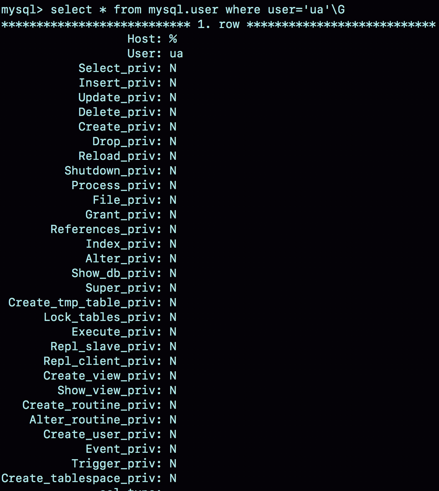

​							图1 mysql.user 数据行

在MySQL中，用户权限是有不同的范围的。接下来，我就按照用户权限范围从大到小的顺序依次和你说明。

## 全局权限

全局权限，作用于整个MySQL实例，这些权限信息保存在mysql库的user表里。如果我要给用户ua赋一个最高权限的话，语句是这么写的：

```
grant all privileges on *.* to 'ua'@'%' with grant option;
```

这个grant命令做了两个动作：

1. 磁盘上，将mysql.user表里，用户’ua’@’%'这一行的所有表示权限的字段的值都修改为‘Y’；
2. 内存里，从数组acl_users中找到这个用户对应的对象，将access值（权限位）修改为二进制的“全1”。

在这个grant命令执行完成后，如果有新的客户端使用用户名ua登录成功，MySQL会为新连接维护一个线程对象，然后从acl_users数组里查到这个用户的权限，并将权限值拷贝到这个线程对象中。之后在这个连接中执行的语句，所有关于全局权限的判断，都直接使用线程对象内部保存的权限位。

基于上面的分析我们可以知道：

1. grant 命令对于全局权限，同时更新了磁盘和内存。命令完成后即时生效，接下来新创建的连接会使用新的权限。
2. 对于一个已经存在的连接，它的全局权限不受grant命令的影响。

需要说明的是，**一般在生产环境上要合理控制用户权限的范围**。我们上面用到的这个grant语句就是一个典型的错误示范。如果一个用户有所有权限，一般就不应该设置为所有IP地址都可以访问。

如果要回收上面的grant语句赋予的权限，你可以使用下面这条命令：

```
revoke all privileges on *.* from 'ua'@'%';
```

这条revoke命令的用法与grant类似，做了如下两个动作：

1. 磁盘上，将mysql.user表里，用户’ua’@’%'这一行的所有表示权限的字段的值都修改为“N”；
2. 内存里，从数组acl_users中找到这个用户对应的对象，将access的值修改为0。

## db权限

除了全局权限，MySQL也支持库级别的权限定义。如果要让用户ua拥有库db1的所有权限，可以执行下面这条命令：

```
grant all privileges on db1.* to 'ua'@'%' with grant option;
```

基于库的权限记录保存在mysql.db表中，在内存里则保存在数组acl_dbs中。这条grant命令做了如下两个动作：

1. 磁盘上，往mysql.db表中插入了一行记录，所有权限位字段设置为“Y”；
2. 内存里，增加一个对象到数组acl_dbs中，这个对象的权限位为“全1”。

图2就是这个时刻用户ua在db表中的状态。

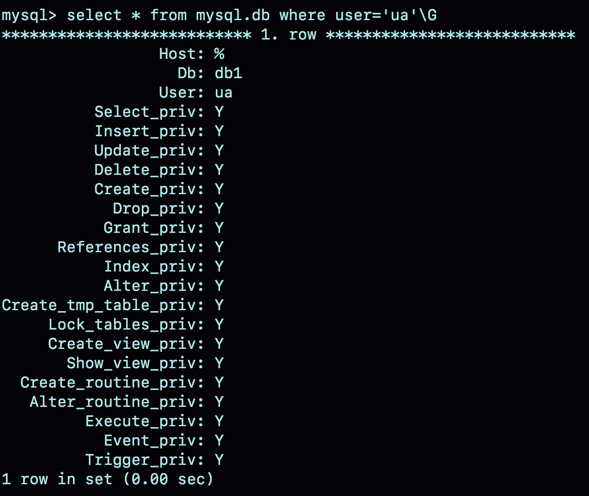

​								图2 mysql.db 数据行

每次需要判断一个用户对一个数据库读写权限的时候，都需要遍历一次acl_dbs数组，根据user、host和db找到匹配的对象，然后根据对象的权限位来判断。

也就是说，grant修改db权限的时候，是同时对磁盘和内存生效的。

grant操作对于已经存在的连接的影响，在全局权限和基于db的权限效果是不同的。接下来，我们做一个对照试验来分别看一下。

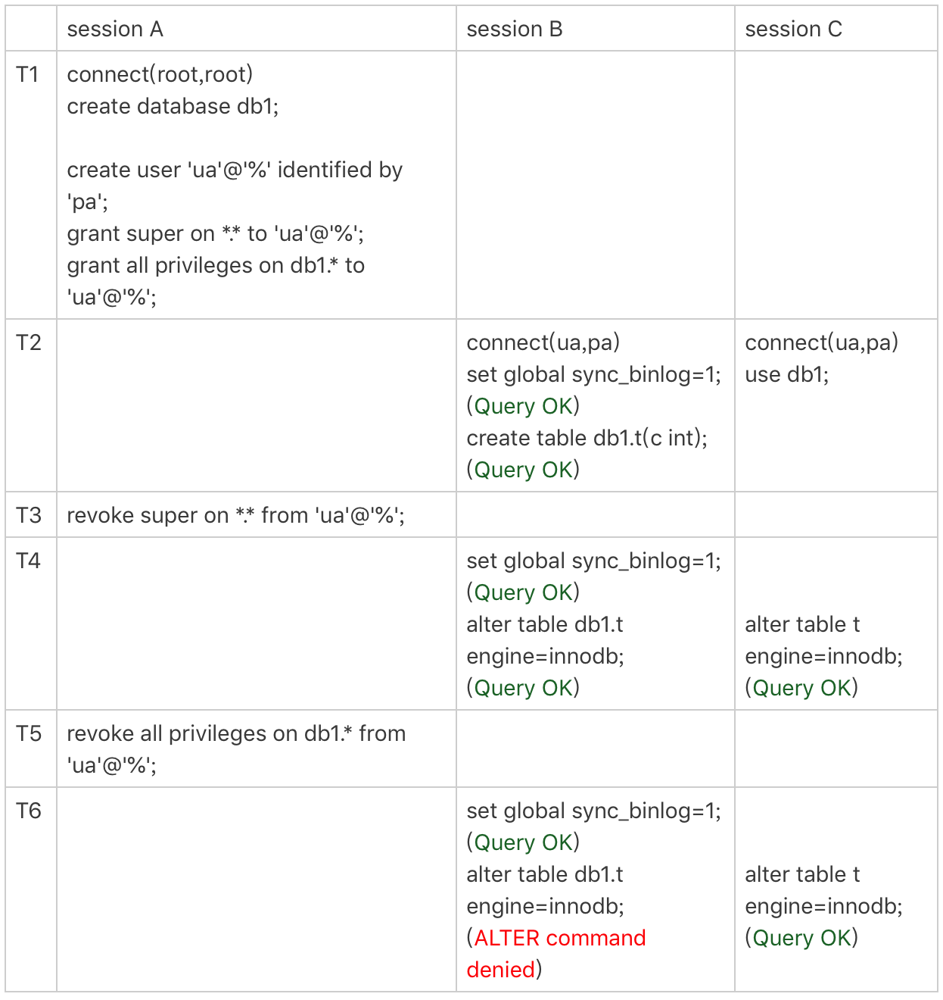

​									图3 权限操作效果

需要说明的是，图中set global sync_binlog这个操作是需要super权限的。

可以看到，虽然用户ua的super权限在T3时刻已经通过revoke语句回收了，但是在T4时刻执行set global的时候，权限验证还是通过了。这是因为super是全局权限，这个权限信息在线程对象中，而revoke操作影响不到这个线程对象。

而在T5时刻去掉ua对db1库的所有权限后，在T6时刻session B再操作db1库的表，就会报错“权限不足”。这是因为acl_dbs是一个全局数组，所有线程判断db权限都用这个数组，这样revoke操作马上就会影响到session B。

这里在代码实现上有一个特别的逻辑，如果当前会话已经处于某一个db里面，之前use这个库的时候拿到的库权限会保存在会话变量中。

你可以看到在T6时刻，session C和session B对表t的操作逻辑是一样的。但是session B报错，而session C可以执行成功。这是因为session C在T2 时刻执行的use db1，拿到了这个库的权限，在切换出db1库之前，session C对这个库就一直有权限。

## 表权限和列权限

除了db级别的权限外，MySQL支持更细粒度的表权限和列权限。其中，表权限定义存放在表mysql.tables_priv中，列权限定义存放在表mysql.columns_priv中。这两类权限，组合起来存放在内存的hash结构column_priv_hash中。

这两类权限的赋权命令如下：

```
create table db1.t1(id int, a int);

grant all privileges on db1.t1 to 'ua'@'%' with grant option;
GRANT SELECT(id), INSERT (id,a) ON mydb.mytbl TO 'ua'@'%' with grant option;
```

跟db权限类似，这两个权限每次grant的时候都会修改数据表，也会同步修改内存中的hash结构。因此，对这两类权限的操作，也会马上影响到已经存在的连接。

看到这里，你一定会问，看来grant语句都是即时生效的，那这么看应该就不需要执行flush privileges语句了呀。

答案也确实是这样的。

flush privileges命令会清空acl_users数组，然后从mysql.user表中读取数据重新加载，重新构造一个acl_users数组。也就是说，以数据表中的数据为准，会将全局权限内存数组重新加载一遍。

同样地，对于db权限、表权限和列权限，MySQL也做了这样的处理。

也就是说，如果内存的权限数据和磁盘数据表相同的话，不需要执行flush privileges。而如果我们都是用grant/revoke语句来执行的话，内存和数据表本来就是保持同步更新的。

**因此，正常情况下，grant命令之后，没有必要跟着执行flush privileges命令。**

## flush privileges使用场景

那么，flush privileges是在什么时候使用呢？显然，当数据表中的权限数据跟内存中的权限数据不一致的时候，flush privileges语句可以用来重建内存数据，达到一致状态。

这种不一致往往是由不规范的操作导致的，比如直接用DML语句操作系统权限表。我们来看一下下面这个场景：

实战45讲笔记.assets/9031814361be42b7bc084ad2ab2aa3ec.png)

​								图4 使用flush privileges

可以看到，T3时刻虽然已经用delete语句删除了用户ua，但是在T4时刻，仍然可以用ua连接成功。原因就是，这时候内存中acl_users数组中还有这个用户，因此系统判断时认为用户还正常存在。

在T5时刻执行过flush命令后，内存更新，T6时刻再要用ua来登录的话，就会报错“无法访问”了。

直接操作系统表是不规范的操作，这个不一致状态也会导致一些更“诡异”的现象发生。比如，前面这个通过delete语句删除用户的例子，就会出现下面的情况：

实战45讲笔记.assets/dd625b6b4eb2dcbdaac73648a1af50f1.png)

​							图5 不规范权限操作导致的异常

可以看到，由于在T3时刻直接删除了数据表的记录，而内存的数据还存在。这就导致了：

1. T4时刻给用户ua赋权限失败，因为mysql.user表中找不到这行记录；
2. 而T5时刻要重新创建这个用户也不行，因为在做内存判断的时候，会认为这个用户还存在。

## 小结

今天这篇文章，我和你介绍了MySQL用户权限在数据表和内存中的存在形式，以及grant和revoke命令的执行逻辑。

**使用grant和revoke语句时，无论是操作全局权限、db权限、表权限、列权限，都是会立即更新磁盘和内存的，因此完全不需要加上flush privileges**

grant语句会同时修改数据表和内存，判断权限的时候使用的是内存数据。因此，**规范地使用grant和revoke语句，是不需要随后加上flush privileges语句的。**

flush privileges语句本身会用数据表的数据重建一份内存权限数据，所以在权限数据可能存在不一致的情况下再使用。而这种不一致往往是由于直接用DML语句操作系统权限表导致的，所以我们尽量不要使用这类语句。


另外，在使用grant语句赋权时，你可能还会看到这样的写法：

```
grant super on *.* to 'ua'@'%' identified by 'pa';
```

这条命令加了identified by ‘密码’， 语句的逻辑里面除了赋权外，还包含了：

1. 如果用户’ua’@’%'**不存在**，就创建这个用户，密码是pa；
2. 如果用户ua已经**存在**，就将密码修改成pa。

这也是一种**不建议**的写法，因为这种写法很容易就会不慎把密码给改了。


“grant之后随手加flush privileges”，我自己是这么使用了两三年之后，在看代码的时候才发现其实并不需要这样做，那已经是2011年的事情了。

去年我看到一位小伙伴这么操作的时候，指出这个问题时，他也觉得很神奇。因为，他和我一样看的第一份文档就是这么写的，自己也一直是这么用的。


# 43 讲要不要使用分区表

我经常被问到这样一个问题：分区表有什么问题，为什么公司规范不让使用分区表呢？今天，我们就来聊聊分区表的使用行为，然后再一起回答这个问题。

## 分区表是什么？

为了说明分区表的组织形式，我先创建一个表t：

```
CREATE TABLE `t` (
  `ftime` datetime NOT NULL,
  `c` int(11) DEFAULT NULL,
  KEY (`ftime`)
) ENGINE=InnoDB DEFAULT CHARSET=latin1
PARTITION BY RANGE (YEAR(ftime))
(PARTITION p_2017 VALUES LESS THAN (2017) ENGINE = InnoDB,
 PARTITION p_2018 VALUES LESS THAN (2018) ENGINE = InnoDB,
 PARTITION p_2019 VALUES LESS THAN (2019) ENGINE = InnoDB,
PARTITION p_others VALUES LESS THAN MAXVALUE ENGINE = InnoDB);
insert into t values('2017-4-1',1),('2018-4-1',1);
```

实战45讲笔记.assets/06f041129783533de9c75580f9decdf5.png)

​									图1 表t的磁盘文件

我在表t中初始化插入了两行记录，按照定义的分区规则，这两行记录分别落在p_2018和p_2019这两个分区上。

可以看到，这个表包含了一个.frm文件和4个.ibd文件，每个分区对应一个.ibd文件。也就是说：

- 对于引擎层来说，这是4个表；
- 对于Server层来说，这是1个表。

你可能会觉得这两句都是废话。其实不然，这两句话非常重要，可以帮我们理解分区表的执行逻辑。

## 分区表的引擎层行为

我先给你举个在分区表加间隙锁的例子，目的是说明对于InnoDB来说，这是4个表。

实战45讲笔记.assets/d28d6ab873bd8337d88812d45b9266c7.png)

​								图2 分区表间隙锁示例

这里顺便复习一下，我在[第21篇文章](https://time.geekbang.org/column/article/75659)和你介绍的间隙锁加锁规则。

我们初始化表t的时候，只插入了两行数据， ftime的值分别是，‘2017-4-1’ 和’2018-4-1’ 。session A的select语句对索引ftime上这两个记录之间的间隙加了锁。如果是一个普通表的话，那么T1时刻，在表t的ftime索引上，间隙和加锁状态应该是图3这样的。

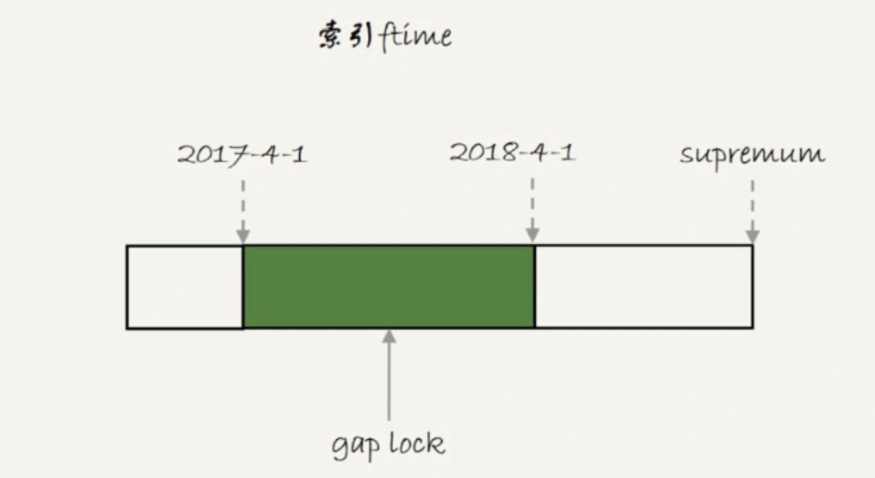

​								图3 普通表的加锁范围

也就是说，‘2017-4-1’ 和’2018-4-1’ 这两个记录之间的间隙是会被锁住的。那么，sesion B的两条插入语句应该都要进入锁等待状态。

但是，从上面的实验效果可以看出，session B的第一个insert语句是可以执行成功的。这是因为，对于引擎来说，p_2018和p_2019是两个不同的表，也就是说2017-4-1的下一个记录并不是2018-4-1，而是p_2018分区的supremum。所以T1时刻，在表t的ftime索引上，间隙和加锁的状态其实是图4这样的：


​								图4 分区表t的加锁范围

由于分区表的规则，session A的select语句其实只操作了分区p_2018，因此加锁范围就是图4中深绿色的部分。

所以，session B要写入一行ftime是2018-2-1的时候是可以成功的，而要写入2017-12-1这个记录，就要等session A的间隙锁。

图5就是这时候的show engine innodb status的部分结果。

实战45讲笔记.assets/e3d83d9ba89de9a6f541c9a2f24a3b0f.png)

​								图5 session B被锁住信息

看完InnoDB引擎的例子，我们再来一个MyISAM分区表的例子。

我首先用alter table t engine=myisam，把表t改成MyISAM表；然后，我再用下面这个例子说明，对于MyISAM引擎来说，这是4个表。

实战45讲笔记.assets/941306d4a7193455dcf1cfebf7678876.png)

​								图6 用MyISAM表锁验证

在session A里面，我用sleep(100)将这条语句的执行时间设置为100秒。由于MyISAM引擎只支持表锁，所以这条update语句会锁住整个表t上的读。

但我们看到的结果是，session B的第一条查询语句是可以正常执行的，第二条语句才进入锁等待状态。

这正是因为MyISAM的表锁是在引擎层实现的，session A加的表锁，其实是锁在分区p_2018上。因此，只会堵住在这个分区上执行的查询，落到其他分区的查询是不受影响的。

看到这里，你可能会说，分区表看来还不错嘛，为什么不让用呢？我们使用分区表的一个重要原因就是单表过大。那么，如果不使用分区表的话，我们就是要使用手动分表的方式。

接下来，我们一起看看手动分表和分区表有什么区别。

比如，按照年份来划分，我们就分别创建普通表t_2017、t_2018、t_2019等等。手工分表的逻辑，也是找到需要更新的所有分表，然后依次执行更新。在性能上，这和分区表并没有实质的差别。

分区表和手工分表，一个是由server层来决定使用哪个分区，一个是由应用层代码来决定使用哪个分表。因此，从引擎层看，这两种方式也是没有差别的。

其实这两个方案的区别，主要是在server层上。从server层看，我们就不得不提到分区表一个被广为诟病的问题：打开表的行为。

## 分区策略

每当第一次访问一个分区表的时候，MySQL需要把所有的分区都访问一遍。**一个典型的报错情况**是这样的：如果一个分区表的分区很多，比如超过了1000个，而MySQL启动的时候，open_files_limit参数使用的是默认值1024，那么就会在访问这个表的时候，由于需要打开所有的文件，导致打开表文件的个数超过了上限而报错。

下图就是我创建的一个包含了很多分区的表t_myisam，执行一条插入语句后报错的情况。

实战45讲笔记.assets/abfa0054ec43d97fb18ba3c1c8829ae7.png)

​								图 7 insert 语句报错

可以看到，这条insert语句，明显只需要访问一个分区，但语句却无法执行。

这时，你一定从表名猜到了，这个表我用的是MyISAM引擎。是的，因为使用InnoDB引擎的话，并不会出现这个问题。

MyISAM分区表使用的分区策略，我们称为**通用分区策略**（generic partitioning），每次访问分区都由server层控制。通用分区策略，是MySQL一开始支持分区表的时候就存在的代码，在文件管理、表管理的实现上很粗糙，因此有比较严重的性能问题。

从MySQL 5.7.9开始，InnoDB引擎引入了**本地分区策略**（native partitioning）。这个策略是在InnoDB内部自己管理打开分区的行为。

MySQL从5.7.17开始，将MyISAM分区表标记为即将弃用(deprecated)，意思是“从这个版本开始不建议这么使用，请使用替代方案。在将来的版本中会废弃这个功能”。

从MySQL 8.0版本开始，就不允许创建MyISAM分区表了，只允许创建已经实现了本地分区策略的引擎。目前来看，只有InnoDB和NDB这两个引擎支持了本地分区策略。

接下来，我们再看一下分区表在server层的行为。

## 分区表的server层行为

如果从server层看的话，一个分区表就只是一个表。

这句话是什么意思呢？接下来，我就用下面这个例子来和你说明。如图8和图9所示，分别是这个例子的操作序列和执行结果图。

实战45讲笔记.assets/0eca5a3190161e59ea58493915bd5e81.png)

​								图8 分区表的MDL锁

实战45讲笔记.assets/afe662f5e051a2ceb96a87624a589aa8.png)

​								图9 show processlist结果

可以看到，虽然session B只需要操作p_2107这个分区，但是由于session A持有整个表t的MDL锁，就导致了session B的alter语句被堵住。

这也是DBA同学经常说的，分区表，在做DDL的时候，影响会更大。如果你使用的是普通分表，那么当你在truncate一个分表的时候，肯定不会跟另外一个分表上的查询语句，出现MDL锁冲突。

到这里我们小结一下：

1. MySQL在第一次打开分区表的时候，需要访问所有的分区；
2. 在server层，认为这是同一张表，因此所有分区共用同一个MDL锁；
3. 在引擎层，认为这是不同的表，因此MDL锁之后的执行过程，会根据分区表规则，只访问必要的分区。

而关于“必要的分区”的判断，就是根据SQL语句中的where条件，结合分区规则来实现的。比如我们上面的例子中，where ftime=‘2018-4-1’，根据分区规则year函数算出来的值是2018，那么就会落在p_2019这个分区。

但是，如果这个where 条件改成 where ftime>=‘2018-4-1’，虽然查询结果相同，但是这时候根据where条件，就要访问p_2019和p_others这两个分区。

如果查询语句的where条件中没有分区key，那就只能访问所有分区了。当然，这并不是分区表的问题。即使是使用业务分表的方式，where条件中没有使用分表的key，也必须访问所有的分表。

我们已经理解了分区表的概念，那么什么场景下适合使用分区表呢？

## 分区表的应用场景

分区表的一个显而易见的优势是对业务透明，相对于用户分表来说，使用分区表的业务代码更简洁。还有，分区表可以很方便的清理历史数据。

如果一项业务跑的时间足够长，往往就会有根据时间删除历史数据的需求。这时候，按照时间分区的分区表，就可以直接通过alter table t drop partition …这个语法删掉分区，从而删掉过期的历史数据。

这个alter table t drop partition …操作是直接删除分区文件，效果跟drop普通表类似。与使用delete语句删除数据相比，优势是速度快、对系统影响小。

## 小结和问题

这篇文章，我主要和你介绍的是server层和引擎层对分区表的处理方式。我希望通过这些介绍，你能够对是否选择使用分区表，有更清晰的想法。

需要注意的是，我是以范围分区（range）为例和你介绍的。实际上，MySQL还支持hash分区、list分区等分区方法。你可以在需要用到的时候，再翻翻[手册](https://dev.mysql.com/doc/refman/8.0/en/partitioning-types.html)。


一个含有4个分区的分区表包含了一个.frm文件和4个.ibd文件，每个分区对应一个.ibd文件。也就是说：

- 对于引擎层来说，这是4个表；
- 对于Server层来说，这是1个表。

具体来看：

1. MySQL在**第一次**打开分区表的时候，需要**访问所有**的分区；
2. 在server层，认为这是同一张表，因此所有分区**共用同一个MDL锁**；
3. 在**引擎层**，认为这是不同的表，因此MDL锁之后的执行过程，会根据分区表规则，**只访问必要的分区**。

实际使用时，分区表跟用户分表比起来，有两个绕不开的问题：**一个是第一次访问的时候需要访问所有分区，另一个是共用MDL锁。**

因此，如果要使用分区表，就不要创建太多的分区。我见过一个用户做了按天分区策略，然后预先创建了10年的分区。这种情况下，访问分区表的性能自然是不好的。这里有两个问题需要注意：

1. 分区并不是越细越好。实际上，单表或者单分区的数据一千万行，只要没有特别大的索引，对于现在的硬件能力来说都已经是小表了。
2. 分区也不要提前预留太多，在使用之前预先创建即可。比如，如果是按月分区，每年年底时再把下一年度的12个新分区创建上即可。对于没有数据的历史分区，要及时的drop掉。

至于分区表的其他问题，比如查询需要跨多个分区取数据，查询性能就会比较慢，基本上就不是分区表本身的问题，而是数据量的问题或者说是使用方式的问题了。

当然，如果你的团队已经维护了成熟的分库分表中间件，用业务分表，对业务开发同学没有额外的复杂性，对DBA也更直观，自然是更好的。


最后，我给你留下一个思考题吧。

我们举例的表中没有用到自增主键，假设现在要创建一个自增字段id。MySQL要求分区表中的主键必须包含分区字段。如果要在表t的基础上做修改，你会怎么定义这个表的主键呢？为什么这么定义呢？

这时候就有两种可选：一种是(ftime, id)，另一种是(id, ftime)。

如果从利用率上来看，应该使用(ftime, id)这种模式。因为用ftime做分区key，说明大多数语句都是包含ftime的，使用这种模式，可以利用前缀索引的规则，减少一个索引。

这时的建表语句是：

```
CREATE TABLE `t` (
  `id` int(11) NOT NULL AUTO_INCREMENT,
  `ftime` datetime NOT NULL,
  `c` int(11) DEFAULT NULL,
  PRIMARY KEY (`ftime`,`id`)
) ENGINE=MyISAM DEFAULT CHARSET=latin1
PARTITION BY RANGE (YEAR(ftime))
(PARTITION p_2017 VALUES LESS THAN (2017) ENGINE = MyISAM,
 PARTITION p_2018 VALUES LESS THAN (2018) ENGINE = MyISAM,
 PARTITION p_2019 VALUES LESS THAN (2019) ENGINE = MyISAM,
 PARTITION p_others VALUES LESS THAN MAXVALUE ENGINE = MyISAM);
```

当然，我的建议是你要尽量使用InnoDB引擎。InnoDB表要求至少有一个索引，以自增字段作为第一个字段，所以需要加一个id的单独索引。

```
CREATE TABLE `t` (
  `id` int(11) NOT NULL AUTO_INCREMENT,
  `ftime` datetime NOT NULL,
  `c` int(11) DEFAULT NULL,
  PRIMARY KEY (`ftime`,`id`),
  KEY `id` (`id`)
) ENGINE=InnoDB DEFAULT CHARSET=latin1
PARTITION BY RANGE (YEAR(ftime))
(PARTITION p_2017 VALUES LESS THAN (2017) ENGINE = InnoDB,
 PARTITION p_2018 VALUES LESS THAN (2018) ENGINE = InnoDB,
 PARTITION p_2019 VALUES LESS THAN (2019) ENGINE = InnoDB,
 PARTITION p_others VALUES LESS THAN MAXVALUE ENGINE = InnoDB);
```

当然把字段反过来，创建成：

```
  PRIMARY KEY (`id`,`ftime`),
  KEY `id` (`ftime`)
```

也是可以的。


# 44 讲答疑文章（三）：

## join的写法

在第35篇文章[《join语句怎么优化？》](https://time.geekbang.org/column/article/80147)中，我在介绍join执行顺序的时候，用的都是straight_join。@郭健 同学在文后提出了两个问题：

1. 如果用left join的话，左边的表一定是驱动表吗？
2. 如果两个表的join包含多个条件的等值匹配，是都要写到on里面呢，还是只把一个条件写到on里面，其他条件写到where部分？

为了同时回答这两个问题，我来构造两个表a和b：

```
create table a(f1 int, f2 int, index(f1))engine=innodb;
create table b(f1 int, f2 int)engine=innodb;
insert into a values(1,1),(2,2),(3,3),(4,4),(5,5),(6,6);
insert into b values(3,3),(4,4),(5,5),(6,6),(7,7),(8,8);
```

表a和b都有两个字段f1和f2，不同的是表a的字段f1上有索引。然后，我往两个表中都插入了6条记录，其中在表a和b中同时存在的数据有4行。

@郭健 同学提到的第二个问题，其实就是下面这两种写法的区别：

```
select * from a left join b on(a.f1=b.f1) and (a.f2=b.f2); /*Q1*/
select * from a left join b on(a.f1=b.f1) where (a.f2=b.f2);/*Q2*/
```

我把这两条语句分别记为Q1和Q2。

首先，需要说明的是，这两个left join语句的语义逻辑并不相同。我们先来看一下它们的执行结果。

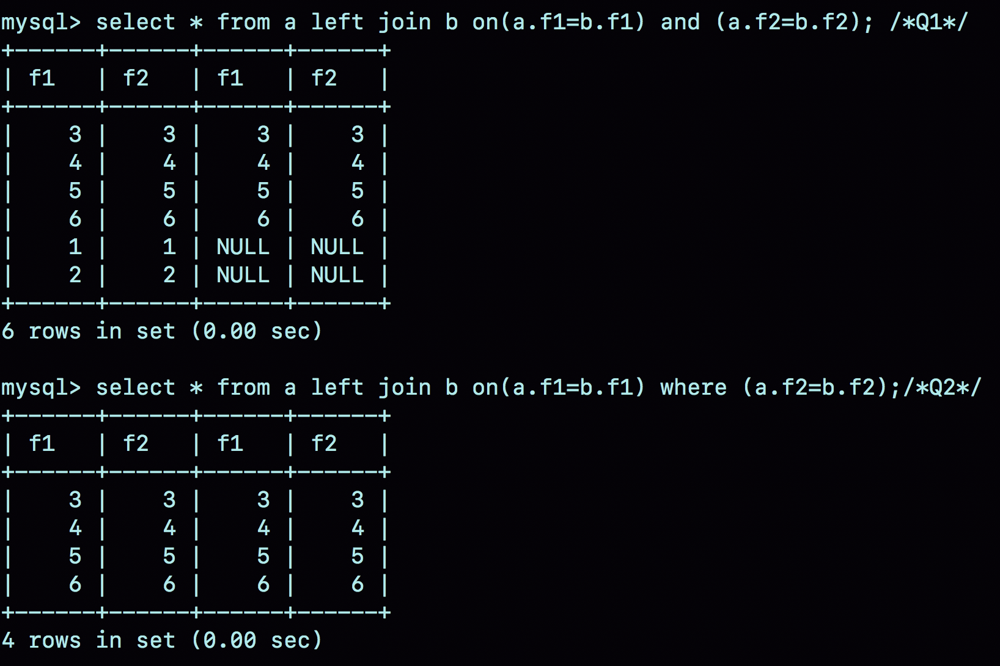

​								图1 两个join的查询结果

可以看到：

- 语句Q1返回的数据集是6行，表a中即使没有满足匹配条件的记录，查询结果中也会返回一行，并将表b的各个字段值填成NULL。
- 语句Q2返回的是4行。从逻辑上可以这么理解，最后的两行，由于表b中没有匹配的字段，结果集里面b.f2的值是空，不满足where 部分的条件判断，因此不能作为结果集的一部分。

接下来，我们看看实际执行这两条语句时，MySQL是怎么做的。

我们先一起看看语句Q1的explain结果：

实战45讲笔记.assets/b7f27917ceb0be90ef7b201f2794c817.png)

​								图2 Q1的explain结果

可以看到，这个结果符合我们的预期：

- 驱动表是表a，被驱动表是表b；
- 由于表b的f1字段上没有索引，所以使用的是Block Nexted Loop Join（简称BNL） 算法。

看到BNL算法，你就应该知道这条语句的执行流程其实是这样的：

1. 把表a的内容读入join_buffer 中。因为是select * ，所以字段f1和f2都被放入join_buffer了。
2. 顺序扫描表b，对于每一行数据，判断join条件（也就是a.f1=b.f1 and a.f2=b.f2)是否满足，满足条件的记录, 作为结果集的一行返回。如果语句中有where子句，需要先判断where部分满足条件后，再返回。
3. 表b扫描完成后，对于没有被匹配的表a的行（在这个例子中就是(1,1)、(2,2)这两行），把剩余字段补上NULL，再放入结果集中。

对应的流程图如下：


​								图3 left join -BNL算法

可以看到，这条语句确实是以表a为驱动表，而且从执行效果看，也和使用straight_join是一样的。

你可能会想，语句Q2的查询结果里面少了最后两行数据，是不是就是把上面流程中的步骤3去掉呢？我们还是先看一下语句Q2的expain结果吧。

实战45讲笔记.assets/f5712c56dc84d331990409a5c313ea9c.png)

​								图4 Q2的explain结果

这里先和你说一句题外话，专栏马上就结束了，我也和你一起根据explain结果“脑补”了很多次一条语句的执行流程了，所以我希望你已经具备了这个能力。今天，我们再一起分析一次SQL语句的explain结果。

可以看到，这条语句是以表b为驱动表的。而如果一条join语句的Extra字段什么都没写的话，就表示使用的是Index Nested-Loop Join（简称NLJ）算法。

因此，语句Q2的执行流程是这样的：顺序扫描表b，每一行用b.f1到表a中去查，匹配到记录后判断a.f2=b.f2是否满足，满足条件的话就作为结果集的一部分返回。

那么，**为什么语句Q1和Q2这两个查询的执行流程会差距这么大呢？**其实，这是因为优化器基于Q2这个查询的语义做了优化。

为了理解这个问题，我需要再和你交代一个背景知识点：在MySQL里，NULL跟任何值执行等值判断和不等值判断的结果，都是NULL。这里包括， select NULL = NULL 的结果，也是返回NULL。

因此，语句Q2里面where a.f2=b.f2就表示，查询结果里面不会包含b.f2是NULL的行，这样这个left join的语义就是“找到这两个表里面，f1、f2对应相同的行。对于表a中存在，而表b中匹配不到的行，就放弃”。

这样，这条语句虽然用的是left join，但是语义跟join是一致的。

因此，优化器就把这条语句的left join改写成了join，然后因为表a的f1上有索引，就把表b作为驱动表，这样就可以用上NLJ 算法。在执行explain之后，你再执行show warnings，就能看到这个改写的结果，如图5所示。

实战45讲笔记.assets/d74878e7469edb8b713a18c6158530ab.png)

​									图5 Q2的改写结果

这个例子说明，即使我们在SQL语句中写成left join，执行过程还是有可能不是从左到右连接的。也就是说，**使用left join时，左边的表不一定是驱动表。**

这样看来，**如果需要left join的语义，就不能把被驱动表的字段放在where条件里面做等值判断或不等值判断，必须都写在on里面。**那如果是join语句呢？

这时候，我们再看看这两条语句：

```
select * from a join b on(a.f1=b.f1) and (a.f2=b.f2); /*Q3*/
select * from a join b on(a.f1=b.f1) where (a.f2=b.f2);/*Q4*/
```

我们再使用一次看explain 和 show warnings的方法，看看优化器是怎么做的。

实战45讲笔记.assets/d9952e4c2150bc649c7f2977e6ea80f5.png)

​								图6 join语句改写

可以看到，这两条语句都被改写成：

```
select * from a join b where (a.f1=b.f1) and (a.f2=b.f2);
```

执行计划自然也是一模一样的。

也就是说，在这种情况下，join将判断条件是否全部放在on部分就没有区别了。

## Simple Nested Loop Join 的性能问题

我们知道，join语句使用不同的算法，对语句的性能影响会很大。在第34篇文章[《到底可不可以使用join？》](https://time.geekbang.org/column/article/79700)的评论区中，@书策稠浊 和 @朝夕心 两位同学提了一个很不错的问题。

我们在文中说到，虽然BNL算法和Simple Nested Loop Join 算法都是要判断M*N次（M和N分别是join的两个表的行数），但是Simple Nested Loop Join 算法的每轮判断都要走全表扫描，因此性能上BNL算法执行起来会快很多。

为了便于说明，我还是先为你简单描述一下这两个算法。

BNL算法的执行逻辑是：

1. 首先，将驱动表的数据全部读入内存join_buffer中，这里join_buffer是无序数组；
2. 然后，顺序遍历被驱动表的所有行，每一行数据都跟join_buffer中的数据进行匹配，匹配成功则作为结果集的一部分返回。

Simple Nested Loop Join算法的执行逻辑是：顺序取出驱动表中的每一行数据，到被驱动表去做全表扫描匹配，匹配成功则作为结果集的一部分返回。

这两位同学的疑问是，Simple Nested Loop Join算法，其实也是把数据读到内存里，然后按照匹配条件进行判断，为什么性能差距会这么大呢？

解释这个问题，需要用到MySQL中索引结构和Buffer Pool的相关知识点：

1. 在对被驱动表做全表扫描的时候，如果数据没有在Buffer Pool中，就需要等待这部分数据从磁盘读入；
   从磁盘读入数据到内存中，会影响正常业务的Buffer Pool命中率，而且这个算法天然会对被驱动表的数据做多次访问，更容易将这些数据页放到Buffer Pool的头部（请参考[第35篇文章](https://time.geekbang.org/column/article/80147)中的相关内容)；
2. 即使被驱动表数据都在内存中，每次查找“下一个记录的操作”，都是类似指针操作。而join_buffer中是数组，遍历的成本更低。

所以说，BNL算法的性能会更好。

## distinct 和 group by的性能

在第37篇文章[《什么时候会使用内部临时表？》](https://time.geekbang.org/column/article/80477)中，@老杨同志 提了一个好问题：如果只需要去重，不需要执行聚合函数，distinct 和group by哪种效率高一些呢？

我来展开一下他的问题：如果表t的字段a上没有索引，那么下面这两条语句：

```
select a from t group by a order by null;
select distinct a from t;
```

的性能是不是相同的?

首先需要说明的是，这种group by的写法，并不是SQL标准的写法。标准的group by语句，是需要在select部分加一个聚合函数，比如：

```
select a,count(*) from t group by a order by null;
```

这条语句的逻辑是：按照字段a分组，计算每组的a出现的次数。在这个结果里，由于做的是聚合计算，相同的a只出现一次。

> 备注：这里你可以顺便复习一下[第37篇文章](https://time.geekbang.org/column/article/80477)中关于group by的相关内容。

没有了count(*)以后，也就是不再需要执行“计算总数”的逻辑时，第一条语句的逻辑就变成是：按照字段a做分组，相同的a的值只返回一行。而这就是distinct的语义，所以不需要执行聚合函数时，distinct 和group by这两条语句的语义和执行流程是相同的，因此**执行性能也相同。**

这两条语句的执行流程是下面这样的。

1. 创建一个临时表，临时表有一个字段a，并且在这个字段a上创建一个唯一索引；
2. 遍历表t，依次取数据插入临时表中：
   - 如果发现唯一键冲突，就跳过；
   - 否则插入成功；
3. 遍历完成后，将临时表作为结果集返回给客户端。

## 备库自增主键问题

除了性能问题，大家对细节的追问也很到位。在第39篇文章[《自增主键为什么不是连续的？》](https://time.geekbang.org/column/article/80531)评论区，@帽子掉了 同学问到：在binlog_format=statement时，语句A先获取id=1，然后语句B获取id=2；接着语句B提交，写binlog，然后语句A再写binlog。这时候，如果binlog重放，是不是会发生语句B的id为1，而语句A的id为2的不一致情况呢？

首先，这个问题默认了“自增id的生成顺序，和binlog的写入顺序可能是不同的”，这个理解是正确的。

其次，这个问题限定在statement格式下，也是对的。因为row格式的binlog就没有这个问题了，Write row event里面直接写了每一行的所有字段的值。

而至于为什么不会发生不一致的情况，我们来看一下下面的这个例子。

```
create table t(id int auto_increment primary key);
insert into t values(null);
```

实战45讲笔记.assets/b55b2167aa301d899ccc86a00b496b25.png)

​							图7 insert 语句的binlog

可以看到，在insert语句之前，还有一句SET INSERT_ID=1。这条命令的意思是，这个线程里下一次需要用到自增值的时候，不论当前表的自增值是多少，固定用1这个值。

这个SET INSERT_ID语句是固定跟在insert语句之前的，比如@帽子掉了同学提到的场景，主库上语句A的id是1，语句B的id是2，但是写入binlog的顺序先B后A，那么binlog就变成：

```
SET INSERT_ID=2;
语句B；
SET INSERT_ID=1;
语句A；
```

你看，在备库上语句B用到的INSERT_ID依然是2，跟主库相同。

因此，即使两个INSERT语句在主备库的执行顺序不同，自增主键字段的值也不会不一致。

## 小结

今天这篇答疑文章，我选了4个好问题和你分享，并做了分析。在我看来，能够提出好问题，首先表示这些同学理解了我们文章的内容，进而又做了深入思考。有你们在认真的阅读和思考，对我来说是鼓励，也是动力。

说实话，短短的三篇答疑文章无法全部展开同学们在评论区留下的高质量问题，之后有的同学还会二刷，也会有新的同学加入，大家想到新的问题就请给我留言吧，我会继续关注评论区，和你在评论区交流。


老规矩，答疑文章也是要有课后思考题的。

在[第8篇文章](https://time.geekbang.org/column/article/70562)的评论区， @XD同学提到一个问题：他查看了一下innodb_trx，发现这个事务的trx_id是一个很大的数（281479535353408），而且似乎在同一个session中启动的会话得到的trx_id是保持不变的。当执行任何加写锁的语句后，trx_id都会变成一个很小的数字（118378）。

你可以通过实验验证一下，然后分析看看，事务id的分配规则是什么，以及MySQL为什么要这么设计呢？


# 45 自增id用完的情况

实战45讲笔记.assets/image-20231020153102372.png)

MySQL 里有很多自增的 id，每个自增 id 都是定义了初始值，然后不停地往上加步长。虽然自然数是没有上限的，但是在计算机里，只要定义了表示这个数的字节长度，那它就有上限。比如，无符号整型 (unsigned int) 是 4 个字节，上限就是 232-1。

既然自增 id 有上限，就有可能被用完。但是，自增 id 用完了会怎么样呢？

今天这篇文章，我们就来看看 MySQL 里面的几种自增 id，一起分析一下它们的值达到上限以后，会出现什么情况。

## 表定义自增值 id

说到自增 id，你第一个想到的应该就是表结构定义里的自增字段，也就是我在第 39 篇文章[《自增主键为什么不是连续的？》](https://time.geekbang.org/column/article/80531)中和你介绍过的自增主键 id。

表定义的自增值达到上限后的逻辑是：再申请下一个 id 时，得到的值保持不变。

我们可以通过下面这个语句序列验证一下：

```
create table t(id int unsigned auto_increment primary key) auto_increment=4294967295;
insert into t values(null);
// 成功插入一行 4294967295
show create table t;
/* CREATE TABLE `t` (
  `id` int(10) unsigned NOT NULL AUTO_INCREMENT,
  PRIMARY KEY (`id`)
) ENGINE=InnoDB AUTO_INCREMENT=4294967295;
*/
 
insert into t values(null);
//Duplicate entry '4294967295' for key 'PRIMARY'
```

可以看到，**第一个 insert 语句插入数据成功后，这个表的 AUTO_INCREMENT 没有改变（还是 4294967295），就导致了第二个 insert 语句又拿到相同的自增 id 值，再试图执行插入语句，报主键冲突错误。**

232-1（4294967295）不是一个特别大的数，对于一个频繁插入删除数据的表来说，是可能会被用完的。因此在建表的时候你需要考察你的表是否有可能达到这个上限，如果有可能，就应该创建成 8 个字节的 bigint unsigned。

## InnoDB 系统自增 row_id

如果你创建的 InnoDB 表没有指定主键，那么 InnoDB 会给你创建一个不可见的，长度为 6 个字节的 row_id。InnoDB 维护了一个全局的 dict_sys.row_id 值，所有无主键的 InnoDB 表，每插入一行数据，都将当前的 dict_sys.row_id 值作为要插入数据的 row_id，然后把 dict_sys.row_id 的值加 1。

实际上，在代码实现时 row_id 是一个长度为 8 字节的无符号长整型 (bigint unsigned)。但是，InnoDB 在设计时，给 row_id 留的只是 6 个字节的长度，这样写到数据表中时只放了最后 6 个字节，所以 row_id 能写到数据表中的值，就有两个特征：

1. row_id 写入表中的值范围，是从 0 到 248-1；
2. 当 dict_sys.row_id=248时，如果再有插入数据的行为要来申请 row_id，拿到以后再取最后 6 个字节的话就是 0。

也就是说，写入表的 row_id 是从 0 开始到 248-1。达到上限后，下一个值就是 0，然后继续循环。

当然，248-1 这个值本身已经很大了，但是如果一个 MySQL 实例跑得足够久的话，还是可能达到这个上限的。在 InnoDB 逻辑里，**申请到 row_id=N 后，就将这行数据写入表中；如果表中已经存在 row_id=N 的行，新写入的行就会覆盖原有的行。**

要验证这个结论的话，你可以通过 gdb 修改系统的自增 row_id 来实现。注意，用 gdb 改变量这个操作是为了便于我们复现问题，只能在测试环境使用。

![img]()

​							图 1 row_id 用完的验证序列

![img]()

​							图 2 row_id 用完的效果验证

可以看到，在我用 gdb 将 dict_sys.row_id 设置为 248之后，再插入的 a=2 的行会出现在表 t 的第一行，因为这个值的 row_id=0。之后再插入的 a=3 的行，由于 row_id=1，就覆盖了之前 a=1 的行，因为 a=1 这一行的 row_id 也是 1。

从这个角度看，我们还是应该在 InnoDB 表中主动创建自增主键。因为，表自增 id 到达上限后，再插入数据时报主键冲突错误，是更能被接受的。

毕竟覆盖数据，就意味着数据丢失，影响的是数据可靠性；报主键冲突，是插入失败，影响的是可用性。而一般情况下，可靠性优先于可用性。

## Xid

在第 15 篇文章[《答疑文章（一）：日志和索引相关问题》](https://time.geekbang.org/column/article/73161)中，我和你介绍 redo log 和 binlog 相配合的时候，提到了它们有一个共同的字段叫作 Xid。它在 MySQL 中是用来对应事务的。

那么，Xid 在 MySQL 内部是怎么生成的呢？

MySQL 内部维护了一个全局变量 global_query_id，每次执行语句的时候将它赋值给 Query_id，然后给这个变量加 1。如果当前语句是这个事务执行的第一条语句，那么 MySQL 还会同时把 Query_id 赋值给这个事务的 Xid。

**而 global_query_id 是一个纯内存变量，重启之后就清零了。所以你就知道了，在同一个数据库实例中，不同事务的 Xid 也是有可能相同的。**

**但是 MySQL 重启之后会重新生成新的 binlog 文件，这就保证了，同一个 binlog 文件里，Xid 一定是唯一的。**

虽然 MySQL 重启不会导致同一个 binlog 里面出现两个相同的 Xid，但是如果 global_query_id 达到上限后，就会继续从 0 开始计数。从理论上讲，还是就会出现同一个 binlog 里面出现相同 Xid 的场景。

因为 global_query_id 定义的长度是 8 个字节，这个自增值的上限是 264-1。要出现这种情况，必须是下面这样的过程：

1. 执行一个事务，假设 Xid 是 A；
2. 接下来执行 264次查询语句，让 global_query_id 回到 A；
3. 再启动一个事务，这个事务的 Xid 也是 A。

不过，264这个值太大了，大到你可以认为这个可能性只会存在于理论上。

## Innodb trx_id

Xid 和 InnoDB 的 trx_id 是两个容易混淆的概念。

Xid 是由 server 层维护的。InnoDB 内部使用 Xid，就是为了能够在 InnoDB 事务和 server 之间做关联。但是，InnoDB 自己的 trx_id，是另外维护的。

其实，你应该非常熟悉这个 trx_id。它就是在我们在第 8 篇文章[《事务到底是隔离的还是不隔离的？》](https://time.geekbang.org/column/article/70562)中讲事务可见性时，用到的事务 id（transaction id）。

InnoDB 内部维护了一个 max_trx_id 全局变量，每次需要申请一个新的 trx_id 时，就获得 max_trx_id 的当前值，然后并将 max_trx_id 加 1。

InnoDB 数据可见性的核心思想是：每一行数据都记录了更新它的 trx_id，当一个事务读到一行数据的时候，判断这个数据是否可见的方法，就是通过事务的一致性视图与这行数据的 trx_id 做对比。

对于正在执行的事务，你可以从 information_schema.innodb_trx 表中看到事务的 trx_id。

我在上一篇文章的末尾留给你的思考题，就是关于从 innodb_trx 表里面查到的 trx_id 的。现在，我们一起来看一个事务现场：

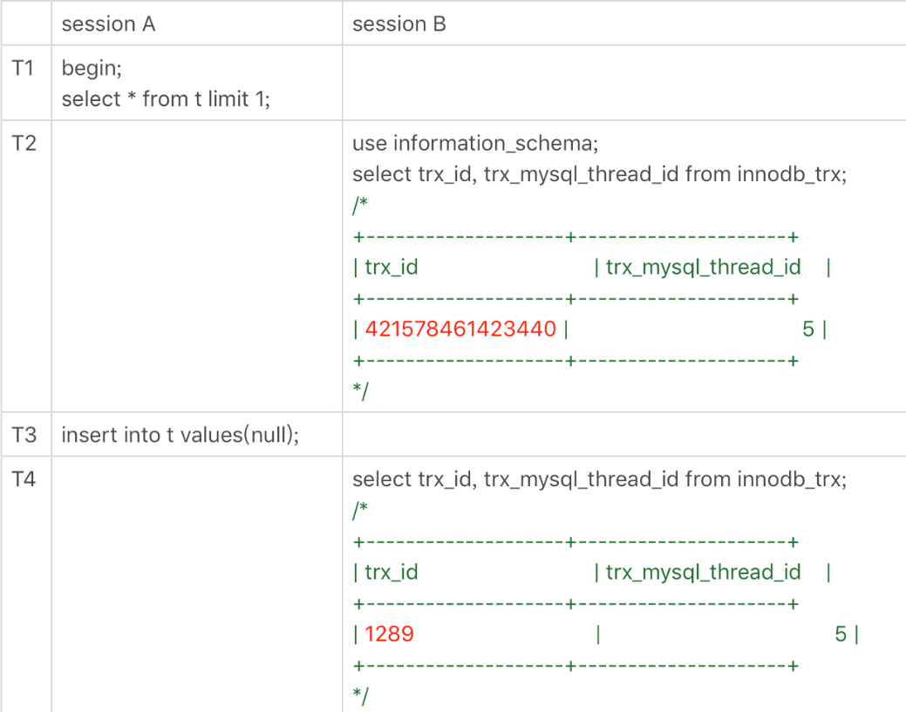

​								图 3 事务的 trx_id

session B 里，我从 innodb_trx 表里查出的这两个字段，第二个字段 trx_mysql_thread_id 就是线程 id。显示线程 id，是为了说明这两次查询看到的事务对应的线程 id 都是 5，也就是 session A 所在的线程。

可以看到，T2 时刻显示的 trx_id 是一个很大的数；T4 时刻显示的 trx_id 是 1289，看上去是一个比较正常的数字。这是什么原因呢？

实际上，在 T1 时刻，session A 还没有涉及到更新，是一个只读事务。而对于只读事务，InnoDB 并不会分配 trx_id。也就是说：

1. 在 T1 时刻，trx_id 的值其实就是 0。而这个很大的数，只是显示用的。一会儿我会再和你说说这个数据的生成逻辑。
2. 直到 session A 在 T3 时刻执行 insert 语句的时候，InnoDB 才真正分配了 trx_id。所以，T4 时刻，session B 查到的这个 trx_id 的值就是 1289。

需要注意的是，除了显而易见的修改类语句外，如果在 select 语句后面加上 for update，这个事务也不是只读事务。

在上一篇文章的评论区，有同学提出，实验的时候发现不止加 1。这是因为：

1. update 和 delete 语句除了事务本身，还涉及到标记删除旧数据，也就是要把数据放到 purge 队列里等待后续物理删除，这个操作也会把 max_trx_id+1， 因此在一个事务中至少加 2；
2. InnoDB 的后台操作，比如表的索引信息统计这类操作，也是会启动内部事务的，因此你可能看到，trx_id 值并不是按照加 1 递增的。

那么，**T2 时刻查到的这个很大的数字是怎么来的呢？**

其实，这个数字是每次查询的时候由系统临时计算出来的。它的算法是：把当前事务的 trx 变量的指针地址转成整数，再加上 2^48^。使用这个算法，就可以保证以下两点：

1. 因为同一个只读事务在执行期间，它的指针地址是不会变的，所以不论是在 innodb_trx 还是在 innodb_locks 表里，同一个只读事务查出来的 trx_id 就会是一样的。
2. 如果有并行的多个只读事务，每个事务的 trx 变量的指针地址肯定不同。这样，不同的并发只读事务，查出来的 trx_id 就是不同的。

那么，**为什么还要再加上 2^48^呢？**

在显示值里面加上 2^48^，目的是要保证只读事务显示的 trx_id 值比较大，正常情况下就会区别于读写事务的 id。但是，trx_id 跟 row_id 的逻辑类似，定义长度也是 8 个字节。因此，在理论上还是可能出现一个读写事务与一个只读事务显示的 trx_id 相同的情况。不过这个概率很低，并且也没有什么实质危害，可以不管它。

另一个问题是，**只读事务不分配 trx_id，有什么好处呢？**

- 一个好处是，这样做可以减小事务视图里面活跃事务数组的大小。因为当前正在运行的只读事务，是不影响数据的可见性判断的。所以，在创建事务的一致性视图时，InnoDB 就只需要拷贝读写事务的 trx_id。
- 另一个好处是，可以减少 trx_id 的申请次数。在 InnoDB 里，即使你只是执行一个普通的 select 语句，在执行过程中，也是要对应一个只读事务的。所以只读事务优化后，普通的查询语句不需要申请 trx_id，就大大减少了并发事务申请 trx_id 的锁冲突。

由于只读事务不分配 trx_id，一个自然而然的结果就是 trx_id 的增加速度变慢了。

但是，max_trx_id 会持久化存储，重启也不会重置为 0，那么从理论上讲，只要一个 MySQL 服务跑得足够久，就可能出现 max_trx_id 达到 2^48^-1 的上限，然后从 0 开始的情况。

当达到这个状态后，MySQL 就会持续出现一个脏读的 bug，我们来复现一下这个 bug。

首先我们需要把当前的 max_trx_id 先修改成 2^48^-1。注意：这个 case 里使用的是可重复读隔离级别。具体的操作流程如下：

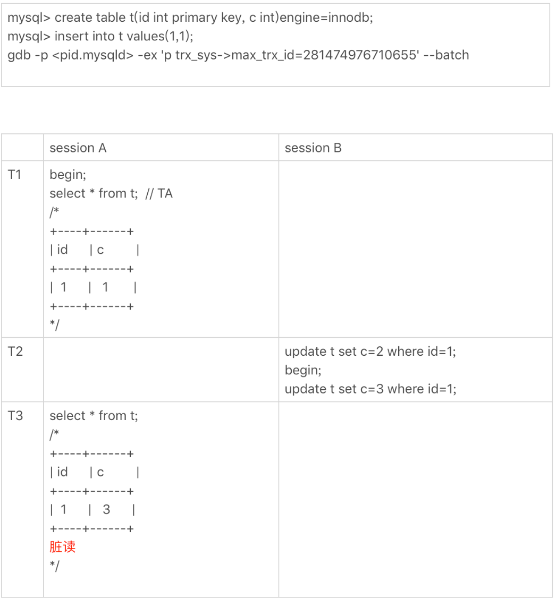

​									图 4 复现脏读

由于我们已经把系统的 max_trx_id 设置成了 2^48^-1，所以在 session A 启动的事务 TA 的低水位就是 248-1。

在 T2 时刻，session B 执行第一条 update 语句的事务 id 就是 2^48^-1，而第二条 update 语句的事务 id 就是 0 了，这条 update 语句执行后生成的数据版本上的 trx_id 就是 0。

在 T3 时刻，session A 执行 select 语句的时候，判断可见性发现，c=3 这个数据版本的 trx_id，小于事务 TA 的低水位，因此认为这个数据可见。

但，这个是脏读。

由于低水位值会持续增加，而事务 id 从 0 开始计数，就导致了系统在这个时刻之后，所有的查询都会出现脏读的。

并且，MySQL 重启时 max_trx_id 也不会清 0，也就是说重启 MySQL，这个 bug 仍然存在。

那么，**这个 bug 也是只存在于理论上吗？**

假设一个 MySQL 实例的 TPS 是每秒 50 万，持续这个压力的话，在 17.8 年后，就会出现这个情况。如果 TPS 更高，这个年限自然也就更短了。但是，从 MySQL 的真正开始流行到现在，恐怕都还没有实例跑到过这个上限。不过，这个 bug 是只要 MySQL 实例服务时间够长，就会必然出现的。

当然，这个例子更现实的意义是，可以加深我们对低水位和数据可见性的理解。你也可以借此机会再回顾下第 8 篇文章[《事务到底是隔离的还是不隔离的？》](https://time.geekbang.org/column/article/70562)中的相关内容。

## thread_id

接下来，我们再看看线程 id（thread_id）。其实，线程 id 才是 MySQL 中最常见的一种自增 id。平时我们在查各种现场的时候，show processlist 里面的第一列，就是 thread_id。

thread_id 的逻辑很好理解：系统保存了一个全局变量 thread_id_counter，每新建一个连接，就将 thread_id_counter 赋值给这个新连接的线程变量。

thread_id_counter 定义的大小是 4 个字节，因此达到 2^32^-1 后，它就会重置为 0，然后继续增加。但是，你不会在 show processlist 里看到两个相同的 thread_id。

这，是因为 MySQL 设计了一个唯一数组的逻辑，给新线程分配 thread_id 的时候，逻辑代码是这样的：

```
do {
  new_id= thread_id_counter++;
} while (!thread_ids.insert_unique(new_id).second);
```

这个代码逻辑简单而且实现优雅，相信你一看就能明白。

## 小结

今天这篇文章，我给你介绍了 MySQL 不同的自增 id 达到上限以后的行为。数据库系统作为一个可能需要 7*24 小时全年无休的服务，考虑这些边界是非常有必要的。

每种自增 id 有各自的应用场景，在达到上限后的表现也不同：

1. 表的**自增 id** 达到上限后，**再申请时它的值就不会改变**，进而导致继续插入数据时报主键冲突的错误。
2. **row_id** 达到上限后，**则会归 0 再重新递增**，如果出现相同的 row_id，后写的数据会覆盖之前的数据。
3. Xid 只需要不在同一个 binlog 文件中出现重复值即可。虽然理论上会出现重复值，但是概率极小，可以忽略不计。
4. InnoDB 的 **max_trx_id** 递增值每次 MySQL 重启都**会被保存**起来，所以我们文章中提到的脏读的例子就是一个必现的 bug，好在留给我们的时间还很充裕。
5. thread_id 是我们使用中最常见的，而且也是处理得最好的一个自增 id 逻辑了。

当然，在 MySQL 里还有别的自增 id，比如 table_id、binlog 文件序号等，就留给你去验证和探索了。

不同的自增 id 有不同的上限值，上限值的大小取决于声明的类型长度。


